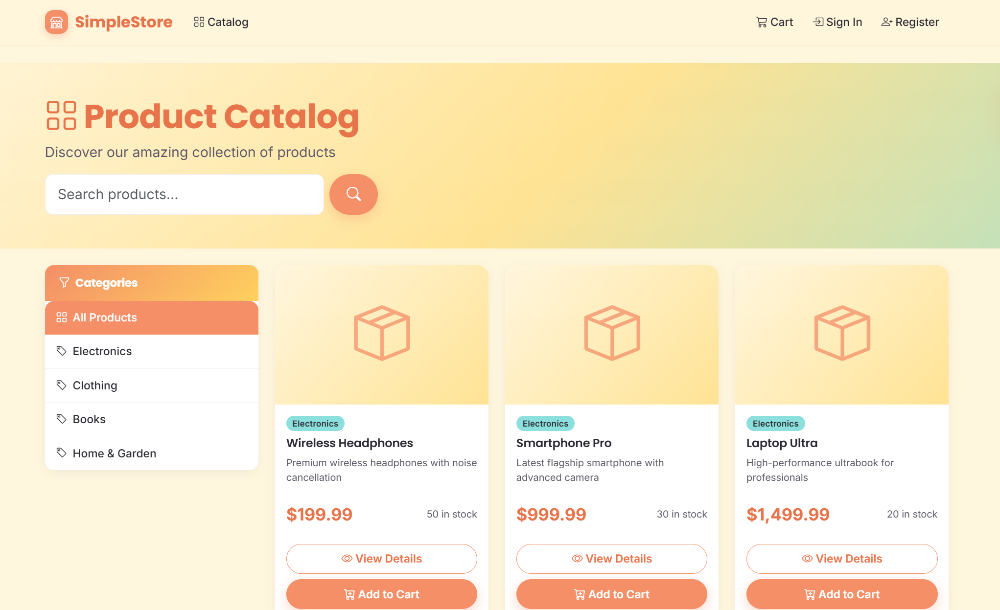
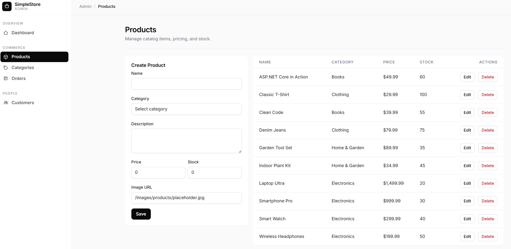

# SimpleStore

A sample e-commerce application built with **ASP.NET Core 10**, **Entity Framework Core**, **PostgreSQL**, and **.NET Aspire**. It includes a customer-facing storefront and a Blazor Server admin dashboard, both orchestrated by a single Aspire AppHost.

---

## Features

### Storefront (`SimpleStore.Web`)
- Product catalog browsing by category
- Session-based shopping cart (30-minute idle timeout)
- Order placement and order history
- ASP.NET Core Identity authentication (Identity Schema v3 with passkey support)
- Demo account seeded on first run: `demo@simplestore.local` / `Demo123!`

### Admin Dashboard (`SimpleStore.Admin`)
- Blazor Server interactive UI
- Manage **Products**, **Categories**, **Orders**, and **Customers**

---

## Screenshots

### Frontend



### Backend



---

## Project Structure

```
SimpleStore.slnx
src/
├── SimpleStore.AppHost        # .NET Aspire orchestration entry point
├── SimpleStore.Web            # Customer storefront (ASP.NET Core MVC + Razor Pages)
├── SimpleStore.Admin          # Admin dashboard (Blazor Server)
├── SimpleStore.Data           # EF Core data layer (DbContext, models, migrations, seeder)
└── SimpleStore.ServiceDefaults # Shared Aspire defaults (OpenTelemetry, health checks, resilience)
```

### Data Model

| Entity       | Description                                      |
|--------------|--------------------------------------------------|
| `Category`   | Product categories (Electronics, Clothing, etc.) |
| `Product`    | Products with name, price, stock, image URL      |
| `Order`      | Customer order with status and shipping address  |
| `OrderItem`  | Line items belonging to an order                 |

ASP.NET Core Identity tables (`ApplicationUser`) share the same `StoreDbContext` and database.

---

## Prerequisites

- [.NET 10 SDK](https://dotnet.microsoft.com/download)
- [.NET Aspire workload](https://learn.microsoft.com/dotnet/aspire/fundamentals/setup-tooling)
- [Docker Desktop](https://www.docker.com/products/docker-desktop/) (used by Aspire to run PostgreSQL)

Install the Aspire workload if needed:

```pwsh
dotnet workload install aspire
```

---

## Getting Started

### Run with Aspire (recommended)

Aspire starts PostgreSQL, PgWeb, and both web projects automatically:

```pwsh
dotnet run --project src/SimpleStore.AppHost
```

Open the Aspire dashboard URL printed in the console to see service endpoints and logs.

### Run a single project

Each project requires a `storedb` connection string (normally injected by Aspire). Set it via user secrets or environment variables first, then:

```pwsh
dotnet run --project src/SimpleStore.Web
dotnet run --project src/SimpleStore.Admin
```

---

## Database Migrations

The `StoreDbContext` lives in `SimpleStore.Data`. Migrations are applied automatically on startup via `DbSeeder.SeedAsync`. To manage migrations manually:

```pwsh
# Add a new migration
dotnet ef migrations add <MigrationName> \
  --project src/SimpleStore.Data \
  --startup-project src/SimpleStore.Web

# Apply migrations
dotnet ef database update \
  --project src/SimpleStore.Data \
  --startup-project src/SimpleStore.Web
```

---

## Build

```pwsh
dotnet build SimpleStore.slnx
```

---

## Technology Stack

| Technology | Usage |
|---|---|
| ASP.NET Core 10 MVC | Customer storefront |
| Blazor Server | Admin dashboard |
| ASP.NET Core Identity (v3) | Authentication & passkeys |
| Entity Framework Core 10 | ORM / data access |
| PostgreSQL + Npgsql | Database |
| .NET Aspire 13 | Orchestration, observability |
| OpenTelemetry (OTLP) | Distributed tracing & metrics |

---

## License

This project is licensed under the [MIT License](LICENSE).