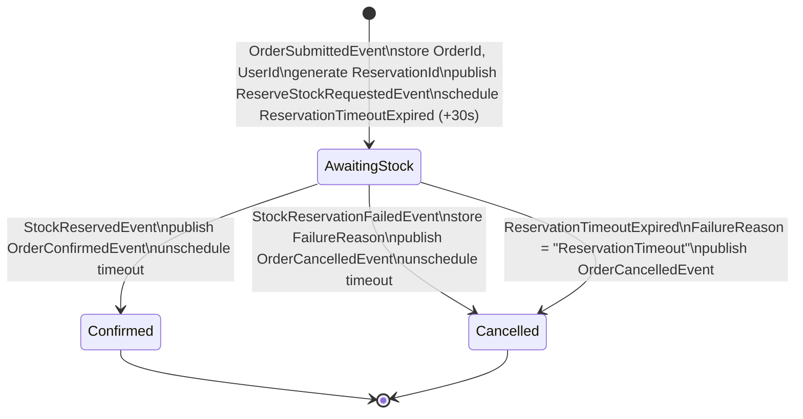
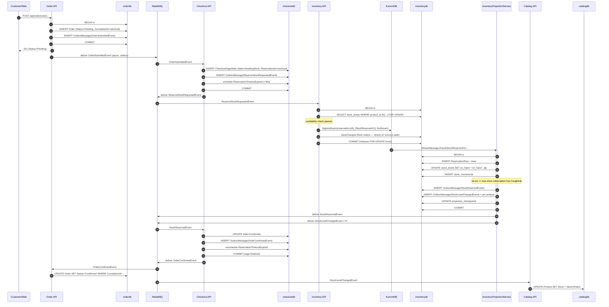
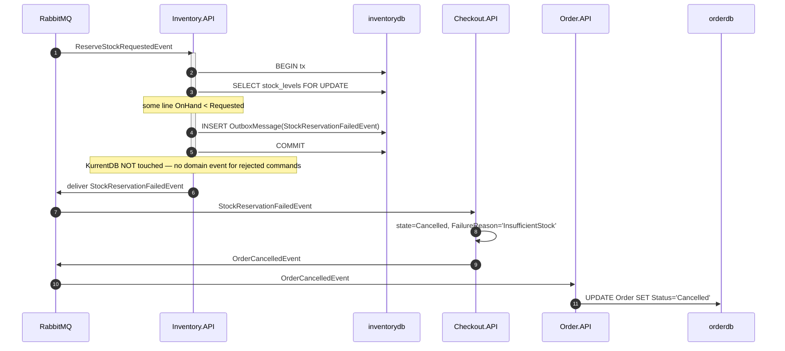
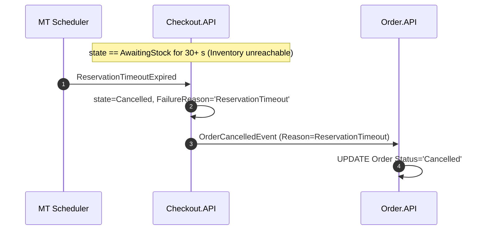

# Checkout Saga — Design Specification

> Introduced in **v8**. This document is the design spec for the cross-service workflow that turns a submitted order into either a **Confirmed** order with reserved stock, or a **Cancelled** order with no stock impact.

---

## 1. Purpose

When a customer submits an order, three things must happen across three services:

1. **Order.API** persists the order.
2. **Inventory.API** reserves stock for each line item — and may refuse if there isn't enough.
3. **Order.API** updates the order's status based on the outcome.

These three steps span three databases (`orderdb`, `inventorydb`, plus the saga's own `checkoutdb`) and cannot share a single ACID transaction. The **Saga pattern** coordinates them by keeping the workflow's state in a dedicated persistent store, listening for completion events from each step, and issuing compensating actions when a step fails.

The saga lives in a **dedicated microservice — `SimpleStore.Checkout.API`** — chosen over hosting it inside Order.API because:

- It makes the saga's role explicit: it owns no business data, only the saga state. Order.API still owns Orders, Inventory.API still owns stock; Checkout.API only owns the choreography.
- It demonstrates the pattern in its canonical shape (an orchestrator service).
- It keeps Order.API agnostic of inventory — Order.API does not know what "reserve stock" means; it only knows that something will tell it the order is `"Confirmed"` or `"Cancelled"`.

---

## 2. Service responsibilities

| Service | Role |
|---|---|
| **Order.API** | Persists the order with `Status = "Pending"`. Generates the saga `CorrelationId`. Publishes `OrderSubmittedEvent`. Consumes `OrderConfirmedEvent` / `OrderCancelledEvent` and flips order status. |
| **Checkout.API** | Hosts the MassTransit Saga State Machine. Consumes `OrderSubmittedEvent`, publishes `ReserveStockRequestedEvent`, then waits for `StockReservedEvent` / `StockReservationFailedEvent` or a scheduled timeout. Publishes `OrderConfirmedEvent` / `OrderCancelledEvent`. |
| **Inventory.API** | Consumes `ReserveStockRequestedEvent`. Checks projected stock against the request. Either appends `StockReservedV1` to KurrentDB (projector then publishes `StockReservedEvent`) or publishes `StockReservationFailedEvent` directly without persisting a domain event. |
| **Catalog.API** | Consumes `StockLevelChangedEvent` (a side-channel emitted by Inventory's projector) to refresh its denormalized `Product.Stock` cache. Catalog is *not* part of the saga — it just listens. |

---

## 3. Correlation

The saga key is a **`Guid CorrelationId`** generated by Order.API at order-creation time, persisted on the `Order` row, and threaded through every saga-related event.

| Event | Carries CorrelationId? |
|---|---|
| `OrderSubmittedEvent` | ✅ |
| `ReserveStockRequestedEvent` | ✅ |
| `StockReservedEvent` | ✅ |
| `StockReservationFailedEvent` | ✅ |
| `OrderConfirmedEvent` | ✅ |
| `OrderCancelledEvent` | ✅ |
| `StockLevelChangedEvent` | ❌ — broadcast cache refresh, unrelated to any specific saga |

### Why not just use OrderId?

- MassTransit's `MassTransitStateMachine<TInstance>` requires `TInstance.CorrelationId` to be a `Guid` — it's a framework requirement, not a design choice.
- A separate `CorrelationId` decouples the saga key from Order.API's primary-key type. If Order.API later moves to a different ID strategy (e.g., string ULIDs), no integration event has to change.
- It lets the saga be looked up in `checkoutdb` independently of any service's local ID.

---

## 4. State machine



### States

| State | Meaning |
|---|---|
| `AwaitingStock` | Reservation requested; waiting for Inventory. A 30-second `ReservationTimeoutExpired` is scheduled to bound the wait. |
| `Confirmed` | **Terminal.** Stock reserved; Order.API notified to set status `"Confirmed"`. The saga calls `Finalize()`. |
| `Cancelled` | **Terminal.** Either stock could not be reserved or the wait timed out. Order.API notified to set status `"Cancelled"`. `FailureReason` is preserved on the saga state for diagnostics. |

### Persisted state — `CheckoutSagaState`

```csharp
public class CheckoutSagaState : SagaStateMachineInstance
{
    public Guid CorrelationId { get; set; }
    public string CurrentState { get; set; } = string.Empty;
    public int OrderId { get; set; }
    public string? UserId { get; set; }
    public Guid ReservationId { get; set; }    // saga-generated; passed to Inventory
    public string? FailureReason { get; set; } // "InsufficientStock" | "ReservationTimeout"
    public DateTime CreatedAt { get; set; }
    public DateTime UpdatedAt { get; set; }
    public byte[]? RowVersion { get; set; }    // EF concurrency token
}
```

Persisted in `checkoutdb` via MassTransit's EF Core saga repository (`AddSagaStateMachine<…>().EntityFrameworkRepository(...)`). Finalized instances are removed from the table by default — set `SetCompletedWhenFinalized(false)` on the state machine if you want to retain them for audit.

---

## 5. Events

### 5.1 Consumed (inputs)

#### `OrderSubmittedEvent` — Order.API → Checkout.API

The trigger. Published by Order.API at the end of `OrderService.CreateOrderAsync` using the existing EF Core transactional outbox (the order row and the `OutboxMessage` row commit in one Postgres transaction). Field added in v8: **`CorrelationId`**.

```
CorrelationId    : Guid       # v8 — generated by Order.API
OrderId          : int
UserId           : string
OrderDate        : DateTime
TotalAmount      : decimal
ShippingAddress  : string
Items            : IReadOnlyList<OrderSubmittedLineItem>
                   { ProductId; ProductName; Quantity; UnitPrice; }
```

#### `StockReservedEvent` — Inventory.API → Checkout.API

Published by Inventory's `InventoryProjectionService` when the projector applies `StockReservedV1` to the read tables AND the subscription is in the live tail (see §10.1 for why this matters).

```
CorrelationId    : Guid
ReservationId    : Guid
OrderId          : int
Lines            : IReadOnlyList<ReservationLineItem>
                   { ProductId; Quantity; }
ReservedAt       : DateTimeOffset
```

#### `StockReservationFailedEvent` — Inventory.API → Checkout.API

Published by Inventory's `CreateReservationHandler` **directly**, NOT via the projector. The handler decides "insufficient stock," writes the integration-event row to its outbox, and never appends anything to KurrentDB. Rejected commands emit no domain event by design.

```
CorrelationId    : Guid
ReservationId    : Guid       # may be Guid.Empty if Inventory bailed early
OrderId          : int
Reason           : string     # "InsufficientStock" | "UnknownProduct"
ShortageLines    : IReadOnlyList<ShortageLine>
                   { ProductId; Requested; Available; }
FailedAt         : DateTimeOffset
```

#### `ReservationTimeoutExpired` — saga-scheduled

A self-addressed message the saga schedules when it enters `AwaitingStock`. Default delay: **30 s** (configurable via `Checkout:ReservationTimeoutSeconds`). Cancelled by the saga when `StockReservedEvent` or `StockReservationFailedEvent` arrives in time.

```
CorrelationId    : Guid
```

### 5.2 Published (outputs)

#### `ReserveStockRequestedEvent` — Checkout.API → Inventory.API

```
CorrelationId    : Guid
ReservationId    : Guid       # saga-generated; idempotency key for Inventory
OrderId          : int
RequestedAt      : DateTimeOffset
Lines            : IReadOnlyList<ReservationLineItem>
```

#### `OrderConfirmedEvent` — Checkout.API → Order.API

```
CorrelationId    : Guid
OrderId          : int
ReservationId    : Guid
ConfirmedAt      : DateTimeOffset
```

#### `OrderCancelledEvent` — Checkout.API → Order.API

```
CorrelationId    : Guid
OrderId          : int
Reason           : string     # "InsufficientStock" | "ReservationTimeout"
CancelledAt      : DateTimeOffset
```

### 5.3 Side channel

#### `StockLevelChangedEvent` — Inventory.API → Catalog.API (cache refresh)

Published by Inventory's projector whenever `stock_levels.OnHand` changes — i.e., from any of `StockReservedV1`, `DeliveryNoteIssuedV1`, `ReceiptNoteRecordedV1` (and, in v9, the reservation commit/cancel events). NOT part of the saga itself.

```
ProductId        : int
NewOnHand        : int
ChangedAt        : DateTimeOffset
Cause            : string     # "ReservationCreated" | "ReceiptNote" | "DeliveryNote" | ...
```

---

## 6. Happy-path sequence



---

## 7. Failure path (insufficient stock)



---

## 8. Timeout path



---

## 9. Idempotency

Every link in the chain must handle redelivery — RabbitMQ guarantees at-least-once, not exactly-once.

| Consumer | Mechanism |
|---|---|
| Saga / `OrderSubmittedEvent` | MassTransit enforces one saga instance per `CorrelationId` via a unique index in `checkoutdb`. Duplicate delivery either finds the existing instance (state machine ignores out-of-state events) or hits a uniqueness violation that MassTransit retries through. |
| Inventory / `ReserveStockRequestedEvent` | `AppendCondition.NoStream` on `reservation-{ReservationId}` — the second delivery throws `ConcurrencyConflictException`. The consumer treats this as "already done, the original `StockReservedEvent` was already published, nothing more to do." |
| Saga / `StockReservedEvent` & `StockReservationFailedEvent` | State machine only honors them in `AwaitingStock`. In `Confirmed`/`Cancelled` the message is dropped (state-machine guard). |
| Order / `OrderConfirmedEvent` & `OrderCancelledEvent` | MassTransit EF inbox on `OrderDbContext` rejects duplicate `MessageId`. Status updates are idempotent too (writing the same value is harmless). |
| Catalog / `StockLevelChangedEvent` | Same EF inbox on `CatalogDbContext`. Overwrites are idempotent. |

The `ReservationId` is **client-supplied** (the saga generates it once and reuses on retries), which is what makes Inventory's idempotency work.

---

## 10. Concurrency

### 10.1 Cold-start replay must not republish history

The projector subscribes to `$all` from its stored checkpoint (or from `FromAll.Start` after a read-DB wipe). KurrentDB's `StreamMessage` discriminated union includes `CaughtUp` and `FellBehind` markers — the projector flips an `IsLive` boolean when it sees `CaughtUp`. Integration-event publishes are gated on `IsLive`:

```csharp
// inside InventoryProjector.ApplyStockReservedAsync
if (isLive)
{
    await publish.Publish(new StockReservedEvent { ... }, ct);
    foreach (var line in evt.Lines)
        await publish.Publish(new StockLevelChangedEvent {
            ProductId = line.ProductId,
            NewOnHand = newOnHand[line.ProductId],
            ChangedAt = evt.ReservedAt,
            Cause = "ReservationCreated",
        }, ct);
}
```

During cold-start catch-up the read tables are still rebuilt (and the checkpoint advances), but no RabbitMQ traffic is generated. Once the subscription reaches the live tail, normal publishing resumes.

### 10.2 Per-product serialization

The reservation handler uses Postgres row-level pessimistic locking on `stock_levels`:

```sql
BEGIN;
SELECT * FROM stock_levels WHERE product_id = ANY($1) FOR UPDATE;
-- read holds, compute availability ...
-- if OK: append to KurrentDB (inside this tx)
-- if not: INSERT outbox message, commit, return
COMMIT;
```

Concurrent reservations against overlapping products serialize behind the lock. The first to acquire it appends to KurrentDB, releases the lock on COMMIT. The projector picks up the new event in a separate transaction and updates `OnHand`. The second handler's `FOR UPDATE` lines up behind the projector's commit, sees the new `OnHand`, and makes its decision against the up-to-date value.

The 2PC-like edge case — KurrentDB append succeeds but Postgres COMMIT fails (network blip) — is **self-healing**: the projector will eventually replay the event and write the read-side rows. The saga retry semantics handle the missing `StockReservedEvent` (Inventory replays it on the next projector pass).

### 10.3 Cross-aggregate concurrency

Admin `POST /receipt-notes` and `POST /delivery-notes` continue to append to KurrentDB outside any Postgres transaction — they're aggregate-creation operations that don't read state. The projector applies them in its own transactions. A reservation in flight at the same time as an admin receipt may see stale `OnHand` (the receipt hasn't been projected yet) and reject — that's correct behavior: the receipt has not yet "taken effect" from the read model's perspective.

For a sample, this eventual consistency between admin actions and reservations is acceptable. A production system might move availability checks onto a per-product event stream with optimistic concurrency to remove the read-after-write gap.

---

## 11. Operational considerations

### 11.1 Timeout choice

Default 30 s is comfortable for a single-region deployment with healthy RabbitMQ. Under load or with a slow projector, 30 s could be tight. Configurable via `Checkout:ReservationTimeoutSeconds`.

### 11.2 Scheduler

The saga's `Schedule(...)` timeout needs a message scheduler. The standard Aspire `rabbitmq` image does **not** ship the `rabbitmq_delayed_message_exchange` plugin, so `UseDelayedMessageScheduler()` is not an option here, and `UseInMemoryScheduler()` only exists for the in-memory transport (not RabbitMQ). Checkout.API therefore uses the **Quartz scheduler** (`MassTransit.Quartz`): `x.AddQuartzConsumers()` / `x.AddPublishMessageScheduler()` and `cfg.UsePublishMessageScheduler()` on the bus. It needs no broker plugin and is self-contained to Checkout.API.

**Persistence (v8a):** Quartz is configured with a **persistent ADO store** in `checkoutdb` rather than the default in-memory `RAMJobStore`. `Program.cs` calls `AddQuartz(q => q.UsePersistentStore(s => { s.UseProperties = true; s.UsePostgres(...); s.UseSystemTextJsonSerializer(); }))`, and the `AddQuartzTables` migration creates the `qrtz_*` schema (lowercase to match the configured `qrtz_` `TablePrefix`). Because the trigger row lives in Postgres, a scheduled timeout **survives a Checkout.API restart**: on boot, Quartz reloads pending triggers and immediately fires any that misfired while the process was down, so a saga left in `AwaitingStock` is still cancelled. `UseProperties = true` keeps MassTransit's scheduled-message payload as string entries in the job-data map (no object serialization needed there).

A design-time `CheckoutDbContextFactory` (`IDesignTimeDbContextFactory`) lets `dotnet ef migrations add` run without building the full host, since `Program.cs` now requires the `checkoutdb` connection string for the Quartz store at startup.

> **Single instance vs. clustering:** the persistent store survives restarts for a single replica. Running multiple Checkout.API replicas would also require `s.UseClustering()` plus a unique instance id so only one node fires each trigger — not enabled here (Checkout runs one replica, consistent with the projector).

### 11.3 RabbitMQ outage

Order.API and Checkout.API both use the EF outbox, so events queued for delivery during an outage are retained in `OutboxMessage`. When the broker recovers, outboxed messages drain naturally. The saga's 30 s timeout still fires regardless of the broker state — if the broker recovers AFTER the timeout, the order is already `Cancelled` but Inventory still receives the redelivered reserve request and reserves stock for a cancelled order. **This produces an orphan reservation.** See §13 for the v9 plan.

### 11.4 Inspection

`CheckoutSagaState` rows in `checkoutdb` are the operational source of truth for in-flight and recently-finalized sagas. PgWeb (already part of the Aspire stack) lets you query by `CorrelationId`. Recommended diagnostic queries:

```sql
-- in-flight sagas older than 1 minute (something's stuck)
SELECT * FROM "CheckoutSagaState"
WHERE "CurrentState" = 'AwaitingStock'
  AND "UpdatedAt" < NOW() - INTERVAL '1 minute';

-- recent cancellations by reason
SELECT "FailureReason", COUNT(*) FROM "CheckoutSagaState"
WHERE "CurrentState" = 'Cancelled' AND "UpdatedAt" > NOW() - INTERVAL '1 hour'
GROUP BY "FailureReason";
```

---

## 12. Wire-type strings (Inventory internal domain events)

The Reservation aggregate's domain events follow the existing convention `simplestore.<context>.<aggregate>.<verb>.<version>`:

| CLR type | Wire type | v8? |
|---|---|---|
| `Domain.Reservations.Events.StockReservedV1` | `simplestore.inventory.reservation.reserved.v1` | ✅ |
| `Domain.Reservations.Events.StockReservationCommittedV1` | `simplestore.inventory.reservation.committed.v1` | v9 |
| `Domain.Reservations.Events.StockReservationCancelledV1` | `simplestore.inventory.reservation.cancelled.v1` | v9 |

Registered in `EventStore/EventTypeRegistry.cs` alongside `delivery-note.issued.v1` and `receipt-note.recorded.v1`. Unknown wire types in `$all` are logged and skipped — forward-compatible.

The stream name pattern is **`reservation-{guid}`** (lowercase noun + hyphen + GUID), matching the existing `deliveryNote-{guid}` and `receiptNote-{guid}` conventions.

---

## 13. Known limitations and future work

### Out of scope for v8

1. **Reservation Commit** — once an order ships, the reservation should be converted into a `DeliveryNote`. v9 adds `Reservation.Commit(now)` which emits `StockReservationCommittedV1` (no stock movement — already debited) plus issues a `DeliveryNote` for the audit trail.
2. **Reservation Cancel** — when an order is cancelled (admin action or saga timeout compensation), stock should be released. v9 adds `Reservation.Cancel(now)` which emits `StockReservationCancelledV1`; the projector adds stock back to `OnHand`.
3. **Orphan reservation compensation** — when the saga times out, also publish a `CancelStockReservationRequestedEvent`. Inventory consumes it and, retrying with backoff, cancels the reservation once it exists in the event store. Closes the §11.3 gap.
4. **Admin reservation read endpoints** — `GET /api/inventory/reservations` (paged), `GET /api/inventory/reservations/{id}`. Useful for operations visibility but not required for the saga to function.
5. **Per-product event-stream availability** — replace `SELECT FOR UPDATE` on `stock_levels` with a per-product KurrentDB stream and optimistic concurrency. Removes the read-after-write race window in §10.3 and allows true parallelism across products.

### Web checkout UX

After `POST /api/order/orders`, Web shows the order page with status `Pending`. The saga completes in ≤1 s in normal operation, so a manual page refresh shows the final status. A small enhancement (`<meta http-equiv="refresh" content="2">` while status is Pending) is left as a v9 polish item.

### Stock decrement timing

`StockReservedV1` immediately decrements `stock_levels.OnHand`. Without v9's Cancel, a cancelled order's stock decrement is **permanent** in v8 — the books don't balance for cancelled orders. This is acceptable for the demo (cancellation is rare and operational cleanup is possible via a compensating receipt note), but is the strongest reason to ship v9 before declaring the saga production-grade.

---

## 14. Quick reference — what to read when

| You want to | Read |
|---|---|
| Understand the overall flow | §1, §2, §4, §6 |
| Implement the state machine | §4, §5 |
| Debug a stuck saga | §11.4 |
| Understand why integration events have `CorrelationId` | §3 |
| Understand why the failure event isn't event-sourced | §5.1 (`StockReservationFailedEvent`), §7 |
| Reason about replays after a DB wipe | §10.1 |
| Plan v9 work | §13 |
