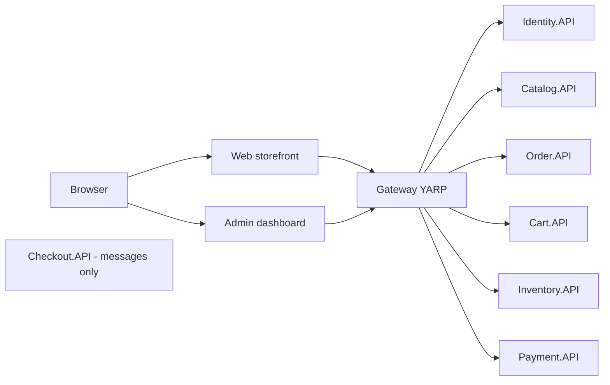
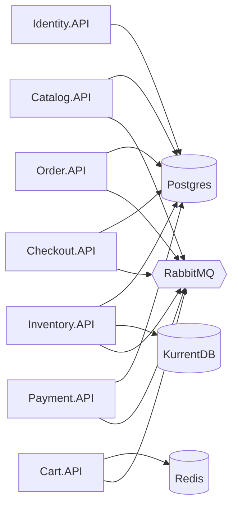

# Chapter 1 - Architecture and .NET Aspire

SimpleStore is an online shop split into ten small programs that run together. This chapter shows what those programs are, which databases and brokers they depend on, and how a single file, `AppHost.cs`, starts everything in the right order and tells each program where to find the others. Read it first: every later chapter assumes you know this map.

**What you will learn**

- Which services exist, what each one owns, and which ones have an HTTP API.
- What .NET Aspire's AppHost does and how `WithReference`, `WaitFor` and `WithEnvironment` work.
- Why every service has its own database and what a "soft reference" between databases is.
- How a service finds another service by name (service discovery) instead of by IP address and port.
- What `AddServiceDefaults()` gives every service for free.

---

## The problem

A shop needs a catalog, a cart, orders, stock, payments and user accounts. In a **monolith** all of that is one program and one database. That is simple to start, but every change ships the whole program, and one slow feature can drag everything down.

Splitting into **microservices** (small programs that each do one job) fixes some of that, but creates new questions:

- How do you start ten programs, three databases engines and a message broker on your laptop with one command?
- How does the Order service know the address of the Payment service when ports are chosen at random?
- How do you stop services from quietly reading each other's tables?

> **New term: microservice.** A small program that owns one business capability (for example "orders") and its own data. Other programs talk to it over HTTP or through messages, never by opening its database.

> **New term: .NET Aspire.** A set of .NET tools for describing a multi-program application in C#. One "AppHost" project lists every program and every dependency (databases, caches, brokers). When you run it, Aspire starts them, wires connection strings and addresses, and opens a dashboard with logs and traces.

## Big picture

SimpleStore has two layers: browsers talk to two user interfaces, the interfaces talk to one gateway, and the gateway forwards to the HTTP backends. The checkout service has no HTTP surface at all; it only reacts to messages.



*How to read it: arrows are HTTP calls. Web and Admin never call a backend directly. `Checkout.API` has no arrow because nothing calls it over HTTP; it is reached through RabbitMQ events (chapter 6).*

The second picture shows what each backend depends on. Each arrow is a `WithReference` in `AppHost.cs`.



*How to read it: a service points at every infrastructure resource it uses. Postgres is one server that hosts six separate databases (see the table below). Identity is the only backend that does not use RabbitMQ.*

### The services at a glance

| Service | Owns | Talks over HTTP | Talks over RabbitMQ | Chapter |
|---|---|---|---|---|
| `SimpleStore.Identity.API` | Postgres `identitydb` | yes | no | [3](03-authentication-and-bff.md) |
| `SimpleStore.Catalog.API` | Postgres `catalogdb` | yes | yes | [4](04-catalog-and-cart.md) |
| `SimpleStore.Cart.API` | Redis `cart-redis` | yes | yes | [4](04-catalog-and-cart.md) |
| `SimpleStore.Order.API` | Postgres `orderdb` | yes | yes | [5](05-orders-and-outbox.md) |
| `SimpleStore.Checkout.API` | Postgres `checkoutdb` (saga state only) | no | yes | [6](06-checkout-saga.md) |
| `SimpleStore.Inventory.API` | KurrentDB (events) and Postgres `inventorydb` (read side) | yes | yes | [7](07-inventory-event-sourcing-cqrs.md) |
| `SimpleStore.Payment.API` | Postgres `paymentdb` | yes | yes | [8](08-payment-and-compensation.md) |
| `SimpleStore.Gateway` | nothing | yes (reverse proxy) | no | [2](02-gateway-and-api-versioning.md) |
| `SimpleStore.Web` | nothing (session cache only) | yes (as a client) | no | [3](03-authentication-and-bff.md) |
| `SimpleStore.Admin` | nothing (session cache only) | yes (as a client) | no | [3](03-authentication-and-bff.md) |

Four more projects are not services:

- `SimpleStore.Contracts` - the event records that travel over RabbitMQ ([chapter 10](10-contracts-and-versioning.md)).
- `SimpleStore.<Service>.API.Client` - one small client library per backend (DTOs plus a typed `HttpClient`).
- `SimpleStore.ServiceDefaults` - shared startup code used by every program (see "Walk through the code", step 7).
- `SimpleStore.AppHost` - the Aspire orchestrator described next.

---

## Walk through the code

### Step 1 - The AppHost declares the infrastructure

[AppHost.cs](../../src/SimpleStore.AppHost/AppHost.cs) is the entry point of the whole system. It has no `Program.cs`; the file is top-level statements. It starts by declaring one Postgres server with six databases:

```csharp
var postgres = builder.AddPostgres("postgres")
    .WithPgWeb();

var catalogDb = postgres.AddDatabase("catalogdb");
var orderDb = postgres.AddDatabase("orderdb");
var identityDb = postgres.AddDatabase("identitydb");
var inventoryDb = postgres.AddDatabase("inventorydb");
var checkoutDb = postgres.AddDatabase("checkoutdb");
var paymentDb = postgres.AddDatabase("paymentdb");
```

`WithPgWeb()` adds a small web UI (pgweb) so you can browse the tables. The other three infrastructure resources follow the same pattern:

```csharp
var cartRedis = builder.AddRedis("cart-redis")
    .WithRedisInsight();
```

```csharp
var rabbitmq = builder.AddRabbitMQ("rabbitmq")
    .WithManagementPlugin();
```

```csharp
var kurrentdb = builder.AddKurrentDB("kurrentdb")
    .WithDataVolume("kurrentdb-data");
```

> **New term: resource.** In Aspire, anything the AppHost manages: a container (Postgres, Redis, RabbitMQ, KurrentDB), a database inside a container, or a .NET project. Each resource has a name, such as `"orderdb"`, and that name is how other resources refer to it.

`WithDataVolume("kurrentdb-data")` keeps the event store's files in a named Docker volume so events survive restarts. The Postgres, Redis and RabbitMQ resources have no volume in this file, so their data is lost when the containers are recreated.

### Step 2 - Shared JWT settings

Services that issue or check login tokens must agree on the signing key, the issuer and the audience. The AppHost declares them as **parameters** and hands them to each project:

```csharp
var jwtKey = builder.AddParameter("jwt-key", secret: true);
var jwtIssuer = builder.AddParameter("jwt-issuer");
var jwtAudience = builder.AddParameter("jwt-audience");

// Identity runs as its own microservice and is the only resource that talks to identitydb.
var identity = builder.AddProject<Projects.SimpleStore_Identity_API>("identity")
    .WithReference(identityDb)
    .WithEnvironment("Jwt__Key", jwtKey)
    .WithEnvironment("Jwt__Issuer", jwtIssuer)
    .WithEnvironment("Jwt__Audience", jwtAudience)
    .WaitFor(identityDb);
```

Three things happen here:

- `AddParameter(..., secret: true)` marks the key as sensitive. You supply values once with `dotnet user-secrets` on the AppHost project (the exact commands are in the repository's [README.md](../../README.md#getting-started), section "Getting Started"). The key must be a base64-encoded value of at least 32 bytes.
- `WithEnvironment("Jwt__Key", ...)` sets an environment variable. In .NET configuration a double underscore means a colon, so `Jwt__Key` becomes the setting `Jwt:Key`. Each service reads it with `builder.Configuration["Jwt:Key"]`.
- `WithReference(identityDb)` injects the connection string for `identitydb`. The service then asks for it by the same name: `builder.AddNpgsqlDbContext<IdentityDbContext>("identitydb", ...)`. The string `"identitydb"` is the contract between AppHost and service.

> **New term: JWT (JSON Web Token).** A signed piece of text that says who the caller is and which roles they have. Any service that knows the signing key can verify it without calling the Identity service. Chapter 3 covers it in detail.

### Step 3 - Every project lists what it needs

The same shape repeats for each service. This table is read straight from `AppHost.cs`:

| Project (resource name) | `WithReference` / `WaitFor` | `Jwt__*` |
|---|---|---|
| `identity` | `identitydb` | yes |
| `catalog` | `catalogdb`, `rabbitmq` | yes |
| `order` | `orderdb`, `rabbitmq` | yes |
| `cart` | `cart-redis`, `rabbitmq` | yes |
| `inventory` | `inventorydb`, `kurrentdb`, `rabbitmq` | yes |
| `checkout` | `checkoutdb`, `rabbitmq` | **no** |
| `payment` | `paymentdb`, `rabbitmq` | yes |
| `gateway` | `identity`, `catalog`, `order`, `cart`, `inventory`, `payment` (not `checkout`) | yes |
| `web` | `gateway` | yes |
| `admin` | `gateway` | yes |

Two methods do different jobs and are easy to confuse:

- `WithReference(x)` tells Aspire "inject the address or connection string of `x` into this project".
- `WaitFor(x)` tells Aspire "do not start this project until `x` is healthy".

### Step 4 - Checkout is the exception

```csharp
var checkout = builder.AddProject<Projects.SimpleStore_Checkout_API>("checkout")
    .WithReference(checkoutDb)
    .WithReference(rabbitmq)
    .WaitFor(checkoutDb)
    .WaitFor(rabbitmq);
```

There are no `Jwt__*` lines because the checkout service never receives an HTTP request and never validates a token. It consumes RabbitMQ messages and drives the saga (chapter 6). The gateway also has no reference to it, for the same reason.

### Step 5 - The gateway and the two UIs

```csharp
var gateway = builder.AddProject<Projects.SimpleStore_Gateway>("gateway")
    .WithReference(identity)
    .WithReference(catalog)
    .WithReference(order)
    .WithReference(cart)
    .WithReference(inventory)
    .WithReference(payment)
```

The gateway then adds the three `Jwt__*` variables and one `WaitFor` per backend, so it starts last among the backends. `web` and `admin` reference only `gateway`. This is deliberate: the UIs know one address, and all routing and edge authorization lives in one place ([chapter 2](02-gateway-and-api-versioning.md)).

### Step 6 - How a name becomes an address

Look at how Web and Admin create their HTTP client for the Order service, in [OrderApiClientExtensions.cs](../../src/SimpleStore.Order.API.Client/OrderApiClientExtensions.cs):

```csharp
    public static IHttpClientBuilder AddOrderApiClient(
        this IHostApplicationBuilder builder,
        string serviceName = "gateway")
    {
        return builder.Services.AddHttpClient<IOrderApiClient, OrderApiClient>(client =>
        {
            client.BaseAddress = new Uri($"https+http://{serviceName}");
        });
    }
```

`https+http://gateway` is not a real URL. The host name `gateway` is the resource name from `AppHost.cs`. The `https+http` scheme means "prefer HTTPS, fall back to HTTP". At runtime Aspire's service discovery replaces the placeholder with a real address.

> **New term: service discovery.** A lookup that turns a logical name ("gateway") into the current address and port of that service. It removes hard-coded URLs, which matters because Aspire picks ports dynamically.

### Step 7 - What `AddServiceDefaults()` adds to every program

Every service starts with `builder.AddServiceDefaults()`, defined in [Extensions.cs](../../src/SimpleStore.ServiceDefaults/Extensions.cs):

```csharp
        builder.ConfigureOpenTelemetry();

        builder.AddDefaultHealthChecks();

        builder.Services.AddServiceDiscovery();

        builder.Services.ConfigureHttpClientDefaults(http =>
        {
            // Turn on resilience by default
            http.AddStandardResilienceHandler();

            // Turn on service discovery by default
            http.AddServiceDiscovery();
        });
```

(The excerpt is the body of the `AddServiceDefaults<TBuilder>` extension method.)

In plain words:

1. **OpenTelemetry** - traces, metrics and logs, sent to the Aspire dashboard.
2. **Health checks** - `/health`, `/alive` and `/ready` endpoints.
3. **Service discovery** - makes `https+http://order` resolvable.
4. **Standard resilience handler** - every outgoing `HttpClient` gets retries, timeouts and a circuit breaker by default.

Chapter 9 explains items 1, 2 and 4 in depth.

### Step 8 - One database per service, and soft references

Because each service owns its database, SQL cannot join across them. The Order service stores the buyer's id and the product ids as plain values, in [Order.cs](../../src/SimpleStore.Order.API/Models/Order.cs) and [OrderItem.cs](../../src/SimpleStore.Order.API/Models/OrderItem.cs):

```csharp
    [Required, MaxLength(450)]
    public string UserId { get; set; } = string.Empty;
```

```csharp
    public int ProductId { get; set; }
    public string ProductName { get; set; } = string.Empty;
```

> **New term: soft reference.** A column that holds the id of a row in someone else's database, with no foreign key constraint. `Order.UserId` points at a user in `identitydb`; `OrderItem.ProductId` points at a product in `catalogdb`. The database cannot check that the row exists, and nothing prevents it from being deleted.

Notice `ProductName` is copied into the order item when the order is created. That is **denormalization**: the Order service keeps its own copy so it never has to ask Catalog for a name when showing an order.

---

## Algorithm

**Algorithm 1 - how `dotnet run --project src/SimpleStore.AppHost` brings the system up**

1. Aspire reads `AppHost.cs` and builds a graph of resources and dependencies.
2. It starts the containers: Postgres (then creates the six databases), Redis, RabbitMQ, KurrentDB.
3. For each project it waits until every `WaitFor` target reports healthy.
4. It starts the project with configuration injected: connection strings for each `WithReference`, plus the `Jwt__*` variables from `WithEnvironment`.
5. Each project runs its own startup: apply database migrations (retry wrapper described in chapter 9), then listen for requests or messages.
6. Because `gateway` waits for all six HTTP backends and `web`/`admin` wait for the gateway, the order is: infrastructure, backends, gateway, user interfaces.

**Algorithm 2 - resolving `https+http://order`**

1. A caller (for example the gateway) has `https+http://order` as the base address.
2. The service discovery handler takes the host `order` and looks it up in configuration that Aspire injected because of `WithReference(order)`.
3. It picks an endpoint, trying `https` first and then `http`.
4. It rewrites the request URL and sends it.

Step 2 is Aspire behaviour, not code in this repository. You can see the injected values on the gateway's detail page in the dashboard.

## What can go wrong

- **Missing JWT parameters.** If `jwt-key` has no value, Aspire cannot resolve the parameter for the projects that need it (the dashboard may ask you for it). Set the three user-secrets before the first run.
- **A key that is not valid base64.** The services call `Convert.FromBase64String` on `Jwt:Key`, so a plain-text key fails at startup or on the first token check.
- **A name typo.** `GetConnectionString("catalogdb")` returns nothing if the AppHost resource is named differently. The resource name is the only link.
- **Starting a project alone.** `dotnet run --project src/SimpleStore.Order.API` works only if you provide the connection strings and `Jwt__*` yourself. Normally let the AppHost do it.
- **Soft references can dangle.** Deleting a product in Catalog does not touch old order items. This is the price of independent databases.
- **Lost data.** Only KurrentDB has a named volume here. Recreating the Postgres container wipes all six databases.

## Try it yourself

1. Set the three AppHost secrets once. Use placeholders for your own values:
   ```pwsh
   dotnet user-secrets set Parameters:jwt-key "<base64 of 32 random bytes>" --project src/SimpleStore.AppHost
   dotnet user-secrets set Parameters:jwt-issuer "simple-store" --project src/SimpleStore.AppHost
   dotnet user-secrets set Parameters:jwt-audience "simple-store" --project src/SimpleStore.AppHost
   ```
   To make a key in PowerShell: `[Convert]::ToBase64String([System.Security.Cryptography.RandomNumberGenerator]::GetBytes(32))`.
2. Start everything: `dotnet run --project src/SimpleStore.AppHost`. Open the dashboard URL printed in the console.
3. On the **Resources** page, watch the states change. Containers start first, `gateway` last among backends. Switch to the **Graph** view to see the dependency arrows from the second diagram.
4. Click `gateway`, open its details and look at the environment/configuration section. You will find the injected entries for the six services it references, and the `Jwt__*` values (the key is masked).
5. Click `checkout` and confirm there are no `Jwt__*` entries and no HTTP endpoint.
6. Open pgweb (its link is on the `postgres` resource). Pick `orderdb` and run `select "Id", "UserId" from "Orders" limit 5;`. Then pick `identitydb`. The table `AspNetUsers` is only there; the order database has no foreign key to it.
7. Open the RabbitMQ management link and look at the **Queues** tab. Queues appear after the services connect; you will see them fill up in later chapters.

## Key takeaways

- One `AppHost.cs` describes the whole system: infrastructure, programs, and who depends on whom.
- `WithReference` injects addresses and connection strings; `WaitFor` controls start order; `WithEnvironment` sets plain settings such as `Jwt__Key`.
- Each service owns exactly one set of data. Links between databases are soft references resolved in application code.
- Names such as `"orderdb"` and `https+http://gateway` are the glue; they come from `AppHost.cs`.
- `AddServiceDefaults()` gives every program telemetry, health checks, service discovery and HTTP resilience.
- Checkout has no HTTP and no JWT on purpose; it is purely message-driven.

## Next chapter

[Chapter 2 - Gateway and API versioning](02-gateway-and-api-versioning.md) shows how the single gateway decides which backend gets a request and who is allowed through.
