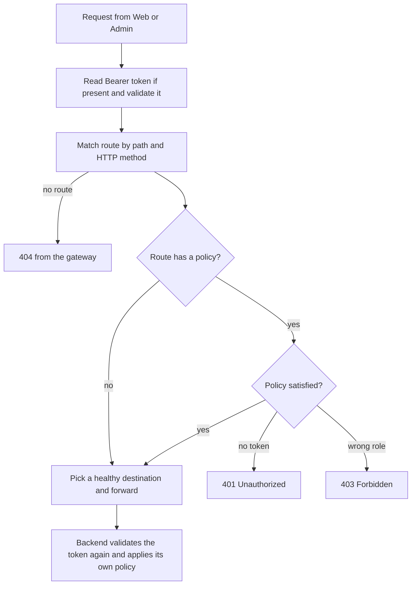

# Chapter 2 - Gateway and API versioning

The gateway is the single front door to every HTTP backend. It checks the caller's login token, decides which backend should receive each request, and stops traffic to a backend that is not healthy. This chapter reads the gateway's code and route table, and then shows how every backend puts a version number in its URLs so the API can change later without breaking existing callers.

**What you will learn**

- Why a gateway exists and what YARP (the reverse proxy library) does.
- How the route table in `appsettings.json` splits each service into anonymous, signed-in and admin-only routes.
- How YARP picks one route when several could match.
- How active health checks keep the gateway from sending traffic to a downed backend.
- How URL-segment API versioning works (`/api/v1/...`) and why the gateway forwards the path unchanged.
- Why backends still check permissions themselves ("defense in depth").

---

## The problem

Without a gateway, the Web and Admin programs would need to know six backend addresses, and each backend would have to be reachable from outside. Every backend would also have to defend itself against anonymous traffic on its own.

A gateway solves this by being the only public entry point:

- One address for clients.
- One place to reject callers without a valid token before they reach a backend.
- One place to describe which URLs belong to which service.

A second problem is **change**. Sooner or later an API has to change shape (a field is renamed, a new required parameter appears). If you edit the URL's meaning in place, every old client breaks. Versioning keeps `/api/v1/...` frozen while `/api/v2/...` can differ.

> **New term: reverse proxy.** A server that receives requests on behalf of other servers and forwards them. The caller talks to the proxy and never sees the real backend address. **YARP** ("Yet Another Reverse Proxy") is Microsoft's reverse proxy library for ASP.NET Core; here it is configured entirely from JSON.

> **New term: API gateway.** A reverse proxy that also applies cross-cutting rules such as authentication, authorization and health-based routing.

## Big picture

Every request passes through the same pipeline inside the gateway. Authentication runs first, then the route is matched, then the route's policy is enforced, and only then is the request forwarded.



*How to read it: follow the arrows from the top. The outcome boxes 404, 401 and 403 never reach a backend. The last box shows that passing the gateway is not the end of the checks.*

The three kinds of route in the table below map to three access levels:

| Access level | YARP setting | Who gets through |
|---|---|---|
| Anonymous | no `AuthorizationPolicy` | everyone, even without a token |
| Signed in | `"AuthorizationPolicy": "AuthenticatedUser"` | any valid token |
| Admin | `"AuthorizationPolicy": "Admin"` | valid token whose `role` claim is `Admin` |

---

## Walk through the code

### Step 1 - The gateway program is short

All of [Program.cs](../../src/SimpleStore.Gateway/Program.cs) is about 50 lines. It does four things: add service defaults, validate JWTs, define two policies, and start the reverse proxy.

```csharp
builder.Services
    .AddAuthentication(JwtBearerDefaults.AuthenticationScheme)
    .AddJwtBearer(options =>
    {
        options.MapInboundClaims = false;
        options.TokenValidationParameters = new TokenValidationParameters
        {
            ValidateIssuer = true,
            ValidateAudience = true,
            ValidateLifetime = true,
            ValidateIssuerSigningKey = true,
            ValidIssuer = jwtIssuer,
            ValidAudience = jwtAudience,
```

The rest of that block builds the signing key from the shared `Jwt:Key` and sets three more options:

- `ClockSkew = TimeSpan.FromSeconds(30)` - a token is still accepted for 30 seconds after it expires, to tolerate small clock differences between machines.
- `NameClaimType = "name"` and `RoleClaimType = "role"` - tell ASP.NET which claims hold the user name and the roles.
- `MapInboundClaims = false` - keep the raw claim names from the token (`sub`, `role`) instead of renaming them to long Microsoft URIs.

> **New term: claim.** One fact inside a token, such as `sub` (the user id) or `role` (`Admin` or `Customer`). The gateway reads the `role` claim to enforce the `Admin` policy.

### Step 2 - Two named policies

```csharp
builder.Services.AddAuthorization(options =>
{
    options.AddPolicy("AuthenticatedUser", p => p.RequireAuthenticatedUser());
    options.AddPolicy("Admin", p => p.RequireAuthenticatedUser().RequireRole("Admin"));
});
```

A policy is only a name plus requirements. The route table refers to these names as strings. There is no fallback policy, so a route that does not name a policy is open.

### Step 3 - Reverse proxy from configuration

```csharp
builder.Services
    .AddReverseProxy()
    .LoadFromConfig(builder.Configuration.GetSection("ReverseProxy"))
    .AddServiceDiscoveryDestinationResolver();
```

- `LoadFromConfig` reads routes and clusters from the `ReverseProxy` section of [appsettings.json](../../src/SimpleStore.Gateway/appsettings.json).
- `AddServiceDiscoveryDestinationResolver` lets a destination address such as `https+http://catalog` be resolved with Aspire service discovery (chapter 1, step 6). Without it YARP would try to use `catalog` as a literal host name.

The middleware order further down is: `app.UseAuthentication(); app.UseAuthorization(); app.MapReverseProxy();`. Authentication fills in the user, authorization checks the route's policy, and the proxy forwards.

### Step 4 - The route table

A **route** says "requests that look like this go to that cluster, under this policy". A **cluster** is a named group of destination addresses. Every route below is in `appsettings.json` under `ReverseProxy:Routes`. All paths start with `/api/v1/`.

| Route | Path after `/api/v1/` | Methods | Policy | Cluster |
|---|---|---|---|---|
| `identity-anon-login` | `identity/login` | POST | none | identity-cluster |
| `identity-anon-register` | `identity/register` | POST | none | identity-cluster |
| `identity-anon-refresh` | `identity/refresh` | POST | none | identity-cluster |
| `identity-anon-logout` | `identity/logout` | POST | none | identity-cluster |
| `identity-anon-pk-aopts` | `identity/passkey/assertion-options` | POST | none | identity-cluster |
| `identity-anon-pk-assert` | `identity/passkey/assertion` | POST | none | identity-cluster |
| `identity-admin-users` | `identity/users/{**catch-all}` | any | `Admin` | identity-cluster |
| `identity-auth-rest` | `identity/{**catch-all}` | any | `AuthenticatedUser` | identity-cluster |
| `catalog-read` | `catalog/{**catch-all}` | GET, HEAD | none | catalog-cluster |
| `catalog-write` | `catalog/{**catch-all}` | POST, PUT, DELETE, PATCH | `Admin` | catalog-cluster |
| `order-admin` | `order/admin/{**catch-all}` | any | `Admin` | order-cluster |
| `order-user` | `order/{**catch-all}` | any | `AuthenticatedUser` | order-cluster |
| `cart-merge` | `cart/merge` | POST | `AuthenticatedUser` | cart-cluster |
| `cart-any` | `cart/{**catch-all}` | any | none | cart-cluster |
| `inventory-admin` | `inventory/{**catch-all}` | any | `Admin` | inventory-cluster |
| `payment-admin` | `payment/admin/{**catch-all}` | any | `Admin` | payment-cluster |
| `payment-user` | `payment/{**catch-all}` | any | `AuthenticatedUser` | payment-cluster |

There is no route for `checkout` because that service has no HTTP surface. A request to `/api/v1/checkout/...` matches nothing and gets a 404 from the gateway.

> **New term: catch-all.** In a route template, `{**catch-all}` matches the rest of the path, however many segments it has.

Read the table as a pattern repeated per service: narrow, specific routes carry the special rule, and one broad catch-all route per service carries the default rule.

### Step 5 - Specific routes win over catch-all routes

Look at the two cart routes:

```json
"cart-merge": {
  "ClusterId": "cart-cluster",
  "AuthorizationPolicy": "AuthenticatedUser",
  "Match": { "Path": "/api/v1/cart/merge", "Methods": [ "POST" ] }
},
"cart-any": {
  "ClusterId": "cart-cluster",
  "Match": { "Path": "/api/v1/cart/{**catch-all}" }
},
```

A `POST /api/v1/cart/merge` request matches both. YARP builds on ASP.NET Core endpoint routing, which prefers the more specific match: literal path segments beat a catch-all parameter, and a route that names its HTTP methods beats one that does not. So `cart-merge` wins and its policy applies. The same rule makes `order-admin` beat `order-user`, `payment-admin` beat `payment-user`, and `identity-admin-users` and the six `identity-anon-*` routes beat `identity-auth-rest`.

The two catalog routes never compete because their `Methods` lists do not overlap: reads are anonymous, writes need `Admin`.

This precedence is how YARP and ASP.NET Core routing behave; the repository does not implement it. If you add a route, test it (see "Try it yourself").

### Step 6 - Clusters and active health checks

Each backend has one cluster with one destination. The identity cluster is the most complete example:

```json
"identity-cluster": {
  "HealthCheck": {
    "Active": {
      "Enabled": true,
      "Interval": "00:00:10",
      "Timeout": "00:00:03",
      "Policy": "ConsecutiveFailures",
      "Path": "/health"
    }
  },
  "Metadata": { "ConsecutiveFailuresHealthPolicy.Threshold": "1" },
  "Destinations": {
    "primary": { "Address": "https+http://identity" }
  }
},
```

- Every 10 seconds the gateway sends `GET /health` to the backend and waits up to 3 seconds.
- `ConsecutiveFailures` is a YARP policy: a destination is marked unhealthy after N failed probes in a row. N is read from cluster metadata.
- The identity cluster sets `Threshold` to `1`, so a single failed probe is enough. The other five clusters leave it unset and use YARP's default, which tolerates more failures. Identity is stricter because every signed-in request depends on it.
- `/health` is the endpoint added by `MapDefaultEndpoints()` in every service (chapter 9 explains it).

### Step 7 - Versioned URLs in the backends

Every backend calls two helpers from [ApiVersioningExtensions.cs](../../src/SimpleStore.ServiceDefaults/ApiVersioningExtensions.cs). The first registers the versioning rules in `Program.cs`:

```csharp
            .AddApiVersioning(options =>
            {
                options.DefaultApiVersion = new ApiVersion(1, 0);
                options.AssumeDefaultVersionWhenUnspecified = true;
                // Emits api-supported-versions / api-deprecated-versions headers so clients
                // can discover what the server knows about without reading OpenAPI.
                options.ReportApiVersions = true;
                // URL-segment reader: /api/v{N}/...
                options.ApiVersionReader = new UrlSegmentApiVersionReader();
            })
```

- The version comes from the URL itself (`UrlSegmentApiVersionReader`), never from a header or query string.
- `ReportApiVersions = true` adds an `api-supported-versions` header to responses, so a client can see which versions exist.

The second helper builds the route group that every endpoint file uses:

```csharp
        var versionSet = app.NewApiVersionSet()
            .HasApiVersion(new ApiVersion(1, 0))
            .ReportApiVersions()
            .Build();

        return app
            .MapGroup($"/api/v{{version:apiVersion}}/{serviceSegment}")
            .WithApiVersionSet(versionSet)
            .MapToApiVersion(new ApiVersion(1, 0));
```

In `Endpoints/CatalogEndpoints.cs` this is one line, `var group = app.MapApiV1Group("catalog");`. The result is that Catalog serves `/api/v1/catalog/...`. Order, Cart, Identity, Inventory and Payment call the same helper with their own segment. Each backend also registers `builder.Services.AddOpenApi("v1")`, which produces one OpenAPI document per version at `/openapi/v1.json` (mapped only in the Development environment). The gateway itself does not publish an OpenAPI document.

Since v11 the gateway does not rewrite paths. The URL a browser-side client uses, the URL the gateway matches, and the URL the backend serves are the same string. That removes a whole class of "works on the backend, 404 on the gateway" mistakes. The policy for adding a `v2` (new route group, new gateway route, deprecation with a `Sunset` header) is written in [docs/versioning.md](../versioning.md).

### Step 8 - Defense in depth: backends check again

Passing the gateway does not make a request trusted. Each backend validates the JWT with the same shared settings and enforces its own policy. Inventory marks its whole route group as admin-only in [InventoryEndpoints.cs](../../src/SimpleStore.Inventory.API/Endpoints/InventoryEndpoints.cs):

```csharp
        var group = app.MapApiV1Group("inventory").RequireAuthorization("Admin");
```

and Payment guards its admin sub-group in [PaymentEndpoints.cs](../../src/SimpleStore.Payment.API/Endpoints/PaymentEndpoints.cs):

```csharp
        var admin = group.MapGroup("/admin/accounts").RequireAuthorization("Admin");
```

Order does the same for `/admin/orders`. This matters because a backend may one day be reached by something other than the gateway (another service, a misconfigured route, a tool in the dashboard). The gateway is the first lock, not the only lock.

---

## Algorithm

**Algorithm 1 - handling one request in the gateway**

1. `UseAuthentication` looks for `Authorization: Bearer <token>`. If present, it validates signature, issuer, audience and lifetime (30 s skew). A bad token does not fail the request yet; the user is simply treated as anonymous.
2. Endpoint routing picks the most specific route that matches the path and method. No match means 404.
3. `UseAuthorization` reads the route's `AuthorizationPolicy`.
   - No policy: continue.
   - `AuthenticatedUser`: require an authenticated user, else 401.
   - `Admin`: require an authenticated user with `role` = `Admin`, else 401 (not signed in) or 403 (signed in, wrong role).
4. YARP asks its cluster for the available destinations (those not marked unhealthy), resolves the address through service discovery, and forwards the request with the same path.
5. The backend repeats token validation and applies its own policy.

**Algorithm 2 - active health check with `ConsecutiveFailures`**

```text
every 10 seconds, for each destination:
    send GET /health with a 3 second timeout
    if the response is a success (2xx):
        failures = 0
        mark destination healthy
    else:
        failures = failures + 1
        if failures >= Threshold:      # 1 for identity, YARP default for the others
            mark destination unhealthy
```

An unhealthy destination is skipped when YARP chooses where to send a request.

## What can go wrong

- **Forgetting the gateway route for a new endpoint.** The backend works when called directly but the UI gets 404. Each new URL family needs a route (and a `v2` needs its own).
- **Wrong precedence.** A broad route without `Methods` placed next to a narrower one is fine only because YARP prefers the specific one. If you remove `Methods` from `cart-merge`, you lose the method-based specificity; always test a new route pair.
- **Anonymous by default.** A route with no `AuthorizationPolicy` is open because there is no fallback policy. A missing policy line is a security bug, not an error.
- **A bad token on an anonymous route.** The request continues anonymously. For `cart-any` this means a user with an expired token silently looks like an anonymous shopper.
- **Health probe lag.** A destination is probed every 10 seconds, so for up to that long after a crash the gateway still forwards traffic.
- **What clients see when everything is unhealthy.** The repository's v10 notes say the client gets a clean 503. YARP also has an "available destinations" policy that can fall back to trying all destinations when none are healthy. This guide did not verify which behaviour applies here, so check it with the last experiment below.
- **Direct calls to a version that does not exist.** `/api/v2/...` has no gateway route (404 at the edge). Adding a `v2` in a backend alone is not enough.

## Try it yourself

Start the system with `dotnet run --project src/SimpleStore.AppHost` and copy the gateway's HTTPS address from the dashboard. In PowerShell:

```pwsh
$gw = "https://localhost:<gateway-port>"
```

The seeded demo accounts are defined in [IdentitySeeder.cs](../../src/SimpleStore.Identity.API/IdentitySeeder.cs); use those values for `<email>` and `<password>` below (`-k` accepts the local development certificate).

1. **Anonymous read works.**
   `curl.exe -ski "$gw/api/v1/catalog/products?pageSize=2"` returns 200. Look for the `api-supported-versions: 1.0` response header.
2. **Anonymous write is rejected at the edge.**
   `curl.exe -ski -X POST "$gw/api/v1/catalog/products" -H "Content-Type: application/json" -d "{}"` returns 401 (route `catalog-write`).
3. **Signed-in route needs a token.**
   `curl.exe -ski "$gw/api/v1/order/orders"` returns 401.
4. **Get tokens.** Log in once as the customer and once as the admin:
   ```pwsh
   $body = '{"Email":"<email>","Password":"<password>"}'
   $customer = (Invoke-RestMethod -SkipCertificateCheck -Method Post -Uri "$gw/api/v1/identity/login" -ContentType "application/json" -Body $body).accessToken
   ```
   Repeat with the admin account into `$admin`.
5. **Role check.**
   `curl.exe -ski "$gw/api/v1/order/orders" -H "Authorization: Bearer $customer"` returns 200 (route `order-user`).
   `curl.exe -ski "$gw/api/v1/order/admin/orders" -H "Authorization: Bearer $customer"` returns 403 (route `order-admin`); the same call with `$admin` returns 200.
6. **No route, no service.**
   `curl.exe -ski "$gw/api/v1/checkout/anything"` returns 404, and `curl.exe -ski "$gw/api/v2/catalog/products"` returns 404.
7. **Specific beats catch-all.**
   `curl.exe -ski -X POST "$gw/api/v1/cart/merge"` returns 401 (`cart-merge`), while `curl.exe -ski "$gw/api/v1/cart/count" -H "X-Cart-Id: demo-cart"` returns 200 (`cart-any`).
8. **Defense in depth.** In the dashboard, open the `order` resource and copy its own URL. Call `<order-url>/api/v1/order/admin/orders` with the customer token: you still get 403, because the backend enforces the `Admin` policy itself.
9. **See the proxy in a trace.** In the dashboard open **Traces**, pick a request to `gateway`, and expand it. You should see the gateway span with a child span inside the backend service.
10. **Health-based routing.** In the dashboard stop the `catalog` resource. Wait about a minute, then repeat step 1 and note the status code you get. Start `catalog` again and watch it recover.

## Key takeaways

- The gateway is the only public entry point; Web and Admin know one address.
- Routes are data (JSON), not code: three access levels, one catch-all per service plus a few specific exceptions.
- YARP/ASP.NET Core routing chooses the most specific route, so narrow routes can carry stricter rules than the catch-all.
- Active health checks probe `/health` every 10 seconds; Identity is stricter (threshold 1).
- Versions live in the URL (`/api/v1/...`), set up by `AddSimpleStoreApiVersioning` and `MapApiV1Group`; the gateway forwards the path unchanged.
- Gateway checks are the first lock; each backend enforces its own policy as well.

## Next chapter

[Chapter 3 - Authentication and the BFF pattern](03-authentication-and-bff.md) explains where the tokens used in this chapter come from, how they are refreshed, and why the browser never holds one.
