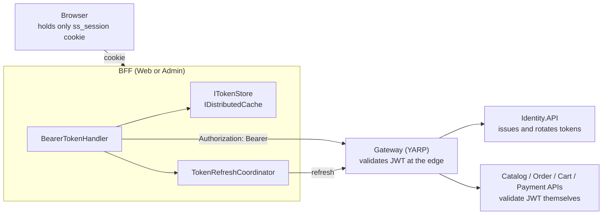
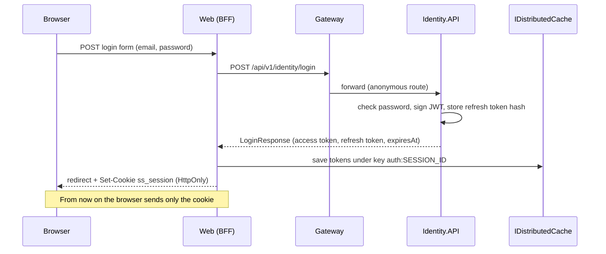
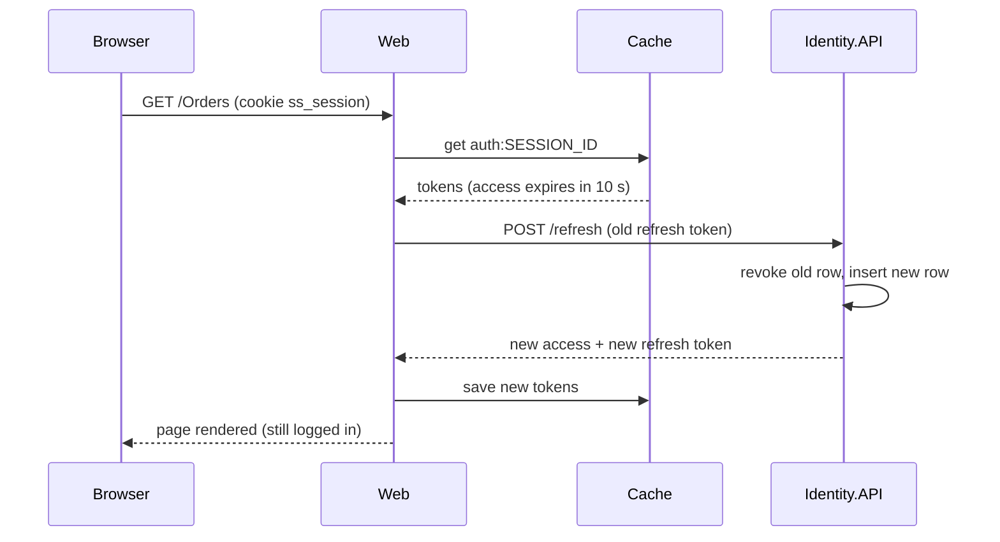
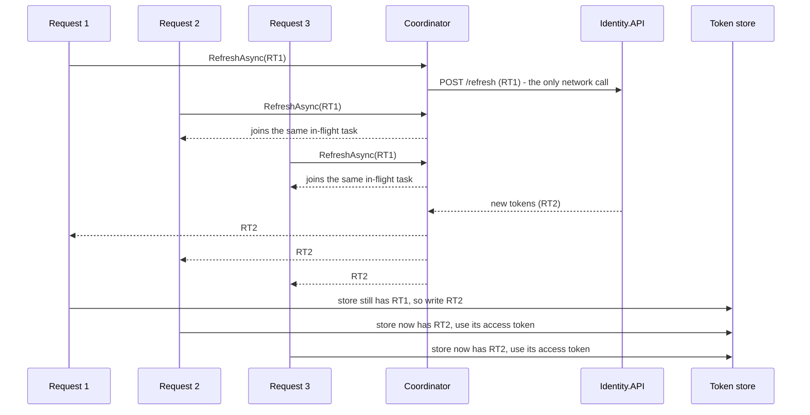

# Chapter 3 - Authentication and the BFF pattern

This chapter explains how a user proves who they are in SimpleStore, and how that proof travels safely between a browser, two web front ends, a gateway and several APIs. You will follow one login from the browser all the way to the database, and then watch what happens an hour later when the access token expires.

**What you will learn**

- What a JWT access token contains and how `Identity.API` signs it.
- How refresh tokens are generated, stored (as a hash) and rotated on every use.
- How passkeys (WebAuthn) plug into the same token issuing code.
- What the BFF (Backend for Frontend) pattern is and why the browser never sees a JWT.
- How `BearerTokenHandler` attaches tokens to outgoing calls and refreshes them.
- Why `TokenRefreshCoordinator` exists (single-flight) and why Admin needs an extra `TokenRefreshClient`.

Previous chapters: [01 Architecture and Aspire](01-architecture-and-aspire.md), [02 Gateway and API versioning](02-gateway-and-api-versioning.md).

---

## The problem

A web shop has to answer two questions on every request: *who is calling?* and *are they allowed to do this?* In a monolith you would keep a session in memory. In SimpleStore there are many services (Catalog, Order, Cart, Payment, ...) and none of them should have to call a central "session service" for every request. They also should not each need their own user table.

The usual answer is a **token**: a small, signed piece of data that says "this is user X, with role Y, valid until time T". Any service that knows the signing key can check the signature locally and trust the content.

> **New term: JWT (JSON Web Token).** A string made of three base64url parts separated by dots: a header (algorithm), a payload (claims such as user id and roles) and a signature. Anyone can *read* the payload; only someone with the key can *produce a valid signature*. So never put secrets in it.

> **New term: Access token vs refresh token.** The access token is short-lived and sent on every API call. The refresh token is long-lived, sent only to Identity to get a new access token. Short access tokens limit the damage if one leaks; the refresh token lets the user stay logged in without typing the password again.

> **New term: BFF (Backend for Frontend).** A server-side web application that sits between the browser and the APIs. The browser talks only to the BFF using a normal cookie; the BFF holds the real tokens and calls the APIs on the browser's behalf. In SimpleStore, `SimpleStore.Web` (MVC storefront) and `SimpleStore.Admin` (Blazor Server) are the BFFs.

There is a second problem hiding behind the first. Refresh tokens here are **rotated on use**: every successful refresh invalidates the old refresh token and returns a new one. That is good for security, but if a page triggers five API calls at once with an expired access token, all five would try to use the same old refresh token and four of them would fail. Section "Single-flight refresh" solves that.

---

## Big picture



*How to read it: arrows show who calls whom. The browser only ever talks to the BFF with a cookie. Everything to the right of the BFF uses the JWT in an `Authorization` header.*

The same flow for a login, step by step:



*How to read it: time flows downward. The tokens stop at the cache; only an opaque session id goes back to the browser.*

---

## Walk through the code

### 1. Signing the access token

File: [JwtTokenService.cs](../../src/SimpleStore.Identity.API/Services/JwtTokenService.cs)

The key comes from configuration as a base64 string and is turned into bytes, then used with HMAC-SHA256 (HS256 - a *symmetric* algorithm: the same key signs and verifies).

```csharp
var keyBytes = Convert.FromBase64String(_options.Key);
var signingKey = new SymmetricSecurityKey(keyBytes);
var credentials = new SigningCredentials(signingKey, SecurityAlgorithms.HmacSha256);

var now = DateTime.UtcNow;
var expiresAt = now.AddMinutes(_options.AccessTokenMinutes);
```

Then the claims (the facts inside the token):

```csharp
var claims = new List<Claim>
{
    new(JwtRegisteredClaimNames.Sub, user.Id),
    new(JwtRegisteredClaimNames.Email, user.Email ?? string.Empty),
    new(JwtRegisteredClaimNames.Name, user.FullName),
    new(JwtRegisteredClaimNames.Jti, Guid.NewGuid().ToString())
};
foreach (var role in roles)
{
    claims.Add(new Claim("role", role));
}
```

- `sub` is the user id. Every service uses it as "who is this".
- `name` carries the user's full name (the UIs show it).
- `jti` is a unique id for this token.
- One `role` claim is added per role (`Admin`, `Customer`). Services check these for authorization.

The token also gets `iss`/`aud` (issuer and audience), `nbf` (not before = now) and `exp` (expires). How long is the lifetime? [JwtOptions.cs](../../src/SimpleStore.Identity.API/Services/JwtOptions.cs) defaults `AccessTokenMinutes` to **60**, and [appsettings.json](../../src/SimpleStore.Identity.API/appsettings.json) sets it to 60 as well. Refresh tokens default to 30 days. (Some older notes in `docs/` mention 15 minutes; the code says 60.)

The key itself is never in the repository. The AppHost passes `Jwt__Key`, `Jwt__Issuer` and `Jwt__Audience` to every service that needs to validate tokens (see [Chapter 1](01-architecture-and-aspire.md)).

### 2. Refresh tokens: random, hashed, rotated

File: [RefreshTokenService.cs](../../src/SimpleStore.Identity.API/Services/RefreshTokenService.cs)

A refresh token is not a JWT. It is just 32 random bytes, encoded as base64url. Only a SHA-256 hash is stored in the database, so a stolen database dump does not hand out usable tokens.

```csharp
private static string GenerateRaw()
{
    var bytes = RandomNumberGenerator.GetBytes(32);
    return Convert.ToBase64String(bytes).TrimEnd('=').Replace('+', '-').Replace('/', '_');
}

private static string Hash(string raw)
{
    var bytes = Encoding.UTF8.GetBytes(raw);
    return Convert.ToHexString(SHA256.HashData(bytes));
}
```

The entity ([RefreshToken.cs](../../src/SimpleStore.Identity.API/Models/RefreshToken.cs)) knows when it is usable:

```csharp
public bool IsActive => RevokedAt is null && DateTime.UtcNow < ExpiresAt;
```

`RotateAsync` is the heart of the design:

```csharp
var (newRaw, newExp) = (GenerateRaw(), DateTime.UtcNow.AddDays(_options.RefreshTokenDays));
var newHash = Hash(newRaw);

existing.RevokedAt = DateTime.UtcNow;
existing.ReplacedByTokenHash = newHash;

_db.RefreshTokens.Add(new RefreshToken
{
    UserId = existing.UserId,
    TokenHash = newHash,
    ExpiresAt = newExp
});
await _db.SaveChangesAsync(cancellationToken);
```

Revoking the old row and inserting the new row happen in a single `SaveChangesAsync`, which EF Core wraps in one database transaction, so you never end up with zero or two valid tokens from one rotation.

> **Algorithm: refresh token rotation**
>
> 1. Hash the raw token the client sent (SHA-256, hex).
> 2. Look up a row with that hash. If missing, revoked, or expired: return nothing (the endpoint answers 401).
> 3. Generate a new random token and hash it.
> 4. On the old row set `RevokedAt = now` and `ReplacedByTokenHash = new hash`.
> 5. Insert a new row for the same user with the new hash and a fresh expiry.
> 6. Save both changes together and return the *raw* new token (it is never stored in plain text).

`RevokeAsync` (used by logout) is idempotent: if the row is missing or already revoked it simply returns.

### 3. Login, register, refresh, logout

File: [IdentityService.cs](../../src/SimpleStore.Identity.API/Services/IdentityService.cs)

Login uses ASP.NET Core Identity's `SignInManager.CheckPasswordSignInAsync`, then calls `IssueTokensAsync`, which signs an access token and creates a refresh token. Register creates the user, adds the `Customer` role and issues tokens the same way.

Refresh is two small steps:

```csharp
var existing = await _refresh.ValidateAsync(refreshToken, cancellationToken);
if (existing is null) return null;

var rotated = await _refresh.RotateAsync(refreshToken, cancellationToken);
if (rotated is null) return null;
```

It then loads the user again, re-reads the *current* roles, and signs a new access token. That means role changes take effect at the next refresh. The HTTP endpoints are in [IdentityEndpoints.cs](../../src/SimpleStore.Identity.API/Endpoints/IdentityEndpoints.cs): `/login`, `/register`, `/refresh` and `/logout` are anonymous, because the caller has no valid access token yet (or, for refresh, it has just expired).

### 4. Passkeys

> **New term: Passkey (WebAuthn).** A passwordless login where the browser asks the device (fingerprint, PIN, security key) to sign a challenge from the server. Only the public key is stored on the server.

Passkeys reuse ASP.NET Core Identity's built-in support (`IdentityPasskeyOptions`, schema version 3). The flow is two round trips for sign-in and two for registering a passkey:

| Purpose | Step 1 (get options) | Step 2 (send signed result) |
|---|---|---|
| Sign in (anonymous) | `POST /passkey/assertion-options` | `POST /passkey/assertion` |
| Register a passkey (logged in) | `POST /passkey/creation-options` | `POST /passkey/attestation` |

The important part is where a passkey login ends. After verifying the assertion it calls the *same* `IssueTokensAsync` as the password login:

```csharp
var assertion = await signInManager.PerformPasskeyAssertionAsync(request.CredentialJson);
if (!assertion.Succeeded || assertion.User is null)
    return Results.BadRequest(new { error = assertion.Failure?.Message ?? "Passkey assertion failed." });

var response = await service.IssueTokensAsync(assertion.User.Id, ct);
```

So everything after login (JWT, refresh token, BFF session) is identical no matter how the user proved their identity. The browser must finish the ceremony within `AuthenticatorTimeout`, set to 2 minutes in [Program.cs](../../src/SimpleStore.Identity.API/Program.cs).

### 5. The BFF stores the tokens, the browser gets a cookie

The Web login page handler ([Login.cshtml.cs](../../src/SimpleStore.Web/Areas/Identity/Pages/Account/Login.cshtml.cs)) calls Identity through the typed client and hands the result to `ITokenStore`:

```csharp
await _tokens.SetAsync(new TokenSet
{
    AccessToken = response.AccessToken,
    RefreshToken = response.RefreshToken,
    ExpiresAt = response.ExpiresAt
});

return LocalRedirect(returnUrl);
```

The store ([DistributedCacheTokenStore.cs](../../src/SimpleStore.Web/Services/Auth/DistributedCacheTokenStore.cs)) is where the BFF idea becomes concrete. If the browser has no session cookie yet, it creates a random id and sets an `HttpOnly` cookie:

```csharp
if (!ctx.Request.Cookies.TryGetValue(SessionCookieName, out var sessionId) || string.IsNullOrEmpty(sessionId))
{
    sessionId = Guid.NewGuid().ToString("N");
    ctx.Response.Cookies.Append(SessionCookieName, sessionId, new CookieOptions
    {
        HttpOnly = true,
        Secure = true,
        SameSite = SameSiteMode.Lax,
        IsEssential = true,
        Path = "/"
    });
}
```

Then it serializes the `TokenSet` to JSON and writes it to the cache under the key `"auth:" + sessionId` with a 30-day sliding expiration:

```csharp
var json = JsonSerializer.Serialize(tokens);
await _cache.SetStringAsync(CacheKeyPrefix + sessionId, json, new DistributedCacheEntryOptions
{
    // Sliding expiration keeps the entry alive as long as the user is active.
    SlidingExpiration = TimeSpan.FromDays(30)
}, cancellationToken);
```

What each cookie flag buys you:

- `HttpOnly`: JavaScript cannot read the cookie, so an XSS bug cannot steal the session id.
- `Secure`: only sent over HTTPS.
- `SameSite=Lax`: not sent on cross-site POSTs, which blunts CSRF attacks.

Both Web and Admin register `AddDistributedMemoryCache()`. Despite the "distributed" name, that implementation is **per-process memory**: sessions are lost when the app restarts and are not shared between replicas. For a teaching sample with one instance that is fine; see [Chapter 11](11-known-limitations.md).

### 6. Turning the session back into a JWT on each request

`SimpleStore.Web` and `SimpleStore.Admin` still use ASP.NET Core's JWT bearer middleware to authenticate *incoming* browser requests. The trick is the `OnMessageReceived` event, which runs before the token is read from the `Authorization` header. Since the browser sends no such header, the event pulls the token out of the store ([Program.cs](../../src/SimpleStore.Web/Program.cs)):

```csharp
var store = ctx.HttpContext.RequestServices.GetRequiredService<ITokenStore>();
var current = await store.GetAsync(ctx.HttpContext.RequestAborted);
if (current is null) return;

// Auto-refresh expired access tokens transparently for inbound auth.
if (current.ExpiresAt <= DateTime.UtcNow.AddSeconds(30) && !string.IsNullOrEmpty(current.RefreshToken))
```

If the access token is within 30 seconds of expiry (the same value as `ClockSkew`), it refreshes right here:

```csharp
var rotated = await identity.RefreshAsync(new RefreshRequest { RefreshToken = current.RefreshToken }, ctx.HttpContext.RequestAborted);
if (rotated is not null)
{
    var next = new TokenSet
    {
        AccessToken = rotated.AccessToken,
        RefreshToken = rotated.RefreshToken,
        ExpiresAt = rotated.ExpiresAt
    };
    await store.SetAsync(next, ctx.HttpContext.RequestAborted);
    ctx.Token = next.AccessToken;
    return;
```

Note that this inbound path calls Identity directly; it does **not** go through the coordinator described below.

> **Algorithm: expired-token refresh on an incoming request**
>
> 1. Read the `ss_session` cookie, then the `TokenSet` from the cache. No cookie or no entry: the request stays anonymous.
> 2. If `ExpiresAt` is more than 30 seconds away, use the access token as is.
> 3. Otherwise call `POST /refresh` with the stored refresh token.
> 4. On success save the rotated tokens in the cache and use the new access token.
> 5. On failure present the old token anyway; validation fails and the request is treated as not logged in.



*How to read it: the user sees nothing; the refresh happens inside one page request.*

### 7. Outbound calls: BearerTokenHandler

When a controller calls `ICatalogApiClient`, `IOrderApiClient` and so on, a `DelegatingHandler` (an HttpClient middleware) attaches the token. See [BearerTokenHandler.cs](../../src/SimpleStore.Web/Services/Auth/BearerTokenHandler.cs). Handlers are attached in [Program.cs](../../src/SimpleStore.Web/Program.cs) with `.AddHttpMessageHandler<BearerTokenHandler>()`.

> **Algorithm: BearerTokenHandler.GetUsableAccessTokenAsync**
>
> 1. Read the `TokenSet` from `ITokenStore`. None: send the request without a token.
> 2. If `ExpiresAt > now + 30 s`: return the access token.
> 3. If there is no refresh token: return the access token as is.
> 4. Otherwise ask `TokenRefreshCoordinator` to refresh using the current refresh token (single-flight, see next section).
> 5. Re-read the store. If its refresh token still equals the one we started with, write the rotated tokens there; if it changed, someone else already stored the new ones, so use the store's access token.
> 6. If the refresh failed (null or exception), send the request unauthenticated and let the API answer 401.

Step 5 in code:

```csharp
// Re-read the store: another concurrent caller may have already persisted the rotated
// tokens. If we see an unchanged refresh token, we are the one responsible for writing.
var latest = await _tokens.GetAsync(cancellationToken);
if (latest is null || string.Equals(latest.RefreshToken, current.RefreshToken, StringComparison.Ordinal))
{
    await _tokens.SetAsync(new TokenSet
    {
        AccessToken = rotated.AccessToken,
        RefreshToken = rotated.RefreshToken,
        ExpiresAt = rotated.ExpiresAt
    }, cancellationToken);
    return rotated.AccessToken;
}
return latest.AccessToken;
```

Two callers can both see the unchanged value before either writes; in that case both write the same rotated tokens, which is harmless.

Web's `AddIdentityApiClient()` has **no** `BearerTokenHandler`: login, register and refresh are anonymous routes, so none is needed (and it would make refresh call itself). Calls to Catalog, Order, Payment and Cart all get the handler.

### 8. Single-flight refresh: TokenRefreshCoordinator

File: [TokenRefreshCoordinator.cs](../../src/SimpleStore.Web/Services/Auth/TokenRefreshCoordinator.cs)

> **New term: Single-flight.** If many callers ask for the same expensive thing at the same time, do the work once and give everybody the same result.

The coordinator keeps a dictionary from *refresh token value* to a `Lazy<Task<LoginResponse?>>`. The first caller installs the `Lazy`; later callers with the same refresh token find it and await the same task.

```csharp
var created = false;
var lazy = _inFlight.GetOrAdd(refreshToken, _ =>
{
    created = true;
    return new Lazy<Task<LoginResponse?>>(refreshFn, LazyThreadSafetyMode.ExecutionAndPublication);
});
if (!created)
{
    Telemetry.TokenRefreshCoalesced.Add(1);
}
return AwaitAndCleanupAsync(refreshToken, lazy);
```

`ConcurrentDictionary.GetOrAdd` can, under a race, run its factory more than once and discard the extras. That is why the value is a `Lazy` with `ExecutionAndPublication`: even if two `Lazy` objects are created, only the one that wins the dictionary slot is ever *executed*, so the network call runs once.

Cleanup happens in a `finally` block so a failed refresh does not leave a poisoned entry behind:

```csharp
finally
{
    // Best-effort cleanup. Late callers that already grabbed this Lazy still receive its
    // cached result via lazy.Value; removing the dictionary entry only affects future callers
    // who would otherwise see a stale, already-completed task and reuse its (no-longer-valid)
    // refresh token.
    _inFlight.TryRemove(key, out _);
}
```

> **Algorithm: coalescing N parallel refreshes**
>
> 1. Each caller calls `RefreshAsync(refreshToken, refreshFn)`.
> 2. `GetOrAdd` returns an existing `Lazy` if present, otherwise stores a new one.
> 3. The caller that created it increments nothing; every other caller increments the counter `simplestore.identity.token_refresh.coalesced`.
> 4. All callers `await lazy.Value`; the first access runs `refreshFn` (one HTTP call to Identity), the rest wait for the same task.
> 5. When the task completes, each caller removes the key (only the first removal does anything).



*How to read it: three callers need a refresh at the same time. Identity sees one call, not three, so the single-use RT1 is not spent three times.*

One detail in `BearerTokenHandler`: the inner refresh call uses `CancellationToken.None`. If one waiting caller is cancelled (the user closes the tab), that must not abort the shared refresh the others are waiting for.

### 9. What is different in Admin

Admin ([Program.cs](../../src/SimpleStore.Admin/Program.cs)) is a Blazor Server app, so it differs in three ways.

**a) `TokenRefreshClient` avoids a circular dependency.** In Web, `IIdentityApiClient` has no handler. In Admin it does, because the admin `/users` endpoints need a JWT. But `BearerTokenHandler` needs a client to call refresh, and `IIdentityApiClient`'s handler chain contains `BearerTokenHandler`: a cycle. The fix is a tiny second client with no handlers ([TokenRefreshClient.cs](../../src/SimpleStore.Admin/Services/Auth/TokenRefreshClient.cs)):

```csharp
public sealed class TokenRefreshClient(HttpClient http)
{
    private readonly IIdentityApiClient _identity = new IdentityApiClient(http);

    public Task<LoginResponse?> RefreshAsync(RefreshRequest request, CancellationToken cancellationToken = default)
        => _identity.RefreshAsync(request, cancellationToken);
}
```

It also guarantees that a refresh call can never trigger another refresh.

**b) `CircuitTokenStore` caches the token for the lifetime of the Blazor circuit.** `IHttpContextAccessor.HttpContext` is only dependable during the first HTTP request that sets up the SignalR connection; later button clicks run without a normal request. So [CircuitTokenStore.cs](../../src/SimpleStore.Admin/Services/Auth/CircuitTokenStore.cs) remembers the last good `TokenSet` and falls back to it:

```csharp
catch
{
    // HttpContext may be unavailable in interactive Blazor — fall back to cached.
}

return _hasCached ? _cached : null;
```

**c) Admin rejects non-admins at login and sends browsers to the login page.** From [Login.cshtml.cs](../../src/SimpleStore.Admin/Pages/Account/Login.cshtml.cs):

```csharp
if (!response.User.Roles.Contains("Admin"))
{
    ErrorMessage = "Account does not have admin access.";
    return Page();
}
```

and `OnChallenge` in `Program.cs` redirects an unauthenticated HTML `GET` to `/Account/Login?returnUrl=...` while leaving other requests as plain 401. The authorization `FallbackPolicy` is set to the `Admin` policy, so every page is admin-only unless it says otherwise.

### 10. Logout

[Logout.cshtml.cs](../../src/SimpleStore.Web/Areas/Identity/Pages/Account/Logout.cshtml.cs) revokes the refresh token at Identity (`LogoutAsync`) and then clears the cache entry and the cookie (`ClearAsync`). The access token itself cannot be revoked; it simply expires (up to 60 minutes later) and nobody holds it any more except the cache entry that was just removed.

### 11. The gateway checks tokens too

All browser-to-API traffic from the BFFs goes through the gateway, which validates the JWT *again* for protected routes (see [Chapter 2](02-gateway-and-api-versioning.md)). The downstream APIs validate it a third time. This is deliberate defense in depth: each layer is cheap (an HMAC check) and no layer has to trust the one before it.

---

## What can go wrong

- **Refresh token reuse is not detected.** If an old refresh token is presented again, `ValidateAsync` finds it revoked and returns null, so the caller gets a 401. That is all that happens. The model records `ReplacedByTokenHash` on the old row, but nothing reads it: there is no "token family" revocation that would log out everyone if a stolen token is replayed. Real systems often add this.
- **Rotation has no concurrency guard.** `RotateAsync` does a lookup, then a save, without a row version or lock. Two truly simultaneous refreshes with the same token could both pass `ValidateAsync`. In SimpleStore the coordinator makes this unlikely for outbound calls from one process, but it is not a database-level guarantee.
- **The inbound refresh path bypasses the coordinator.** `OnMessageReceived` calls `IIdentityApiClient.RefreshAsync` directly (Web) or `TokenRefreshClient` (Admin). If a browser fires several parallel requests that all find an expired token, each one runs its own refresh. The single-flight only protects parallel *outbound* calls that go through `BearerTokenHandler`. This is also why the `coalesced` counter may stay at zero during simple browsing.
- **A late caller can still lose the race.** The coordinator removes its entry as soon as the refresh finishes. A caller that read the old tokens just before the store was updated, but reaches the coordinator after the removal, would start a second refresh with an already-revoked token, get a 401 from Identity, and send its request without a token.
- **Sessions live in process memory.** `AddDistributedMemoryCache()` means a restart of Web or Admin logs everyone out, and two replicas would not share sessions. Swapping in Redis is a one-line registration change, but this repo does not do it.
- **The session cookie has no explicit expiry.** `ss_session` is set without `Expires`, so browsers normally drop it when they close, while the cache entry lives on until its 30-day sliding window ends. The "Remember me" checkbox on the Web login form is bound to `Input.RememberMe`, but the handler shown above never reads it.
- **Login does not rotate the session id.** `SetAsync` reuses an existing `ss_session` cookie value if the browser already has one, so the same id continues across anonymous and logged-in states.
- **The signing key is shared.** HS256 means every service that can *verify* a token can also *forge* one. That is acceptable inside one trust boundary; an asymmetric algorithm (RS256) with a published public key is the usual step up.
- **Access tokens cannot be revoked early.** Locking a user in Admin does not invalidate access tokens already issued; it only stops new logins and refreshes.

---

## Try it yourself

Start the system with `dotnet run --project src/SimpleStore.AppHost` and open the Aspire dashboard. The dev seed accounts are `admin@simplestore.local` / `Admin123!` (role Admin) and `demo@simplestore.local` / `Demo123!` (role Customer).

1. **See what the browser holds.** Open the storefront, go to the login page, sign in as the demo customer. In browser dev tools open *Application > Cookies*. You should see `ss_session` flagged `HttpOnly` and `Secure`, and a random-looking value. Check *Local Storage* and *Session Storage*: no token there. Try `document.cookie` in the console: `ss_session` is not listed because it is HttpOnly.
2. **Read a JWT.** Send `POST /api/v1/identity/login` to the gateway address shown in the dashboard, with a JSON body of `email` and `password`. Take the middle part of `accessToken`, base64url-decode it locally (for example with `base64 -d` after fixing padding) and look for `sub`, `email`, `name`, `role`, `exp`. Do not paste tokens into third-party websites. These are dev tokens, but it is a good habit.
3. **Watch a rotation.** In the same response note the `refreshToken`. Call `POST /api/v1/identity/refresh` with it: you get new tokens. Call it again with the *old* refresh token: you get 401. (If you have pgweb from the AppHost open, look at the `RefreshTokens` table in `identitydb`: the old row has `RevokedAt` and `ReplacedByTokenHash` filled in, and no raw tokens appear.)
4. **Force an automatic refresh.** Temporarily set `AccessTokenMinutes` to `1` in [appsettings.json](../../src/SimpleStore.Identity.API/appsettings.json), restart, sign in, wait about 40 seconds, then reload an authenticated page such as *My orders*. In the dashboard's *Traces* view you should see a `refresh` request to Identity inside that page request. Put the value back to 60 afterwards.
5. **Look at the coalescing counter.** In *Metrics* choose the Web or Admin resource and find `simplestore.identity.token_refresh.coalesced`. After ordinary browsing it may well be 0 (see "What can go wrong"). It increases when several outbound API calls start at the same moment with an expired token.
6. **Admin is stricter.** Try signing into the Admin app with the demo customer account and read the message. Then sign in as the admin account.

---

## Key takeaways

- The access token is a signed JWT (HS256) with `sub`, `email`, `name`, `jti` and `role` claims, valid for 60 minutes by default.
- Refresh tokens are random, stored only as SHA-256 hashes, and rotated on every use in one transaction.
- Passkeys and passwords both end in `IssueTokensAsync`, so everything downstream is identical.
- With the BFF pattern the browser holds an opaque `HttpOnly` cookie; tokens live server-side in `IDistributedCache` under `auth:` plus the session id.
- `BearerTokenHandler` refreshes just before expiry; `TokenRefreshCoordinator` ensures parallel callers share one refresh so rotate-on-use does not cause failures.
- Admin needs `TokenRefreshClient` (to break a dependency cycle) and `CircuitTokenStore` (Blazor circuits lack a reliable `HttpContext`).
- Known gaps (no reuse detection, in-memory sessions, uncoalesced inbound refresh) are listed honestly in [Chapter 11](11-known-limitations.md).

## Next chapter

Now that you know how a caller is identified, continue with [Chapter 4 - Catalog and Cart](04-catalog-and-cart.md), where an anonymous visitor's shopping cart is merged into their account at login.
