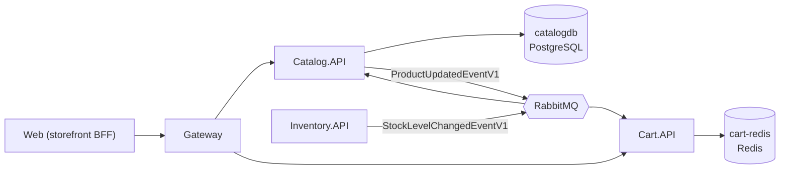
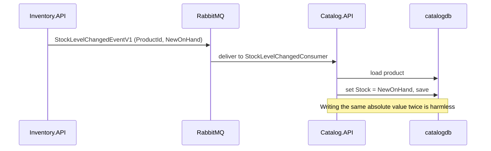
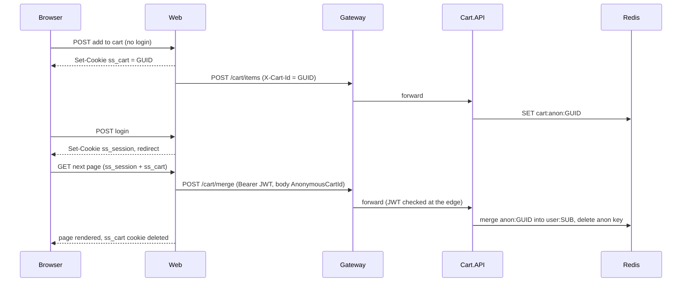
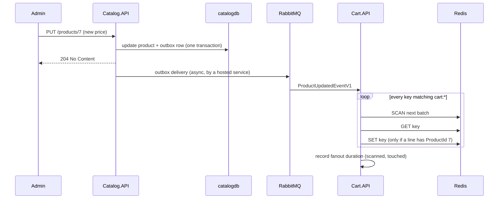

# Chapter 4 - Catalog and Cart

This chapter covers the two services a shopper touches first: **Catalog** (the list of products, stored in PostgreSQL) and **Cart** (a shopping basket stored in Redis). Both are small on the surface, but they show three important microservice ideas: reading and writing data your service owns, keeping a *copy* of another service's data in sync with events, and handling visitors who have not logged in yet.

**What you will learn**

- How Catalog does safe paging and searching.
- Why `Product.Stock` in Catalog is a read-only cache, and how an event keeps it fresh.
- How an update to a product is saved *and* announced in one database transaction (outbox).
- How Cart keys work in Redis (`cart:user:<sub>` and `cart:anon:<guid>`) and how `ResolveOwner` picks one.
- How an anonymous cart is merged into the user's cart when they log in, and why that merge lives in a middleware.
- How a product price change fans out to every cart using Redis `SCAN`, and what that costs.
- How Cart degrades when Redis is unhealthy.

Previous: [Chapter 3 - Authentication and the BFF pattern](03-authentication-and-bff.md). Related: [Chapter 1](01-architecture-and-aspire.md), [Chapter 2](02-gateway-and-api-versioning.md).

---

## The problem

1. **A store has to list thousands of products without sending them all at once.** The API must page, filter by category and search by text, and a careless client must not be able to ask for a million rows.
2. **Stock lives somewhere else.** Since the Inventory service became the single source of truth for stock (see [Chapter 7](07-inventory-event-sourcing-cqrs.md)), Catalog must still show "in stock: 12" on a product page. Calling Inventory on every page view would couple the two services tightly.
3. **A cart line needs the product name, price and image.** Cart.API could call Catalog every time it shows the cart, but then Cart would break whenever Catalog is down. Instead each cart line carries a copy of those fields. Copies go stale, so when an admin edits a product, every copy must be refreshed.
4. **Shoppers browse before they log in.** Their cart must survive the login, and must not be lost if they were already logged in on another device.

> **New term: Denormalization.** Storing a copy of data from another place so you do not have to look it up each time. It makes reads fast and services independent, but you must keep the copy up to date.

> **New term: Eventual consistency.** The copies will agree *soon*, not instantly. Between an admin saving a product and Cart refreshing, a cart can briefly show the old price.

> **New term: Idempotent.** An operation that has the same effect whether you run it once or many times. Message brokers can deliver the same message twice, so consumers should be idempotent.

---

## Big picture



*How to read it: solid arrows to a database are reads and writes; arrows through RabbitMQ are events. Catalog publishes product edits (Cart listens); Inventory publishes stock changes (Catalog listens).*

Who owns what:

| Data | Owner | Copies |
|---|---|---|
| Name, description, price, image, category | Catalog | Cart lines (`ProductName`, `UnitPrice`, `ImageUrl`) |
| Stock on hand | Inventory | `Product.Stock` in Catalog |
| Cart contents | Cart (Redis) | none |

---

## Walk through the code

### Part A - Catalog

#### 1. Paging and searching

File: [CatalogService.cs](../../src/SimpleStore.Catalog.API/Services/CatalogService.cs)

Every list call first passes through a small guard that keeps paging values sane:

```csharp
private static (int page, int pageSize) ClampPaging(int page, int pageSize)
{
    if (page < 1) page = 1;
    if (pageSize < 1) pageSize = 1;
    if (pageSize > MaxPageSize) pageSize = MaxPageSize;
    return (page, pageSize);
}
```

`MaxPageSize` is 100, so the biggest page a caller can get is 100 products. Then `GetProductsAsync` builds the query step by step:

```csharp
var query = _context.Products.Include(p => p.Category).AsNoTracking().AsQueryable();
if (categoryId.HasValue)
    query = query.Where(p => p.CategoryId == categoryId.Value);
if (!string.IsNullOrWhiteSpace(searchTerm))
    query = query.Where(p => p.Name.Contains(searchTerm) || p.Description.Contains(searchTerm));

var totalCount = await query.CountAsync(ct);
var items = await query
    .OrderBy(p => p.Id)
    .Skip((page - 1) * pageSize)
    .Take(pageSize)
    .Select(p => ToDto(p))
    .ToListAsync(ct);
```

Points worth noticing:

- Nothing hits the database until `CountAsync` and `ToListAsync`. Filters just add to the query that EF Core later translates into one SQL statement.
- `Contains` becomes a SQL `LIKE '%term%'`. Simple, but a leading wildcard cannot use a normal index, so on a large table you would move to full-text search.
- `OrderBy(p => p.Id)` is required for stable paging: without a defined order, page 2 could repeat or skip rows.
- `AsNoTracking()` tells EF Core not to remember the entities, which is cheaper for read-only queries.
- The count and the page are two separate queries, so under concurrent writes the total can be slightly off from the items.

The endpoints that call this are in [CatalogEndpoints.cs](../../src/SimpleStore.Catalog.API/Endpoints/CatalogEndpoints.cs). Reads have no authorization; writes use `.RequireAuthorization("Admin")`. The gateway repeats that split (`catalog-read` anonymous, `catalog-write` admin; see [Chapter 2](02-gateway-and-api-versioning.md)).

> **Algorithm: paged product query**
>
> 1. Clamp `page >= 1` and `1 <= pageSize <= 100`.
> 2. Start from `Products` joined to `Category`, untracked.
> 3. If `categoryId` is given, filter by it.
> 4. If `search` is non-blank, filter on `Name` or `Description` containing it.
> 5. Count the filtered rows.
> 6. Order by `Id`, skip `(page-1) * pageSize`, take `pageSize`, map to DTOs.
> 7. Return items plus `Page`, `PageSize`, `TotalCount`.

#### 2. Stock is a cache, not a field you edit

When an admin creates a product, Catalog does **not** accept a stock number. It forces zero:

```csharp
// Stock starts at 0 — Inventory.API is the source of truth. An admin establishes initial
// stock by issuing a receipt note in Inventory, which flows back here as a
// StockLevelChangedEventV1 and updates the cached Product.Stock.
var product = new Product
{
    Name = request.Name,
    Description = request.Description,
    Price = request.Price,
    Stock = 0,
```

`UpdateProductAsync` does not touch `Stock` either. The request DTOs (`CreateProductRequest`, `UpdateProductRequest`) have no `Stock` field at all, so a client cannot even try. (The seeder, [CatalogSeeder.cs](../../src/SimpleStore.Catalog.API/CatalogSeeder.cs), creates 4 categories and 10 products with initial stock so the demo has data; Inventory's own seeder records matching receipt notes.)

#### 3. Saving and announcing an update: the outbox

A product edit has two jobs: change the row, and tell Cart about it. If you did both separately you could save the row and crash before sending the event, or send the event and fail to save. That is the **dual-write problem** (explained fully in [Chapter 5](05-orders-and-outbox.md)).

> **New term: Transactional outbox.** Instead of sending the message directly, write it into a table in the *same database transaction* as your data change. A background process later reads the table and delivers the message. Either both the row and the message are saved, or neither is.

Catalog turns the outbox on in [Program.cs](../../src/SimpleStore.Catalog.API/Program.cs):

```csharp
x.AddEntityFrameworkOutbox<CatalogDbContext>(o =>
{
    o.UsePostgres();
    o.UseBusOutbox();
});
x.AddConsumer<StockLevelChangedConsumer>();
```

Then `UpdateProductAsync` uses it. First it wraps the work in an EF Core execution strategy so a transient database failure can be retried as a whole (see [Chapter 9](09-resilience-and-observability.md)):

```csharp
var strategy = _context.Database.CreateExecutionStrategy();
await strategy.ExecuteAsync(async () =>
{
    await using var tx = await _context.Database.BeginTransactionAsync(ct);

    await _context.SaveChangesAsync(ct);

    await _context.Entry(product).Reference(p => p.Category).LoadAsync(ct);
```

Then it publishes. Because the bus outbox is on, `Publish` does not talk to RabbitMQ; it queues an `OutboxMessage` row in the EF change tracker. The second `SaveChanges` writes that row, and `CommitAsync` makes the product update and the outbox row permanent together:

```csharp
await _publishEndpoint.Publish(new ProductUpdatedEventV1
{
    ProductId = product.Id,
    Name = product.Name,
    Description = product.Description,
    Price = product.Price,
    ImageUrl = product.ImageUrl,
    Stock = product.Stock,
    CategoryId = product.CategoryId,
    CategoryName = product.Category?.Name ?? string.Empty
}, ct);

await _context.SaveChangesAsync(ct);
await tx.CommitAsync(ct);
```

> **Algorithm: update a product and announce it**
>
> 1. Load the product; if missing, return not found.
> 2. Copy Name, Description, Price, ImageUrl, CategoryId from the request (never Stock).
> 3. Open an execution strategy (retry unit) and begin a transaction.
> 4. `SaveChanges`: the product update is written inside the transaction.
> 5. Load the category name for the event.
> 6. `Publish(ProductUpdatedEventV1)`: stored in the outbox table.
> 7. `SaveChanges` again: the outbox row is written.
> 8. Commit. A hosted MassTransit service delivers outbox rows to RabbitMQ asynchronously and marks them delivered.

`ProductUpdatedEventV1` itself lives in [ProductUpdatedEvent.cs](../../src/SimpleStore.Contracts/ProductUpdatedEvent.cs) and has a pinned wire name; see [Chapter 10](10-contracts-and-versioning.md).

#### 4. Keeping the stock cache fresh

File: [StockLevelChangedConsumer.cs](../../src/SimpleStore.Catalog.API/Consumers/StockLevelChangedConsumer.cs)

Inventory publishes `StockLevelChangedEventV1` whenever its `stock_levels` change (reservations, receipts, deliveries, cancellations), carrying the new absolute quantity on hand (`NewOnHand`). Catalog's consumer overwrites its cached value:

```csharp
var product = await _context.Products.FirstOrDefaultAsync(p => p.Id == msg.ProductId, ct);
if (product is null)
{
    _logger.LogWarning(
        "StockLevelChangedEventV1 for unknown ProductId={ProductId} — Catalog has no such product.",
        msg.ProductId);
    return;
}

var oldStock = product.Stock;
product.Stock = msg.NewOnHand;
await _context.SaveChangesAsync(ct);
```

Why this is safe to run twice: the message says "stock is now N", not "stock changed by -2". Writing "N" a second time changes nothing. If it were a delta, a duplicate delivery would double-count. An unknown product is logged and skipped rather than failing (a failure would just make the broker retry something that can never succeed). Catalog's `DbContext` also maps MassTransit's inbox table (`AddInboxStateEntity` in [CatalogDbContext.cs](../../src/SimpleStore.Catalog.API/Data/CatalogDbContext.cs)), which the EF Core outbox integration can use to de-duplicate deliveries by message id; the project notes describe this as exactly-once consumption.



*How to read it: the number in the message is the final answer, not a change amount, which is what makes the consumer idempotent.*

---

### Part B - Cart

#### 5. Where the cart lives in Redis

File: [RedisCartStore.cs](../../src/SimpleStore.Cart.API/Services/RedisCartStore.cs)

A cart is one JSON array stored under one Redis key:

```csharp
private static readonly DistributedCacheEntryOptions EntryOptions = new()
{
    SlidingExpiration = TimeSpan.FromDays(30)
};

private const string KeyPrefix = "cart:";
```

The full key is `cart:` plus an *owner key*, and the owner key is either `user:<sub>` (a logged-in user, where `sub` is the JWT subject from [Chapter 3](03-authentication-and-bff.md)) or `anon:<guid>` (an anonymous browser). The value is a JSON list of `CartItemDto` with `ProductId`, `ProductName`, `UnitPrice`, `ImageUrl`, `Quantity`. "Sliding" 30-day expiry means each read or write pushes the deadline out; an abandoned cart disappears after 30 days of silence.

Every mutation is "read the list, change it, write it back" (`AddItemAsync`, `UpdateItemAsync`, `RemoveItemAsync`). That is simple, and it is not atomic (see "What can go wrong").

#### 6. Who is calling? ResolveOwner

File: [CartEndpoints.cs](../../src/SimpleStore.Cart.API/Endpoints/CartEndpoints.cs)

```csharp
private static string? ResolveOwner(HttpContext ctx)
{
    var sub = ctx.User.FindFirst("sub")?.Value;
    if (!string.IsNullOrEmpty(sub)) return $"user:{sub}";

    var anon = ctx.Request.Headers[CartIdHeader].ToString();
    return string.IsNullOrEmpty(anon) ? null : $"anon:{anon}";
}
```

> **Algorithm: resolve the cart owner**
>
> 1. If the request carries a valid JWT with a `sub` claim, the owner is `user:<sub>`. The JWT always wins.
> 2. Else if the `X-Cart-Id` header is present, the owner is `anon:<that value>`.
> 3. Else there is no owner: most endpoints answer `400`; `/count` and `/total` answer `0`.

Most endpoints end in `.AllowAnonymous()` because an anonymous shopper has no token. This works with JWT middleware: a request with no token is simply unauthenticated, and `ctx.User` has no `sub`. Only `/merge` is protected:

```csharp
group.MapPost("/merge", async (MergeCartRequest request, HttpContext ctx, ICartStore store, CancellationToken ct) =>
{
    var sub = ctx.User.FindFirst("sub")?.Value;
    if (string.IsNullOrEmpty(sub)) return Results.Unauthorized();
    if (string.IsNullOrEmpty(request.AnonymousCartId)) return Results.BadRequest("AnonymousCartId is required.");

    await store.MergeAsync($"anon:{request.AnonymousCartId}", $"user:{sub}", ct);
    return Results.NoContent();
}).RequireAuthorization();
```

The destination always comes from the *token*, never from the request body, so a caller cannot merge somebody else's cart into their own account by naming another user. The gateway also marks this route `AuthenticatedUser` (`cart-merge`, [appsettings.json](../../src/SimpleStore.Gateway/appsettings.json)).

#### 7. How the storefront identifies an anonymous browser

Three small classes in `SimpleStore.Web/Services/Cart/` cooperate:

**`CartCookieManager`** ([CartCookieManager.cs](../../src/SimpleStore.Web/Services/Cart/CartCookieManager.cs)) creates the `ss_cart` cookie the first time an anonymous visitor adds something. `CartController.Add` calls `EnsureCartId()` only when the user is not authenticated.

```csharp
var id = Guid.NewGuid().ToString("N");
ctx.Response.Cookies.Append(CookieName, id, new CookieOptions
{
    HttpOnly = true,
    Secure = true,
    SameSite = SameSiteMode.Lax,
    IsEssential = true,
    Path = "/",
    Expires = DateTimeOffset.UtcNow.AddDays(30)
});
ctx.Items[ItemsKey] = id;
return id;
```

The last line matters. A cookie you just appended to the *response* is not visible in `Request.Cookies` of the *same* request. So the manager also stores the id in `HttpContext.Items`, and every read checks `Items` first. Without this, the first "Add to cart" of a new visitor would reach Cart.API with no cart id.

**`CartIdHandler`** ([CartIdHandler.cs](../../src/SimpleStore.Web/Services/Cart/CartIdHandler.cs)) is an outgoing `DelegatingHandler` that stamps the header:

```csharp
var cartId = _cookies.TryGetCartId();
if (!string.IsNullOrEmpty(cartId) && !request.Headers.Contains(HeaderName))
{
    request.Headers.TryAddWithoutValidation(HeaderName, cartId);
}
return base.SendAsync(request, cancellationToken);
```

It runs for every Cart call, including logged-in users; that is harmless because Cart.API prefers the JWT.

**`CartMergeMiddleware`** ([CartMergeMiddleware.cs](../../src/SimpleStore.Web/Services/Cart/CartMergeMiddleware.cs)) folds the anonymous cart into the user's cart. It is registered right after authentication and authorization in [Program.cs](../../src/SimpleStore.Web/Program.cs):

```csharp
app.UseAuthentication();
app.UseAuthorization();

// Runs after authentication so the merge sees the just-logged-in user.
app.UseMiddleware<CartMergeMiddleware>();
```

and does this:

```csharp
var anonCartId = cookies.TryGetCartId();
if (!string.IsNullOrEmpty(anonCartId))
{
    try
    {
        await cart.MergeAsync(anonCartId, context.RequestAborted);
    }
    catch (Exception ex)
    {
        _logger.LogWarning(ex, "Anonymous cart merge failed; clearing cookie regardless.");
    }
    cookies.Clear();
}
```

(inside an `if (context.User.Identity?.IsAuthenticated == true)` check).

**Why a middleware and not the login POST?** The login handler saves the tokens in the cache and sets the `ss_session` cookie on its *response*. During that same POST the request carried no `ss_session` cookie yet, so `DistributedCacheTokenStore.GetAsync` (which reads `Request.Cookies`) finds nothing, and an outbound call would go out without a JWT. By the very next request the browser sends the cookie, authentication succeeds, and the merge call carries the token. The middleware runs on that first authenticated request that still has an `ss_cart` cookie, merges once, and clears the cookie.



*How to read it: the cart is created under an anonymous key, and the merge happens on the first request after the login redirect, when the JWT is available.*

#### 8. The merge algorithm

```csharp
var toItems = await LoadItemsAsync(toKey, ct);
foreach (var src in fromItems)
{
    var dst = toItems.FirstOrDefault(i => i.ProductId == src.ProductId);
    if (dst is null)
    {
        toItems.Add(src);
    }
    else
    {
        dst.Quantity += src.Quantity;
    }
}
```

followed by saving the destination and deleting the source key:

```csharp
await SaveItemsAsync(toKey, toItems, ct);
await _cache.RemoveAsync(KeyFor(fromKey), ct);
```

> **Algorithm: MergeAsync(from = anon, to = user)**
>
> 1. If both keys are equal: do nothing.
> 2. Load the source items. If empty: delete the source key and stop.
> 3. Load the destination items.
> 4. For each source line: if the destination has that `ProductId`, add the quantities; otherwise append the line.
> 5. Save the destination list.
> 6. Delete the source key.

The merge is *not* atomic: steps 3 to 6 are separate Redis calls. See "What can go wrong".

#### 9. Refreshing cart lines when a product changes

File: [ProductUpdatedConsumer.cs](../../src/SimpleStore.Cart.API/Consumers/ProductUpdatedConsumer.cs)

Cart has no database besides Redis, and Redis cannot answer "which carts contain product 7?" without an index. SimpleStore does not keep an index. Instead the consumer walks **every** cart key:

```csharp
await foreach (var ownerKey in _store.EnumerateOwnerKeysAsync(ct))
{
    scanned++;
    var redisKey = "cart:" + ownerKey;
    var raw = await _cache.GetStringAsync(redisKey, ct);
    if (string.IsNullOrEmpty(raw)) continue;

    var items = JsonSerializer.Deserialize<List<CartItemDto>>(raw);
    if (items is null || items.Count == 0) continue;
```

> **New term: SCAN.** A Redis command that walks the key space in small batches using a cursor. Unlike `KEYS *`, it does not block the server while it works. The cost is still proportional to the number of keys.

`EnumerateOwnerKeysAsync` in `RedisCartStore` uses it:

```csharp
foreach (var endpoint in _mux.GetEndPoints())
{
    var server = _mux.GetServer(endpoint);
    // KeysAsync uses SCAN under the hood — non-blocking on the Redis server.
    await foreach (var key in server.KeysAsync(pattern: KeyPrefix + "*").WithCancellation(ct))
    {
        var s = (string)key!;
        if (s.StartsWith(KeyPrefix, StringComparison.Ordinal))
            yield return s.Substring(KeyPrefix.Length);
    }
}
```

This is why Cart.API registers both `AddRedisDistributedCache` (for `IDistributedCache`) and `AddRedisClient` (for the raw `IConnectionMultiplexer`) in [Program.cs](../../src/SimpleStore.Cart.API/Program.cs).

For each cart that contains the product, the consumer rewrites the denormalized fields and saves:

```csharp
var dirty = false;
foreach (var item in items)
{
    if (item.ProductId != evt.ProductId) continue;
    item.ProductName = evt.Name;
    item.UnitPrice = evt.Price;
    item.ImageUrl = evt.ImageUrl;
    dirty = true;
}

if (dirty)
{
    await _cache.SetStringAsync(redisKey, JsonSerializer.Serialize(items), EntryOptions, ct);
    touched++;
}
```

Quantity and other lines stay untouched. The consumer has no inbox, because Cart has no `DbContext`. It does not need one: overwriting identical values is idempotent, so a duplicate delivery changes nothing.

It also records how long the sweep took, tagged with how many keys it looked at and how many it changed:

```csharp
Telemetry.CartFanoutDuration.Record(
    sw.Elapsed.TotalMilliseconds,
    new KeyValuePair<string, object?>("scanned", scanned),
    new KeyValuePair<string, object?>("touched", touched));
```

The histogram is named `simplestore.cart.fanout.duration`. It is the early-warning signal: when it grows, the "scan everything" design is getting expensive and the alternative mentioned in the source comments, a maintained reverse index (a set per product listing its carts), becomes worth building.



*How to read it: the admin gets a response right after the database commit; the cart refresh happens later and asynchronously.*

> **Algorithm: cart fan-out on ProductUpdatedEventV1**
>
> 1. Start a stopwatch; `scanned = 0`, `touched = 0`.
> 2. SCAN Redis for keys matching `cart:*`; for each, strip the prefix to get the owner key.
> 3. `GET` the value; skip empty or unparsable ones.
> 4. For every line whose `ProductId` equals the event's, copy `Name`, `Price`, `ImageUrl`.
> 5. If any line changed, `SET` the cart back with the sliding 30-day expiry and `touched++`.
> 6. Record the elapsed time with tags `scanned` and `touched`; log if `touched > 0`.

#### 10. When Redis is unhappy

Two different behaviours, chosen on purpose:

- **Reads degrade.** `GetAsync` calls `TryLoadItemsAsync`, which catches Redis connection and timeout errors and returns an empty cart:

```csharp
catch (RedisConnectionException ex)
{
    _log.LogWarning(ex,
        "Redis unreachable while loading cart {OwnerKey}; degrading to empty cart.", ownerKey);
    return new List<CartItemDto>();
}
```

A brief outage shows an empty basket instead of an error page.

- **Writes fail loudly.** `AddItemAsync` and friends use the non-swallowing `LoadItemsAsync`. If they treated an outage as "empty cart", the next `SaveItemsAsync` would overwrite the real cart with nearly nothing. Instead the exception reaches [RedisExceptionMiddleware.cs](../../src/SimpleStore.Cart.API/Middleware/RedisExceptionMiddleware.cs), which answers a clean 503 and a hint to retry:

```csharp
ctx.Response.Clear();
ctx.Response.StatusCode = StatusCodes.Status503ServiceUnavailable;
ctx.Response.Headers.RetryAfter = "5";
ctx.Response.ContentType = "application/problem+json";
```

---

## What can go wrong

- **Lost updates in the cart.** `AddItemAsync`, `UpdateItemAsync` and `MergeAsync` read the whole list, modify it in memory and write it back. Two requests for the same cart at the same moment (two tabs) can overwrite each other. The merge adds a second window: the fan-out consumer or another tab can write the destination cart between the merge's read and write.
- **The merge can drop a cart.** The middleware catches any merge exception, logs a warning and clears the `ss_cart` cookie "regardless". If the merge call failed (for example a 503 from Redis), the anonymous cart is orphaned in Redis until its 30-day sliding expiry removes it, and the user never sees it.
- **Fan-out cost grows with every cart.** The sweep is linear in the number of cart keys, runs on every product edit, and issues one `GET` per key. That is fine for a demo and a real problem for millions of carts. There is no reverse index.
- **Stale prices in carts.** Cart lines hold a copy of the price. Until the event is processed (or if it is lost), the cart shows the old price. Also, the storefront sends the name and price when adding to the cart (`CartController.Add` fills them from a Catalog lookup), and Cart.API trusts what it receives. What the customer is actually charged is decided later, in the Order service (see [Chapter 5](05-orders-and-outbox.md)).
- **Duplicate events.** Cart has no inbox, so a duplicate `ProductUpdatedEventV1` runs the whole sweep again. That is wasteful but correct, because the writes are idempotent.
- **Out-of-order events.** If two edits to the same product are delivered in the wrong order, the older values could overwrite the newer ones. The event carries no version or timestamp for the consumer to compare.
- **Stock lag.** `Product.Stock` shown in the storefront can lag behind Inventory by the projector and broker delay. Overselling protection is Inventory's job, not Catalog's.
- **Unknown product in a stock event.** Logged as a warning and dropped, so a product that exists in Inventory but not Catalog is silently ignored.
- **`LIKE '%term%'` search does not scale** to large tables without extra indexing.

---

## Try it yourself

Run the system: `dotnet run --project src/SimpleStore.AppHost`. Use the Aspire dashboard to find the Web, Redis insight and RabbitMQ management links.

1. **Paging limits.** Call the catalog through the gateway: `GET /api/v1/catalog/products?page=1&pageSize=3`, then `pageSize=1000`, then `page=0`. The response's `pageSize` is clamped to 100 and `page` to 1. Add `&search=watch` and `&categoryId=1` and compare `totalCount`.
2. **Anonymous cart.** In a private browser window open the storefront (do not log in) and add a product. In dev tools *Application > Cookies*, find `ss_cart` (a 32-character GUID, `HttpOnly`, expires in about 30 days). Open **RedisInsight** (link on the `cart-redis` resource in the dashboard) and look for the key `cart:anon:<that GUID>`; its value is a JSON array.
3. **Merge on login.** Still in the same window, add a second product, then log in as `demo@simplestore.local` / `Demo123!`. After the redirect, check: the `ss_cart` cookie is gone; the key `cart:anon:...` is gone; a key `cart:user:<sub>` exists and contains both products. If the demo user already had the same product in their cart, its quantity is the sum of both.
4. **Cart ownership.** In RedisInsight look at the TTL of a cart key. Add another item and watch the TTL jump back to roughly 30 days (sliding expiry).
5. **Fan-out.** With a product in a cart, sign in to Admin as `admin@simplestore.local` / `Admin123!`, open *Products*, change that product's price and save. Reload the storefront cart: the line shows the new price without anyone touching the cart. In RabbitMQ management you can see the message flow; in the Aspire dashboard *Metrics* look at `simplestore.cart.fanout.duration` (with tags `scanned` and `touched`) for the Cart resource, and in *Structured logs* find the "Refreshed N cart(s)" line.
6. **Stock cache.** The Admin UI has no inventory page, so use the API. Log in through the gateway as the admin account (`POST /api/v1/identity/login`, see [Chapter 3](03-authentication-and-bff.md)) and send `POST /api/v1/inventory/receipt-notes` with the admin access token as a Bearer header and a body such as `{"id": "<a new GUID>", "lines": [{"productId": 1, "quantity": 5}]}`. Reload the storefront product page a moment later: the stock of product 1 has increased by 5, driven by `StockLevelChangedEventV1` and not by anything Catalog did itself. Also open the product editor in Admin: there is no stock field.
7. **Degradation.** Stop the `cart-redis` container (from the dashboard or Docker). Reload the storefront: the cart shows empty. Click "Add to cart": the call fails with a 503 and a `Retry-After` header instead of silently losing the cart. Restart Redis and try again.

---

## Key takeaways

- Catalog clamps paging (`pageSize` at most 100), orders by `Id` and searches with `LIKE`.
- `Product.Stock` is a cache written only by `StockLevelChangedConsumer`, which overwrites with an absolute value, so duplicates are harmless.
- Product edits use the transactional outbox: the row and the `ProductUpdatedEventV1` are committed together, then delivered asynchronously.
- Cart stores one JSON list per owner under `cart:user:<sub>` or `cart:anon:<guid>`, with a sliding 30-day expiry; the JWT `sub` always beats `X-Cart-Id`.
- The anonymous cart is merged by `CartMergeMiddleware` on the first authenticated request, because the login POST itself has no session cookie yet.
- Cart lines are denormalized copies refreshed by an idempotent consumer that SCANs all carts; it is simple, linear in cart count, and measured by `simplestore.cart.fanout.duration`.
- Reads degrade to an empty cart; writes return 503 so the cart is never overwritten with bad data.

## Next chapter

Continue with [Chapter 5 - Orders and the outbox](05-orders-and-outbox.md), where the same outbox idea protects the moment a customer presses "place order".
