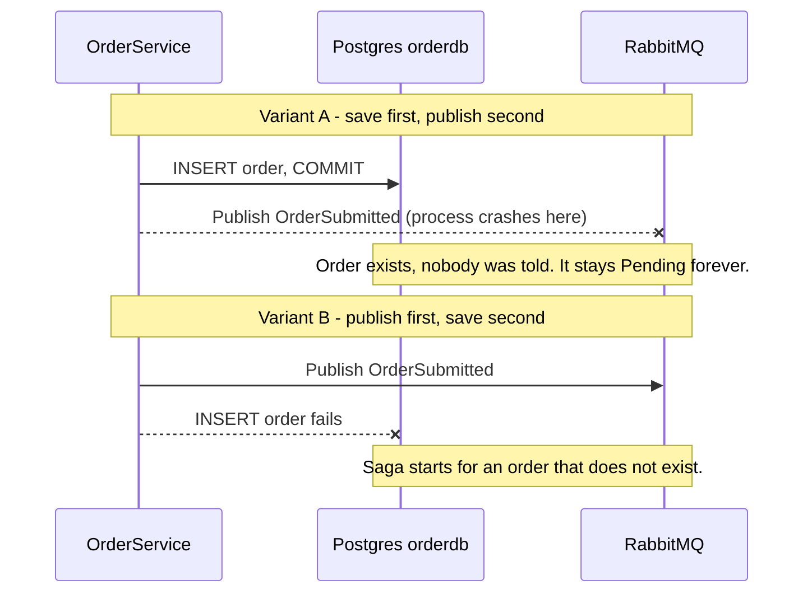
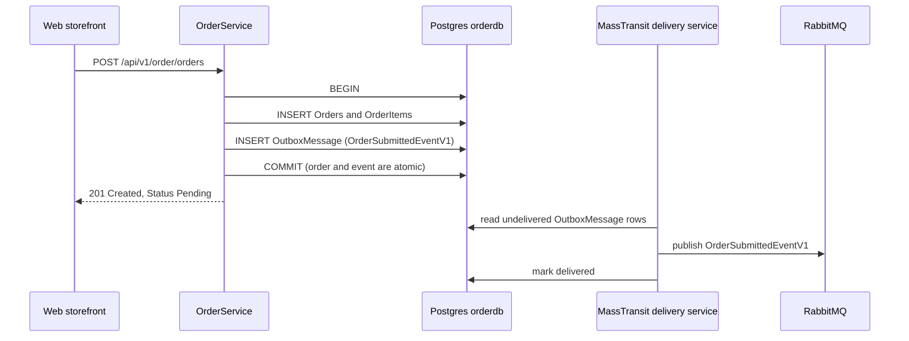
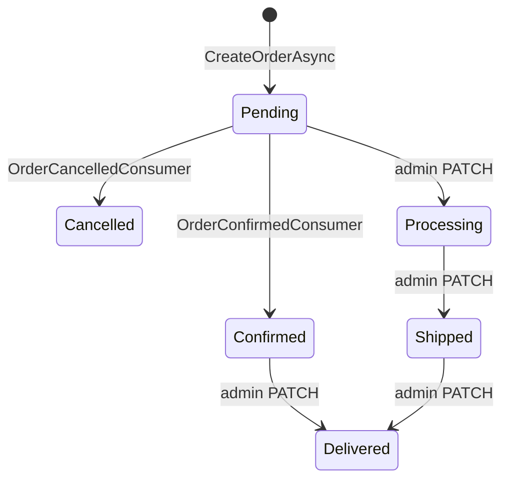

# Chapter 5: Orders and the Transactional Outbox

Placing an order is the moment a SimpleStore customer's request turns into a chain of work spread over four services. This chapter looks at the first link in that chain: how `Order.API` saves an order and announces it to the rest of the system without ever losing the announcement. The trick is called the transactional outbox, and it is one of the most useful patterns in event-driven systems.

**What you will learn**

- What `OrderService.CreateOrderAsync` does, step by step, and why it calls `SaveChangesAsync` twice.
- What the "dual-write problem" is and why a plain "save, then publish" is unsafe.
- How the outbox and the inbox tables give you reliable, effectively exactly-once messaging.
- What the `OrderStatus` values mean and which code is allowed to change them.
- Which parts of the order code are deliberate teaching simplifications.

---

## The problem

When a customer clicks "Place order", two things must happen:

1. The order must be saved in `orderdb` (a Postgres database owned by `Order.API`).
2. The rest of the system must be told, by publishing the event `OrderSubmittedEventV1` to RabbitMQ, so that the checkout saga ([Chapter 6](06-checkout-saga.md)) can start reserving stock and taking payment.

These are two different systems (Postgres and RabbitMQ). There is no single transaction that can cover both. If you do them one after the other, a crash can land you between the two steps.

> **New term: dual write.** Writing the same logical change to two independent systems (here a database and a message broker) with no shared transaction. If one write succeeds and the other fails, the two systems disagree, and nothing in your code notices.



*How to read it: time flows downward; an arrow ending in `x` is a step that never completes. Both orderings leave the database and the broker disagreeing.*

Wrapping the publish in a `try/catch` does not fix this. The process can be killed, the network can drop, or the broker can be down at the exact moment between the two writes.

## Big picture

The fix is to make the event part of the database transaction. Instead of sending the message to RabbitMQ directly, the service writes it into a table (the "outbox") in the same database, in the same transaction as the order. A separate background component then reads the table and forwards the rows to RabbitMQ.

> **New term: transactional outbox.** A table that stores outgoing messages inside your own database. Because the message row is committed together with your business data, either both exist or neither does. A relay process delivers the rows to the broker afterwards.



*How to read it: the only moment the order and its event are written is the single COMMIT. Everything below the 201 response happens later and can be retried.*

Because delivery is retried until it succeeds, a message can be delivered more than once (for example, the relay publishes, then crashes before marking the row delivered). That is called at-least-once delivery. The receiving side handles duplicates with the mirror image of the outbox: the inbox, described in the algorithm section below.

## Walk through the code

### 1. Where the order comes from

The storefront builds the order request from the shopper's cart in [OrdersController.cs](../../src/SimpleStore.Web/Controllers/OrdersController.cs), then calls `Order.API` through the gateway. The request type is [CreateOrderRequest.cs](../../src/SimpleStore.Order.API.Client/CreateOrderRequest.cs): a shipping address and a list of `OrderItemDto` (product id, name, quantity, unit price).

The HTTP endpoint is in [OrderEndpoints.cs](../../src/SimpleStore.Order.API/Endpoints/OrderEndpoints.cs). It reads the user id from the `sub` claim of the JWT (never from the request body) and calls the service:

```csharp
var userId = user.FindFirstValue("sub");
if (string.IsNullOrEmpty(userId)) return Results.Unauthorized();
var created = await service.CreateOrderAsync(userId, request, ct);
```

### 2. Building the order (no validation, by design)

[OrderService.cs](../../src/SimpleStore.Order.API/Services/OrderService.cs) starts `CreateOrderAsync` by building the entity:

```csharp
            Status = OrderStatus.Pending,
            TotalAmount = request.Items.Sum(i => i.UnitPrice * i.Quantity),
            Items = request.Items.Select(i => new OrderItem
            {
                ProductId = i.ProductId,
                ProductName = i.ProductName,
                Quantity = i.Quantity,
                UnitPrice = i.UnitPrice
            }).ToList()
```

Notice what is missing: `Order.API` does not call Catalog, does not check that the product exists, and does not check the price. `ProductName` and `UnitPrice` come straight from the request. The Web storefront fills them from the shopper's cart, but a caller who talks to the API directly could send any price. This is a teaching simplification (it keeps `Order.API` independent of `Catalog.API`); a production system would re-price the order on the server. See [Chapter 11](11-known-limitations.md).

The same method also sets `CorrelationId = Guid.NewGuid()` on the order. This id is the key that ties together every later message about this order, in every service.

### 3. The transaction

The core of the method:

```csharp
var strategy = _context.Database.CreateExecutionStrategy();
await strategy.ExecuteAsync(async () =>
{
    await using var tx = await _context.Database.BeginTransactionAsync(ct);

    _context.Orders.Add(order);
    await _context.SaveChangesAsync(ct);
```

- `CreateExecutionStrategy` / `ExecuteAsync` is the EF Core retry wrapper. Because `Program.cs` enables `EnableRetryOnFailure`, EF Core refuses a hand-written transaction unless the whole unit of work sits inside the strategy, so that it can replay the unit on a transient database error. See [Chapter 9](09-resilience-and-observability.md).
- `BeginTransactionAsync` opens the transaction that will hold both the order and the outbox row.
- The first `SaveChangesAsync` inserts the order. This is needed because the `Id` of the order is generated by Postgres on insert, and the event must carry that `OrderId`.

### 4. Publishing, which only stages a row

```csharp
            }, ct);

            await _context.SaveChangesAsync(ct);
            await tx.CommitAsync(ct);
        });
```

Just above this excerpt, the code calls `_publishEndpoint.Publish(new OrderSubmittedEventV1 { CorrelationId = ..., OrderId = order.Id, UserId = ..., ... })`. Because `Program.cs` enabled the bus outbox, that call does not talk to RabbitMQ. It only hands the message to MassTransit's in-memory outbox. The second `SaveChangesAsync` is what flushes it into the `OutboxMessage` table. Then `CommitAsync` makes order, items, and outbox row visible at the same instant. A code comment in the file explains the same reasoning.

### 5. Switching the outbox on

[Program.cs](../../src/SimpleStore.Order.API/Program.cs) wires MassTransit:

```csharp
builder.Services.AddMassTransit(x =>
{
    x.AddEntityFrameworkOutbox<OrderDbContext>(o =>
    {
        o.UsePostgres();
        o.UseBusOutbox();
    });
    x.AddConsumer<OrderConfirmedConsumer>();
    x.AddConsumer<OrderCancelledConsumer>();
```

- `AddEntityFrameworkOutbox<OrderDbContext>` tells MassTransit to store outbox and inbox data through `OrderDbContext`.
- `UseBusOutbox()` replaces direct publishing with "write to the outbox table". It also starts a hosted background service that delivers the rows to RabbitMQ.

The tables themselves are declared in [OrderDbContext.cs](../../src/SimpleStore.Order.API/Data/OrderDbContext.cs):

```csharp
        builder.AddInboxStateEntity();
        builder.AddOutboxMessageEntity();
        builder.AddOutboxStateEntity();
```

In the migration snapshot these become the tables `InboxState`, `OutboxMessage`, and `OutboxState` (next to `Orders` and `OrderItems`).

The rest of the `AddMassTransit` block (Rabbit heartbeat, exponential `UseMessageRetry` with 5 attempts, `UseCircuitBreaker`) is the resilience setup shared by all services; it is explained in [Chapter 9](09-resilience-and-observability.md).

### 6. The inbox: consuming the saga's verdict

`Order.API` also listens for two events from the saga, `OrderConfirmedEventV1` and `OrderCancelledEventV1`. See [OrderConfirmedConsumer.cs](../../src/SimpleStore.Order.API/Consumers/OrderConfirmedConsumer.cs):

```csharp
        var order = await _context.Orders.FirstOrDefaultAsync(
            o => o.CorrelationId == msg.CorrelationId, context.CancellationToken);

        if (order is null)
        {
            _log.LogWarning("OrderConfirmedEventV1 for unknown CorrelationId {CorrelationId}", msg.CorrelationId);
            return;
        }

        order.Status = OrderStatus.Confirmed;
        await _context.SaveChangesAsync(context.CancellationToken);
```

The consumer finds the order by `CorrelationId` (which is why that column has a unique index, see the `OrderDbContext` excerpt below), sets the status, and saves. [OrderCancelledConsumer.cs](../../src/SimpleStore.Order.API/Consumers/OrderCancelledConsumer.cs) is identical except for `OrderStatus.Cancelled` and a metric tagged with the cancel reason.

`ConfigureEndpoints(ctx)` creates one queue per consumer, and because the EF outbox is registered, those consumers are wrapped with the inbox. The code comment on `OrderConfirmedConsumer` states this: "The MassTransit EF inbox makes the consume idempotent."

### 7. Order status

[OrderStatus.cs](../../src/SimpleStore.Order.API/Models/OrderStatus.cs) defines `Pending, Confirmed, Processing, Shipped, Delivered, Cancelled`. `OrderDbContext` stores the enum as text and enforces a unique `CorrelationId`:

```csharp
            e.Property(o => o.Status).HasConversion<string>().HasMaxLength(16);
            // CorrelationId is the saga key — looked up on OrderConfirmedEventV1 / OrderCancelledEventV1.
            e.HasIndex(o => o.CorrelationId).IsUnique();
```

Storing the name (for example `Confirmed`) rather than a number means you can read the column directly in pgweb.

Who writes the status? Exactly four code paths, and none of them checks the current value:

| Writer | Sets | Where |
|---|---|---|
| `CreateOrderAsync` | `Pending` | [OrderService.cs](../../src/SimpleStore.Order.API/Services/OrderService.cs) |
| `OrderConfirmedConsumer` | `Confirmed` | saga result |
| `OrderCancelledConsumer` | `Cancelled` | saga result |
| `UpdateStatusAsync` (admin `PATCH /api/v1/order/admin/orders/{id}/status`) | any value that parses as an `OrderStatus` | admin action |



*How to read it: this is the intended flow, not an enforced one. The code never rejects a transition; the admin PATCH can jump from any status to any other, and a consumer overwrites the status unconditionally.*

### 8. The rest of the HTTP surface

User endpoints (JWT required, owner is the `sub` claim): `GET /api/v1/order/orders`, `GET /api/v1/order/orders/{id}`, `POST /api/v1/order/orders`. Admin endpoints (`Admin` role): `GET /api/v1/order/admin/orders`, `/count`, `/{id}`, `PATCH /{id}/status`, `/stats`, `/counts-by-user`. All are in [OrderEndpoints.cs](../../src/SimpleStore.Order.API/Endpoints/OrderEndpoints.cs). How requests get here through the gateway is covered in [Chapter 2](02-gateway-and-api-versioning.md).

## Algorithm

> **Algorithm: create an order with the outbox** (`OrderService.CreateOrderAsync`)
>
> 1. Build an `Order` with `Status = Pending`, a new `CorrelationId`, and `TotalAmount = sum(UnitPrice * Quantity)` taken from the request.
> 2. Open an EF execution strategy; everything below is one retryable unit.
> 3. `BEGIN` a database transaction.
> 4. `Orders.Add(order)` and `SaveChanges` so Postgres assigns `order.Id` and the item ids.
> 5. `Publish(OrderSubmittedEventV1 { CorrelationId, OrderId, UserId, ... })`. With the bus outbox this stages the message in memory only.
> 6. `SaveChanges` again; the staged message becomes a row in `OutboxMessage`.
> 7. `COMMIT`. Order, items, and outbox row are now durable together.
> 8. Return the DTO. (Metrics and a log line come after the commit.)

> **Algorithm: outbox delivery** (performed by MassTransit's hosted delivery service, summarised)
>
> 1. Poll the outbox for rows that have not been delivered yet.
> 2. Publish each message to RabbitMQ.
> 3. Mark the row as delivered (and let MassTransit clean up old rows later).
> 4. If the process dies at any point, repeat from step 1 after restart. A message may be published more than once; it is never lost.

> **Algorithm: inbox deduplication** (performed by MassTransit around each consumer, summarised)
>
> 1. A message arrives with a `MessageId`. The consumer has a stable `ConsumerId`.
> 2. In the consumer's own database transaction, look for an `InboxState` row with that `(MessageId, ConsumerId)` pair.
> 3. If it exists and was already consumed, drop the duplicate without calling your code.
> 4. Otherwise run your consumer, and record the inbox row in the same transaction as your own changes.
> 5. Commit. The effect of the message and the record "I processed it" are atomic.

Outbox plus inbox gives "effectively exactly-once" processing: delivery is at-least-once, and duplicates are filtered out on the receiving side. Note that this is a statement about MassTransit's design; the service code in this repo only switches the feature on.

## What can go wrong

- **Crash before `COMMIT`.** Nothing was saved, no event exists. The customer sees an error and retries. Safe.
- **Crash after `COMMIT`, before delivery.** The order and the outbox row exist. After restart the delivery service sends the event. The order just sits at `Pending` a little longer. This is exactly the case the outbox was built for.
- **Duplicate delivery.** The receiving consumer's inbox filters it. Consumers without a DbContext (such as Cart.API) get no inbox and must be written to be idempotent; see [Chapter 4](04-catalog-and-cart.md).
- **RabbitMQ is down.** Orders can still be placed, because `CreateOrderAsync` only talks to Postgres. Events pile up in `OutboxMessage` and drain when the broker returns.
- **Consumer cannot find the order.** Both consumers log a warning and return, which counts as a successful consume; the message is not retried and the status change is silently skipped.
- **A consumer throws.** `UseMessageRetry` retries up to 5 times with exponential back-off, after which MassTransit moves the message to an `_error` queue for an operator.
- **Status is not protected.** Because transitions are not enforced, a late `OrderCancelledEventV1` would overwrite a `Delivered` order, and an admin can set any status. Real systems guard transitions (for example "only `Pending` may become `Confirmed`").
- **Prices are trusted.** As described above, a direct API caller can choose its own `UnitPrice`.
- **Badge colours in the storefront can mislead.** In [Views/Orders/Index.cshtml](../../src/SimpleStore.Web/Views/Orders/Index.cshtml) every status other than `Pending` gets the green "success" badge, so a `Cancelled` order is also green, and the details page ([Details.cshtml](../../src/SimpleStore.Web/Views/Orders/Details.cshtml)) always uses the yellow badge. Read the text, not the colour.

## Try it yourself

1. Start everything: `dotnet run --project src/SimpleStore.AppHost`. Open the Aspire dashboard (the URL is printed in the console).
2. In the Web storefront, log in as the seeded demo customer (credentials are in the README), add a product to the cart, and check out. You land on the order confirmation page. The order starts as `Pending` and is updated by the saga a moment later.
3. Open **pgweb** from the dashboard (the `postgres` resource), choose the `orderdb` database, and run:
   - `SELECT "Id", "CorrelationId", "Status", "TotalAmount" FROM "Orders" ORDER BY "Id" DESC;`
   - `SELECT "SequenceNumber", "MessageType", "SentTime" FROM "OutboxMessage" ORDER BY "SequenceNumber" DESC;`
   - `SELECT "MessageId", "ConsumerId", "Received", "Consumed" FROM "InboxState" ORDER BY "Id" DESC;`

   Refresh the orders query after a few seconds: `Status` moves to `Confirmed` or `Cancelled` (which one depends on the wallet balance, see [Chapter 8](08-payment-and-compensation.md)). MassTransit removes delivered outbox rows over time, so the outbox table may look empty; the `InboxState` rows (one per consumed `OrderConfirmed`/`OrderCancelled`) are a visible trace of the inbox at work.
4. In the dashboard's **Traces** tab, find the `POST /api/v1/order/orders` trace for `order`. Follow it into the RabbitMQ publish and on into the `checkout` service. The log scope field `CorrelationId` (the same value as in the `Orders` row) lets you filter logs across services.
5. In **RabbitMQ management** (the `rabbitmq` resource), open the **Queues** tab. You should see one queue per consumer, for example for `OrderConfirmedConsumer` and `OrderCancelledConsumer`.
6. Experiment: stop the `rabbitmq` resource from the dashboard, place another order, then start it again. Expected result: the order is created normally and shows `Pending`; the `OutboxMessage` row is waiting; once the broker is back the event is delivered and the saga proceeds. (Predicted from the design; confirm it on your machine.)

## Key takeaways

- You cannot atomically write to a database and a broker. The outbox turns that into one local transaction plus a retryable relay.
- `CreateOrderAsync` saves twice on purpose: first to get the database-generated `OrderId`, second to flush the staged event into `OutboxMessage`, all inside one transaction.
- Outbox gives at-least-once delivery; the inbox removes duplicates on the consumer side.
- `CorrelationId` is created once by `Order.API` and is the key for the saga, the logs, and the consumers.
- Order status transitions and incoming prices are not validated in this sample. That is a simplification to remember, not a pattern to copy.

## Next chapter

Continue with [Chapter 6: The checkout saga](06-checkout-saga.md), where the `OrderSubmittedEventV1` published here starts a long-running workflow across Inventory and Payment.
