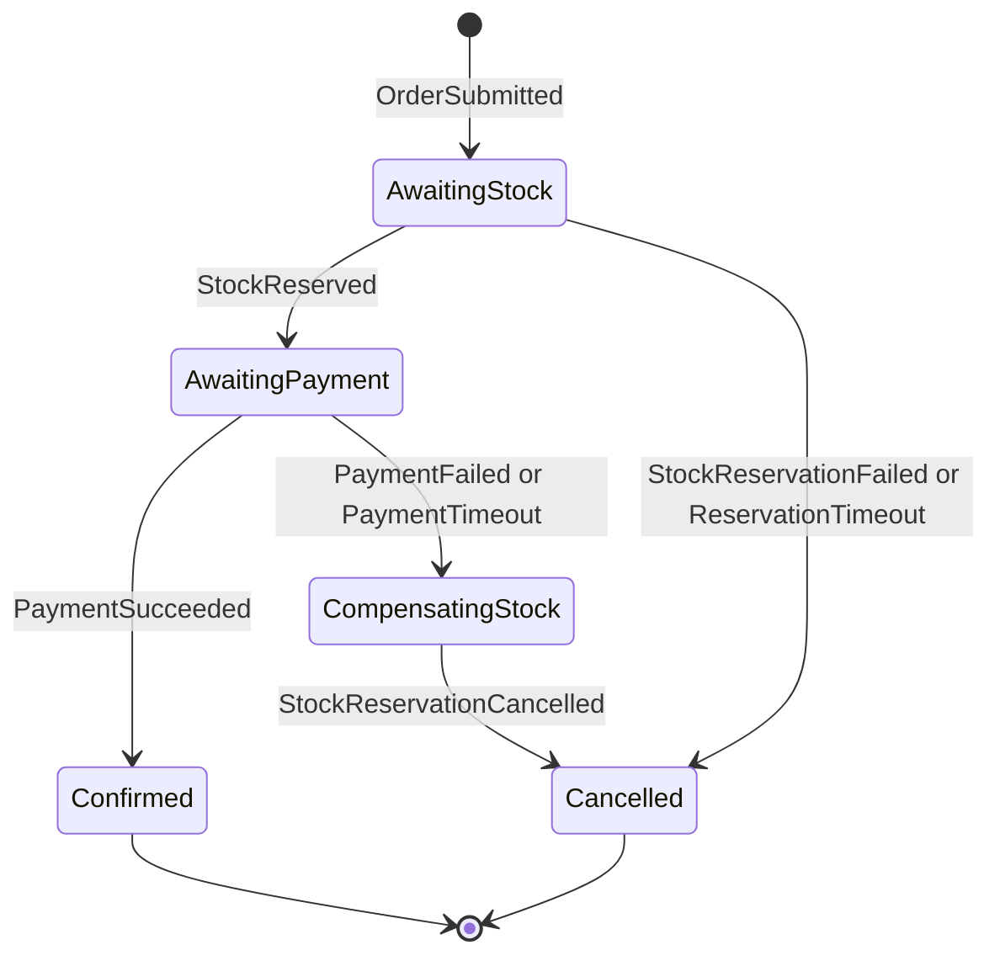
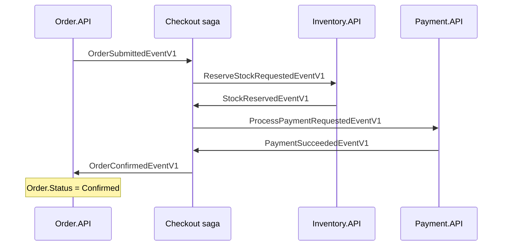
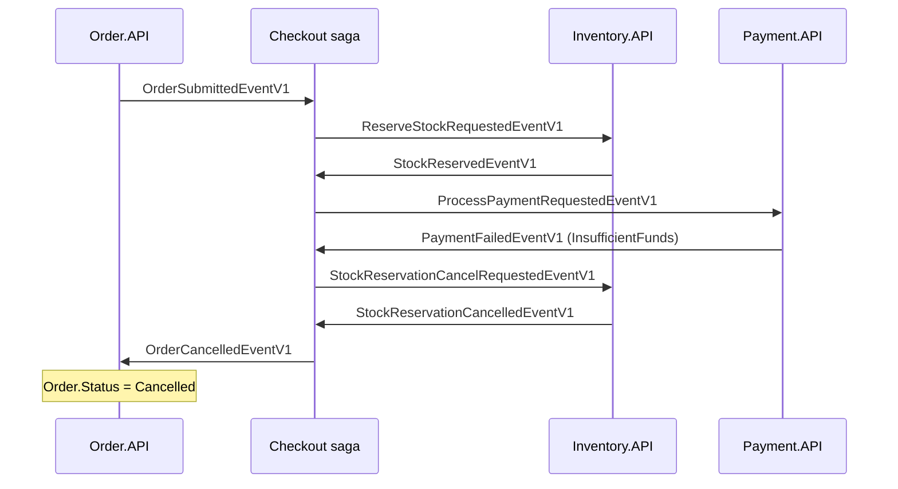

# Chapter 6: The Checkout Saga

After an order is saved, three more services must cooperate before it can be confirmed: Inventory must set stock aside, Payment must take the money, and Order must be told the result. No single database transaction can span those services, so SimpleStore uses a saga: a long-running workflow driven by a state machine that remembers where each order is, and that knows how to undo earlier steps when a later step fails. This chapter walks through `SimpleStore.Checkout.API`, the service that holds that state machine.

**What you will learn**

- What a saga is, and how it differs from a distributed transaction (two-phase commit).
- Orchestration versus choreography, and compensation versus rollback.
- Every state and transition of `CheckoutSagaStateMachine`, read straight from the code.
- How timeouts are scheduled, persisted, and cancelled.
- Why a payment failure needs a compensation but a stock failure does not.
- Which situations the code does not handle explicitly (late and duplicate messages), and what to verify.

---

## The problem

Checkout touches several services, each with its own database:

| Step | Service | Database |
|---|---|---|
| Save the order | Order.API | `orderdb` |
| Reserve stock | Inventory.API | KurrentDB + `inventorydb` |
| Charge the customer | Payment.API | `paymentdb` |
| Set the final order status | Order.API | `orderdb` |

You would like "all or nothing" semantics: either the stock is reserved, the money is taken, and the order is confirmed, or none of it happens. In a single database you would use one transaction. Across services you cannot.

> **New term: distributed transaction (two-phase commit, 2PC).** A protocol in which a coordinator asks every participant to "prepare", then tells all of them to "commit" or all to "abort". It gives true atomicity, but participants must hold locks while waiting, every participant must support the protocol, and a crashed coordinator can leave everyone blocked. Microservices with separate databases and a message broker generally avoid it.

> **New term: saga.** A sequence of local transactions, one per service, linked by messages. If a step fails, the saga runs compensating actions for the steps that already succeeded, instead of rolling back.

> **New term: compensation.** A new action that semantically undoes an earlier committed action (for example "release the reserved stock"). It differs from a rollback: a rollback makes the earlier change never have happened, while a compensation is a second, visible change that cancels the effect of the first. Between the two, other services may have seen the intermediate state.

> **New term: orchestration vs choreography.** In choreography, each service reacts to events from others and nobody has the whole picture. In orchestration, one component (here the saga) holds the whole workflow and tells the others what to do next. SimpleStore uses orchestration because the flow is easy to read in one file.

## Big picture

`Checkout.API` has no HTTP endpoints and no JWT. It is purely a RabbitMQ consumer that owns `checkoutdb`. For every order it keeps one row of state. Each incoming event moves that row from one state to the next and publishes the next command.



*How to read it: each arrow is "event that arrives" and the state it leads to. `Confirmed` and `Cancelled` are final; the saga row is deleted when it gets there. `CompensatingStock` exists only on the payment-failure path.*

Happy path, with the services as columns:



*How to read it: every arrow is a message through RabbitMQ (never a direct call). The saga is the only service that talks to everyone.*

Payment failure with compensation:



*How to read it: stock was already held when payment failed, so the saga must ask Inventory to release it and wait for the confirmation before telling Order the order is cancelled.*

For the detailed message-by-message reference see [docs/checkout-saga.md](../checkout-saga.md), section 15 ("v12 - payment step + stock-release compensation"). Sections 2 to 12 of that document describe the earlier v8 design (before the payment step existed), so use section 15 for the current flow.

## Walk through the code

### 1. Checkout.API is wired as a pure consumer

[Program.cs](../../src/SimpleStore.Checkout.API/Program.cs) registers the state machine and its persistence:

```csharp
    x.AddSagaStateMachine<CheckoutSagaStateMachine, CheckoutSagaState>()
        .EntityFrameworkRepository(r =>
        {
            r.ConcurrencyMode = ConcurrencyMode.Pessimistic; // row-lock the saga instance per message
            r.ExistingDbContext<CheckoutDbContext>();
            r.UsePostgres();
        });
```

- `EntityFrameworkRepository` stores each saga instance as a row through `CheckoutDbContext`.
- `ConcurrencyMode.Pessimistic` means that while a message is being processed for one saga instance, MassTransit locks that row, so two messages for the same order are handled one after the other.
- The same file also enables the EF Core bus outbox (`AddEntityFrameworkOutbox<CheckoutDbContext>` with `UseBusOutbox()`), the same mechanism as in [Chapter 5](05-orders-and-outbox.md). Messages the saga publishes are written to the outbox in the same transaction as the saga state change, so "state moved on" and "next command is sent" cannot drift apart.
- The usual bus settings (heartbeat, `UseMessageRetry` with 5 exponential attempts, `UseCircuitBreaker`) are also here; see [Chapter 9](09-resilience-and-observability.md).

### 2. What is stored: `checkout_saga_state`

[CheckoutSagaState.cs](../../src/SimpleStore.Checkout.API/Sagas/CheckoutSagaState.cs) holds the data, and [CheckoutDbContext.cs](../../src/SimpleStore.Checkout.API/Data/CheckoutDbContext.cs) maps it:

```csharp
        builder.Entity<CheckoutSagaState>(e =>
        {
            e.ToTable("checkout_saga_state");
            e.HasKey(x => x.CorrelationId);
            e.Property(x => x.CorrelationId).ValueGeneratedNever();
            e.Property(x => x.CurrentState).HasMaxLength(64);
            e.Property(x => x.UserId).HasMaxLength(256);
            e.Property(x => x.FailureReason).HasMaxLength(128);
            e.HasIndex(x => x.OrderId);
        });
```

The table `checkout_saga_state` has these columns: `CorrelationId` (primary key, supplied by Order.API), `CurrentState`, `OrderId`, `UserId`, `Amount` (the order total, later sent to Payment), `ReservationId` (a new GUID the saga creates for Inventory), `TimeoutTokenId` and `PaymentTimeoutTokenId` (handles used to cancel scheduled timeouts), `FailureReason`, `CreatedAt`, `UpdatedAt`. There is no row-version column; concurrency is handled by the pessimistic lock described above.

> **New term: correlation id.** One identifier that travels in every message about the same business transaction. The saga uses it to find "its" row. Every event carries it, so the saga needs only to match `CorrelationId`.

### 3. States, events, and schedules

[CheckoutSagaStateMachine.cs](../../src/SimpleStore.Checkout.API/Sagas/CheckoutSagaStateMachine.cs) declares them as properties:

```csharp
    public State AwaitingStock { get; private set; } = null!;
    public State AwaitingPayment { get; private set; } = null!;
    public State CompensatingStock { get; private set; } = null!;
    public State Confirmed { get; private set; } = null!;
    public State Cancelled { get; private set; } = null!;

    public Event<OrderSubmittedEventV1> OrderSubmitted { get; private set; } = null!;
    public Event<StockReservedEventV1> StockReserved { get; private set; } = null!;
    public Event<StockReservationFailedEventV1> StockReservationFailed { get; private set; } = null!;
    public Event<PaymentSucceededEventV1> PaymentSucceeded { get; private set; } = null!;
    public Event<PaymentFailedEventV1> PaymentFailed { get; private set; } = null!;
    public Event<StockReservationCancelledEventV1> StockReservationCancelled { get; private set; } = null!;

    public Schedule<CheckoutSagaState, ReservationTimeoutExpired> ReservationTimeout { get; private set; } = null!;
    public Schedule<CheckoutSagaState, PaymentTimeoutExpired> PaymentTimeout { get; private set; } = null!;
```

MassTransit also provides the built-in states `Initial` and `Final`. Together with the five above, that makes seven states in total.

Every event is correlated on the same field:

```csharp
        Event(() => OrderSubmitted, e => e.CorrelateById(ctx => ctx.Message.CorrelationId));
        Event(() => StockReserved, e => e.CorrelateById(ctx => ctx.Message.CorrelationId));
        Event(() => StockReservationFailed, e => e.CorrelateById(ctx => ctx.Message.CorrelationId));
        Event(() => PaymentSucceeded, e => e.CorrelateById(ctx => ctx.Message.CorrelationId));
        Event(() => PaymentFailed, e => e.CorrelateById(ctx => ctx.Message.CorrelationId));
        Event(() => StockReservationCancelled, e => e.CorrelateById(ctx => ctx.Message.CorrelationId));
```

Only `OrderSubmitted` is handled in `Initially(...)`, so it is the only event that can create a new saga row.

### 4. Starting the saga

```csharp
        Initially(
            When(OrderSubmitted)
                .Then(ctx =>
                {
                    ctx.Saga.OrderId = ctx.Message.OrderId;
                    ctx.Saga.UserId = ctx.Message.UserId;
                    ctx.Saga.Amount = ctx.Message.TotalAmount;
                    ctx.Saga.ReservationId = Guid.NewGuid();
                    ctx.Saga.CreatedAt = DateTime.UtcNow;
                    ctx.Saga.UpdatedAt = DateTime.UtcNow;
                    LogTransition(ctx.Saga, "Initial", "AwaitingStock", reason: null);
                })
                .Schedule(ReservationTimeout, ctx => new ReservationTimeoutExpired { CorrelationId = ctx.Saga.CorrelationId })
```

The code then publishes `ReserveStockRequestedEventV1` (one `ReservationLineItem` per ordered product) and calls `.TransitionTo(AwaitingStock)`.

### 5. Stock reserved: move on to payment

```csharp
            When(StockReserved)
                .Unschedule(ReservationTimeout)
                .Then(ctx =>
                {
                    ctx.Saga.UpdatedAt = DateTime.UtcNow;
                    LogTransition(ctx.Saga, "AwaitingStock", "AwaitingPayment", reason: null);
                })
                .Schedule(PaymentTimeout, ctx => new PaymentTimeoutExpired { CorrelationId = ctx.Saga.CorrelationId })
```

The stock answer arrived in time, so the stock timeout is cancelled (`Unschedule`) and a payment timeout is started. The saga then publishes `ProcessPaymentRequestedEventV1` carrying `OrderId`, `UserId`, and the stored `Amount`, and moves to `AwaitingPayment`. The two failure branches of `AwaitingStock` (`StockReservationFailed` and the timeout) both publish `OrderCancelledEventV1` and go straight to `Cancelled`; nothing needs undoing because Inventory has not reserved anything.

### 6. Payment failed: run the compensation

```csharp
                .Publish(ctx => new StockReservationCancelRequestedEventV1
                {
                    CorrelationId = ctx.Saga.CorrelationId,
                    ReservationId = ctx.Saga.ReservationId,
                    OrderId = ctx.Saga.OrderId,
                    RequestedAt = DateTimeOffset.UtcNow
                })
                .TransitionTo(CompensatingStock),
```

This is the tail of the `When(PaymentFailed)` handler (the `PaymentTimeout.Received` handler ends the same way). Before this, the handler stores `FailureReason` from the message (or `"PaymentTimeout"`). The saga does not cancel the order yet. It first waits in `CompensatingStock`, because the stock is still held. On the Inventory side, [CancelReservationRequestedConsumer.cs](../../src/SimpleStore.Inventory.API/Consumers/CancelReservationRequestedConsumer.cs) receives the request and releases the reservation; [Chapter 7](07-inventory-event-sourcing-cqrs.md) explains how.

### 7. Compensation finished: cancel and finish

```csharp
                .Publish(ctx => new OrderCancelledEventV1
                {
                    CorrelationId = ctx.Saga.CorrelationId,
                    OrderId = ctx.Saga.OrderId,
                    Reason = ctx.Saga.FailureReason ?? "PaymentFailed",
                    CancelledAt = DateTimeOffset.UtcNow
                })
                .TransitionTo(Cancelled)
                .Finalize());
```

This belongs to `During(CompensatingStock, When(StockReservationCancelled) ...)`. The reason reported to Order.API is whatever was saved earlier (`InsufficientFunds` or `PaymentTimeout`).

`Finalize()` moves the instance to the built-in `Final` state, and the last line of the constructor removes it from the database:

```csharp
        // Remove finalized saga instances from checkoutdb. Flip to keep them for audit.
        SetCompletedWhenFinalized();
```

So `checkout_saga_state` only contains orders that are still in flight. A finished order leaves no row behind (the audit trail lives in the logs and traces).

### 8. Observability helper

`LogTransition` writes the log line `Saga {CorrelationId} order {OrderId}: {FromState} -> {ToState}.` (with a reason when there is one) and sets tags such as `saga.state.from` and `saga.state.to` on the current trace activity. That is how you can follow one order across services in the Aspire dashboard ([Chapter 9](09-resilience-and-observability.md)).

### 9. Timeouts

`Schedule(...)` defines a timer that delivers a message to the saga itself after a delay:

```csharp
        Schedule(() => ReservationTimeout, x => x.TimeoutTokenId, s =>
        {
            s.Delay = TimeSpan.FromSeconds(reservationTimeoutSeconds);
            s.Received = r => r.CorrelateById(ctx => ctx.Message.CorrelationId);
        });
```

`TimeoutTokenId` is the column where MassTransit stores the handle of the scheduled message, so `Unschedule` can cancel it. The payment timer is declared the same way with `PaymentTimeoutTokenId`. The delays come from configuration, `Checkout:ReservationTimeoutSeconds` and `Checkout:PaymentTimeoutSeconds`, each defaulting to 30 seconds. In [appsettings.json](../../src/SimpleStore.Checkout.API/appsettings.json) only the reservation value is set, so the payment timeout uses the 30 second default.

The timers live in Quartz with a persistent database store, set up in `Program.cs`:

```csharp
        s.UsePostgres(pg =>
        {
            pg.ConnectionString = checkoutDbConnectionString;
            pg.TablePrefix = "qrtz_";
        });
        s.UseSystemTextJsonSerializer();
```

The Quartz tables (`qrtz_job_details`, `qrtz_triggers`, and others) are created by the `AddQuartzTables` migration in `checkoutdb`. Because pending triggers are stored in Postgres, a restart of Checkout.API does not forget them; the code comments say Quartz reloads them on boot and fires any that came due while the process was down. This setup is for a single Checkout.API replica; running several would need Quartz clustering, which is not configured.

### The transition table

| # | From state | Trigger | What the saga does | Publishes | To state |
|---|---|---|---|---|---|
| 1 | `Initial` | `OrderSubmitted` | Copies `OrderId`, `UserId`, `Amount`; creates `ReservationId`; schedules `ReservationTimeout` | `ReserveStockRequestedEventV1` | `AwaitingStock` |
| 2 | `AwaitingStock` | `StockReserved` | Unschedules `ReservationTimeout`; schedules `PaymentTimeout` | `ProcessPaymentRequestedEventV1` | `AwaitingPayment` |
| 3 | `AwaitingStock` | `StockReservationFailed` | Unschedules `ReservationTimeout`; stores `FailureReason` from the message | `OrderCancelledEventV1` | `Cancelled`, then finalized |
| 4 | `AwaitingStock` | `ReservationTimeout` fires | Stores `FailureReason = "ReservationTimeout"` | `OrderCancelledEventV1` | `Cancelled`, then finalized |
| 5 | `AwaitingPayment` | `PaymentSucceeded` | Unschedules `PaymentTimeout` | `OrderConfirmedEventV1` | `Confirmed`, then finalized |
| 6 | `AwaitingPayment` | `PaymentFailed` | Unschedules `PaymentTimeout`; stores `FailureReason` from the message | `StockReservationCancelRequestedEventV1` | `CompensatingStock` |
| 7 | `AwaitingPayment` | `PaymentTimeout` fires | Stores `FailureReason = "PaymentTimeout"` | `StockReservationCancelRequestedEventV1` | `CompensatingStock` |
| 8 | `CompensatingStock` | `StockReservationCancelled` | Reads stored `FailureReason` | `OrderCancelledEventV1` (reason is `FailureReason`, or `"PaymentFailed"` if empty) | `Cancelled`, then finalized |

Cancel reasons you will see in `OrderCancelledEventV1.Reason`, in logs, and in the `reason` tag on the Order metric: `InsufficientStock` (from Inventory), `ReservationTimeout`, `InsufficientFunds` (from Payment), `PaymentTimeout`.

## Algorithm

> **Algorithm: how the saga handles one message**
>
> 1. A message arrives on the queue MassTransit created for the saga.
> 2. Read its `CorrelationId`. Lock the matching `checkout_saga_state` row (pessimistic mode). If the event is `OrderSubmitted` and there is no row, a new instance is created in `Initial`.
> 3. Look up the handler for (current state, event). If there is none, see "What can go wrong" below.
> 4. Run the handler: update fields, schedule or unschedule timers, stage messages to publish.
> 5. Save the new `CurrentState` and write the staged messages to the outbox, in one database transaction.
> 6. If the instance was finalized, delete the row (`SetCompletedWhenFinalized`).
> 7. The outbox delivery service sends the staged messages to RabbitMQ.

> **Algorithm: why payment failure compensates but stock failure does not**
>
> 1. Walk the steps in order: reserve stock, then charge, then confirm.
> 2. A step that fails has changed nothing durable, so it needs no undo. A step that succeeded earlier has changed something, so it must be undone if a later step fails.
> 3. Stock failure (`StockReservationFailed`): Inventory rejected the request and holds nothing. Nothing earlier succeeded, so cancel directly.
> 4. Payment failure (`PaymentFailed`): `PaymentService` writes no ledger row and changes no balance on a rejection, so there is no money to give back. But the stock reservation from step 1 is still held, so it must be released: that is the compensation, and the saga waits for Inventory's confirmation (`CompensatingStock`) before cancelling.

## What can go wrong

- **A step never answers.** Both waiting states have a timer, so the saga cannot wait forever. Stock timeout cancels directly. Payment timeout runs the stock-release compensation.
- **Checkout.API restarts mid-saga.** The state is in Postgres and the timers are in Quartz tables in the same database, so the saga resumes. Messages that arrived while it was down wait in RabbitMQ.
- **Handler throws.** MassTransit retries up to 5 times with exponential back-off before moving the message to an error queue.
- **Late, duplicate, or out-of-order events.** The state machine defines handlers only for the combinations in the table above. It has no explicit `Ignore(...)`, `DuringAny(...)`, or `OnUnhandledEvent(...)` anywhere, so there is no code in this repository saying what to do with, for example, a second `StockReserved`, a `PaymentSucceeded` that arrives in `CompensatingStock`, or any event whose saga row has already been deleted. What MassTransit does by default for an event that has no handler in the current state, or no matching instance, is something you should verify in the MassTransit documentation and by experiment. This guide does not assert it.
- **The late-payment hole (a design limitation to discuss).** Suppose `PaymentTimeout` fires first, so the saga starts the compensation and the order ends up `Cancelled`. If `Payment.API` was only slow, not dead, its `DebitForOrderAsync` can still commit afterwards: the balance is debited and a `Payment` ledger row is written, then `PaymentSucceededEventV1` is published to a saga that is no longer waiting for it. The customer has paid for an order that was cancelled, and no code in the repository refunds it. The same can happen if Payment.API was stopped: the `ProcessPaymentRequestedEventV1` message waits in its queue and is processed when the service returns (see the experiment below). Real systems add a refund path or ignore-and-reconcile logic; see [Chapter 11](11-known-limitations.md).
- **Timers fire after completion?** Timers are cancelled with `Unschedule` on the success paths. The code does not show what happens if a timeout message is delivered to a saga that has already moved on or been deleted; treat that as another instance of the unhandled-event question.
- **Single replica.** Quartz in this configuration, like the Inventory projector, assumes one running instance.

## Try it yourself

1. Run `dotnet run --project src/SimpleStore.AppHost` and open the Aspire dashboard.
2. Happy path. In the Admin app, open **Payments** and deposit a large amount for the demo customer (see [Chapter 8](08-payment-and-compensation.md)). In the storefront, place an order. In the dashboard, open **Structured logs**, select the `checkout` resource, and look for lines like `Saga ... order ...: Initial -> AwaitingStock.`, then `AwaitingStock -> AwaitingPayment.`, then `AwaitingPayment -> Confirmed.`. Filter by the `CorrelationId` value to see the matching lines in `order`, `inventory`, and `payment` too.
3. Traces. In **Traces**, open the trace that starts at `POST /api/v1/order/orders`. The saga spans carry the tags `saga.state.from` and `saga.state.to`.
4. RabbitMQ management (the `rabbitmq` resource, **Queues** tab): you will see queues for the saga and for each service's consumers. Message rates tick up briefly as you place an order.
5. pgweb, database `checkoutdb`: `SELECT * FROM checkout_saga_state;`. It is usually empty, because finished sagas are deleted. To catch a row in flight, do the experiment below.
6. **Break it on purpose, part 1: not enough money.** Make sure the demo customer's wallet is empty or lower than the order total (Admin **Payments** shows the balance). Place an order for a product, and note its stock on the storefront or in Admin before ordering. In the `checkout` logs you should see `AwaitingStock -> AwaitingPayment`, then `AwaitingPayment -> CompensatingStock (InsufficientFunds)`, then `CompensatingStock -> Cancelled (InsufficientFunds)`. The order status becomes `Cancelled`, and after the Inventory projector and Catalog have processed the update, the product's stock returns to its original value.
7. **Break it on purpose, part 2: a dead payment service.** Stop the `payment` resource in the dashboard, place an order, and quickly run `SELECT "CorrelationId", "CurrentState", "FailureReason" FROM checkout_saga_state;` in pgweb. You should see `AwaitingPayment`. After about 30 seconds the log shows `AwaitingPayment -> CompensatingStock (PaymentTimeout)` and the order ends `Cancelled` with stock restored. Optional follow-up: start `payment` again and watch its logs and the wallet. Our prediction from the design, which you should check, is that the queued request is now processed, so a `Payment` ledger row may appear for an order that is already cancelled. That is the late-payment hole described above.

## Key takeaways

- A saga replaces one big transaction with many small ones plus compensations. Compensations are new actions, not rollbacks.
- `CheckoutSagaStateMachine` is an orchestrator: one file shows the whole checkout flow, and its row in `checkout_saga_state` records where each order is.
- Everything is keyed by `CorrelationId`; only `OrderSubmitted` can create a saga instance.
- Timeouts are persisted in Quartz tables, so they survive restarts, and are cancelled as soon as the awaited answer arrives.
- State change plus published messages are atomic through the outbox; row locking keeps one order's messages sequential.
- The code has no explicit handling for late, duplicate, or out-of-order events; knowing what MassTransit does there, and adding refund or ignore rules, is part of making this production-ready.

## Next chapter

Continue with [Chapter 7: Inventory, event sourcing, and CQRS](07-inventory-event-sourcing-cqrs.md) to see how stock is reserved and released. Payment's side of the story is in [Chapter 8](08-payment-and-compensation.md).
