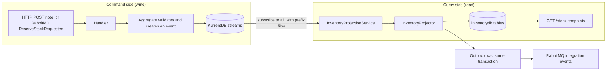
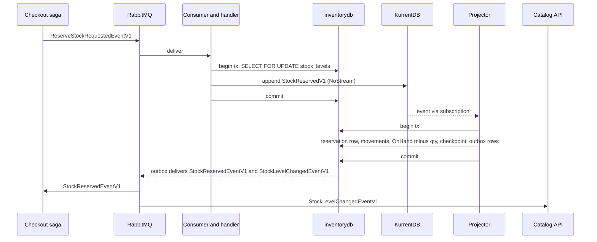
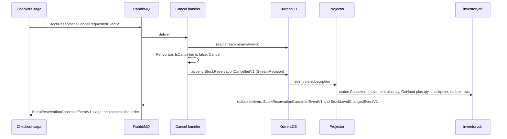

# Chapter 7 - Inventory: Event Sourcing and CQRS

`SimpleStore.Inventory.API` is the single source of truth for stock. Unlike every other service in this repo, it does not store "the current state" in a table and update it. It stores a log of things that happened (a receipt note was recorded, stock was reserved, a reservation was released) in KurrentDB, and it derives the current stock numbers from that log into Postgres. This chapter explains that design, how the checkout saga uses it, and where its sharp edges are.

**What you will learn**

- What event sourcing and CQRS mean, in terms of code you can open.
- How an aggregate (`Reservation`) decides, records and replays events.
- Why the event store sits behind an interface (`IEventStore`) and how optimistic concurrency makes retries safe.
- How a background projector turns events into read tables, checkpoints its progress, and publishes integration events atomically.
- How a reservation and its compensation (release) flow end to end.
- How to rebuild the whole read model by deleting it and restarting.
- Why you would, and would not, use this pattern in a real system.

Prerequisites: [chapter 1](01-architecture-and-aspire.md) (service map), [chapter 5](05-orders-and-outbox.md) (the outbox idea) and [chapter 6](06-checkout-saga.md) (the saga that calls Inventory).

---

## The problem

Stock looks simple: one number per product. In practice you need more than the number.

- Several things change stock: goods arrive (receipt notes), goods leave (delivery notes), and a checkout holds goods for an order (reservations), possibly releasing them again.
- "Why is product 7 at 12 units?" is a question an operator will ask. A single `OnHand` column cannot answer it. You would need a second audit table, kept in sync by hand.
- Other services must react to stock changes (Catalog caches the number, the saga waits for reservation results). If you update a table and then publish a message, a crash between the two loses the message (the dual-write problem from chapter 5).

Event sourcing solves the first two by making the history the primary data. CQRS (explained next) gives the queries a table that is cheap to read. The projector, together with the outbox, solves the third.

> **New term: event sourcing.** Instead of storing the current state of a thing, you store every change to it as an immutable event, in order. The current state is whatever you get by replaying those events from the beginning. A bank statement is the everyday analogy: the balance is derived from the list of transactions, not the other way round.

> **New term: aggregate.** A small cluster of objects that is always changed as one unit and enforces its own rules. Here, a `Reservation` with its lines is one aggregate. Each aggregate instance owns exactly one stream.

> **New term: stream.** The ordered list of events for one aggregate instance. In KurrentDB a stream has a name; here it is `reservation-{guid}`, `receiptNote-{guid}` or `deliveryNote-{guid}`. The first event in a stream has revision 0, the next revision 1, and so on.

> **New term: CQRS (Command Query Responsibility Segregation).** Use one model to change data (commands) and a different model to read it (queries). In this service the write model is the event streams and the read model is a set of Postgres tables.

> **New term: projection / read model.** A projection is code that listens to events and writes them into a shape that is convenient to query. The result is the read model. Here: the tables `stock_levels`, `stock_movements`, `reservations` and so on in `inventorydb`.

---

## Big picture



*How to read it:* follow the left box top to bottom to see a command being decided and written as an event. The arrow out of KurrentDB is asynchronous: a separate background service reads the log and fills the tables on the right. The only way data gets from the left side to the right side is through events.

The two sides are deliberately decoupled. The write side never reads the read tables to decide anything, with one exception that matters (the stock check in `CreateReservationHandler`, covered below). The read side never writes events.

| Concern | Where it lives |
|---|---|
| Source of truth | KurrentDB streams `deliveryNote-{guid}`, `receiptNote-{guid}`, `reservation-{guid}` |
| Query tables | `inventorydb` (Postgres): `delivery_notes`, `receipt_notes`, `reservations` (each with `_lines`), `stock_levels`, `stock_movements`, `projection_checkpoints`, plus the MassTransit outbox/inbox tables |
| Event store abstraction | [IEventStore.cs](../../src/SimpleStore.Inventory.API/EventStore/IEventStore.cs) and the only adapter, [KurrentEventStore.cs](../../src/SimpleStore.Inventory.API/EventStore/KurrentEventStore.cs) |
| Projector | [InventoryProjectionService.cs](../../src/SimpleStore.Inventory.API/Projections/InventoryProjectionService.cs) (loop) and [InventoryProjector.cs](../../src/SimpleStore.Inventory.API/Projections/InventoryProjector.cs) (event to SQL) |

The domain events (`StockReservedV1`, `StockReservationCancelledV1`, ...) are internal to this bounded context. They are not the messages other services see. The messages other services see are the integration events in `SimpleStore.Contracts`; [chapter 10](10-contracts-and-versioning.md) explains the difference.

---

## Walk through the code

### 1. The aggregate decides and records

Open [Reservation.cs](../../src/SimpleStore.Inventory.API/Domain/Reservations/Reservation.cs). All three aggregates (`DeliveryNote`, `ReceiptNote`, `Reservation`) share one shape:

- A private constructor, so the only way to get an instance is a static method.
- A static factory (`DeliveryNote.Issue`, `ReceiptNote.Record`, `Reservation.Reserve`) that validates the input, builds the event, applies it to itself, and remembers it in a private `_uncommitted` list.
- `Rehydrate(events)` that builds an instance by applying stored events one by one.
- A private `Apply` method that switches on the event type and changes the in-memory state.

The factory's last lines show the pattern:

```csharp
        var reservation = new Reservation();
        reservation.Apply(evt);
        reservation._uncommitted.Add(evt);
        return reservation;
```

`Apply` is the only place state changes. The same method is used when creating (new event) and when loading (old events), which is the whole trick: the in-memory state can never differ from what the log implies.

```csharp
    private void Apply(IInventoryDomainEvent @event)
    {
        switch (@event)
        {
            case StockReservedV1 reserved:
                if (_reserved)
                    throw new DomainException("Reservation has already been reserved.");
                Id = reserved.NoteId;
                CorrelationId = reserved.CorrelationId;
                OrderId = reserved.OrderId;
                ReservedAt = reserved.ReservedAt;
                _lines.AddRange(reserved.Lines.Select(l => new InventoryLine(l.ProductId, l.Quantity)));
                _reserved = true;
                break;
```

Loading is a loop over `Apply`:

```csharp
    public static Reservation Rehydrate(IEnumerable<IInventoryDomainEvent> events)
    {
        var reservation = new Reservation();
        foreach (var evt in events) reservation.Apply(evt);
        if (!reservation._reserved)
            throw new DomainException("Reservation stream did not contain a Reserved event.");
        return reservation;
    }
```

`Cancel` is a command on an existing reservation. It refuses to run twice, then emits `StockReservationCancelledV1` carrying the reserved lines so the projector knows how much stock to give back:

```csharp
    public void Cancel(DateTimeOffset now)
    {
        if (!_reserved)
            throw new DomainException("Cannot cancel a reservation that was never reserved.");
        if (_cancelled)
            throw new DomainException("Reservation has already been cancelled.");
```

The line items are a value object, [InventoryLine.cs](../../src/SimpleStore.Inventory.API/Domain/Shared/InventoryLine.cs): an immutable record whose constructor throws `DomainException` if the quantity is not positive. An invalid line cannot exist, so the aggregate never has to re-check.

### 2. Events and their wire names

[StockReservedV1.cs](../../src/SimpleStore.Inventory.API/Domain/Reservations/Events/StockReservedV1.cs) is a plain record. Note the `V1` in the type name and that `NoteId` is the reservation id (the name is dictated by the `IInventoryDomainEvent` interface, which all four domain events share):

```csharp
public sealed record StockReservedV1 : IInventoryDomainEvent
{
    public Guid NoteId { get; init; }
    public Guid CorrelationId { get; init; }
    public int OrderId { get; init; }
    public DateTimeOffset ReservedAt { get; init; }
    public IReadOnlyList<LineData> Lines { get; init; } = [];

    public sealed record LineData
    {
        public int ProductId { get; init; }
        public int Quantity { get; init; }
    }
}
```

In KurrentDB each event is stored as a JSON body plus a type string. [EventTypeRegistry.cs](../../src/SimpleStore.Inventory.API/EventStore/EventTypeRegistry.cs) maps between the C# type and that string, in both directions:

```csharp
    public const string DeliveryNoteIssuedV1Type = "simplestore.inventory.delivery-note.issued.v1";
    public const string ReceiptNoteRecordedV1Type = "simplestore.inventory.receipt-note.recorded.v1";
    public const string StockReservedV1Type = "simplestore.inventory.reservation.reserved.v1";
    public const string StockReservationCancelledV1Type = "simplestore.inventory.reservation.cancelled.v1";
```

The string, not the C# class name, is what is stored forever. You can rename the class; you must never change the string of an event that already exists in a stream. If the registry does not know a string (`ClrTypeFor` returns `null`), the event is still delivered to the projector, just without a decoded `DomainEvent`; the projector skips it and counts it (see step 7).

### 3. The event store behind a port

[IEventStore.cs](../../src/SimpleStore.Inventory.API/EventStore/IEventStore.cs) has three methods: `AppendAsync`, `SubscribeAllAsync`, `ReadStreamAsync`. Everything in the service depends on this interface. Only [KurrentEventStore.cs](../../src/SimpleStore.Inventory.API/EventStore/KurrentEventStore.cs) imports `KurrentDB.Client`, so replacing the database is a one-file job.

> **New term: optimistic concurrency.** Instead of locking a stream while you work, you write with a condition: "append this, but only if the stream is still in the state I expect". If someone else got there first, the write is rejected and you decide what to do. No locks are held between your read and your write.

`AppendAsync` takes an [AppendCondition](../../src/SimpleStore.Inventory.API/EventStore/AppendCondition.cs). There are two:

- `NoStream`: "only if this stream does not exist yet". Used when creating an aggregate.
- `StreamRevision(n)`: "only if the last event in the stream has revision n". Used when adding to an existing aggregate.

The adapter translates them to KurrentDB's `StreamState`:

```csharp
                case AppendCondition.NoStreamCondition:
                    await _client.AppendToStreamAsync(
                        streamName,
                        StreamState.NoStream,
                        data,
                        cancellationToken: ct);
                    break;

                case AppendCondition.StreamRevision rev:
                    await _client.AppendToStreamAsync(
                        streamName,
                        StreamState.StreamRevision(rev.ExpectedRevision),
                        data,
                        cancellationToken: ct);
                    break;
```

When the condition fails, the SDK throws `WrongExpectedVersionException`, which the adapter converts to the port's own exception so callers never see an SDK type:

```csharp
        catch (WrongExpectedVersionException ex)
        {
            throw new ConcurrencyConflictException(streamName, ex);
        }
```

Why this matters: note ids are chosen by the caller (a client-supplied `Guid` for HTTP, the saga's `ReservationId` for reservations). Sending the same request twice means the second `NoStream` append fails. A retry therefore cannot create a duplicate; it turns into a conflict that the caller recognises (HTTP 409, or "already done" for the saga).

### 4. A simple command: record a receipt note

[CreateReceiptNoteHandler.cs](../../src/SimpleStore.Inventory.API/Application/ReceiptNotes/CreateReceiptNoteHandler.cs) is the template for the write side: validate, call the aggregate, append, return a DTO.

```csharp
        var note = ReceiptNote.Record(
            noteId: cmd.NoteId,
            date: cmd.Date,
            reference: cmd.Reference,
            lines: domainLines,
            now: _clock.GetUtcNow());

        var stream = $"receiptNote-{note.Id}";
        await _eventStore.AppendAsync(stream, note.UncommittedEvents, AppendCondition.NoStream, ct);
        note.MarkEventsCommitted();
```

Two things to notice. First, the handler touches no Postgres at all. Second, the DTO it returns is built from the in-memory aggregate, not from the read tables. The projector has not run yet, so an immediate `GET /receipt-notes/{id}` may return 404 for a moment. That is eventual consistency, and it is the price of CQRS.

[ReceiptNoteEndpoints.cs](../../src/SimpleStore.Inventory.API/Endpoints/ReceiptNoteEndpoints.cs) maps `DomainException` to 400 and `ConcurrencyConflictException` to 409. Delivery notes work the same way. There are no HTTP endpoints for reservations: they exist only on the message bus.

### 5. The interesting command: reserve stock

The checkout saga publishes `ReserveStockRequestedEventV1`. [ReserveStockRequestedConsumer.cs](../../src/SimpleStore.Inventory.API/Consumers/ReserveStockRequestedConsumer.cs) converts it into a command and calls [CreateReservationHandler.cs](../../src/SimpleStore.Inventory.API/Application/Reservations/CreateReservationHandler.cs). This handler has two outcomes.

First it opens a transaction and locks the stock rows it is about to read:

```csharp
            await using var tx = await _readDb.Database.BeginTransactionAsync(ct);

            var levels = await _readDb.StockLevels
                .FromSqlInterpolated($"SELECT * FROM stock_levels WHERE \"ProductId\" = ANY({ids}) FOR UPDATE")
                .ToDictionaryAsync(s => s.ProductId, ct);
```

`FOR UPDATE` makes concurrent reservation handlers wait for each other per product row. Then it checks every line. A product with no row is treated as zero on hand:

```csharp
            var shortages = new List<ShortageLine>();
            foreach (var line in cmd.Lines)
            {
                var onHand = levels.TryGetValue(line.ProductId, out var lvl) ? lvl.OnHand : 0;
                if (onHand < line.Quantity)
                    shortages.Add(new ShortageLine
                    {
                        ProductId = line.ProductId,
                        Requested = line.Quantity,
                        Available = onHand
                    });
            }
```

**Outcome A, not enough stock.** A rejected command is not a fact about the world, so no domain event is written to KurrentDB. Instead the handler publishes an integration event straight through the MassTransit outbox, inside the same Postgres transaction:

```csharp
                await _publishEndpoint.Publish(new StockReservationFailedEventV1
                {
                    CorrelationId = cmd.CorrelationId,
                    ReservationId = cmd.ReservationId,
                    OrderId = cmd.OrderId,
                    Reason = "InsufficientStock",
                    ShortageLines = shortages,
                    FailedAt = _clock.GetUtcNow()
                }, ct);
                await _readDb.SaveChangesAsync(ct); // flush the bus outbox in this transaction
                await tx.CommitAsync(ct);
```

**Outcome B, enough stock.** The handler asks the aggregate to reserve and appends with `NoStream`. If the stream already exists, this is a redelivery of a request that was already handled, and it is treated as success:

```csharp
            var domainLines = cmd.Lines.Select(l => new InventoryLine(l.ProductId, l.Quantity)).ToList();
            var reservation = Reservation.Reserve(
                cmd.ReservationId, cmd.CorrelationId, cmd.OrderId, domainLines, _clock.GetUtcNow());

            try
            {
                await _eventStore.AppendAsync(
                    $"reservation-{reservation.Id}", reservation.UncommittedEvents, AppendCondition.NoStream, ct);
            }
            catch (ConcurrencyConflictException)
```

Notice what the success path does **not** do: it publishes nothing. The success message (`StockReservedEventV1`) is published later by the projector, once the event has been written into the read model. That ordering means the saga only hears "reserved" after `stock_levels` has actually been decremented.

The whole body is wrapped in `strategy.ExecuteAsync(...)` (EF Core's retry-on-failure execution strategy, covered in [chapter 9](09-resilience-and-observability.md)), so a transient Postgres error replays the unit of work. This is safe because the `NoStream` append collapses repeats.

### 6. The compensation: cancel a reservation

When payment fails, the saga publishes `StockReservationCancelRequestedEventV1` and [CancelReservationRequestedConsumer.cs](../../src/SimpleStore.Inventory.API/Consumers/CancelReservationRequestedConsumer.cs) calls [CancelReservationHandler.cs](../../src/SimpleStore.Inventory.API/Application/Reservations/CancelReservationHandler.cs). This is true event sourcing: load the stream, rebuild the aggregate, run a command, append the new event.

```csharp
        var reservation = Reservation.Rehydrate(events);
        if (reservation.IsCancelled)
        {
            _log.LogInformation(
                "Reservation {ReservationId} already released — treating redelivery as success.", cmd.ReservationId);
            return;
        }

        reservation.Cancel(_clock.GetUtcNow());
```

The append uses `StreamRevision`, with the revision of the last event we read (`events.Count - 1`, because revisions start at 0):

```csharp
            await _eventStore.AppendAsync(
                streamName,
                reservation.UncommittedEvents,
                new AppendCondition.StreamRevision((ulong)(events.Count - 1)),
                ct);
```

If two cancel deliveries race, only one append wins; the other gets `ConcurrencyConflictException`, which the handler also treats as success. A third delivery arriving later is stopped by the `IsCancelled` check. A missing stream (unknown reservation) logs a warning and returns.

### 7. The projector: from events to tables

[InventoryProjectionService.cs](../../src/SimpleStore.Inventory.API/Projections/InventoryProjectionService.cs) is an ASP.NET `BackgroundService` that runs for the life of the process.

> **New term: checkpoint.** A bookmark saying "I have processed the log up to this position". After a restart the projector resumes from the bookmark instead of starting over. It is stored in the `projection_checkpoints` table, written by [CheckpointStore.cs](../../src/SimpleStore.Inventory.API/Projections/Checkpoints/CheckpointStore.cs) as KurrentDB's `(commit, prepare)` position pair.

The subscription itself is in the adapter. It starts from the checkpoint (or from the beginning when there is none) and filters streams by the three name prefixes. It also tells the projector whether the event is history or live, using KurrentDB's `CaughtUp` marker:

```csharp
        // KurrentDB emits a CaughtUp marker once the subscription reaches the live tail. Before it,
        // we are replaying history (cold start) and stamp IsLive=false so the projector suppresses
        // integration-event publishing; after it, events are live and IsLive=true.
        var caughtUp = false;
        await foreach (var message in subscription.Messages.WithCancellation(ct))
        {
            switch (message)
            {
                case StreamMessage.Event evt:
                    yield return ToEnvelope(evt.ResolvedEvent, caughtUp);
                    break;
                case StreamMessage.CaughtUp:
                    caughtUp = true;
                    break;
            }
        }
```

The service wraps the subscription in an outer loop. If KurrentDB drops the connection or a projection fails, it waits and reconnects, reloading the checkpoint from Postgres. The wait starts at 1 second and doubles up to 30 seconds:

```csharp
            catch (Exception ex)
            {
                _log.LogError(ex,
                    "Inventory projector subscription dropped; reconnecting in {BackoffSeconds}s.",
                    backoff.TotalSeconds);
                try
                {
                    await Task.Delay(backoff, stoppingToken);
                }
                catch (OperationCanceledException)
                {
                    break;
                }
                backoff = TimeSpan.FromSeconds(Math.Min(MaxBackoff.TotalSeconds, backoff.TotalSeconds * 2));
            }
```

For each event, `ApplyOneAsync` opens a fresh DI scope and a database transaction, applies the event, advances the checkpoint, and commits. The read-model rows, the checkpoint row and any outbox rows (outgoing messages) are all in that one transaction:

```csharp
            if (envelope.Position is { } pos)
            {
                await checkpoints.UpsertAsync(ProjectionName, pos, _clock.GetUtcNow(), ct);
            }

            await db.SaveChangesAsync(ct);
            await tx.CommitAsync(ct);
```

If the process dies mid-way, nothing is committed and the event is simply received again after the restart.

An event whose wire type the registry does not know has no decoded `DomainEvent`. The projector logs a warning, increments the `simplestore.inventory.projector.unknown_events` counter, advances the checkpoint, and moves on. This lets an old replica survive a newer replica writing a future `V2` event (see [chapter 10](10-contracts-and-versioning.md)).

### 8. One method per event type

[InventoryProjector.cs](../../src/SimpleStore.Inventory.API/Projections/InventoryProjector.cs) holds one method per domain event. Here is `ApplyReceiptNoteRecordedAsync`'s core, which every stock-changing method repeats:

```csharp
        foreach (var line in evt.Lines)
        {
            // Positive delta = stock IN.
            _db.StockMovements.Add(new StockMovementRow
            {
                ProductId = line.ProductId,
                Delta = line.Quantity,
                MovementType = ReceiptNote,
                SourceNoteId = evt.NoteId,
                OccurredAt = evt.RecordedAt,
            });
            var newOnHand = await UpsertStockLevelAsync(line.ProductId, line.Quantity, evt.RecordedAt, ct);
            if (isLive)
                await PublishStockLevelChangedAsync(line.ProductId, newOnHand, evt.RecordedAt, ReceiptNote, ct);
        }
```

What each method changes:

| Domain event | Rows written | Integration events published (only when `isLive`) |
|---|---|---|
| `DeliveryNoteIssuedV1` | `delivery_notes` + lines; per line `stock_movements` (Delta `-qty`), `stock_levels.OnHand -= qty` | `StockLevelChangedEventV1` per line (cause `DeliveryNote`) |
| `ReceiptNoteRecordedV1` | `receipt_notes` + lines; per line a movement (Delta `+qty`), `OnHand += qty` | `StockLevelChangedEventV1` per line (cause `ReceiptNote`) |
| `StockReservedV1` | `reservations` (Status `"Active"`) + lines; movement `ReservationCreated` (`-qty`), `OnHand -= qty` | `StockLevelChangedEventV1` per line (`ReservationCreated`) and `StockReservedEventV1` |
| `StockReservationCancelledV1` | reservation Status becomes `"Cancelled"`; movement `ReservationCancelled` (`+qty`), `OnHand += qty` | `StockLevelChangedEventV1` per line (`ReservationCancelled`) and `StockReservationCancelledEventV1` |

The cancel method shows the two idempotency guards. A missing row or a row that is no longer `Active` is skipped, so replays and redeliveries never restore stock twice:

```csharp
        var reservation = await _db.Reservations.FirstOrDefaultAsync(r => r.Id == evt.NoteId, ct);
        if (reservation is null)
        {
            // Reserve not yet projected (shouldn't happen — cancel follows a successful reserve) or wiped.
            LogSkippedAlreadyProjected(_log, "StockReservationCancelledV1(no-row)", evt.NoteId);
            return;
        }
        if (reservation.Status != "Active")
        {
            LogSkippedAlreadyProjected(_log, "StockReservationCancelledV1", evt.NoteId);
            return;
        }
```

The other three methods guard with `AnyAsync` on the note id: if the header row exists, the event was already projected.

Publishing is gated by `isLive`. During a cold-start replay it is `false`, so rebuilding the read model does not flood RabbitMQ with the whole history again.

### 9. Reading: plain SQL, eventually consistent

[StockEndpoints.cs](../../src/SimpleStore.Inventory.API/Endpoints/StockEndpoints.cs) reads `stock_levels` and `stock_movements` with EF `AsNoTracking()` queries; no event store involved. A product that never had a movement has no row, and the endpoint says so instead of pretending the stock is zero:

```csharp
            var row = await db.StockLevels
                .AsNoTracking()
                .FirstOrDefaultAsync(s => s.ProductId == productId, ct);
            if (row is null)
                return Results.NotFound(new { productId, message = "No movements recorded for this product." });
```

All Inventory endpoints require the `Admin` policy ([InventoryEndpoints.cs](../../src/SimpleStore.Inventory.API/Endpoints/InventoryEndpoints.cs)).

### 10. Seeding is also event-sourced

[InventorySeeder.cs](../../src/SimpleStore.Inventory.API/InventorySeeder.cs) does not insert into `stock_levels`. It appends one receipt note per product, with a deterministic id so reruns collide harmlessly on `NoStream`:

```csharp
            var noteId = SeedNoteId(productId);
            var note = ReceiptNote.Record(
                noteId: noteId,
                date: clock.GetUtcNow().UtcDateTime.Date,
                reference: $"SEED-{productId:D3}",
                lines: [new InventoryLine(productId, quantity)],
                now: clock.GetUtcNow());
```

The seeder runs in `Program.cs` before `app.Run()`, i.e. before the projector starts. The projector then replays those seed events with `IsLive = false`, so no `StockLevelChangedEventV1` is published for them. Catalog's own seeder uses the same quantities, which is how the two services start consistent without a message.

---

## A tiny event-sourcing example: rehydrating a Reservation

Suppose the stream `reservation-R1` holds two events (revisions 0 and 1):

| Revision | Wire type | Content |
|---|---|---|
| 0 | `simplestore.inventory.reservation.reserved.v1` | `NoteId = R1`, `OrderId = 42`, lines: product 1 x2, product 3 x1 |
| 1 | `simplestore.inventory.reservation.cancelled.v1` | `NoteId = R1`, same lines, `CancelledAt = ...` |

`Reservation.Rehydrate` creates an empty instance and applies them in order:

1. Start: `_reserved = false`, `_cancelled = false`, no lines.
2. Apply revision 0: sets `Id`, `OrderId`, `ReservedAt`, adds the two lines, `_reserved = true`.
3. Apply revision 1: the guards pass (`_reserved` is true, `_cancelled` is false), `_cancelled = true`. `IsCancelled` now returns `true`.

Had the stream held only revision 0, `IsCancelled` would be `false`, `Cancel` would append at expected revision 0 (`events.Count - 1`), and the read side would later turn that new event into "+2 for product 1, +1 for product 3".

The stock level of product 1 is not stored on the aggregate at all. It is the sum of all movement deltas across all streams, maintained by the projector.

---

## Algorithms

**Algorithm 1: the aggregate command cycle (used by every write-side handler)**

1. Build the value objects (`InventoryLine`); invalid input throws `DomainException`.
2. Either create a new aggregate (`Reserve`, `Record`, `Issue`) or load one: read the stream and `Rehydrate`.
3. Run the command method. It checks its invariants, creates an event, calls `Apply`, and stores the event in `UncommittedEvents`.
4. `AppendAsync(stream, UncommittedEvents, condition)`: `NoStream` for new, `StreamRevision(last)` for existing.
5. On `ConcurrencyConflictException`, decide per command: HTTP maps to 409; the saga-driven handlers treat it as "already done".

**Algorithm 2: `CreateReservationHandler.HandleAsync`**

```text
validate: 1..100 lines, every quantity > 0
run inside the EF execution strategy:
    begin Postgres transaction
    levels = SELECT ... FROM stock_levels WHERE ProductId in (...) FOR UPDATE
    shortages = lines where (levels[product] or 0) < quantity
    if shortages not empty:
        publish StockReservationFailedEventV1 (Reason "InsufficientStock")  -> outbox row
        save, commit, count "failed", return          # no domain event
    reservation = Reservation.Reserve(...)
    try append to "reservation-{id}" with NoStream
    on conflict: commit, return                       # redelivery, nothing more to do
    save, commit, count "succeeded"                   # the projector publishes StockReservedEventV1 later
```

**Algorithm 3: the projector loop**

```text
sleep 2 s (let KurrentDB come up)
backoff = 1 s
forever:
    try:
        checkpoint = load from projection_checkpoints   (none = full replay)
        subscribe to all streams with the 3 prefixes, from the checkpoint
        for each event:
            if no registered CLR type: warn, count unknown_events, move checkpoint, continue
            begin transaction
              apply event to read tables (idempotent), publish integration events if IsLive
              upsert checkpoint
              save, commit
        backoff = 1 s            # only reached if the subscription ends cleanly
    catch error:
        log, wait backoff, backoff = min(30 s, backoff * 2), loop again
```

**Algorithm 4: cold-start replay**

1. `projection_checkpoints` has no row, so `LoadAsync` returns `null` and the subscription starts at `FromAll.Start`.
2. Every historic event goes through the same `Apply*` methods, building the tables from scratch. `IsLive` is `false`, so nothing is published.
3. KurrentDB sends `CaughtUp`; from then on `IsLive` is `true` and new events publish integration events normally.

---

## End to end: a successful reservation



*How to read it:* time runs downward. The first block (handler) writes to KurrentDB; the second block (projector) is a separate transaction that happens a moment later and is the one that produces the outgoing messages. The Postgres transaction in the first block only holds the row lock; nothing is stored in it on the success path.

## End to end: the compensation



*How to read it:* same shape as the reserve path, but the handler first reads history to rebuild the aggregate. The saga waits for the final message before telling Order.API to cancel (see [chapter 8](08-payment-and-compensation.md) for why the cancel is needed).

---

## Why event sourcing here, and why not everywhere

Why it fits Inventory:

- **Audit trail for free.** Stock is a ledger. Every change has a cause, a time and a source document id. `stock_movements` is a projection of exactly that.
- **A rebuildable read model.** The Postgres tables are caches. If you change their shape, you wipe them and replay (see "Try it yourself").
- **Natural fit for async messaging.** The same events that update the tables drive the integration events other services depend on.
- **Cheap idempotency.** `NoStream` and expected-revision appends make retries safe without extra bookkeeping.

Why you would not use it everywhere:

- **Two models, more code.** Even this small service needs aggregates, a registry, a port, a projector and read tables for what a CRUD service does in one `DbContext`.
- **Eventual consistency.** A read right after a write can be stale, and every client must tolerate it.
- **Event schemas live forever.** You can never edit history, only add new event versions and keep handling the old ones ([chapter 10](10-contracts-and-versioning.md)).
- **Operational weight.** One more database to run, back up and monitor, plus a projector that must keep up.

A reasonable rule: use it where the history itself has business value (ledgers, inventory, bookings, payments), and use plain tables for data that is only ever looked at in its current state (the product catalog, user profiles).

---

## What can go wrong

- **Overselling race (a documented trade-off).** The `FOR UPDATE` lock protects the *read* of `stock_levels`, but `OnHand` is decremented later by the projector, not by the handler. Two reservations that arrive before the projector has applied the first one can both see enough stock and both succeed. Example: `OnHand = 5`; reservation A wants 5, passes, its event is appended; before the projector runs, reservation B wants 5, reads `OnHand = 5` (A's lock is already released), and also passes. After projection `OnHand` is `-5`. `stock_levels.OnHand` is allowed to go negative. The handler's header comment and [docs/checkout-saga.md](../checkout-saga.md) section 10.2 describe this window. A production design would check against a value updated in the same atomic step, or serialize on the aggregate that owns the stock.
- **Backlog events are not published after a restart.** `IsLive` becomes `true` only after the `CaughtUp` marker, regardless of why the subscription started behind. If the service was down while a reservation was appended, that event is replayed with `IsLive = false` after the restart: the tables are updated, but `StockReservedEventV1` is not published. The saga would then depend on its reservation timeout (see [chapter 6](06-checkout-saga.md)). This follows from reading `SubscribeAllAsync` and the `isLive` checks; it is not covered by a test.
- **A poisoned event stalls the projector.** If applying one event throws every time, the outer loop reloads the same checkpoint and hits it again, forever, with a 30 s pause. Nothing after it is projected. Watch the `simplestore.inventory.projector.lag` gauge and the error log.
- **The backoff is not reset by progress.** `backoff = MinBackoff` runs only when the subscription returns normally. A long-running subscription that processed many events and then dropped still waits with whatever delay was left from earlier failures.
- **Single replica only.** There is no lease on the checkpoint. Two copies of the service would both subscribe and race for the same checkpoint row and the same read-model rows. Scaling out would need persistent subscriptions with a consumer group.
- **The append and the Postgres commit are separate stores.** If the KurrentDB append succeeds and the Postgres commit then fails, a retry hits the `NoStream` conflict and is treated as success, which is correct. The reverse (commit without append) cannot happen because nothing else is stored on the success path.
- **Immediate read-after-write can 404.** `POST /receipt-notes` returns the new note from memory, but `GET /receipt-notes/{id}` reads the tables, so it may 404 for a few milliseconds.
- **Unknown event types.** A newer replica writing a `V2` event makes an older replica skip it and bump `simplestore.inventory.projector.unknown_events`. The counter should be 0 in steady state.

Metrics defined in [Telemetry.cs](../../src/SimpleStore.Inventory.API/Observability/Telemetry.cs): `simplestore.reservations.requested`, `.succeeded`, `.failed`, `.cancelled`, `simplestore.inventory.projector.unknown_events`, and the `simplestore.inventory.projector.lag` gauge (commit-log position difference in bytes, not a count of events).

---

## Try it yourself

Start everything with `dotnet run --project src/SimpleStore.AppHost`. The Aspire dashboard lists the URL of every resource (gateway, pgweb, RabbitMQ management, KurrentDB). Ports are assigned dynamically, so copy them from the dashboard.

1. **Get an admin token.** `POST {gateway}/api/v1/identity/login` with body `{"email": "admin@simplestore.local", "password": "Admin123!"}` (the seeded development admin). Copy `accessToken` from the response and send it as `Authorization: Bearer <token>` below.
2. **Look at the seeded stock.** `GET {gateway}/api/v1/inventory/stock` lists products 1 to 10 with quantities from the seeder. In pgweb, open `inventorydb` and look at `stock_levels`, `stock_movements` and `projection_checkpoints`.
3. **Record a receipt note.** `POST {gateway}/api/v1/inventory/receipt-notes` with a fresh GUID:
   ```json
   { "id": "<new-guid>", "reference": "DEMO-1", "lines": [ { "productId": 1, "quantity": 5 } ] }
   ```
   You get `201`. Send the same body again: you get `409`, because the stream already exists (`NoStream`).
4. **Watch the projection.** `GET .../stock/1` now shows 5 more than before. `GET .../stock/1/movements` has a new `ReceiptNote` row with `Delta = 5`. `projection_checkpoints` has a newer position and `UpdatedAt`.
5. **See the event store.** Open the KurrentDB web UI (the dashboard shows its endpoint), go to the stream browser and open `receiptNote-<your guid>`. You will see one event of type `simplestore.inventory.receipt-note.recorded.v1` with its JSON body. Also open `receiptNote-00000000-0000-0000-0000-000000000001`, a seeded stream.
6. **See the downstream effect.** `GET {gateway}/api/v1/catalog/products/1`: the `stock` field follows, because Catalog consumed `StockLevelChangedEventV1` (cache refresh, see [chapter 4](04-catalog-and-cart.md)).
7. **Trigger reservations.** Place an order in the Web storefront. In `stock_movements` you will see a `ReservationCreated` row with a negative delta and in `reservations` a row with Status `Active`. If the customer's wallet is too small ([chapter 8](08-payment-and-compensation.md)), you will then also see `ReservationCancelled` with a positive delta and Status `Cancelled`.
8. **Cold-start replay.** Stop the AppHost. In pgweb run (adjust names if your pgweb UI quotes differently):
   ```sql
   TRUNCATE delivery_notes, receipt_notes, reservations, stock_levels, stock_movements, projection_checkpoints CASCADE;
   ```
   Start the AppHost again. Watch the Inventory log: "Inventory projector starting at FromAll.Start (cold start / full replay)". After a few seconds `stock_levels` is rebuilt, including your `DEMO-1` note. No messages are published during the replay because `IsLive` is false, which you can confirm in the RabbitMQ management UI.

---

## Key takeaways

- Event sourcing stores what happened; current state is derived. The aggregate's `Apply` method is the single place state changes, for both new and replayed events.
- CQRS splits writing (KurrentDB, via handlers and aggregates) from reading (Postgres tables, via the projector). They are connected only by events, so reads are eventually consistent.
- Optimistic concurrency (`NoStream`, `StreamRevision`) plus client-supplied ids makes retries and redeliveries harmless.
- The projector commits the read-model write, the checkpoint and the outgoing messages in one transaction, and uses `IsLive` so a replay never republishes history.
- The read tables are disposable caches: delete them and restart to rebuild.
- The design has real trade-offs (oversell window, stalled projector, single replica); [chapter 11](11-known-limitations.md) lists them next to the others in the codebase.

**Next chapter:** [Chapter 8 - Payment and compensation](08-payment-and-compensation.md).
