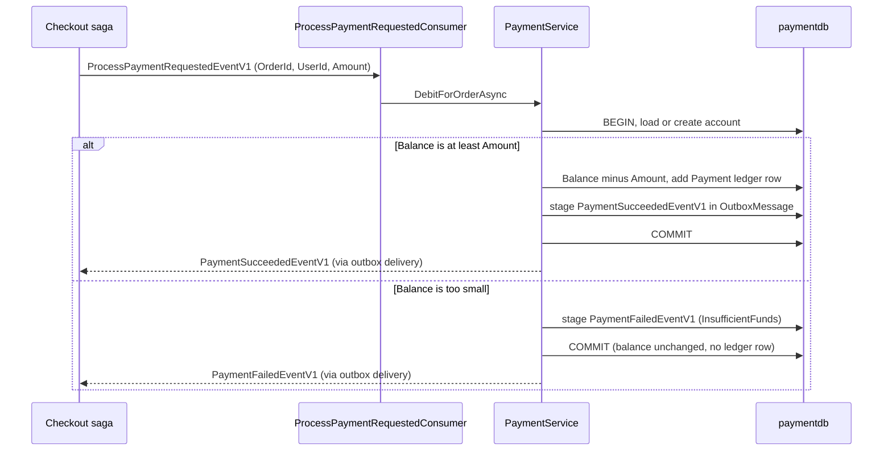
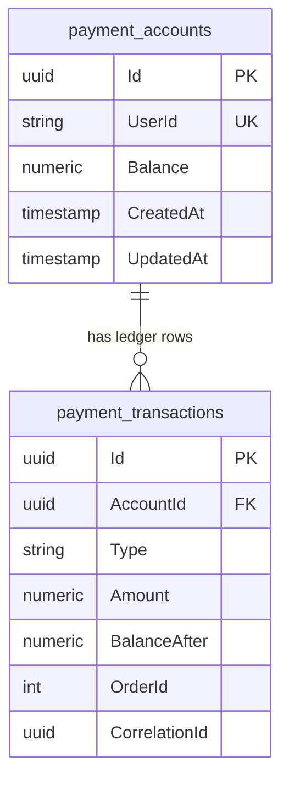

# Chapter 8: Payment and Compensation

`SimpleStore.Payment.API` is the smallest service in the checkout flow and the most useful one for experiments. It keeps a prepaid wallet (a balance) for each customer and a ledger of every deposit and charge. When the checkout saga asks it to charge an order, it checks the balance: enough money means the payment succeeds, not enough means it fails, and the saga then undoes the stock reservation. Because you control the balance, you control whether a checkout ends in `Confirmed` or `Cancelled`.

**What you will learn**

- The data model: `payment_accounts` and the `payment_transactions` ledger.
- How `DepositAsync` and `DebitForOrderAsync` work, line by line.
- How the outbox and inbox make the debit and its reply message safe against crashes and redelivery.
- How the wallet becomes a "controllable gate" for demos, with a step-by-step script.
- Where concurrency protection is missing, and why that is acceptable here but not in production.

---

## The problem

The saga ([Chapter 6](06-checkout-saga.md)) needs a payment step that can succeed or fail, so that the compensation path (releasing reserved stock) can be demonstrated. A real card processor is the wrong tool for a learning project: you cannot make it fail on command, and it adds secrets and external dependencies. A prepaid wallet is simple, local, and fully under your control:

- "Charge" means subtract from a balance.
- "Fails" means the balance is too small.
- "Make it succeed next time" means deposit more money (from the storefront's Wallet page, or from the Admin Payments page).

The service still has to behave like a real one in the ways that matter for messaging: it must charge once even if the request message is delivered twice, and it must never record a debit without also telling the saga about it.

## Big picture



*How to read it: the consumer is a thin shell; `PaymentService` makes the decision. In both branches the reply message and the database change are committed in one transaction, and the reply is sent afterwards by the outbox relay.*

The data model:



*How to read it: one account per user, many ledger rows per account. `Type` is the text `Deposit` or `Payment`. `OrderId` and `CorrelationId` are filled only for `Payment` rows.*

For the original design write-up see [docs/payment-service.md](../payment-service.md).

## Walk through the code

### 1. The entities

[PaymentAccount.cs](../../src/SimpleStore.Payment.API/Models/PaymentAccount.cs) has `Id`, `UserId` (maximum 450 characters), `Balance`, `CreatedAt`, `UpdatedAt`. `UserId` is a soft reference to the Identity user id; there is no foreign key across databases (see [Chapter 1](01-architecture-and-aspire.md)). There is no concurrency token.

[PaymentTransaction.cs](../../src/SimpleStore.Payment.API/Models/PaymentTransaction.cs) is the ledger row:

```csharp
    public Guid Id { get; set; }
    public Guid AccountId { get; set; }
    public PaymentAccount Account { get; set; } = null!;

    public PaymentTransactionType Type { get; set; }
    public decimal Amount { get; set; }
    public decimal BalanceAfter { get; set; }
```

It also has `OrderId`, `CorrelationId`, `Description`, and `CreatedAt`. `BalanceAfter` stores the running balance at the moment of the entry, so a history page never needs to recompute anything. The type enum in [PaymentTransactionType.cs](../../src/SimpleStore.Payment.API/Models/PaymentTransactionType.cs) has two values: `Deposit` and `Payment`.

### 2. The schema

[PaymentDbContext.cs](../../src/SimpleStore.Payment.API/Data/PaymentDbContext.cs) maps the tables `payment_accounts` and `payment_transactions`, stores amounts as `numeric(18,2)`, and stores `Type` as text. Two lines matter most:

```csharp
            e.Property(a => a.Balance).HasPrecision(18, 2);
            // One account per user; the unique index is what makes "get or create" safe.
            e.HasIndex(a => a.UserId).IsUnique();
```

The ledger has plain, non-unique indexes on `AccountId` and on `OrderId`. There is no unique constraint on `OrderId` or `CorrelationId`, so the database itself would not stop two `Payment` rows for the same order. The protection against that is the inbox (below).

The context also registers the MassTransit inbox and outbox tables (`InboxState`, `OutboxMessage`, `OutboxState`), the same pattern as `Order.API` ([Chapter 5](05-orders-and-outbox.md)).

### 3. Wiring the consumer and the outbox

[Program.cs](../../src/SimpleStore.Payment.API/Program.cs):

```csharp
builder.Services.AddMassTransit(x =>
{
    x.AddEntityFrameworkOutbox<PaymentDbContext>(o =>
    {
        o.UsePostgres();
        o.UseBusOutbox();
    });
    x.AddConsumer<ProcessPaymentRequestedConsumer>();
```

This does two jobs. The outbox means `Publish` calls inside `PaymentService` are written to `OutboxMessage` in the same transaction as the balance change. The inbox (applied to the consumer by `ConfigureEndpoints`) means that a `ProcessPaymentRequestedEventV1` that is delivered twice is processed once. The retry, circuit breaker, and heartbeat settings are the common ones described in [Chapter 9](09-resilience-and-observability.md).

### 4. The consumer is a thin shell

[ProcessPaymentRequestedConsumer.cs](../../src/SimpleStore.Payment.API/Consumers/ProcessPaymentRequestedConsumer.cs) opens a log scope with `CorrelationId` and `OrderId`, and then delegates:

```csharp
        await _payments.DebitForOrderAsync(
            msg.UserId, msg.OrderId, msg.CorrelationId, msg.Amount, context.CancellationToken);
```

### 5. Deposits

[PaymentService.cs](../../src/SimpleStore.Payment.API/Services/PaymentService.cs) `DepositAsync` rejects non-positive amounts (`ArgumentOutOfRangeException`), then runs inside an execution strategy and a transaction:

```csharp
            await using var tx = await _context.Database.BeginTransactionAsync(ct);
            var account = await GetOrAddTrackedAsync(userId, ct);

            var now = _clock.GetUtcNow().UtcDateTime;
            account.Balance += amount;
            account.UpdatedAt = now;
```

It then adds a `Deposit` ledger row (`Description = "Deposit"`, `BalanceAfter = account.Balance`), saves, and commits. `GetOrAddTrackedAsync` is how accounts get created on demand:

```csharp
        var account = await _context.Accounts.FirstOrDefaultAsync(a => a.UserId == userId, ct);
        if (account is null)
        {
            account = NewAccount(userId);
            _context.Accounts.Add(account);
        }
        return account;
```

A brand-new account starts at a balance of `0m`. This is why [PaymentSeeder.cs](../../src/SimpleStore.Payment.API/PaymentSeeder.cs) only runs migrations: accounts are keyed by Identity's user GUIDs, which are not known at seed time. Every customer starts with an empty wallet.

### 6. The debit: the heart of the service

`DebitForOrderAsync` starts the same way (execution strategy, transaction, account loaded or created) and then branches:

```csharp
        var strategy = _context.Database.CreateExecutionStrategy();
        var succeeded = await strategy.ExecuteAsync(async () =>
        {
            await using var tx = await _context.Database.BeginTransactionAsync(ct);
            var account = await GetOrAddTrackedAsync(userId, ct);
            var now = _clock.GetUtcNow();

            if (account.Balance >= amount)
            {
```

Success branch: subtract, write a `Payment` ledger row (with `OrderId`, `CorrelationId`, and `Description = $"Payment for order #{orderId}"`), then publish and commit:

```csharp
                await _publishEndpoint.Publish(new PaymentSucceededEventV1
                {
                    CorrelationId = correlationId,
                    OrderId = orderId,
                    TransactionId = txn.Id,
                    Amount = amount,
                    PaidAt = now
                }, ct);
```

The code then calls `SaveChangesAsync` and `CommitAsync` and returns `true`. `Publish` only stages the message; the single `SaveChangesAsync` writes the balance change, the ledger row, and the outbox row together.

Failure branch: no balance change and no ledger row, only a message:

```csharp
            await _publishEndpoint.Publish(new PaymentFailedEventV1
            {
                CorrelationId = correlationId,
                OrderId = orderId,
                Reason = PaymentFailureReason.InsufficientFunds,
                Amount = amount,
                FailedAt = now
            }, ct);

            await _context.SaveChangesAsync(ct);
            await tx.CommitAsync(ct);
            return false;
```

`PaymentFailureReason.InsufficientFunds` is the string `"InsufficientFunds"` from [PaymentFailedEvent.cs](../../src/SimpleStore.Contracts/PaymentFailedEvent.cs). The saga stores it in `FailureReason` and later reports it as the order's cancel reason. After the transaction, a success or failure counter and a log line are recorded.

Note one small difference from `OrderService`: `Order.API` saves twice because it needs the generated order id first. Here the ids are GUIDs created in code, so one save is enough.

### 7. The HTTP surface

[PaymentEndpoints.cs](../../src/SimpleStore.Payment.API/Endpoints/PaymentEndpoints.cs) maps (all under `/api/v1/payment`):

| Audience | Endpoint | Behaviour |
|---|---|---|
| Customer (JWT, owner = `sub` claim) | `GET /account` | Returns the caller's account, creating it at zero if needed |
| Customer | `POST /account/deposit` | Body `DepositRequest { Amount }`, amount must be positive |
| Customer | `GET /account/transactions` | The caller's ledger, newest first |
| Admin (`Admin` role) | `GET /admin/accounts` (+ `/count`) | Paged list of accounts, highest balance first |
| Admin | `GET /admin/accounts/{userId}` | One account, or 404 |
| Admin | `POST /admin/accounts/{userId}/deposit` | Deposit on behalf of a customer |
| Admin | `GET /admin/accounts/{userId}/transactions` | A customer's ledger |

A user deposit looks like this:

```csharp
        account.MapPost("/deposit", async (DepositRequest request, ClaimsPrincipal user, IPaymentService service, CancellationToken ct) =>
        {
            var userId = user.FindFirstValue("sub");
            if (string.IsNullOrEmpty(userId)) return Results.Unauthorized();
            if (request.Amount <= 0) return Results.BadRequest("Deposit amount must be positive.");
            return Results.Ok(await service.DepositAsync(userId, request.Amount, ct));
        });
```

Note that a customer can deposit any amount for free: this is a simulator, not a money system.

### 8. The two user interfaces

Customer wallet: [WalletController.cs](../../src/SimpleStore.Web/Controllers/WalletController.cs) shows the balance and history and posts deposits through `IPaymentApiClient`.

```csharp
        var account = await _payments.DepositAsync(amount);
        TempData["Success"] = $"Deposited ${amount:N2}. New balance: ${account.Balance:N2}.";
```

Operator page: [Payments.razor](../../src/SimpleStore.Admin/Components/Pages/Payments.razor) joins Identity users with Payment accounts in memory (accounts that do not exist yet show as 0.00) and offers a per-row deposit:

```csharp
        var account = await PaymentApi.DepositForUserAsync(row.Id, row.DepositAmount);
        row.Balance = account.Balance;
```

The page loads the first 100 users and the first 100 accounts only, which is fine for a demo.

## Algorithm

> **Algorithm: `DebitForOrderAsync(userId, orderId, correlationId, amount)`**
>
> 1. Open a logging scope with `CorrelationId` and `OrderId`.
> 2. Inside an EF execution strategy, `BEGIN` a transaction.
> 3. Load the account for `userId`; if it does not exist, create one with balance `0` (tracked, not yet saved).
> 4. If `Balance >= amount`:
>    1. `Balance = Balance - amount`, update `UpdatedAt`.
>    2. Add a `Payment` ledger row with `BalanceAfter`, `OrderId`, `CorrelationId`.
>    3. Stage `PaymentSucceededEventV1` (with the ledger row id as `TransactionId`).
> 5. Otherwise stage `PaymentFailedEventV1` with `Reason = InsufficientFunds`. Change nothing else.
> 6. `SaveChanges`, then `COMMIT`. The balance, the ledger row, and the outbox row (or only the outbox row, on failure) commit atomically.
> 7. The outbox relay sends the staged reply to RabbitMQ, where the saga picks it up.

> **Algorithm: why a redelivered request does not charge twice** (the idempotency story)
>
> 1. RabbitMQ may deliver the same `ProcessPaymentRequestedEventV1` more than once.
> 2. The MassTransit inbox (the `InboxState` table in `paymentdb`) records each (message id, consumer id) pair in the consumer's transaction.
> 3. A duplicate with the same message id is recognised and skipped before `DebitForOrderAsync` runs.
> 4. Because the inbox row commits with the debit, a crash cannot produce "debited but not recorded as consumed" or the reverse.
>
> The guard is per message id. The service itself has no business-level check such as "has order 42 already been paid?": there is no unique constraint on `OrderId` or `CorrelationId`, and `DebitForOrderAsync` does not query the ledger first.

## What can go wrong

- **Not enough money.** The expected failure. The saga receives `PaymentFailedEventV1`, releases stock, and cancels ([Chapter 6](06-checkout-saga.md)).
- **No account yet.** The debit creates one at zero balance, so a first-time customer with no deposit fails with `InsufficientFunds`.
- **Duplicate message.** Handled by the inbox, as described above.
- **No row-level locking or concurrency token.** Two debits (or a deposit and a debit) for the same account running at the same moment each read the old balance and each write back a computed balance. One update can overwrite the other (a "lost update"), leaving a balance that is wrong. EF Core's execution strategy and a transaction do not prevent this by themselves. Fixes: a concurrency token on `PaymentAccount` (for Postgres, the `xmin` system column), or `SELECT ... FOR UPDATE`, or an atomic `UPDATE ... SET Balance = Balance - @amount WHERE Balance >= @amount`. The design document calls this out as intentionally omitted.
- **Two concurrent first accesses.** Both try to insert an account; the unique index on `UserId` makes the second fail, and the consumer's retry policy tries again.
- **Payment is slow or down.** The saga's payment timeout fires and compensates, and the debit may still happen later, as described in [Chapter 6](06-checkout-saga.md) (the late-payment hole). There is no refund event or refund endpoint in the code.
- **No authorize/capture, no currencies, no refunds.** It is a prepaid balance simulator, not a payment gateway.

## Try it yourself

You need the AppHost running (`dotnet run --project src/SimpleStore.AppHost`), the storefront open, and the Admin app open as the seeded admin user (credentials are in the README). Use the seeded demo customer in the storefront.

**Demo script**

1. **(a) Success path.**
   1. In Admin, open **Payments**. Find the demo customer, enter an amount well above any product price (for example 1000), and click **Deposit**. The message line confirms the new balance.
   2. In the storefront, open **Wallet** and confirm the same balance. Note the stock of a product on its detail page.
   3. Add that product to the cart and check out.
   4. Open **My Orders**. The order starts `Pending` and should become `Confirmed` after a short moment (refresh the page). Open **Wallet** again: a `Payment` row "Payment for order #N" appears with the new balance. The product's stock is lower by the ordered quantity.
2. **(b) Failure path with compensation.**
   1. Make the wallet too small. There is no withdrawal feature, so use either a customer whose balance is lower than the order total (order more or a more expensive product than the balance covers), or register a new customer in the storefront (new accounts start at zero).
   2. Note the stock of the product, then check out.
   3. The order should end `Cancelled`. No `Payment` row appears in the ledger. On the product's detail page the stock may drop briefly (the reservation) and then return to its original value (the release); the displayed number is a cache that Catalog refreshes from Inventory events, so refresh after a few seconds.
   4. To see why, follow the compensation through Inventory in [Chapter 7](07-inventory-event-sourcing-cqrs.md): the reservation is cancelled and the held quantity is added back to `stock_levels`.
3. **(c) Fix it and retry.** Deposit enough in Admin **Payments** and order again; it now ends `Confirmed`.

**Look inside**

- pgweb, database `paymentdb`:
  - `SELECT * FROM payment_accounts;`
  - `SELECT "Type", "Amount", "BalanceAfter", "OrderId", "Description", "CreatedAt" FROM payment_transactions ORDER BY "CreatedAt" DESC;`
  - `SELECT "MessageId", "ConsumerId", "Received", "Consumed" FROM "InboxState" ORDER BY "Id" DESC;` shows one row per processed payment request.
- pgweb, database `checkoutdb`: `SELECT * FROM checkout_saga_state;` (usually empty; finished sagas are deleted).
- Aspire dashboard, **Structured logs**, resource `payment`: lines `Payment requested for order N: amount.`, then either `Payment of ... succeeded.` or `... rejected - insufficient funds.` Filter on `CorrelationId` to join with `checkout`, `order`, and `inventory`.
- Aspire dashboard, **Metrics**: the Payment service has counters for deposits and for succeeded and failed payments (the failed counter has a `reason` tag).
- RabbitMQ management, **Queues**: the queue for `ProcessPaymentRequestedConsumer` is where requests wait if you stop the `payment` resource.

## Key takeaways

- The wallet balance is the controllable gate: a bigger balance means `Confirmed`, a smaller one means `Cancelled` plus a stock release.
- `DebitForOrderAsync` keeps the balance change, the ledger row, and the reply message in one transaction, using the outbox.
- Exactly-once charging comes from the inbox (per message id), not from a database constraint on the order.
- A failed payment writes no ledger row and moves no money; the compensation is about releasing stock, not refunding.
- The missing concurrency control and the missing refund path are known limitations to discuss, not patterns to copy.

## Next chapter

Continue with [Chapter 9: Resilience and observability](09-resilience-and-observability.md) to see the retry, circuit-breaker, health-check, and tracing machinery that every service in this guide relies on.
