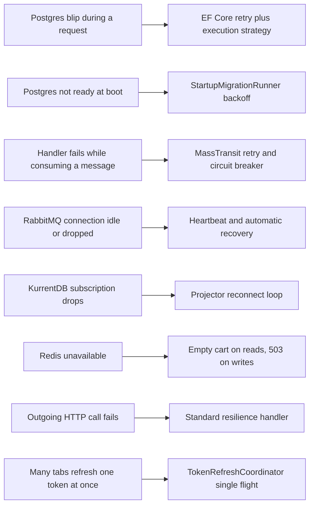
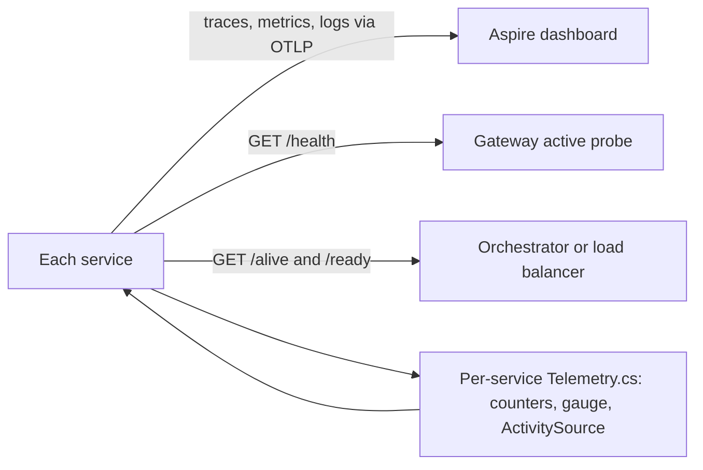

# Chapter 9 - Resilience and observability

In a system of ten programs and four data stores, something is always briefly broken: a database restarts, a broker connection drops, a container is slow to start. This chapter shows the defenses SimpleStore puts around those short failures (retries, circuit breakers, graceful degradation, health checks) and the tools it uses to see what is going on (traces, metrics, logs). The two topics belong together: you can only trust a retry if you can see that it happened.

**What you will learn**

- How EF Core retries transient database errors, and why that forces transactions into a special wrapper (`IExecutionStrategy`).
- How MassTransit retries failed message handling, and what the circuit breaker and heartbeat settings do.
- How services survive a database that is not ready at startup, and how the inventory projector reconnects.
- How the cart degrades on reads but fails cleanly on writes when Redis is down.
- What `/health`, `/alive` and `/ready` mean and how the `"ready"` tag works.
- How OpenTelemetry traces, metrics and logs reach the Aspire dashboard, which custom metrics exist, and how to read a trace.

---

## The problem

Most failures in a distributed system are **transient**: they disappear if you wait a moment and try again. Examples: Postgres is restarting, a TCP connection was reset, RabbitMQ is slow to answer. Three bad reactions are common:

1. **Crash.** A single failed query throws, the request returns 500, or the whole process exits.
2. **Retry forever, instantly.** The retries hammer a service that is already struggling.
3. **Fail silently.** Something goes wrong and nobody can tell what or where.

Good resilience means: retry a few times with growing delays, stop calling something that is clearly down, and degrade to a safe answer when possible. Good observability means each of those decisions leaves a trace, a metric or a log line you can find.

> **New term: transient failure.** A failure that is expected to go away by itself in seconds, as opposed to a bug or a wrong password, which will fail every time.

> **New term: exponential backoff.** Waiting longer after each failed attempt (for example 1 s, 2 s, 4 s, 8 s). It gives the broken thing time to recover and avoids a stampede of retries.

> **New term: circuit breaker.** A guard that watches the failure rate. When too many calls fail, it "opens" and rejects further calls immediately for a while, then lets a few through to test whether the problem is gone. Like an electrical breaker, it protects the rest of the system.

## Big picture

Each kind of failure has its own layer of defense. The first diagram maps failures to defenses.



*How to read it: left boxes are things that go wrong, right boxes are the code that handles them. Every arrow is a section in "Walk through the code".*

The second diagram shows how the same programs report what they are doing.



*How to read it: everything a service emits goes either to the dashboard (telemetry) or to something that decides whether to send it traffic (health endpoints).*

---

## Walk through the code

### Part A - Resilience

#### Step 1 - EF Core retries transient database errors

Every service that owns a Postgres database registers its `DbContext` the same way. Here is Order.API in [Program.cs](../../src/SimpleStore.Order.API/Program.cs):

```csharp
builder.AddNpgsqlDbContext<OrderDbContext>("orderdb",
    configureSettings: settings =>
    {
        settings.DisableRetry = true;
        settings.CommandTimeout = 30;
    },
    configureDbContextOptions: opt =>
        opt.UseNpgsql(npgsql =>
            npgsql.EnableRetryOnFailure(
                maxRetryCount: 5,
                maxRetryDelay: TimeSpan.FromSeconds(10),
                errorCodesToAdd: null)));
```

- `EnableRetryOnFailure` turns on EF Core's built-in **execution strategy**: when a command fails with an error Npgsql considers transient, EF waits and tries again, up to 5 times, with each wait capped at 10 seconds.
- `settings.DisableRetry = true` switches off the retry that the Aspire Postgres component would otherwise add, so there is exactly one retry policy and its numbers are visible in this file.
- `settings.CommandTimeout = 30` limits a single SQL command to 30 seconds.

The same block (same numbers) appears for Identity, Catalog, Inventory, Checkout and Payment. Cart.API has no Postgres, so it has no DbContext.

#### Step 2 - Why transactions must be wrapped in `CreateExecutionStrategy().ExecuteAsync`

A retry has to repeat the whole unit of work, not just the failed statement. Suppose a transaction runs `INSERT order`, `INSERT outbox row`, then the connection drops before `COMMIT`. The database has rolled everything back, so the only correct recovery is to run all of it again from the start. EF cannot know which of your statements belong together unless you tell it.

So EF Core **refuses** to run a transaction you opened yourself (`BeginTransactionAsync`) when a retrying strategy is enabled. It throws an `InvalidOperationException` that says user-initiated transactions are not supported and tells you to use the execution strategy. The fix is to put the whole transaction inside a lambda that the strategy can re-run. This is the start of `CreateOrderAsync` in [OrderService.cs](../../src/SimpleStore.Order.API/Services/OrderService.cs):

```csharp
        var strategy = _context.Database.CreateExecutionStrategy();
        await strategy.ExecuteAsync(async () =>
        {
            await using var tx = await _context.Database.BeginTransactionAsync(ct);

            _context.Orders.Add(order);
            await _context.SaveChangesAsync(ct);
```

and this is the end of the same lambda:

```csharp
            await _context.SaveChangesAsync(ct);
            await tx.CommitAsync(ct);
        });
```

Between them the code publishes `OrderSubmittedEventV1` into the outbox (chapter 5). The whole lambda may run up to six times (the first attempt plus five retries), so it must be safe to repeat. Two habits in this code base follow from that:

- **Work that must happen once goes after the lambda.** In the same method, `Telemetry.OrdersSubmitted.Add(1, ...)` and the "order submitted" log line come after `ExecuteAsync` returns, so a retried transaction is counted once.
- **Side effects inside the lambda must be idempotent.** The same pattern is used in `PaymentService`, `CreateReservationHandler` and `InventoryProjectionService.ApplyOneAsync`, where "have I already applied this?" guards make a second run harmless.

> **New term: idempotent.** Doing it twice has the same result as doing it once. Idempotent operations are safe to retry.

#### Step 3 - MassTransit retries, circuit breaker and heartbeat

Message handlers fail for the same transient reasons. Each service that uses RabbitMQ configures the bus the same way; Order.API, Checkout.API, Payment.API, Catalog.API, Cart.API and Inventory.API all use identical numbers. Identity has no bus. In Order.API:

```csharp
        cfg.Host(new Uri(builder.Configuration.GetConnectionString("rabbitmq")!), h =>
        {
            h.Heartbeat(TimeSpan.FromSeconds(30));
            h.RequestedConnectionTimeout(TimeSpan.FromSeconds(10));
        });
```

```csharp
        cfg.UseMessageRetry(r => r.Exponential(
            retryLimit: 5,
            minInterval: TimeSpan.FromSeconds(1),
            maxInterval: TimeSpan.FromSeconds(30),
            intervalDelta: TimeSpan.FromSeconds(2)));
```

```csharp
        cfg.UseCircuitBreaker(cb =>
        {
            cb.TrackingPeriod = TimeSpan.FromMinutes(1);
            cb.TripThreshold = 15;
            cb.ActiveThreshold = 10;
            cb.ResetInterval = TimeSpan.FromMinutes(5);
        });
```

What each setting means:

| Setting | Value | Meaning |
|---|---|---|
| `Heartbeat` | 30 s | The client and RabbitMQ exchange small keep-alive frames, so a silent connection is noticed (and not dropped by a network device for being idle). |
| `RequestedConnectionTimeout` | 10 s | Give up on a connection attempt after 10 seconds. |
| `UseMessageRetry` / `Exponential` | 5 retries, delays growing from about 1 s up to a 30 s cap | If a consumer throws, MassTransit re-runs the handler in-process. The exact spacing comes from MassTransit's formula. After the fifth retry the message moves to an `_error` queue for an operator to inspect. |
| `TrackingPeriod` | 1 minute | The window over which failures are counted. |
| `ActiveThreshold` | 10 | The breaker only judges the endpoint once at least 10 messages were processed in the window. |
| `TripThreshold` | 15 | Percent of failed messages in the window that opens the breaker. |
| `ResetInterval` | 5 minutes | How long the breaker stays open before it lets a trial message through. |

The retry layer fixes short blips; the breaker handles sustained trouble by pausing consumption instead of burning through retries on every message. The Checkout program has one extra comment worth knowing: saga consumers get the retry policy automatically, and the saga repository uses a pessimistic row lock so concurrent messages for one saga run one at a time (chapter 6).

Retrying a handler only makes sense if the handler can run twice safely. That is why Order, Catalog, Checkout and Payment use the EF inbox (exactly-once consume) and why the Cart consumer is written to be idempotent without one (chapters 4 and 5).

#### Step 4 - Surviving a database that is not ready at boot

Every service that owns a database runs migrations at startup. If Postgres is still starting, the first attempt throws. [StartupMigrationRunner.cs](../../src/SimpleStore.ServiceDefaults/StartupMigrationRunner.cs) wraps the migration and seeding in a bounded retry. Order.API calls it like this near the end of `Program.cs`:

```csharp
await StartupMigrationRunner.RunAsync(app, async (sp, _) =>
{
    var context = sp.GetRequiredService<OrderDbContext>();
    await OrderSeeder.SeedAsync(context);
});
```

And this is the heart of the runner:

```csharp
            catch (Exception ex) when (attempt < maxAttempts && !cancellationToken.IsCancellationRequested)
            {
                log.LogWarning(ex,
                    "Startup migration attempt {Attempt}/{MaxAttempts} failed; retrying in {DelaySeconds}s.",
                    attempt, maxAttempts, delay.TotalSeconds);
                try
                {
                    await Task.Delay(delay, cancellationToken);
                }
                catch (OperationCanceledException)
                {
                    throw;
                }
                delay = TimeSpan.FromSeconds(Math.Min(MaxDelay.TotalSeconds, delay.TotalSeconds * 2));
            }
```

The `when (attempt < maxAttempts ...)` filter is the trick: on the fifth failure the filter is false, the `catch` does not run, and the exception propagates out of `RunAsync`, so a genuinely wrong connection string still crashes the service quickly instead of retrying forever. The six services with a database (Identity, Catalog, Order, Inventory, Checkout, Payment) use this runner.

#### Step 5 - The inventory projector reconnects

The Inventory projector (chapter 7) reads events from KurrentDB through a long-lived subscription. If that subscription breaks, an outer loop in [InventoryProjectionService.cs](../../src/SimpleStore.Inventory.API/Projections/InventoryProjectionService.cs) reconnects:

```csharp
            catch (OperationCanceledException) when (stoppingToken.IsCancellationRequested)
            {
                break;
            }
            catch (Exception ex)
            {
                _log.LogError(ex,
                    "Inventory projector subscription dropped; reconnecting in {BackoffSeconds}s.",
                    backoff.TotalSeconds);
                try
                {
                    await Task.Delay(backoff, stoppingToken);
                }
                catch (OperationCanceledException)
                {
                    break;
                }
                backoff = TimeSpan.FromSeconds(Math.Min(MaxBackoff.TotalSeconds, backoff.TotalSeconds * 2));
            }
```

The backoff starts at 1 second and doubles up to 30 seconds. Before each reconnect the loop reloads the checkpoint from Postgres, so it resumes exactly where it stopped. Note one detail: `backoff` is reset to 1 second only when `RunSubscriptionLoopAsync` returns normally. A subscription that processes events for hours and then drops does not reset it, so the next reconnect uses whatever delay the previous failures left behind. That is conservative rather than wrong, and chapter 11 lists it.

#### Step 6 - The cart degrades on reads and returns 503 on writes

When Redis is unreachable, Cart.API chooses differently for reads and writes. In [RedisCartStore.cs](../../src/SimpleStore.Cart.API/Services/RedisCartStore.cs), reading a cart swallows the Redis exceptions and answers with an empty cart:

```csharp
    private async Task<List<CartItemDto>> TryLoadItemsAsync(string ownerKey, CancellationToken ct)
    {
        try
        {
            return await LoadItemsAsync(ownerKey, ct);
        }
        catch (RedisConnectionException ex)
        {
            _log.LogWarning(ex,
                "Redis unreachable while loading cart {OwnerKey}; degrading to empty cart.", ownerKey);
            return new List<CartItemDto>();
        }
```

`GetAsync` (used by `GET /cart`, `/cart/count` and `/cart/total`) calls this method. The storefront shows an empty cart instead of an error page.

Writes (add, update, remove, merge) first need to load the current cart, and they must not do that through the forgiving path. If a failed read looked like an empty cart, the next save would overwrite the real cart with a nearly empty one. So write paths use `LoadItemsAsync`, which lets the exception escape. [RedisExceptionMiddleware.cs](../../src/SimpleStore.Cart.API/Middleware/RedisExceptionMiddleware.cs) catches `RedisConnectionException` and `RedisTimeoutException` and turns them into a clean answer:

```csharp
        ctx.Response.Clear();
        ctx.Response.StatusCode = StatusCodes.Status503ServiceUnavailable;
        ctx.Response.Headers.RetryAfter = "5";
        ctx.Response.ContentType = "application/problem+json";
```

`503 Service Unavailable` plus `Retry-After: 5` is the standard "try again in a few seconds" signal. (A comment in `RedisCartStore.GetAsync` mentions an "ExceptionHandlingMiddleware"; the class that does the work is `RedisExceptionMiddleware`, registered in Cart.API's `Program.cs`.)

#### Step 7 - Outgoing HTTP calls and token refresh

Two more protections are already in place from earlier chapters:

- `AddServiceDefaults()` calls `http.AddStandardResilienceHandler()` for every `HttpClient` in every service (chapter 1, step 7). It is the Microsoft default pipeline of rate limiting, timeouts, retries and a circuit breaker for outgoing HTTP. Its defaults are not set in this repository; check the Microsoft documentation for the current values, and be aware that retrying non-idempotent requests (such as a POST that creates something) needs thought.
- `TokenRefreshCoordinator` in Web and Admin makes concurrent token refreshes share one network call (one `Lazy<Task>` per refresh-token value in a `ConcurrentDictionary`). It exists because Identity rotates refresh tokens on first use, so parallel refreshes would race and all but one would fail. Chapter 3 has the full algorithm.

### Part B - Health checks

#### Step 8 - Three endpoints, one tag convention

Every service exposes three health endpoints, defined in [Extensions.cs](../../src/SimpleStore.ServiceDefaults/Extensions.cs). First, a trivial `self` check tagged `live`:

```csharp
        builder.Services.AddHealthChecks()
            // Add a default liveness check to ensure app is responsive
            .AddCheck("self", () => HealthCheckResult.Healthy(), ["live"]);
```

Next, the dependency probes. The Aspire components for Postgres and Redis and MassTransit register their own health checks, but they do not carry our `"ready"` tag. A post-configuration step adds the tag by name:

```csharp
        builder.Services.PostConfigure<HealthCheckServiceOptions>(o =>
        {
            foreach (var r in o.Registrations)
            {
                if (r.Tags.Contains("ready")) continue;
                if (AspireDependencyCheckPrefixes.Any(p =>
                        r.Name.StartsWith(p, StringComparison.OrdinalIgnoreCase)))
                {
                    r.Tags.Add("ready");
                }
            }
        });
```

The prefixes are `npgsql`, `postgres`, `redis`, `stackexchangeredis`, `rabbitmq` and `masstransit`. Finally `MapDefaultEndpoints()` publishes the endpoints, in every environment (not only Development):

```csharp
        app.MapHealthChecks(HealthEndpointPath);

        app.MapHealthChecks(AlivenessEndpointPath, new HealthCheckOptions
        {
            Predicate = r => r.Tags.Contains("live")
        });

        app.MapHealthChecks(ReadinessEndpointPath, new HealthCheckOptions
        {
            Predicate = r => r.Tags.Contains("ready")
        });
```

| Endpoint | Runs which checks | Answers the question | Fails when |
|---|---|---|---|
| `/alive` | only checks tagged `live` (just `self`) | Is the process responsive? Should it be restarted? | the process is stuck; never because a dependency is down |
| `/ready` | only checks tagged `ready` (dependency probes) | Can this instance do useful work? Should it receive traffic? | a dependency such as Postgres or RabbitMQ is unreachable |
| `/health` | every registered check | Overall status; used by the gateway's active probe and the Aspire dashboard | anything is unhealthy |

> **New term: liveness vs readiness.** Liveness asks "is the process alive?" and the cure for "no" is a restart. Readiness asks "is it able to serve right now?" and the cure for "no" is to stop sending it traffic and wait. Mixing them up causes needless restarts: restarting an API will not bring its database back.

The Inventory service adds one custom probe. [KurrentDbHealthCheck.cs](../../src/SimpleStore.Inventory.API/Infrastructure/KurrentDbHealthCheck.cs) reads a single event from the end of the event store with a 3 second timeout, and `Program.cs` registers it with the tag already attached:

```csharp
builder.Services.AddHealthChecks()
    .AddCheck<KurrentDbHealthCheck>("kurrentdb", tags: ["ready"]);
```

Finally, the OpenTelemetry trace filter in the same file excludes these three paths so that probes polling every few seconds do not flood the trace list:

```csharp
                    .AddAspNetCoreInstrumentation(tracing =>
                        // Exclude health check requests from tracing — they would otherwise dominate
                        // the trace stream with no signal.
                        tracing.Filter = context =>
                            !context.Request.Path.StartsWithSegments(HealthEndpointPath)
                            && !context.Request.Path.StartsWithSegments(AlivenessEndpointPath)
                            && !context.Request.Path.StartsWithSegments(ReadinessEndpointPath)
                    )
```

### Part C - Observability

> **New term: observability.** The ability to understand what a running system is doing from the outside, using three kinds of signals. **Logs** are text events. **Metrics** are numbers over time (counters, gauges, histograms). **Traces** follow one request across programs as a tree of timed steps called **spans**.

> **New term: OpenTelemetry (OTel).** A vendor-neutral standard and set of libraries for producing those three signals. **OTLP** is the protocol used to ship them to a collector; here the collector is the Aspire dashboard.

#### Step 9 - What is instrumented

`ConfigureOpenTelemetry` in [Extensions.cs](../../src/SimpleStore.ServiceDefaults/Extensions.cs) sets up everything once for every service:

- **Tracing sources:** the application's own name, `MassTransit`, and the wildcard `SimpleStore.*`.
- **Metrics meters:** `MassTransit` and the wildcard `SimpleStore.*`, plus ASP.NET Core, `HttpClient` and runtime instrumentation.
- **Automatic instrumentation:** ASP.NET Core, `HttpClient`, gRPC client (this is how KurrentDB calls show up), and EF Core with `SetDbStatementForText = true`, so each span carries the real SQL text. Redis is instrumented separately in Cart.API's own `Program.cs`, because it needs the service's `IConnectionMultiplexer`.
- **Logs:** exported through OpenTelemetry with `IncludeScopes = true`, so log scopes such as `CorrelationId` become searchable fields.

The sampler decides how many traces are kept:

```csharp
        var samplerArg = builder.Configuration.GetValue<double?>("OTEL_TRACES_SAMPLER_ARG") ?? 1.0;
```

and later `.SetSampler(new ParentBasedSampler(new TraceIdRatioBasedSampler(samplerArg)))`. With the default `1.0`, every trace is kept. Setting `OTEL_TRACES_SAMPLER_ARG=0.1` would keep about 10 percent. `ParentBased` means a service follows the decision already made by the caller, so a kept trace stays complete across services instead of having holes.

Exporting is optional:

```csharp
        var useOtlpExporter = !string.IsNullOrWhiteSpace(builder.Configuration["OTEL_EXPORTER_OTLP_ENDPOINT"]);

        if (useOtlpExporter)
        {
            builder.Services.AddOpenTelemetry().UseOtlpExporter();
        }
```

Aspire sets `OTEL_EXPORTER_OTLP_ENDPOINT` for every project it starts, which is why the dashboard fills up with no extra configuration. Run a service on its own without that variable and it simply does not export.

#### Step 10 - One `Telemetry.cs` per service

By convention each service has an `Observability/Telemetry.cs` with a static `ActivitySource` and `Meter`, both named `SimpleStore.<Service>`. The wildcards above pick them up automatically, so adding a counter is one line in that file. The sources and meters exist for Order, Cart, Catalog, Checkout, Identity, Inventory, Payment, Web and Admin. Catalog, Checkout and Identity declare their source and meter but define no counters yet. Only Inventory actually starts custom spans (`InventoryProjector.Apply`, one per projected event).

These are all the custom metrics, read from every `Telemetry.cs`:

| Metric name | Kind (unit) | Emitted by | Tags | Meaning |
|---|---|---|---|---|
| `simplestore.orders.submitted` | counter | Order.API, after the create-order transaction commits | `line_count` | Orders created |
| `simplestore.orders.confirmed` | counter | Order.API `OrderConfirmedConsumer` | none | Orders moved to Confirmed by the saga |
| `simplestore.orders.cancelled` | counter | Order.API `OrderCancelledConsumer` | `reason` | Orders moved to Cancelled, split by reason |
| `simplestore.cart.fanout.duration` | histogram (ms) | Cart.API `ProductUpdatedConsumer` | `scanned`, `touched` | Time of the Redis SCAN over all carts after a product update |
| `simplestore.reservations.requested` | counter | Inventory `ReserveStockRequestedConsumer` | `line_count` | Reserve requests received |
| `simplestore.reservations.succeeded` | counter | Inventory `CreateReservationHandler` | `line_count` | Reservations accepted (first delivery only) |
| `simplestore.reservations.failed` | counter | Inventory `CreateReservationHandler` | `reason`, `shortage_lines` | Reservations rejected for insufficient stock |
| `simplestore.reservations.cancelled` | counter | Inventory `CancelReservationHandler` | none | Reservations released as compensation |
| `simplestore.inventory.projector.unknown_events` | counter | Inventory projector | `event_type` | Events the projector did not recognise; should stay 0 |
| `simplestore.inventory.projector.lag` | observable gauge (bytes) | Inventory projector | none | How far the read model is behind KurrentDB |
| `simplestore.payments.succeeded` | counter | Payment.API `DebitForOrderAsync` | none | Payments charged |
| `simplestore.payments.failed` | counter | Payment.API `DebitForOrderAsync` | `reason` | Payments rejected (for example `InsufficientFunds`) |
| `simplestore.payments.deposits` | counter | Payment.API `DepositAsync` | none | Deposits made |
| `simplestore.identity.token_refresh.coalesced` | counter | Web and Admin `TokenRefreshCoordinator` | none | Refresh calls that joined an in-flight refresh |

The last metric has "identity" in its name but is emitted by the Web and Admin meters, not by Identity.API.

The **projector lag gauge** deserves a closer look because it is not incremented anywhere; it is *observed*. The meter calls a callback each time metrics are collected:

```csharp
    public static readonly ObservableGauge<long> ProjectorLag = Meter.CreateObservableGauge(
        "simplestore.inventory.projector.lag",
        () => _projectorLagProvider(),
        unit: "bytes",
        description: "Commit-log position delta between KurrentDB's tail and the projector's last applied checkpoint. 0 = caught up.");
```

The projector service supplies the callback in its constructor:

```csharp
        Telemetry.SetProjectorLagProvider(() =>
        {
            var tail = Volatile.Read(ref _lastSeenTailCommit);
            var applied = Volatile.Read(ref _lastAppliedCommit);
            return tail > applied ? tail - applied : 0L;
        });
```

`_lastSeenTailCommit` is updated when an event arrives from the subscription. `_lastAppliedCommit` is updated after the Postgres transaction for that event commits. The difference is measured in bytes of KurrentDB's commit log, not in events, so treat it as "zero means caught up, bigger means further behind".

#### Step 11 - Saga transitions are tagged on the active span

The checkout saga does not create its own span. Instead `LogTransition` in `CheckoutSagaStateMachine` writes a log line and adds tags to the span that MassTransit already opened for the message being consumed:

```csharp
        var activity = Activity.Current;
        if (activity is not null)
        {
            activity.SetTag("saga.correlation_id", saga.CorrelationId);
            activity.SetTag("saga.order_id", saga.OrderId);
            activity.SetTag("saga.state.from", from);
            activity.SetTag("saga.state.to", to);
            if (reason is not null) activity.SetTag("saga.cancel_reason", reason);
        }
```

In the dashboard you can search spans for a given `saga.correlation_id` and see every transition (for example `AwaitingStock` to `AwaitingPayment`) with its reason. Order, Inventory, Payment and the saga also open a logging scope with the `CorrelationId`, so logs from different services about the same order can be joined by that one value.

---

## Algorithm

**Algorithm 1 - EF execution strategy**

```text
attempt = 0
loop:
    try:
        run the lambda          # begin transaction, save, publish to outbox, commit
        return its result
    catch transient database error:
        attempt = attempt + 1
        if attempt > 5: throw
        wait (growing delay, never more than 10 s)
        # the transaction was rolled back, so run the lambda again from the top
    catch any other error:
        throw
```

**Algorithm 2 - StartupMigrationRunner**

```text
delay = 1 s
for attempt = 1, 2, 3, 4, 5:
    try:
        migrate and seed
        return
    catch error when attempt < 5:
        log a warning
        wait delay
        delay = min(16 s, delay * 2)
    # on attempt 5 the filter is false, the error is thrown
```

The waits are 1, 2, 4 and 8 seconds, about 15 seconds in total, before the service gives up and exits.

**Algorithm 3 - Projector reconnect loop**

```text
backoff = 1 s
while not stopping:
    try:
        load checkpoint from Postgres
        subscribe to KurrentDB from that position and apply events
        backoff = 1 s            # only reached when the subscription ends cleanly
    catch error:
        log it, wait backoff
        backoff = min(30 s, backoff * 2)
```

**Algorithm 4 - Assigning the `"ready"` tag**

```text
for each registered health check r:
    if r has the tag "ready": skip
    if r.Name starts with npgsql, postgres, redis, stackexchangeredis, rabbitmq or masstransit (any case):
        add the tag "ready"
/ready runs only checks with the tag "ready"
```

**Algorithm 5 - Circuit breaker, as configured**

```text
every message outcome is counted over a sliding 1 minute window
if at least 10 messages were processed in the window
   and 15 percent or more of them failed:
       open the breaker      # reject further messages for a while
after 5 minutes open:
       let a trial message through
       success: close the breaker    failure: open again
```

## What can go wrong

- **Retry multiplies work.** A lambda that sends an email, calls an external API, or increments a counter inside `ExecuteAsync` will do it again on each retry. Keep side effects idempotent or move them after the lambda.
- **Retries hide a real outage.** Six attempts with delays up to 10 s can add many seconds to a request that was always going to fail. The metrics and traces are how you notice.
- **A message that always fails.** After five retries it lands in an `_error` queue. Nothing replays it automatically; someone has to look at the RabbitMQ management UI.
- **Breaker too eager or too lazy.** The breaker only acts after 10 messages in a minute, so a slow trickle of failing messages never trips it, and once open it pauses a whole endpoint for five minutes.
- **A graceful read can mislead.** The empty cart during a Redis outage is a valid answer to the UI, but it is not the true state. Do not build a write on top of it.
- **The `"ready"` tag is name-based.** If a library's health check is registered under a name that does not start with one of the listed prefixes, `/ready` silently ignores it. This guide did not enumerate the registered names. Test it by stopping the dependency and watching `/ready` (see below).
- **Health endpoints are open.** They are mapped in all environments and return only up or down, but they are not protected by authentication.
- **A migration that fails five times kills the service.** That is intended, but check the logs for the underlying error rather than the last attempt message.
- **Projector backoff is not reset after a long healthy run.** A brief outage after hours of success may reconnect more slowly than necessary.
- **Sampling.** If you lower `OTEL_TRACES_SAMPLER_ARG`, the trace you want may not exist. Metrics and logs are not sampled.
- **Light instrumentation outside Inventory.** Only the projector starts custom spans; most other timing comes from the automatic ASP.NET Core, EF Core and MassTransit spans.

## Try it yourself

Start the system with `dotnet run --project src/SimpleStore.AppHost` and open the Aspire dashboard.

**1. Read a trace.**

1. Open the storefront (`web` in the dashboard), sign in with a seeded customer account (see `IdentitySeeder.cs`), add a product to the cart and check out.
2. In the dashboard open **Traces**. Filter by the `web` or `gateway` resource and open the trace for the order-creating request (a `POST` to `/api/v1/order/orders`).
3. Expand the tree. You should see: the `web` span, a `gateway` span, an `order` span for the HTTP call, then child spans for the SQL commands. Click one SQL span and look for the statement text (`db.statement`), which is there because of `SetDbStatementForText`.
4. Look for MassTransit spans for the publish and for the consumers in `checkout`, `inventory` and `payment`. MassTransit passes trace context in message headers, so these normally join the same trace; if they appear as separate traces, find them with the attribute search below.
5. Open a span from `checkout` and look at its attributes: `saga.correlation_id`, `saga.state.from`, `saga.state.to`, and for a cancellation `saga.cancel_reason`.
6. For the correlation id of your order, open pgweb on `orderdb` and run `select "Id", "CorrelationId", "Status" from "Orders" order by "Id" desc limit 1;`. Then in **Structured logs** filter on that `CorrelationId` and watch the order, saga, inventory and payment logs line up.

**2. Metrics.** Open **Metrics**, select the `order` resource, and look for `simplestore.orders.submitted`. Select `payment` and look at `simplestore.payments.failed` (a new customer has a zero balance, so the first checkout is a good way to see it increment) and `simplestore.reservations.cancelled` under `inventory`, which counts the compensation.

**3. Projector lag.** Under `inventory`, chart `simplestore.inventory.projector.lag`. It should sit at 0. Create a receipt note through the admin UI and watch whether it blips.

**4. Liveness vs readiness.** Copy the `inventory` URL from the dashboard, then:

```pwsh
curl.exe -sk -o NUL -w "%{http_code}\n" "<inventory-url>/alive"
curl.exe -sk -o NUL -w "%{http_code}\n" "<inventory-url>/ready"
curl.exe -sk -o NUL -w "%{http_code}\n" "<inventory-url>/health"
```

All should print 200. Now stop the `kurrentdb` resource in the dashboard and repeat after a few seconds. `/ready` and `/health` should return 503 (the explicit `kurrentdb` check is tagged `ready`), while `/alive` stays 200. Start `kurrentdb` again and watch `/ready` recover. Then try stopping `rabbitmq` and see which services' `/ready` changes; that experiment tells you whether the name-based tagging caught the MassTransit check.

**5. Cart degrade vs 503.** Get the `cart` URL from the dashboard and stop `cart-redis`:

```pwsh
curl.exe -sk -i "<cart-url>/api/v1/cart" -H "X-Cart-Id: demo-cart"
curl.exe -sk -i -X POST "<cart-url>/api/v1/cart/items" -H "X-Cart-Id: demo-cart" -H "Content-Type: application/json" -d "{\"ProductId\":1,\"ProductName\":\"x\",\"UnitPrice\":1,\"Quantity\":1}"
```

The first (a read) should return 200 with an empty cart and a warning in the `cart` logs. The second (a write) should return 503 with a `Retry-After: 5` header. Start Redis again and repeat.

**6. Startup retry.** Stop the `postgres` resource, then restart the `order` resource. Watch its console logs: you should see "Startup migration attempt 1/5 failed; retrying in 1s", then 2s, 4s, 8s. Start `postgres` again before the fifth attempt and the log shows "Startup migration succeeded on attempt N". Leave it down for the whole schedule and the service stops.

**7. Retry then error queue.** In the RabbitMQ management UI, look at the queues. If a consumer ever exhausted its retries you will see a queue ending in `_error` with messages in it.

## Key takeaways

- Retry transient failures a few times with growing delays, then give up loudly. EF Core (5 tries, 10 s cap), MassTransit (5 tries, 1 s to 30 s) and the startup runner (5 attempts, 1 to 8 s waits) all follow that rule.
- Because a retry repeats a whole transaction, user-opened transactions must live inside `CreateExecutionStrategy().ExecuteAsync(...)`, and what runs inside must be safe to repeat.
- Use the circuit breaker, heartbeat and reconnect loops for sustained or silent failures.
- Choose degradation per operation: Cart reads return an empty cart, Cart writes return 503 with `Retry-After`.
- `/alive` is for restart decisions, `/ready` is for traffic decisions, `/health` is the overall view.
- Every service ships traces, metrics and logs to the Aspire dashboard through one shared setup; each service adds its own counters in `Telemetry.cs`.
- Correlate by `CorrelationId`: it is in log scopes and in the saga's span tags.

## Next chapter

[Chapter 10 - Contracts and versioning](10-contracts-and-versioning.md) lists every event that travels over RabbitMQ and explains how events can change without breaking the services that consume them.
