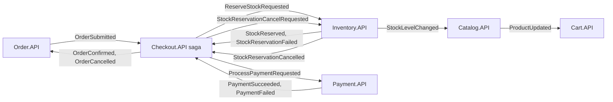
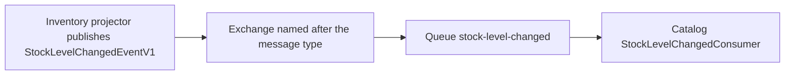
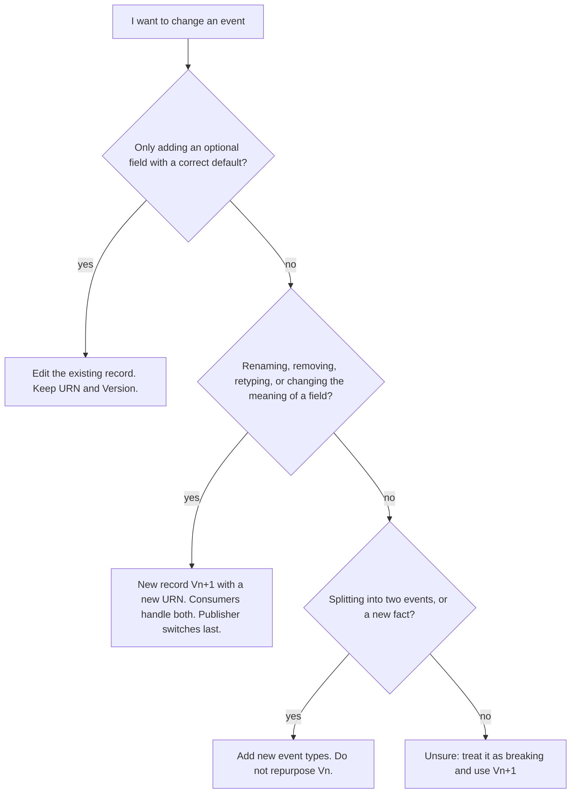

# Chapter 10 - Contracts and Versioning

Services in SimpleStore talk to each other with messages, and the shape of those messages is a contract: the publisher and every consumer must agree on it, but they are deployed separately and at different times. This chapter lists every integration event in `SimpleStore.Contracts`, explains how MassTransit identifies and routes them, and gives a repeatable method for changing a contract without breaking the services that depend on it. It also covers how HTTP APIs and Inventory's internal domain events are versioned, because they follow different rules.

**What you will learn**

- The difference between an integration event (between services) and a domain event (inside one service).
- The full catalogue of events: fields, who publishes, who consumes, and why.
- What a message URN is, and how MassTransit uses it and the type names to build exchanges and queues (marked "by default" where this is MassTransit behaviour rather than repo code).
- Which changes are additive (safe) and which are breaking, and how to ship a `V2`.
- How Inventory versions its stored events, and how that links to HTTP API versioning in [chapter 2](02-gateway-and-api-versioning.md).

---

## The problem

Imagine the Payment service wants to add a currency next to `Amount` in `PaymentSucceededEventV1`. Right now, five services are running, each one built from a different commit if you are mid-deployment. Messages already sitting in RabbitMQ queues, or in an outbox table waiting to be delivered, were written by the old code. Three questions follow:

1. Will the old consumer still understand a message produced by the new publisher?
2. Will the new consumer still understand a message produced by the old publisher?
3. How does a consumer know which shape it received?

Without rules, the answer is "it depends, and you find out in production". The rules in this repo are small: every event is named `...EventV1`, carries a `Version` number, has a pinned wire identity (the message URN), is changed only in additive ways, and otherwise gets a new type with a new identity next to the old one.

> **New term: integration event.** A message one service publishes so that other services can react. It crosses a process boundary, so its shape is a public contract. All of them live in `src/SimpleStore.Contracts`.

> **New term: domain event.** A record of something that happened inside one bounded context, used for that context's own storage (event sourcing). Inventory's `StockReservedV1` is one. Domain events never leave their service and are not in `SimpleStore.Contracts`. See [chapter 7](07-inventory-event-sourcing-cqrs.md).

> **New term: message URN.** A string such as `urn:message:SimpleStore.Contracts:StockReservedEvent` that identifies a message type on the wire. MassTransit writes it into the message envelope, and consumers use it to decide whether a message is one they handle.

> **New term: upcasting.** Converting an old stored event into the newest shape at read time (`V1` in, `V2` out) so that only the newest handler has to exist. Inventory has a scaffold for this; it is explained in the last section.

---

## Big picture



*How to read it:* each box is a service, each arrow is one or more events travelling through RabbitMQ from the publisher (arrow tail) to the consumer (arrow head). Every real name carries a `V1` suffix, omitted here to keep the labels short. The saga in the middle is the hub of the checkout flow; Catalog and Cart sit on the side as pure cache refreshers.

---

## The event catalogue

Every event below is a `sealed record` in `src/SimpleStore.Contracts`, named `<Name>EventV1`, with `public int Version { get; init; } = 1;` as its first member. The "wire name" is the tail of its pinned URN: the full URN is `urn:message:SimpleStore.Contracts:<wire name>` and the wire name is the type name without the `V1`.

| Event (file) | Fields (besides `Version`) | Publisher -> consumers | Purpose |
|---|---|---|---|
| `OrderSubmittedEventV1` ([OrderSubmittedEvent.cs](../../src/SimpleStore.Contracts/OrderSubmittedEvent.cs)) | `CorrelationId`, `OrderId`, `UserId`, `OrderDate`, `TotalAmount`, `ShippingAddress`, `Items` (list of `OrderSubmittedLineItem`: `ProductId`, `ProductName`, `Quantity`, `UnitPrice`) | Order.API -> Checkout saga | Starts the checkout saga. Carries the `CorrelationId` that keys the saga. |
| `ReserveStockRequestedEventV1` ([ReserveStockRequestedEvent.cs](../../src/SimpleStore.Contracts/ReserveStockRequestedEvent.cs)) | `CorrelationId`, `ReservationId`, `OrderId`, `RequestedAt`, `Lines` (list of `ReservationLineItem`: `ProductId`, `Quantity`) | Checkout saga -> Inventory.API | Asks Inventory to hold stock. `ReservationId` doubles as the idempotency key. |
| `StockReservedEventV1` ([StockReservedEvent.cs](../../src/SimpleStore.Contracts/StockReservedEvent.cs)) | `CorrelationId`, `ReservationId`, `OrderId`, `ReservedAt`, `Lines` | Inventory.API (projector) -> Checkout saga | The hold succeeded; the saga can ask for payment. |
| `StockReservationFailedEventV1` ([StockReservationFailedEvent.cs](../../src/SimpleStore.Contracts/StockReservationFailedEvent.cs)) | `CorrelationId`, `ReservationId`, `OrderId`, `Reason`, `ShortageLines` (list of `ShortageLine`: `ProductId`, `Requested`, `Available`), `FailedAt` | Inventory.API (`CreateReservationHandler`) -> Checkout saga | The hold was refused; the saga cancels the order. |
| `ProcessPaymentRequestedEventV1` ([ProcessPaymentRequestedEvent.cs](../../src/SimpleStore.Contracts/ProcessPaymentRequestedEvent.cs)) | `CorrelationId`, `OrderId`, `UserId`, `Amount`, `RequestedAt` | Checkout saga -> Payment.API | Asks Payment to charge the customer's account. |
| `PaymentSucceededEventV1` ([PaymentSucceededEvent.cs](../../src/SimpleStore.Contracts/PaymentSucceededEvent.cs)) | `CorrelationId`, `OrderId`, `TransactionId`, `Amount`, `PaidAt` | Payment.API -> Checkout saga | The account was debited; the saga confirms the order. |
| `PaymentFailedEventV1` ([PaymentFailedEvent.cs](../../src/SimpleStore.Contracts/PaymentFailedEvent.cs)) | `CorrelationId`, `OrderId`, `Reason`, `Amount`, `FailedAt`. `Reason` is one of the `PaymentFailureReason` constants (currently only `InsufficientFunds`). | Payment.API -> Checkout saga | Payment was refused; the saga starts the compensation. |
| `StockReservationCancelRequestedEventV1` ([StockReservationCancelRequestedEvent.cs](../../src/SimpleStore.Contracts/StockReservationCancelRequestedEvent.cs)) | `CorrelationId`, `ReservationId`, `OrderId`, `RequestedAt` | Checkout saga -> Inventory.API | The compensation: release the held stock. |
| `StockReservationCancelledEventV1` ([StockReservationCancelledEvent.cs](../../src/SimpleStore.Contracts/StockReservationCancelledEvent.cs)) | `CorrelationId`, `ReservationId`, `OrderId`, `CancelledAt`, `Lines` | Inventory.API (projector) -> Checkout saga | The stock is back on hand; the saga can now cancel the order. |
| `OrderConfirmedEventV1` ([OrderConfirmedEvent.cs](../../src/SimpleStore.Contracts/OrderConfirmedEvent.cs)) | `CorrelationId`, `OrderId`, `ReservationId`, `ConfirmedAt` | Checkout saga -> Order.API | Sets `Order.Status` to `Confirmed`. |
| `OrderCancelledEventV1` ([OrderCancelledEvent.cs](../../src/SimpleStore.Contracts/OrderCancelledEvent.cs)) | `CorrelationId`, `OrderId`, `Reason`, `CancelledAt` | Checkout saga -> Order.API | Sets `Order.Status` to `Cancelled`. |
| `ProductUpdatedEventV1` ([ProductUpdatedEvent.cs](../../src/SimpleStore.Contracts/ProductUpdatedEvent.cs)) | `ProductId`, `Name`, `Description`, `Price`, `ImageUrl`, `Stock`, `CategoryId`, `CategoryName` | Catalog.API -> Cart.API | Lets carts refresh their denormalized copy of the product. |
| `StockLevelChangedEventV1` ([StockLevelChangedEvent.cs](../../src/SimpleStore.Contracts/StockLevelChangedEvent.cs)) | `ProductId`, `NewOnHand`, `ChangedAt`, `Cause`. `Cause` is one of the `StockChangeCause` constants: `DeliveryNote`, `ReceiptNote`, `ReservationCreated`, `ReservationCancelled`. | Inventory.API (projector) -> Catalog.API | Broadcast cache refresh for `Product.Stock`. Not tied to any workflow. |

Things to notice in the table:

- Most events carry `CorrelationId`, the Guid minted by Order.API that ties every message of one checkout together ([chapter 6](06-checkout-saga.md)). The two broadcast events (`ProductUpdated`, `StockLevelChanged`) have none, because they belong to no workflow.
- The nested records (`OrderSubmittedLineItem`, `ReservationLineItem`, `ShortageLine`) have no `Version` and no URN. They version together with their parent event. `StockReservationCancelledEventV1` reuses `ReservationLineItem` from `ReserveStockRequestedEvent.cs`.
- `Reason` on `PaymentFailedEventV1` and `Cause` on `StockLevelChangedEventV1` are strings backed by constants, not enums. A string can gain a new value without changing the type, but see "What can go wrong" for why that is not entirely free.
- Nothing in the code reads the `Version` property. It is documentation and a hook for a future consumer that wants to branch on it; routing is done by the URN.

---

## Walk through the code

### 1. One contract file

[PaymentSucceededEvent.cs](../../src/SimpleStore.Contracts/PaymentSucceededEvent.cs) shows every convention in a few lines: the pinned URN, the `V1` type name, the `Version` default, immutable `init` properties.

```csharp
[MessageUrn("urn:message:SimpleStore.Contracts:PaymentSucceededEvent")]
public sealed record PaymentSucceededEventV1
{
    public int Version { get; init; } = 1;
    public Guid CorrelationId { get; init; }
    public int OrderId { get; init; }
    public Guid TransactionId { get; init; }
    public decimal Amount { get; init; }
    public DateTimeOffset PaidAt { get; init; }
}
```

The attribute pins the wire name to the original, un-suffixed one. The `V1` in the C# name is for developers; the URN is for the bus. [OrderSubmittedEvent.cs](../../src/SimpleStore.Contracts/OrderSubmittedEvent.cs) explains the intent in its comment: a future `OrderSubmittedEventV2` declares a different URN so consumers can route on it.

> **Check before relying on the pin.** The `MessageUrn` attribute in the MassTransit package this repo references (`MassTransit.Abstractions` 9.2.1, see [SimpleStore.Contracts.csproj](../../src/SimpleStore.Contracts/SimpleStore.Contracts.csproj)) adds the `urn:message:` prefix itself and throws if the value already starts with it. While this guide was being written the problem was reproduced twice (independently): a scratch console project that referenced `SimpleStore.Contracts` and called `MessageUrn.ForType(typeof(OrderSubmittedEventV1))` failed with `Value should not contain the default prefix 'urn:message:'`. Writing `[MessageUrn("SimpleStore.Contracts:OrderSubmittedEvent")]` produced the same final URN in the same experiment. If you see this error when you run the system, that is the cause. It is listed in [chapter 11](11-known-limitations.md#8-possible-defects-found-while-writing-this-guide).

The contracts project references only the attribute package, not the whole of MassTransit, so it stays a light dependency for every service:

```xml
    <PackageReference Include="MassTransit.Abstractions" Version="9.2.1" />
```

### 2. Publishing and consuming

Order.API publishes by calling `Publish` with a new record inside its database transaction (the outbox pattern from [chapter 5](05-orders-and-outbox.md)). [OrderService.cs](../../src/SimpleStore.Order.API/Services/OrderService.cs):

```csharp
            await _publishEndpoint.Publish(new OrderSubmittedEventV1
            {
                CorrelationId = order.CorrelationId,
                OrderId = order.Id,
                UserId = order.UserId,
                OrderDate = order.OrderDate,
                TotalAmount = order.TotalAmount,
                ShippingAddress = order.ShippingAddress,
```

A consumer declares which contract it handles with a generic interface. [OrderConfirmedConsumer.cs](../../src/SimpleStore.Order.API/Consumers/OrderConfirmedConsumer.cs):

```csharp
public sealed class OrderConfirmedConsumer : IConsumer<OrderConfirmedEventV1>
```

Each service registers its consumers (`x.AddConsumer<...>()`) and calls `cfg.ConfigureEndpoints(ctx)` in its `Program.cs`. That one call is all the routing configuration there is.

### 3. How MassTransit routes (by default)

The following is MassTransit's default behaviour, not repo code. The conventions were checked with the MassTransit version this repo uses; treat the RabbitMQ management UI as the final authority.



*How to read it:* a publisher never addresses a queue. It sends to an exchange named after the message type, and every consumer service has its own queue bound to that exchange.

- **Publishing** goes to an exchange derived from the message's CLR namespace and type name, for example `SimpleStore.Contracts:StockLevelChangedEventV1`. In a scratch test, an attribute-pinned type still got an exchange named after its CLR name, not after its URN, so the pin does not control the exchange name.
- **Consuming**: `ConfigureEndpoints` creates one queue per consumer class, with the name in kebab-case and the `Consumer` suffix removed (`ReserveStockRequestedConsumer` becomes `reserve-stock-requested`; `OrderConfirmedConsumer` becomes `order-confirmed`), and binds it to the exchange of the message type the consumer handles. If two services consume the same event, each has its own queue and each receives its own copy. The saga also gets its own queue; read its name in the management UI.
- **The envelope**: each message travels as a JSON envelope. Besides the body, it lists the message's URN(s) in a `messageType` field. A consumer for `IConsumer<T>` accepts an envelope whose `messageType` includes the URN of `T`, then deserializes the body into `T`. This is why the URN, not the C# class name, is "the contract": publisher and consumer need not share the exact CLR type name, only the URN and a compatible body.

What the pin buys you: the URN in the envelope did not change when the types were renamed to `...V1` in v11, so a message body written before the rename still matches a consumer after it. What it does not buy: the exchange name follows the CLR type, so the rename moved publishing to differently named exchanges. Because all services were rebuilt together this is harmless, but messages still sitting in an old exchange would not have followed. Treat "the rename is invisible on the bus" as true for the URN only.

### 4. Domain events use a different mechanism

Inventory's stored events are identified by a plain string in KurrentDB, registered in [EventTypeRegistry.cs](../../src/SimpleStore.Inventory.API/EventStore/EventTypeRegistry.cs):

```csharp
    public const string StockReservedV1Type = "simplestore.inventory.reservation.reserved.v1";
    public const string StockReservationCancelledV1Type = "simplestore.inventory.reservation.cancelled.v1";
```

The two mechanisms look alike but have different lifetimes:

| | Integration event | Inventory domain event |
|---|---|---|
| Where it lives | `SimpleStore.Contracts` | `Inventory.API/Domain/**/Events/` |
| Identity | `[MessageUrn]` | Wire string in `EventTypeRegistry` (`simplestore.<context>.<aggregate>.<verb>.v1`) |
| Lifetime | Seconds to days (until consumed) | Forever (the log is the source of truth) |
| Who must understand it | Every consumer service | Only Inventory's projector and handlers |

That last row explains why domain event versioning is stricter: a message that is consumed is gone; a stored event must still be readable in ten years.

---

## Additive versus breaking changes

Within one `Vn`, adding an optional field is safe. The reason is how System.Text.Json (the serializer MassTransit uses by default) reads bodies: a property that is missing in the JSON keeps its C# default initializer, and a property in the JSON that the type does not have is ignored. [docs/versioning.md](../versioning.md) section 2 states the policy; this table is the same rule with the reason.

| Change | Safe in the same `Vn`? | What happens to the other side |
|---|---|---|
| Add an optional field with a sensible default | Yes | Old consumer ignores it. New consumer reading an old message sees the default. |
| Rename a field | No | Old consumer reads the default for the renamed field, silently. |
| Remove a field | No | Old consumer reads the default, silently. |
| Change a field's type | No | Deserialization can throw, or values are misread. |
| Keep the name, change the meaning (for example `Amount` from net to gross) | No | Nothing fails; the numbers are just wrong. This is the worst case. |
| Split one event into two | No: add new event types, leave `Vn` alone | The old event keeps its meaning for old consumers. |

The word "silently" is the problem. A removed or renamed field produces no error, because the missing property falls back to its default (0, empty string, `Guid.Empty`) and the consumer carries on with wrong data. That is why the rule is to be strict about what counts as additive.

---

## Algorithms

**Algorithm 1: how a consumer decides it can handle a message (by default, simplified)**

1. The message arrives on the consumer's queue with an envelope listing one or more URNs in `messageType`.
2. MassTransit looks for a message type whose URN is in that list and which the endpoint has a consumer for.
3. If found, it deserializes the body into that CLR type. Missing JSON properties keep their default values; extra JSON properties are dropped.
4. The consumer's `Consume` method runs.
5. If no URN matches, the message is not handled by this consumer (by default MassTransit moves it to a `_skipped` queue instead of failing it).

**Algorithm 2: shipping a breaking change as `V2` (from [docs/versioning.md](../versioning.md) section 2)**

1. Add `FooEventV2` as a new record in `SimpleStore.Contracts`. Do not touch or delete `FooEventV1`.
2. Give it its own URN. Never reuse a URN for a different shape.
3. Set `public int Version { get; init; } = 2;`.
4. Update every consumer to implement `IConsumer<FooEventV2>` next to `IConsumer<FooEventV1>`. Deploy the consumers first.
5. Update the publisher to publish `FooEventV2`.
6. Keep the `V1` consumer until no publisher sends `V1` and the `V1` queue is empty. Then remove it.

Deploy consumers before publishers, so there is never a `V2` message in flight with nobody to read it. Messages that were queued as `V1` before the switch are still delivered as `V1`, which is why the `V1` consumer stays until the queue drains.

**Algorithm 3: a quick compatibility check before you merge a contract change**

1. Take a JSON body produced by the old code. Can the new type read it and end up with correct values (not only without errors)?
2. Take a JSON body produced by the new code. Can the old type read it and end up with correct values?
3. If both answers are yes, the change is additive. If either answer is no, it is breaking: use Algorithm 2.

---

## Worked examples

These two examples are illustrations, not code that exists in the repo.

### Example A: add a field (additive)

Goal: `OrderSubmittedEventV1` should also carry the discount applied.

```csharp
public decimal DiscountAmount { get; init; }
```

1. Add the property with the default (`0`). No new type, no new URN, `Version` stays `1`.
2. Run the compatibility check. Old body into new type: the field is missing, so `DiscountAmount` is `0`, which is correct because old orders had no discount. New body into old type: the field is ignored. Both pass.
3. Deploy in any order. The consumer that cares (say the saga) starts using `DiscountAmount`.

A case that looks additive but is not: a new `Currency` property defaulting to an empty string. Old messages would carry an empty currency, and a consumer that treats empty as "unknown" might reject payments. The default has to be a correct statement about every old message.

### Example B: change a field's shape (breaking)

Goal: replace `PaymentSucceededEventV1.Amount` (a `decimal`) with a pair of amount and currency.

1. Add `PaymentSucceededEventV2` with its own URN and `Version = 2`:
   ```csharp
   [MessageUrn("SimpleStore.Contracts:PaymentSucceededEventV2")]
   public sealed record PaymentSucceededEventV2 { /* new shape */ }
   ```
   (The URN string here follows the shape that works with the attribute in 9.2.1, see the callout above.)
2. In the checkout saga, add `Event<PaymentSucceededEventV2>` next to the `V1` event and handle it in the same state.
3. Deploy the saga. It now accepts both versions.
4. Change Payment.API to publish `V2`.
5. When the `V1` queue is empty and no process publishes `V1`, remove the `V1` handling, then (optionally) the `V1` record.

### Example C: splitting an event

If `OrderSubmittedEventV1` had to be split into "order placed" and "payment details captured", the rule is to add two new event types and leave `OrderSubmittedEventV1` alone until its consumers are migrated. Reusing `OrderSubmittedEventV1` with a different meaning would be a silent breaking change.

### Choose the right change



*How to read it:* start at the top and answer each question. Only the first branch lets you edit an existing record; every other path adds a new type.

---

## Versioning the other two kinds of contract

HTTP APIs, integration events and Inventory's domain events each have their own identifier and their own rules. The policy lives in [docs/versioning.md](../versioning.md).

| | HTTP APIs | Integration events | Inventory domain events |
|---|---|---|---|
| Identifier | URL segment `/api/v{N}/<service>/...` | `[MessageUrn]` | Wire string in `EventTypeRegistry` |
| Library | `Asp.Versioning.Http` | `MassTransit.Abstractions` | Hand-written registry |
| Unknown version or type | 404 | Unknown JSON properties dropped; no matching URN means no handler | Projector skips the event and counts it |
| `V2` runs alongside `V1` | Same backend serves both | Separate record and URN | Both types stay in the registry forever |

HTTP versioning is covered in [chapter 2](02-gateway-and-api-versioning.md): the gateway forwards `/api/v1/...` unchanged, and each backend declares its versions natively.

Inventory's domain events add three things on top, all from v11:

1. **The `.v1` wire-string suffix** is the anchor. Additive changes keep `.v1`; a breaking change introduces `.v2` and both strings stay registered.
2. **An upcaster scaffold**, [IEventUpcaster.cs](../../src/SimpleStore.Inventory.API/EventStore/IEventUpcaster.cs). It is a one-method interface, and it is not wired into anything yet because no `V2` event exists:
   ```csharp
   public interface IEventUpcaster<TOld, TNew>
       where TOld : IInventoryDomainEvent
       where TNew : IInventoryDomainEvent
   {
       TNew Upcast(TOld old);
   }
   ```
   The intent: when `StockReservedV2` arrives in the future, an upcaster turns historic `V1` events into `V2` during a replay, so only the `V2` projection code is needed. It is supposed to be a pure transform; if conversion needs outside data, a one-time migration projection is the better tool.
3. **A loud failure mode for botched rollouts.** An older replica that meets a `V2` wire string finds no entry in its registry, logs "Projector skipped unknown event type...", moves its checkpoint past it, and increments `simplestore.inventory.projector.unknown_events` ([InventoryProjectionService.cs](../../src/SimpleStore.Inventory.API/Projections/InventoryProjectionService.cs)). In steady state that counter must stay at zero; a non-zero rate means a `V2` was written before every replica could read it.

Two ways to bring a read model up to date after a domain event changes: **upcast** (cheap, in-process, for lossless reshapes) or **full replay** (wipe the read tables and restart so the projector rebuilds from the start, as practised in [chapter 7](07-inventory-event-sourcing-cqrs.md)).

---

## What can go wrong

- **Reusing or editing a pinned URN.** If a URN is changed, or reused for a new shape, old messages either match no consumer or are parsed into the wrong shape. Never change a URN that has been published.
- **Deleting `V1` too early.** Messages produced before the switch can still be in a queue or in an outbox table. Retire a `V1` consumer only after the queue has drained.
- **Silent defaults.** Removing or renaming a field never throws; the consumer just sees the default. Prefer adding a new field and moving consumers over before removing the old one in a `V2`.
- **Open string vocabularies.** `PaymentFailureReason` and `StockChangeCause` are strings. Adding a constant (as v12 did with `ReservationCancelled`) keeps the type compatible, but a consumer with a `switch` that assumes only the old values may mis-handle it. Treat a new constant as a change that needs a consumer review.
- **Assuming the `Version` field routes anything.** It does not; nothing reads it. Routing is by URN. Using it for in-consumer branching is possible but has to be written.
- **Rename and exchange names.** As described above, renaming the CLR type changes the default exchange name. The URN pin protects the body identity, not the exchange.
- **The attribute prefix issue.** See the callout in the walk-through: with the pinned package version, the URN strings in this repo may be rejected at runtime.
- **Nested records have no version.** A change to `ReservationLineItem` is a change to every event that contains it (`ReserveStockRequested`, `StockReserved`, `StockReservationCancelled`). Run the compatibility check for all of them.
- **Domain-event drift.** Never edit a stored event's wire string or delete an old `V1` record in Inventory; historic events must stay readable.

---

## Try it yourself

1. **Read the wire.** Start the AppHost, open the RabbitMQ management UI from the Aspire dashboard, and look at the Exchanges and Queues tabs. Find the exchanges named `SimpleStore.Contracts:...` and queues such as `reserve-stock-requested`, `order-confirmed`, `stock-level-changed`. Compare with the table above.
2. **Inspect an envelope.** In the Queues tab, open a queue, use "Get messages" with "Nack message requeue true" so nothing is lost, and read the `messageType` field of a message. (A queue often drains instantly; temporarily stopping the consuming service makes messages stay long enough to look at.)
3. **Dry-run an additive change.** On a scratch branch, add `public decimal DiscountAmount { get; init; }` to `OrderSubmittedEventV1`, build, and place an order. Nothing else needs to change. Revert afterwards.
4. **Dry-run a dual-consumer change.** In your head or on a scratch branch, sketch `PaymentFailedEventV2` and the matching `Event<PaymentFailedEventV2>` in `CheckoutSagaStateMachine`. Which services must be deployed first?
5. **See the unknown-event path.** The counter `simplestore.inventory.projector.unknown_events` and the log message "Projector skipped unknown event type" are defined in the projector; they only fire if the registry lacks a type that is in the stream. Read the code path in [InventoryProjectionService.cs](../../src/SimpleStore.Inventory.API/Projections/InventoryProjectionService.cs) (`ApplyOneAsync`) and describe what a deploy with an old replica and a new event would look like.

---

## Key takeaways

- Integration events are public contracts shared by services that deploy independently; domain events are private to one service and live in its event store.
- Every contract here has a `Vn`-suffixed CLR name, a `Version` field, and a pinned URN. The URN is the wire identity; the C# name is for developers.
- Only a new optional field with a correct default is additive. Anything else gets a new record, a new URN, dual consumers, and a retirement step.
- Deploy consumers first, publishers second, and remove the old version when its queue is empty.
- Inventory's stored events add `.vN` wire strings, an upcaster scaffold, and an `unknown_events` counter, because stored history never expires.
- Verify, rather than assume, that the pinned URNs are accepted by the MassTransit version in use (see the callout in the walk-through).

**Next chapter:** [Chapter 11 - Known limitations](11-known-limitations.md).
