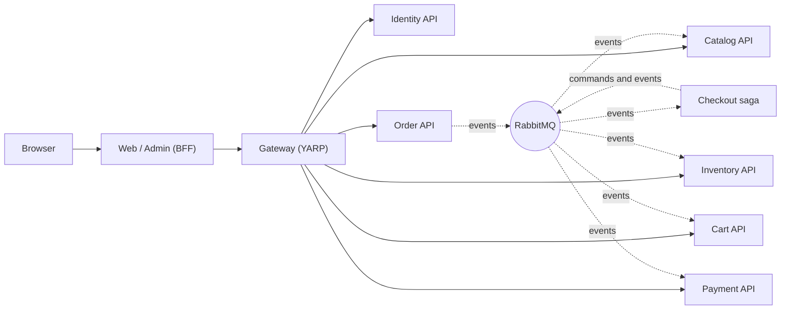

# SimpleStore Learning Guide

> 🇻🇳 Bản tiếng Việt: [docs/guide/vi/README.md](vi/README.md)

A step-by-step, code-level tour of SimpleStore for people who are **new to microservices**. The root [README](../../README.md) tells you *what* the system contains; this guide explains *how it works and why*, using the real code, diagrams and small algorithms.

Every chapter has the same shape, so you always know where to look:

1. **The problem** — why this piece exists.
2. **Big picture** — a Mermaid diagram.
3. **Walk through the code** — real files, real snippets, numbered steps.
4. **Algorithm** — the logic in plain steps.
5. **What can go wrong** — failure modes.
6. **Try it yourself** — hands-on steps against the running app.
7. **Key takeaways.**

> Diagrams use [Mermaid](https://mermaid.js.org/). GitHub and VS Code (with a Mermaid extension) render them directly.

---

## Suggested reading order

If you have **one hour**, read [Chapter 1](01-architecture-and-aspire.md), [Chapter 5](05-orders-and-outbox.md) and [Chapter 6](06-checkout-saga.md). They contain the core idea of the whole project: *services own their data, talk through events, and a saga keeps a multi-service workflow consistent.*

If you have **a weekend**, read them in order:

| # | Chapter | You will understand... |
|---|---|---|
| 1 | [Architecture and Aspire](01-architecture-and-aspire.md) | what the services are, who owns which database, how Aspire wires everything together |
| 2 | [Gateway and API versioning](02-gateway-and-api-versioning.md) | how one entry point routes and protects 6 backends, and how URLs are versioned |
| 3 | [Authentication and the BFF pattern](03-authentication-and-bff.md) | JWTs, refresh-token rotation, passkeys, and why the browser never sees a token |
| 4 | [Catalog and Cart](04-catalog-and-cart.md) | a classic CRUD service, a Redis-backed anonymous cart, cart merge and event-driven cache refresh |
| 5 | [Orders and the transactional outbox](05-orders-and-outbox.md) | why you cannot "save then publish", and how the outbox/inbox fix it |
| 6 | [The checkout saga](06-checkout-saga.md) | an orchestrated multi-service workflow with timeouts and compensation |
| 7 | [Inventory: event sourcing and CQRS](07-inventory-event-sourcing-cqrs.md) | append-only events, aggregates, projections and rebuildable read models |
| 8 | [Payment and compensation](08-payment-and-compensation.md) | the prepaid wallet that lets you make checkout succeed or fail on demand |
| 9 | [Resilience and observability](09-resilience-and-observability.md) | retries, circuit breakers, health checks, traces and metrics |
| 10 | [Contracts and versioning](10-contracts-and-versioning.md) | every integration event, and how to change one without breaking consumers |
| 11 | [Known limitations](11-known-limitations.md) | what this teaching project simplifies, and what production needs |

---

## The system in one picture



*Solid arrows are synchronous HTTP calls; dotted arrows are asynchronous messages. Checkout has no HTTP surface at all: it only reacts to messages.*

---

## Glossary

| Term | Plain meaning | Chapter |
|---|---|---|
| **Aspire** | A .NET tool that starts all services and databases locally and wires their addresses and secrets | [1](01-architecture-and-aspire.md) |
| **Service discovery** | Calling `https+http://gateway` instead of a fixed host and port; Aspire resolves the real address | [1](01-architecture-and-aspire.md) |
| **API gateway** | One front door that routes requests to the right service and checks tokens | [2](02-gateway-and-api-versioning.md) |
| **JWT** | A signed token that says who the user is and what roles they have | [3](03-authentication-and-bff.md) |
| **Refresh token rotation** | Every time a refresh token is used it is replaced by a new one | [3](03-authentication-and-bff.md) |
| **BFF (Backend for Frontend)** | A server-side app that holds tokens for the browser, so the browser only has an opaque cookie | [3](03-authentication-and-bff.md) |
| **Dual write problem** | Updating a database *and* publishing a message cannot be made atomic by just doing both | [5](05-orders-and-outbox.md) |
| **Transactional outbox** | Write the message into the same database transaction as the data; a background worker publishes it later | [5](05-orders-and-outbox.md) |
| **Inbox** | A table of already-processed message ids so a redelivered message is ignored | [5](05-orders-and-outbox.md) |
| **Saga** | A long-running workflow made of local transactions, with compensating actions instead of a global rollback | [6](06-checkout-saga.md) |
| **Orchestration** | One component (the saga) tells the others what to do next | [6](06-checkout-saga.md) |
| **Compensation** | An action that undoes the effect of an earlier step (here: release reserved stock) | [6](06-checkout-saga.md), [8](08-payment-and-compensation.md) |
| **Event sourcing** | Store the *history of events* instead of the current state; the state is computed from the events | [7](07-inventory-event-sourcing-cqrs.md) |
| **Aggregate** | A small cluster of objects that protects one business rule and is saved/loaded as a unit | [7](07-inventory-event-sourcing-cqrs.md) |
| **CQRS** | Use one model to change data (commands) and another to read it (queries) | [7](07-inventory-event-sourcing-cqrs.md) |
| **Projection** | A background process that turns events into read-optimised tables | [7](07-inventory-event-sourcing-cqrs.md) |
| **Eventual consistency** | Different parts of the system agree *after a short delay*, not instantly | [7](07-inventory-event-sourcing-cqrs.md) |
| **Idempotent** | Doing it twice has the same effect as doing it once | [4](04-catalog-and-cart.md), [5](05-orders-and-outbox.md) |
| **Circuit breaker** | Stops calling a failing dependency for a while so it can recover | [9](09-resilience-and-observability.md) |
| **Distributed trace** | One timeline that follows a request across services | [9](09-resilience-and-observability.md) |
| **Message URN** | The permanent name of an event on the wire; independent of the C# type name | [10](10-contracts-and-versioning.md) |

---

## How the chapters relate to the version history

The project was built incrementally (v0 to v12). The chapters are organised by *concept*, not by version, but this table tells you where each version lives now:

| Version | Topic | Read |
|---|---|---|
| v1–v4 | Database per service, extracted Catalog, Identity, Order, Cart | [1](01-architecture-and-aspire.md), [3](03-authentication-and-bff.md), [4](04-catalog-and-cart.md) |
| v5 | API gateway | [2](02-gateway-and-api-versioning.md) |
| v6 | RabbitMQ, MassTransit, outbox/inbox | [5](05-orders-and-outbox.md) |
| v7 | Event sourcing and CQRS (Inventory) | [7](07-inventory-event-sourcing-cqrs.md) |
| v8, v8a, v8b | Checkout saga, hardening, durable timeouts | [6](06-checkout-saga.md) |
| v9 | Resilience | [9](09-resilience-and-observability.md) |
| v10 | Observability | [9](09-resilience-and-observability.md) |
| v11 | API and event versioning | [2](02-gateway-and-api-versioning.md), [10](10-contracts-and-versioning.md) |
| v12 | Payment and compensation | [8](08-payment-and-compensation.md), [6](06-checkout-saga.md) |

The original per-version change notes remain in [`docs/`](../) (`v1-changes.md` … `v12-changes.md`) if you want the historical detail. For the saga, [`checkout-saga.md`](../checkout-saga.md) is the long design spec (its section 15 is the current v12 flow).

---

## Before you start: run the system

You can read the guide without running anything, but each chapter's *Try it yourself* section assumes the app is up.

1. Install the .NET 10 SDK, the Aspire tooling and Docker Desktop (see the root [README](../../README.md#prerequisites)).
2. Set the three AppHost secrets (the `jwt-key` must be base64 of 32 or more random bytes — generate your own; never commit it):

   ```pwsh
   dotnet user-secrets set Parameters:jwt-key       "<base64 of 32 random bytes>" --project src/SimpleStore.AppHost
   dotnet user-secrets set Parameters:jwt-issuer    "simple-store"                --project src/SimpleStore.AppHost
   dotnet user-secrets set Parameters:jwt-audience  "simple-store"                --project src/SimpleStore.AppHost
   ```

3. Start everything:

   ```pwsh
   dotnet run --project src/SimpleStore.AppHost
   ```

4. Open the **Aspire dashboard** printed in the console. From there you can open the storefront (`web`), the admin site (`admin`), pgweb (Postgres browser), RedisInsight, the RabbitMQ management UI and the traces/logs/metrics of every service.

Two demo accounts are seeded for development only: `admin@simplestore.local` (Admin) and `demo@simplestore.local` (Customer). Their passwords are in the Identity seeder ([IdentitySeeder.cs](../../src/SimpleStore.Identity.API/IdentitySeeder.cs)).

---

## Conventions used in the guide

- File links are relative to the repository, e.g. [AppHost.cs](../../src/SimpleStore.AppHost/AppHost.cs).
- Code snippets are copied from the repository and shortened with `// ...` where needed. If code and guide ever disagree, **the code wins** — please open an issue or fix the guide.
- Statements about third-party library defaults that are not visible in this repository are marked *"by default"* or *"to verify"*.
