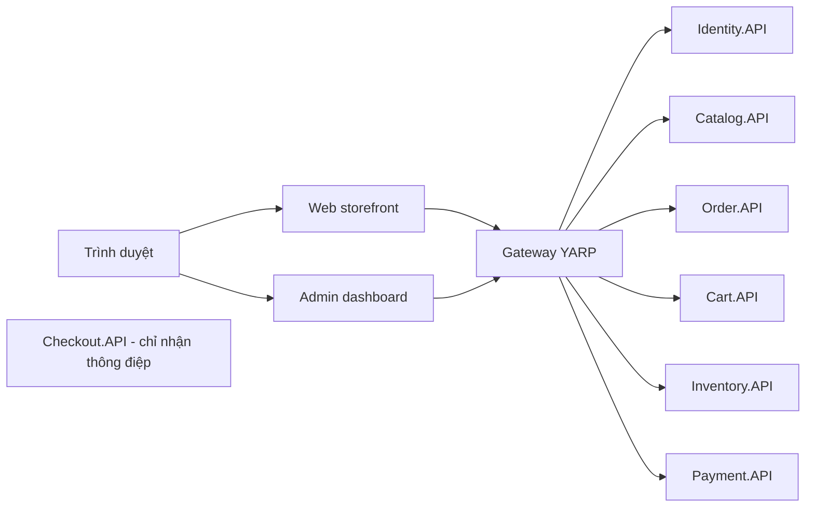
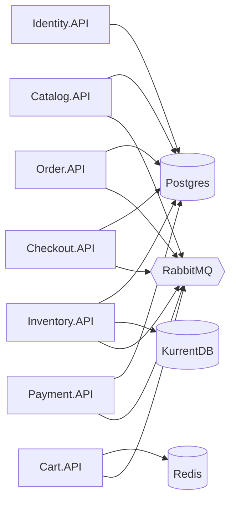

# Chương 1 - Kiến trúc và .NET Aspire

> 🇻🇳 Bản tiếng Việt. English version: [01-architecture-and-aspire.md](../01-architecture-and-aspire.md)

SimpleStore là một cửa hàng trực tuyến gồm mười service nhỏ hoạt động cùng nhau. Chương này giới thiệu các service đó, những database và broker (bộ trung chuyển thông điệp) chúng sử dụng, và cách `AppHost.cs` khởi động mọi thứ đúng thứ tự, đồng thời giúp từng service tìm thấy các service khác. Hãy đọc chương này trước: mọi chương sau đều giả định bạn đã nắm được kiến trúc tổng thể.

**Bạn sẽ học được**

- Có những service nào, mỗi service sở hữu cái gì, và service nào có HTTP API.
- AppHost của .NET Aspire làm gì, và `WithReference`, `WaitFor`, `WithEnvironment` hoạt động ra sao.
- Vì sao mỗi service có database riêng và "soft reference" (tham chiếu mềm) giữa các database là gì.
- Làm thế nào một service tìm thấy service khác bằng tên (service discovery) thay vì bằng địa chỉ IP và port.
- `AddServiceDefaults()` mang lại gì cho mọi service mà bạn không phải làm gì thêm.

---

## Vấn đề cần giải quyết

Một cửa hàng cần danh mục sản phẩm, giỏ hàng, đơn hàng, tồn kho, thanh toán và tài khoản người dùng. Trong một **monolith** (ứng dụng nguyên khối), tất cả nằm trong một chương trình và một database. Cách này dễ bắt đầu, nhưng mỗi thay đổi đều phải phát hành cả chương trình, và một tính năng chậm có thể kéo cả hệ thống chậm theo.

Tách thành **microservice** (các service nhỏ, mỗi service đảm nhận một việc) giải quyết được một phần, nhưng lại đặt ra những câu hỏi mới:

- Làm sao khởi động mười service, ba loại database và một message broker trên máy tính chỉ bằng một lệnh?
- Làm sao service Order biết địa chỉ của service Payment khi các port được chọn ngẫu nhiên?
- Làm sao ngăn các service âm thầm đọc bảng của nhau?

> **Thuật ngữ mới: microservice.** Một service nhỏ đảm nhận một năng lực nghiệp vụ (ví dụ "đơn hàng") và sở hữu dữ liệu riêng. Các service khác giao tiếp với nó qua HTTP hoặc message, chứ không truy cập trực tiếp vào database của nó.

> **Thuật ngữ mới: .NET Aspire.** Bộ công cụ .NET để mô tả một ứng dụng gồm nhiều service bằng C#. Project "AppHost" liệt kê các service và dependency (database, cache, broker). Khi chạy AppHost, Aspire khởi động chúng, cung cấp connection string và địa chỉ, rồi mở dashboard hiển thị log và trace.

## Bức tranh tổng thể

SimpleStore có hai tầng: trình duyệt giao tiếp với hai ứng dụng web, các ứng dụng này gọi đến gateway (cổng vào), rồi gateway chuyển tiếp request đến các backend HTTP. Checkout không cung cấp API HTTP; service này chỉ xử lý các thông điệp.



*Cách đọc: các mũi tên là lời gọi HTTP. Web và Admin không bao giờ gọi trực tiếp backend. `Checkout.API` không có mũi tên vì không ai gọi nó qua HTTP; người ta chỉ tiếp cận nó qua các event của RabbitMQ (chương 6).*

Hình thứ hai cho thấy mỗi backend phụ thuộc vào những gì. Mỗi mũi tên là một `WithReference` trong `AppHost.cs`.



*Cách đọc: một service trỏ đến mọi tài nguyên hạ tầng mà nó dùng. Postgres là một server chứa sáu database riêng biệt (xem bảng bên dưới). Identity là backend duy nhất không dùng RabbitMQ.*

### Các service trong một cái nhìn

| Service | Sở hữu | Giao tiếp qua HTTP | Giao tiếp qua RabbitMQ | Chương |
|---|---|---|---|---|
| `SimpleStore.Identity.API` | Postgres `identitydb` | có | không | [3](03-authentication-and-bff.md) |
| `SimpleStore.Catalog.API` | Postgres `catalogdb` | có | có | [4](04-catalog-and-cart.md) |
| `SimpleStore.Cart.API` | Redis `cart-redis` | có | có | [4](04-catalog-and-cart.md) |
| `SimpleStore.Order.API` | Postgres `orderdb` | có | có | [5](05-orders-and-outbox.md) |
| `SimpleStore.Checkout.API` | Postgres `checkoutdb` (chỉ lưu trạng thái saga) | không | có | [6](06-checkout-saga.md) |
| `SimpleStore.Inventory.API` | KurrentDB (event) và Postgres `inventorydb` (phía đọc) | có | có | [7](07-inventory-event-sourcing-cqrs.md) |
| `SimpleStore.Payment.API` | Postgres `paymentdb` | có | có | [8](08-payment-and-compensation.md) |
| `SimpleStore.Gateway` | không có gì | có (reverse proxy) | không | [2](02-gateway-and-api-versioning.md) |
| `SimpleStore.Web` | không có gì (chỉ có session cache) | có (đóng vai client) | không | [3](03-authentication-and-bff.md) |
| `SimpleStore.Admin` | không có gì (chỉ có session cache) | có (đóng vai client) | không | [3](03-authentication-and-bff.md) |

Còn bốn project nữa không phải là service:

- `SimpleStore.Contracts` - các record event đi qua RabbitMQ ([chương 10](10-contracts-and-versioning.md)).
- `SimpleStore.<Service>.API.Client` - một thư viện client nhỏ cho mỗi backend (các DTO cộng với một `HttpClient` có kiểu).
- `SimpleStore.ServiceDefaults` - mã khởi động dùng chung cho mọi service (xem "Đi qua mã nguồn", bước 7).
- `SimpleStore.AppHost` - bộ điều phối (orchestrator) Aspire được mô tả ngay sau đây.

---

## Đi qua mã nguồn

### Bước 1 - AppHost khai báo hạ tầng

[AppHost.cs](../../../src/SimpleStore.AppHost/AppHost.cs) là điểm vào của cả hệ thống. Nó không có `Program.cs`; file này dùng top-level statements (câu lệnh cấp cao nhất). Nó bắt đầu bằng việc khai báo một server Postgres với sáu database:

```csharp
var postgres = builder.AddPostgres("postgres")
    .WithPgWeb();

var catalogDb = postgres.AddDatabase("catalogdb");
var orderDb = postgres.AddDatabase("orderdb");
var identityDb = postgres.AddDatabase("identitydb");
var inventoryDb = postgres.AddDatabase("inventorydb");
var checkoutDb = postgres.AddDatabase("checkoutdb");
var paymentDb = postgres.AddDatabase("paymentdb");
```

`WithPgWeb()` thêm một giao diện web nhỏ (pgweb) để bạn duyệt các bảng. Ba tài nguyên hạ tầng còn lại theo cùng một mẫu:

```csharp
var cartRedis = builder.AddRedis("cart-redis")
    .WithRedisInsight();
```

```csharp
var rabbitmq = builder.AddRabbitMQ("rabbitmq")
    .WithManagementPlugin();
```

```csharp
var kurrentdb = builder.AddKurrentDB("kurrentdb")
    .WithDataVolume("kurrentdb-data");
```

> **Thuật ngữ mới: resource (tài nguyên).** Trong Aspire, mọi thứ mà AppHost quản lý: một container (Postgres, Redis, RabbitMQ, KurrentDB), một database bên trong container, hoặc một project .NET. Mỗi resource có một cái tên, như `"orderdb"`, và các resource khác dùng chính cái tên đó để nhắc đến nó.

`WithDataVolume("kurrentdb-data")` giữ các file của event store trong một Docker volume có tên, nhờ vậy event không mất khi khởi động lại. Các resource Postgres, Redis và RabbitMQ không có volume trong file này, nên dữ liệu của chúng sẽ mất khi container bị tạo lại.

### Bước 2 - Cấu hình JWT dùng chung

Các service phát hành hoặc kiểm tra token đăng nhập phải thống nhất với nhau về khóa ký, issuer (bên phát hành) và audience (đối tượng nhận). AppHost khai báo chúng như các **parameter** (tham số) và trao cho từng project:

```csharp
var jwtKey = builder.AddParameter("jwt-key", secret: true);
var jwtIssuer = builder.AddParameter("jwt-issuer");
var jwtAudience = builder.AddParameter("jwt-audience");

// Identity runs as its own microservice and is the only resource that talks to identitydb.
var identity = builder.AddProject<Projects.SimpleStore_Identity_API>("identity")
    .WithReference(identityDb)
    .WithEnvironment("Jwt__Key", jwtKey)
    .WithEnvironment("Jwt__Issuer", jwtIssuer)
    .WithEnvironment("Jwt__Audience", jwtAudience)
    .WaitFor(identityDb);
```

Ba điều xảy ra ở đây:

- `AddParameter(..., secret: true)` đánh dấu khóa là dữ liệu nhạy cảm. Bạn cung cấp giá trị một lần bằng `dotnet user-secrets` trên project AppHost (các lệnh cụ thể nằm trong [README.md](../../../README.md#getting-started) của repository, mục "Getting Started"). Khóa phải là giá trị mã hóa base64 của ít nhất 32 byte.
- `WithEnvironment("Jwt__Key", ...)` đặt một biến môi trường. Trong cấu hình .NET, hai dấu gạch dưới nghĩa là một dấu hai chấm, nên `Jwt__Key` trở thành setting `Jwt:Key`. Mỗi service đọc nó bằng `builder.Configuration["Jwt:Key"]`.
- `WithReference(identityDb)` chèn connection string của `identitydb` vào service. Service sau đó xin nó bằng đúng cái tên ấy: `builder.AddNpgsqlDbContext<IdentityDbContext>("identitydb", ...)`. Chuỗi `"identitydb"` chính là "hợp đồng" giữa AppHost và service.

> **Thuật ngữ mới: JWT (JSON Web Token).** Một đoạn văn bản được ký, cho biết người gọi là ai và có những vai trò (role) nào. Bất kỳ service nào biết khóa ký đều có thể xác minh nó mà không cần gọi service Identity. Chương 3 trình bày chi tiết.

### Bước 3 - Mỗi project liệt kê những gì nó cần

Cùng một hình dạng lặp lại cho từng service. Bảng này được đọc thẳng từ `AppHost.cs`:

| Project (tên resource) | `WithReference` / `WaitFor` | `Jwt__*` |
|---|---|---|
| `identity` | `identitydb` | có |
| `catalog` | `catalogdb`, `rabbitmq` | có |
| `order` | `orderdb`, `rabbitmq` | có |
| `cart` | `cart-redis`, `rabbitmq` | có |
| `inventory` | `inventorydb`, `kurrentdb`, `rabbitmq` | có |
| `checkout` | `checkoutdb`, `rabbitmq` | **không** |
| `payment` | `paymentdb`, `rabbitmq` | có |
| `gateway` | `identity`, `catalog`, `order`, `cart`, `inventory`, `payment` (không có `checkout`) | có |
| `web` | `gateway` | có |
| `admin` | `gateway` | có |

Hai phương thức làm hai việc khác nhau và rất dễ nhầm:

- `WithReference(x)` nói với Aspire "hãy chèn địa chỉ hoặc connection string của `x` vào project này".
- `WaitFor(x)` nói với Aspire "đừng khởi động project này cho đến khi `x` ở trạng thái khỏe (healthy)".

### Bước 4 - Checkout là ngoại lệ

```csharp
var checkout = builder.AddProject<Projects.SimpleStore_Checkout_API>("checkout")
    .WithReference(checkoutDb)
    .WithReference(rabbitmq)
    .WaitFor(checkoutDb)
    .WaitFor(rabbitmq);
```

Không có dòng `Jwt__*` nào vì service checkout không bao giờ nhận một yêu cầu HTTP và không bao giờ xác thực token. Nó tiêu thụ các thông điệp RabbitMQ và điều khiển saga (chương 6). Gateway cũng không tham chiếu đến nó, vì cùng lý do.

### Bước 5 - Gateway và hai giao diện người dùng

```csharp
var gateway = builder.AddProject<Projects.SimpleStore_Gateway>("gateway")
    .WithReference(identity)
    .WithReference(catalog)
    .WithReference(order)
    .WithReference(cart)
    .WithReference(inventory)
    .WithReference(payment)
```

Sau đó gateway thêm ba biến `Jwt__*` và một `WaitFor` cho mỗi backend, nên nó khởi động sau cùng trong số các backend. `web` và `admin` chỉ tham chiếu đến `gateway`. Đây là chủ ý: các giao diện chỉ biết một địa chỉ, và toàn bộ việc định tuyến cùng phân quyền ở rìa hệ thống nằm tại một chỗ ([chương 2](02-gateway-and-api-versioning.md)).

### Bước 6 - Một cái tên biến thành địa chỉ như thế nào

Hãy xem cách Web và Admin tạo HTTP client cho service Order, trong [OrderApiClientExtensions.cs](../../../src/SimpleStore.Order.API.Client/OrderApiClientExtensions.cs):

```csharp
    public static IHttpClientBuilder AddOrderApiClient(
        this IHostApplicationBuilder builder,
        string serviceName = "gateway")
    {
        return builder.Services.AddHttpClient<IOrderApiClient, OrderApiClient>(client =>
        {
            client.BaseAddress = new Uri($"https+http://{serviceName}");
        });
    }
```

`https+http://gateway` không phải một URL thật. Tên host `gateway` là tên resource trong `AppHost.cs`. Scheme `https+http` nghĩa là "ưu tiên HTTPS, nếu không được thì dùng HTTP". Khi chạy, service discovery của Aspire thay phần giữ chỗ này bằng một địa chỉ thật.

> **Thuật ngữ mới: service discovery (khám phá service).** Cơ chế này phân giải tên service ("gateway") thành địa chỉ và port hiện tại. Nhờ đó, code không cần chứa URL cố định; Aspire có thể gán port động.

### Bước 7 - `AddServiceDefaults()` bổ sung gì cho mỗi service

Mọi service đều bắt đầu bằng `builder.AddServiceDefaults()`, được định nghĩa trong [Extensions.cs](../../../src/SimpleStore.ServiceDefaults/Extensions.cs):

```csharp
        builder.ConfigureOpenTelemetry();

        builder.AddDefaultHealthChecks();

        builder.Services.AddServiceDiscovery();

        builder.Services.ConfigureHttpClientDefaults(http =>
        {
            // Turn on resilience by default
            http.AddStandardResilienceHandler();

            // Turn on service discovery by default
            http.AddServiceDiscovery();
        });
```

(Đoạn trích là phần thân của extension method `AddServiceDefaults<TBuilder>`.)

Nói đơn giản:

1. **OpenTelemetry** - trace, metric và log, gửi đến Aspire dashboard.
2. **Health checks (kiểm tra sức khỏe)** - các endpoint `/health`, `/alive` và `/ready`.
3. **Service discovery** - làm cho `https+http://order` có thể được phân giải.
4. **Standard resilience handler (bộ xử lý chịu lỗi chuẩn)** - mọi `HttpClient` gọi ra ngoài mặc định đều có retry (thử lại), timeout (giới hạn thời gian chờ) và circuit breaker (cầu dao ngắt mạch).

Chương 9 giải thích sâu các mục 1, 2 và 4.

### Bước 8 - Mỗi service một database, và soft reference

Vì mỗi service sở hữu database của mình, SQL không thể join xuyên qua các database. Service Order lưu id người mua và các id sản phẩm như những giá trị thông thường, trong [Order.cs](../../../src/SimpleStore.Order.API/Models/Order.cs) và [OrderItem.cs](../../../src/SimpleStore.Order.API/Models/OrderItem.cs):

```csharp
    [Required, MaxLength(450)]
    public string UserId { get; set; } = string.Empty;
```

```csharp
    public int ProductId { get; set; }
    public string ProductName { get; set; } = string.Empty;
```

> **Thuật ngữ mới: soft reference (tham chiếu mềm).** Một cột chứa id của một dòng trong database của người khác, không có ràng buộc khóa ngoại (foreign key). `Order.UserId` trỏ đến một người dùng trong `identitydb`; `OrderItem.ProductId` trỏ đến một sản phẩm trong `catalogdb`. Database không thể kiểm tra dòng đó có tồn tại hay không, và không có gì ngăn nó bị xóa.

Hãy để ý `ProductName` được sao chép vào order item lúc đơn hàng được tạo. Đó là **denormalization** (phi chuẩn hóa): service Order giữ một bản sao riêng để không bao giờ phải hỏi Catalog tên sản phẩm khi hiển thị một đơn hàng.

---

## Thuật toán

**Thuật toán 1 - `dotnet run --project src/SimpleStore.AppHost` dựng hệ thống lên như thế nào**

1. Aspire đọc `AppHost.cs` và xây một đồ thị các resource cùng các phụ thuộc.
2. Nó khởi động các container: Postgres (rồi tạo sáu database), Redis, RabbitMQ, KurrentDB.
3. Với mỗi project, nó chờ cho đến khi mọi đích của `WaitFor` báo là khỏe.
4. Nó khởi động project với cấu hình được chèn vào: connection string cho mỗi `WithReference`, cộng với các biến `Jwt__*` từ `WithEnvironment`.
5. Mỗi project chạy phần khởi động riêng của nó: áp dụng database migration (lớp bọc retry được mô tả ở chương 9), rồi lắng nghe yêu cầu hoặc thông điệp.
6. Vì `gateway` chờ cả sáu backend HTTP và `web`/`admin` chờ gateway, nên thứ tự là: hạ tầng, backend, gateway, giao diện người dùng.

**Thuật toán 2 - phân giải `https+http://order`**

1. Một bên gọi (ví dụ gateway) có `https+http://order` làm địa chỉ gốc.
2. Handler service discovery lấy host `order` và tra trong cấu hình mà Aspire đã chèn vào nhờ `WithReference(order)`.
3. Nó chọn một endpoint, thử `https` trước rồi đến `http`.
4. Nó viết lại URL của yêu cầu và gửi đi.

Bước 2 là hành vi của Aspire, không phải mã trong repository này. Bạn có thể xem các giá trị được chèn vào ở trang chi tiết của gateway trong dashboard.

## Điều gì có thể sai

- **Thiếu tham số JWT.** Nếu `jwt-key` không có giá trị, Aspire không thể phân giải parameter cho các project cần nó (dashboard có thể hỏi bạn nhập). Hãy đặt ba user-secret trước lần chạy đầu tiên.
- **Khóa không phải base64 hợp lệ.** Các service gọi `Convert.FromBase64String` trên `Jwt:Key`, nên một khóa dạng văn bản thuần sẽ lỗi lúc khởi động hoặc ở lần kiểm tra token đầu tiên.
- **Gõ sai tên.** `GetConnectionString("catalogdb")` không trả về gì nếu resource trong AppHost được đặt tên khác. Tên resource là sợi dây nối duy nhất.
- **Chạy một project riêng lẻ.** `dotnet run --project src/SimpleStore.Order.API` chỉ chạy được nếu bạn tự cung cấp connection string và `Jwt__*`. Bình thường hãy để AppHost lo việc đó.
- **Soft reference có thể trở thành tham chiếu mồ côi.** Xóa một sản phẩm trong Catalog không ảnh hưởng đến các order item cũ. Đây là cái giá của việc mỗi service sở hữu database riêng.
- **Mất dữ liệu.** Ở đây chỉ KurrentDB có volume được đặt tên. Tạo lại container Postgres sẽ xóa sạch cả sáu database.

## Tự thực hành

1. Đặt ba secret của AppHost một lần. Dùng placeholder cho các giá trị của riêng bạn:
   ```pwsh
   dotnet user-secrets set Parameters:jwt-key "<base64 of 32 random bytes>" --project src/SimpleStore.AppHost
   dotnet user-secrets set Parameters:jwt-issuer "simple-store" --project src/SimpleStore.AppHost
   dotnet user-secrets set Parameters:jwt-audience "simple-store" --project src/SimpleStore.AppHost
   ```
   Để tạo một khóa trong PowerShell: `[Convert]::ToBase64String([System.Security.Cryptography.RandomNumberGenerator]::GetBytes(32))`.
2. Khởi động mọi thứ: `dotnet run --project src/SimpleStore.AppHost`. Mở URL của dashboard được in ra trong console.
3. Ở trang **Resources**, hãy xem các trạng thái thay đổi. Các container khởi động trước, `gateway` khởi động sau cùng trong số các backend. Chuyển sang chế độ xem **Graph** để thấy các mũi tên phụ thuộc như trong sơ đồ thứ hai.
4. Bấm vào `gateway`, mở phần chi tiết và xem mục environment/configuration. Bạn sẽ thấy các mục được chèn vào cho sáu service mà nó tham chiếu, và các giá trị `Jwt__*` (khóa được che đi).
5. Bấm vào `checkout` và xác nhận rằng không có mục `Jwt__*` nào và không có HTTP endpoint nào.
6. Mở pgweb (liên kết nằm trên resource `postgres`). Chọn `orderdb` và chạy `select "Id", "UserId" from "Orders" limit 5;`. Sau đó chọn `identitydb`. Bảng `AspNetUsers` chỉ có ở đó; database của order không có khóa ngoại nào đến nó.
7. Mở liên kết quản lý RabbitMQ và xem tab **Queues**. Các queue chỉ xuất hiện sau khi các service kết nối; chúng sẽ được giới thiệu trong những chương sau.

## Những điều cần nhớ

- Một `AppHost.cs` mô tả cả hệ thống: hạ tầng, các service và quan hệ phụ thuộc giữa chúng.
- `WithReference` chèn địa chỉ và connection string; `WaitFor` điều khiển thứ tự khởi động; `WithEnvironment` đặt các setting đơn giản như `Jwt__Key`.
- Mỗi service sở hữu đúng một bộ dữ liệu. Các liên kết giữa các database là soft reference và được giải quyết trong mã ứng dụng.
- Các tên như `"orderdb"` và `https+http://gateway` là chất keo kết dính; chúng đến từ `AppHost.cs`.
- `AddServiceDefaults()` bổ sung telemetry, health check, service discovery và khả năng chịu lỗi HTTP cho mọi service.
- Checkout cố ý không có HTTP và không có JWT; nó hoàn toàn được điều khiển bằng thông điệp.

## Chương tiếp theo

[Chương 2 - Gateway và phiên bản hóa API](02-gateway-and-api-versioning.md) cho thấy gateway duy nhất quyết định backend nào nhận một yêu cầu và ai được phép đi qua.
