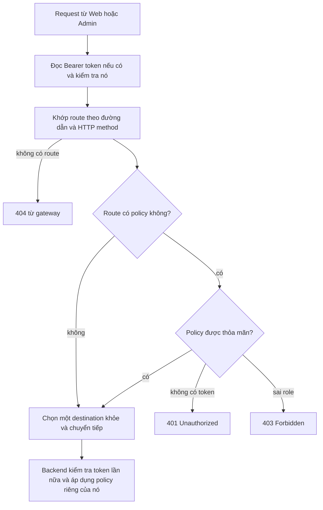

# Chương 2 - Gateway và versioning cho API
> 🇻🇳 Bản tiếng Việt. English version: [02-gateway-and-api-versioning.md](../02-gateway-and-api-versioning.md)

Gateway là "cửa trước" duy nhất của mọi backend HTTP. Nó kiểm tra token đăng nhập của người gọi, quyết định backend nào sẽ nhận từng request, và ngừng gửi lưu lượng tới backend không sẵn sàng. Chương này xem mã nguồn và bảng route của gateway, sau đó giải thích cách mỗi backend đưa số phiên bản (version) vào URL để API có thể thay đổi mà không làm hỏng các client hiện có.

**Bạn sẽ học được**

- Vì sao cần gateway và YARP (thư viện reverse proxy) làm gì.
- Bảng route trong `appsettings.json` chia mỗi service thành các route anonymous (ẩn danh), signed-in (đã đăng nhập) và chỉ dành cho admin như thế nào.
- YARP chọn ra đúng một route như thế nào khi có nhiều route cùng khớp.
- Active health check (kiểm tra sức khỏe chủ động) giúp gateway không gửi lưu lượng tới backend đã sập ra sao.
- Versioning theo đoạn URL (`/api/v1/...`) hoạt động thế nào và vì sao gateway chuyển tiếp đường dẫn nguyên vẹn.
- Vì sao các backend vẫn tự kiểm tra quyền ("defense in depth" - phòng thủ nhiều lớp).

---

## Vấn đề cần giải quyết

Nếu không có gateway, Web và Admin sẽ phải biết địa chỉ của cả sáu backend, đồng thời phải mở từng backend để bên ngoài truy cập. Mỗi backend cũng phải tự bảo vệ mình trước lưu lượng ẩn danh.

Gateway giải quyết việc này bằng cách trở thành điểm vào công khai duy nhất:

- Một địa chỉ duy nhất cho client.
- Một nơi duy nhất để từ chối những người gọi không có token hợp lệ trước khi họ chạm tới backend.
- Một nơi duy nhất để mô tả URL nào thuộc về service nào.

Vấn đề thứ hai là **sự thay đổi**. Sớm hay muộn, một API sẽ phải đổi hình dạng (một trường bị đổi tên, xuất hiện một tham số bắt buộc mới). Nếu bạn sửa ý nghĩa của URL ngay tại chỗ, mọi client cũ sẽ hỏng. Versioning giữ `/api/v1/...` đóng băng trong khi `/api/v2/...` có thể khác đi.

> **Thuật ngữ mới: reverse proxy.** Một server nhận request thay cho các server khác rồi chuyển tiếp chúng. Người gọi nói chuyện với proxy và không bao giờ thấy địa chỉ backend thật. **YARP** ("Yet Another Reverse Proxy") là thư viện reverse proxy của Microsoft cho ASP.NET Core; ở đây nó được cấu hình hoàn toàn bằng JSON.

> **Thuật ngữ mới: API gateway.** Một reverse proxy còn áp dụng thêm các quy tắc dùng chung như xác thực (authentication), phân quyền (authorization) và định tuyến dựa trên tình trạng sức khỏe.

## Bức tranh tổng thể

Mọi request đều đi qua cùng một pipeline bên trong gateway. Xác thực chạy trước, sau đó route được khớp, rồi policy của route được áp dụng, và chỉ khi đó request mới được chuyển tiếp.



*Cách đọc: đi theo các mũi tên từ trên xuống. Các ô kết quả 404, 401 và 403 không bao giờ tới backend. Ô cuối cho thấy việc qua được gateway chưa phải là hết các lần kiểm tra.*

Ba loại route trong bảng bên dưới tương ứng với ba mức truy cập:

| Mức truy cập | Cài đặt YARP | Ai được đi qua |
|---|---|---|
| Anonymous (ẩn danh) | không có `AuthorizationPolicy` | tất cả mọi người, kể cả không có token |
| Signed in (đã đăng nhập) | `"AuthorizationPolicy": "AuthenticatedUser"` | bất kỳ token hợp lệ nào |
| Admin | `"AuthorizationPolicy": "Admin"` | token hợp lệ có claim `role` là `Admin` |

---

## Đi qua mã nguồn

### Bước 1 - Chương trình gateway rất ngắn

Toàn bộ [Program.cs](../../../src/SimpleStore.Gateway/Program.cs) chỉ khoảng 50 dòng. Nó làm bốn việc: thêm service defaults, kiểm tra JWT, định nghĩa hai policy, và khởi động reverse proxy.

```csharp
builder.Services
    .AddAuthentication(JwtBearerDefaults.AuthenticationScheme)
    .AddJwtBearer(options =>
    {
        options.MapInboundClaims = false;
        options.TokenValidationParameters = new TokenValidationParameters
        {
            ValidateIssuer = true,
            ValidateAudience = true,
            ValidateLifetime = true,
            ValidateIssuerSigningKey = true,
            ValidIssuer = jwtIssuer,
            ValidAudience = jwtAudience,
```

Phần còn lại của khối đó tạo khóa ký (signing key) từ `Jwt:Key` dùng chung và đặt thêm ba tùy chọn:

- `ClockSkew = TimeSpan.FromSeconds(30)` - một token vẫn được chấp nhận trong 30 giây sau khi hết hạn, để chịu được chênh lệch đồng hồ nhỏ giữa các máy.
- `NameClaimType = "name"` và `RoleClaimType = "role"` - cho ASP.NET biết claim nào chứa tên người dùng và các role.
- `MapInboundClaims = false` - giữ nguyên tên claim thô trong token (`sub`, `role`) thay vì đổi chúng thành các URI dài kiểu Microsoft.

> **Thuật ngữ mới: claim.** Một thông tin nằm bên trong token, ví dụ `sub` (id người dùng) hoặc `role` (`Admin` hoặc `Customer`). Gateway đọc claim `role` để áp dụng policy `Admin`.

### Bước 2 - Hai policy có tên

```csharp
builder.Services.AddAuthorization(options =>
{
    options.AddPolicy("AuthenticatedUser", p => p.RequireAuthenticatedUser());
    options.AddPolicy("Admin", p => p.RequireAuthenticatedUser().RequireRole("Admin"));
});
```

Policy chỉ là một cái tên cộng với các yêu cầu. Bảng route tham chiếu tới các tên này dưới dạng chuỗi. Không có fallback policy (policy mặc định), nên một route không nêu tên policy nào thì mở cho tất cả.

### Bước 3 - Reverse proxy từ cấu hình

```csharp
builder.Services
    .AddReverseProxy()
    .LoadFromConfig(builder.Configuration.GetSection("ReverseProxy"))
    .AddServiceDiscoveryDestinationResolver();
```

- `LoadFromConfig` đọc các route và cluster từ mục `ReverseProxy` của [appsettings.json](../../../src/SimpleStore.Gateway/appsettings.json).
- `AddServiceDiscoveryDestinationResolver` cho phép một địa chỉ destination như `https+http://catalog` được phân giải bằng service discovery của Aspire (chương 1, bước 6). Nếu thiếu nó, YARP sẽ cố dùng `catalog` như một tên host theo nghĩa đen.

Thứ tự middleware ở phía dưới là: `app.UseAuthentication(); app.UseAuthorization(); app.MapReverseProxy();`. Authentication điền thông tin người dùng, authorization kiểm tra policy của route, và proxy chuyển tiếp request.

### Bước 4 - Bảng route

Một **route** nói rằng "các request trông như thế này sẽ đi tới cluster kia, dưới policy này". Một **cluster** là một nhóm có tên gồm các địa chỉ destination. Mọi route bên dưới nằm trong `appsettings.json` ở mục `ReverseProxy:Routes`. Mọi đường dẫn đều bắt đầu bằng `/api/v1/`.

| Route | Đường dẫn sau `/api/v1/` | Methods | Policy | Cluster |
|---|---|---|---|---|
| `identity-anon-login` | `identity/login` | POST | không có | identity-cluster |
| `identity-anon-register` | `identity/register` | POST | không có | identity-cluster |
| `identity-anon-refresh` | `identity/refresh` | POST | không có | identity-cluster |
| `identity-anon-logout` | `identity/logout` | POST | không có | identity-cluster |
| `identity-anon-pk-aopts` | `identity/passkey/assertion-options` | POST | không có | identity-cluster |
| `identity-anon-pk-assert` | `identity/passkey/assertion` | POST | không có | identity-cluster |
| `identity-admin-users` | `identity/users/{**catch-all}` | bất kỳ | `Admin` | identity-cluster |
| `identity-auth-rest` | `identity/{**catch-all}` | bất kỳ | `AuthenticatedUser` | identity-cluster |
| `catalog-read` | `catalog/{**catch-all}` | GET, HEAD | không có | catalog-cluster |
| `catalog-write` | `catalog/{**catch-all}` | POST, PUT, DELETE, PATCH | `Admin` | catalog-cluster |
| `order-admin` | `order/admin/{**catch-all}` | bất kỳ | `Admin` | order-cluster |
| `order-user` | `order/{**catch-all}` | bất kỳ | `AuthenticatedUser` | order-cluster |
| `cart-merge` | `cart/merge` | POST | `AuthenticatedUser` | cart-cluster |
| `cart-any` | `cart/{**catch-all}` | bất kỳ | không có | cart-cluster |
| `inventory-admin` | `inventory/{**catch-all}` | bất kỳ | `Admin` | inventory-cluster |
| `payment-admin` | `payment/admin/{**catch-all}` | bất kỳ | `Admin` | payment-cluster |
| `payment-user` | `payment/{**catch-all}` | bất kỳ | `AuthenticatedUser` | payment-cluster |

Không có route nào cho `checkout` vì service đó không có giao diện HTTP. Một request tới `/api/v1/checkout/...` không khớp với gì cả và nhận 404 từ gateway.

> **Thuật ngữ mới: catch-all.** Trong một route template, `{**catch-all}` khớp với phần còn lại của đường dẫn, bất kể nó có bao nhiêu đoạn.

Hãy đọc bảng như một mẫu lặp lại cho từng service: các route hẹp, cụ thể mang quy tắc đặc biệt, còn một route catch-all rộng cho mỗi service mang quy tắc mặc định.

### Bước 5 - Route cụ thể thắng route catch-all

Hãy nhìn hai route của cart:

```json
"cart-merge": {
  "ClusterId": "cart-cluster",
  "AuthorizationPolicy": "AuthenticatedUser",
  "Match": { "Path": "/api/v1/cart/merge", "Methods": [ "POST" ] }
},
"cart-any": {
  "ClusterId": "cart-cluster",
  "Match": { "Path": "/api/v1/cart/{**catch-all}" }
},
```

Một request `POST /api/v1/cart/merge` khớp với cả hai. YARP được xây trên endpoint routing của ASP.NET Core, vốn ưu tiên kết quả khớp cụ thể hơn: đoạn đường dẫn viết cố định (literal) thắng tham số catch-all, và một route có nêu HTTP method thắng route không nêu. Vì vậy `cart-merge` thắng và policy của nó được áp dụng. Cùng quy tắc này khiến `order-admin` thắng `order-user`, `payment-admin` thắng `payment-user`, còn `identity-admin-users` và sáu route `identity-anon-*` thắng `identity-auth-rest`.

Hai route catalog không bao giờ cạnh tranh nhau vì danh sách `Methods` của chúng không trùng nhau: đọc thì ẩn danh, ghi thì cần `Admin`.

Thứ tự ưu tiên này là cách YARP và routing của ASP.NET Core hoạt động; repository không tự cài đặt nó. Nếu bạn thêm một route, hãy kiểm thử nó (xem "Tự thực hành").

### Bước 6 - Cluster và active health check

Mỗi backend có một cluster với một destination. Cluster identity là ví dụ đầy đủ nhất:

```json
"identity-cluster": {
  "HealthCheck": {
    "Active": {
      "Enabled": true,
      "Interval": "00:00:10",
      "Timeout": "00:00:03",
      "Policy": "ConsecutiveFailures",
      "Path": "/health"
    }
  },
  "Metadata": { "ConsecutiveFailuresHealthPolicy.Threshold": "1" },
  "Destinations": {
    "primary": { "Address": "https+http://identity" }
  }
},
```

- Cứ mỗi 10 giây, gateway gửi `GET /health` tới backend và chờ tối đa 3 giây.
- `ConsecutiveFailures` là một policy của YARP: một destination bị đánh dấu là không khỏe (unhealthy) sau N lần thăm dò thất bại liên tiếp. N được đọc từ metadata của cluster.
- Cluster identity đặt `Threshold` là `1`, nên chỉ một lần thăm dò thất bại là đủ. Năm cluster còn lại không đặt ngưỡng riêng mà dùng mặc định của YARP, vốn chịu được nhiều lần thất bại hơn. Identity nghiêm ngặt hơn vì mọi request của người dùng đã đăng nhập đều phụ thuộc vào nó.
- `/health` là endpoint được thêm bởi `MapDefaultEndpoints()` trong mọi service (chương 9 giải thích về nó).

### Bước 7 - URL có phiên bản trong các backend

Mọi backend gọi hai hàm hỗ trợ từ [ApiVersioningExtensions.cs](../../../src/SimpleStore.ServiceDefaults/ApiVersioningExtensions.cs). Hàm thứ nhất đăng ký các quy tắc versioning trong `Program.cs`:

```csharp
            .AddApiVersioning(options =>
            {
                options.DefaultApiVersion = new ApiVersion(1, 0);
                options.AssumeDefaultVersionWhenUnspecified = true;
                // Emits api-supported-versions / api-deprecated-versions headers so clients
                // can discover what the server knows about without reading OpenAPI.
                options.ReportApiVersions = true;
                // URL-segment reader: /api/v{N}/...
                options.ApiVersionReader = new UrlSegmentApiVersionReader();
            })
```

- Phiên bản được lấy từ chính URL (`UrlSegmentApiVersionReader`), không bao giờ từ header hay query string.
- `ReportApiVersions = true` thêm header `api-supported-versions` vào các response, để client thấy được những phiên bản nào đang tồn tại.

Hàm thứ hai dựng route group mà mọi file endpoint đều dùng:

```csharp
        var versionSet = app.NewApiVersionSet()
            .HasApiVersion(new ApiVersion(1, 0))
            .ReportApiVersions()
            .Build();

        return app
            .MapGroup($"/api/v{{version:apiVersion}}/{serviceSegment}")
            .WithApiVersionSet(versionSet)
            .MapToApiVersion(new ApiVersion(1, 0));
```

Trong `Endpoints/CatalogEndpoints.cs` đây chỉ là một dòng, `var group = app.MapApiV1Group("catalog");`. Kết quả là Catalog phục vụ `/api/v1/catalog/...`. Order, Cart, Identity, Inventory và Payment gọi cùng hàm này với đoạn đường dẫn của riêng chúng. Mỗi backend cũng đăng ký `builder.Services.AddOpenApi("v1")`, tạo ra một tài liệu OpenAPI cho mỗi phiên bản tại `/openapi/v1.json` (chỉ được map trong môi trường Development). Bản thân gateway không xuất bản tài liệu OpenAPI.

Từ v11, gateway không viết lại (rewrite) đường dẫn. URL mà client phía trình duyệt dùng, URL mà gateway khớp, và URL mà backend phục vụ là cùng một chuỗi. Điều đó loại bỏ cả một nhóm lỗi kiểu "chạy được trên backend, nhưng 404 trên gateway". Chính sách để thêm một `v2` (route group mới, route gateway mới, deprecation bằng header `Sunset`) được viết trong [docs/versioning.md](../../versioning.md).

### Bước 8 - Defense in depth: backend kiểm tra lại

Việc qua được gateway không làm một request trở nên đáng tin. Mỗi backend kiểm tra JWT bằng cùng các cài đặt dùng chung và áp dụng policy riêng của nó. Inventory đánh dấu toàn bộ route group của mình là chỉ dành cho admin trong [InventoryEndpoints.cs](../../../src/SimpleStore.Inventory.API/Endpoints/InventoryEndpoints.cs):

```csharp
        var group = app.MapApiV1Group("inventory").RequireAuthorization("Admin");
```

và Payment bảo vệ nhóm con admin của nó trong [PaymentEndpoints.cs](../../../src/SimpleStore.Payment.API/Endpoints/PaymentEndpoints.cs):

```csharp
        var admin = group.MapGroup("/admin/accounts").RequireAuthorization("Admin");
```

Order làm tương tự cho `/admin/orders`. Điều này quan trọng vì một ngày nào đó backend có thể bị gọi bởi thứ khác ngoài gateway (một service khác, một route cấu hình sai, một công cụ trong dashboard). Gateway là ổ khóa đầu tiên, không phải ổ khóa duy nhất.

---

## Thuật toán

**Thuật toán 1 - xử lý một request trong gateway**

1. `UseAuthentication` tìm `Authorization: Bearer <token>`. Nếu có, nó kiểm tra chữ ký, issuer, audience và thời hạn (độ lệch 30 giây). Token xấu chưa làm request thất bại ngay; người dùng chỉ đơn giản bị coi là ẩn danh.
2. Endpoint routing chọn route cụ thể nhất khớp với đường dẫn và method. Không khớp nghĩa là 404.
3. `UseAuthorization` đọc `AuthorizationPolicy` của route.
   - Không có policy: đi tiếp.
   - `AuthenticatedUser`: yêu cầu một người dùng đã xác thực, nếu không thì 401.
   - `Admin`: yêu cầu một người dùng đã xác thực có `role` = `Admin`, nếu không thì 401 (chưa đăng nhập) hoặc 403 (đã đăng nhập, sai role).
4. YARP hỏi cluster của nó các destination đang khả dụng (những destination không bị đánh dấu unhealthy), phân giải địa chỉ qua service discovery, và chuyển tiếp request với cùng đường dẫn.
5. Backend lặp lại việc kiểm tra token và áp dụng policy riêng của nó.

**Thuật toán 2 - active health check với `ConsecutiveFailures`**

```text
every 10 seconds, for each destination:
    send GET /health with a 3 second timeout
    if the response is a success (2xx):
        failures = 0
        mark destination healthy
    else:
        failures = failures + 1
        if failures >= Threshold:      # 1 for identity, YARP default for the others
            mark destination unhealthy
```

Một destination không khỏe sẽ bị bỏ qua khi YARP chọn nơi gửi request.

## Điều gì có thể sai

- **Quên tạo route gateway cho một endpoint mới.** Backend chạy tốt khi gọi trực tiếp nhưng UI nhận 404. Mỗi nhóm URL mới cần một route (và một `v2` cần route riêng của nó).
- **Sai thứ tự ưu tiên.** Một route rộng không có `Methods` đặt cạnh một route hẹp hơn chỉ ổn vì YARP ưu tiên route cụ thể hơn. Nếu bạn bỏ `Methods` khỏi `cart-merge`, bạn mất tính cụ thể dựa trên method; hãy luôn kiểm thử mỗi cặp route mới.
- **Mặc định là ẩn danh.** Một route không có `AuthorizationPolicy` là mở vì không có fallback policy. Thiếu một dòng policy là lỗ hổng bảo mật, không phải một lỗi báo ra.
- **Token xấu trên route ẩn danh.** Request vẫn tiếp tục như ẩn danh. Với `cart-any`, điều này nghĩa là một người dùng có token hết hạn lặng lẽ trông như một người mua hàng ẩn danh.
- **Độ trễ của health probe.** Một destination được thăm dò mỗi 10 giây, nên trong tối đa khoảng thời gian đó sau khi sập, gateway vẫn chuyển tiếp lưu lượng.
- **Client thấy gì khi mọi thứ đều unhealthy.** Ghi chú v10 của repository nói client nhận một 503 gọn gàng. YARP cũng có một policy "available destinations" có thể quay về thử tất cả destination khi không còn cái nào khỏe. Tài liệu này chưa xác minh hành vi nào áp dụng ở đây, nên hãy kiểm tra bằng thí nghiệm cuối cùng bên dưới.
- **Gọi trực tiếp một phiên bản không tồn tại.** `/api/v2/...` không có route gateway (404 ở biên). Chỉ thêm một `v2` trong backend là chưa đủ.

## Tự thực hành

Khởi động hệ thống bằng `dotnet run --project src/SimpleStore.AppHost` và sao chép địa chỉ HTTPS của gateway từ dashboard. Trong PowerShell:

```pwsh
$gw = "https://localhost:<gateway-port>"
```

Các tài khoản demo được khai báo trong [IdentitySeeder.cs](../../../src/SimpleStore.Identity.API/IdentitySeeder.cs); hãy dùng thông tin đăng nhập đó cho `<email>` và `<password>` bên dưới (`-k` chấp nhận chứng chỉ phát triển cục bộ).

1. **Đọc ẩn danh hoạt động.**
   `curl.exe -ski "$gw/api/v1/catalog/products?pageSize=2"` trả về 200. Hãy tìm header response `api-supported-versions: 1.0`.
2. **Ghi ẩn danh bị từ chối ở biên.**
   `curl.exe -ski -X POST "$gw/api/v1/catalog/products" -H "Content-Type: application/json" -d "{}"` trả về 401 (route `catalog-write`).
3. **Route signed-in cần token.**
   `curl.exe -ski "$gw/api/v1/order/orders"` trả về 401.
4. **Lấy token.** Đăng nhập một lần với tư cách customer và một lần với tư cách admin:
   ```pwsh
   $body = '{"Email":"<email>","Password":"<password>"}'
   $customer = (Invoke-RestMethod -SkipCertificateCheck -Method Post -Uri "$gw/api/v1/identity/login" -ContentType "application/json" -Body $body).accessToken
   ```
   Lặp lại với tài khoản admin vào `$admin`.
5. **Kiểm tra role.**
   `curl.exe -ski "$gw/api/v1/order/orders" -H "Authorization: Bearer $customer"` trả về 200 (route `order-user`).
   `curl.exe -ski "$gw/api/v1/order/admin/orders" -H "Authorization: Bearer $customer"` trả về 403 (route `order-admin`); cùng lệnh gọi đó với `$admin` trả về 200.
6. **Không có route, không có service.**
   `curl.exe -ski "$gw/api/v1/checkout/anything"` trả về 404, và `curl.exe -ski "$gw/api/v2/catalog/products"` trả về 404.
7. **Cụ thể thắng catch-all.**
   `curl.exe -ski -X POST "$gw/api/v1/cart/merge"` trả về 401 (`cart-merge`), trong khi `curl.exe -ski "$gw/api/v1/cart/count" -H "X-Cart-Id: demo-cart"` trả về 200 (`cart-any`).
8. **Defense in depth.** Trong dashboard, mở resource `order` và sao chép URL riêng của nó. Gọi `<order-url>/api/v1/order/admin/orders` với token của customer: bạn vẫn nhận 403, vì chính backend áp dụng policy `Admin`.
9. **Xem proxy trong một trace.** Trong dashboard mở **Traces**, chọn một request tới `gateway`, và mở rộng nó. Bạn sẽ thấy span của gateway với một span con bên trong service backend.
10. **Định tuyến dựa trên sức khỏe.** Trong dashboard hãy dừng resource `catalog`. Chờ khoảng một phút, rồi lặp lại bước 1 và ghi lại mã trạng thái bạn nhận được. Khởi động lại `catalog` và quan sát nó hồi phục.

## Những điều cần nhớ

- Gateway là điểm vào công khai duy nhất; Web và Admin chỉ biết một địa chỉ.
- Route là dữ liệu (JSON), không phải mã: ba mức truy cập, một catch-all cho mỗi service cộng thêm vài ngoại lệ cụ thể.
- Routing của YARP/ASP.NET Core chọn route cụ thể nhất, nên các route hẹp có thể mang quy tắc chặt hơn catch-all.
- Active health check thăm dò `/health` mỗi 10 giây; Identity nghiêm ngặt hơn (threshold 1).
- Phiên bản nằm trong URL (`/api/v1/...`), được thiết lập bởi `AddSimpleStoreApiVersioning` và `MapApiV1Group`; gateway chuyển tiếp đường dẫn nguyên vẹn.
- Các kiểm tra của gateway là ổ khóa đầu tiên; mỗi backend cũng tự áp dụng policy của mình.

## Chương tiếp theo

[Chương 3 - Authentication và mẫu BFF](03-authentication-and-bff.md) giải thích các token dùng trong chương này đến từ đâu, chúng được làm mới (refresh) thế nào, và vì sao trình duyệt không bao giờ giữ token.
