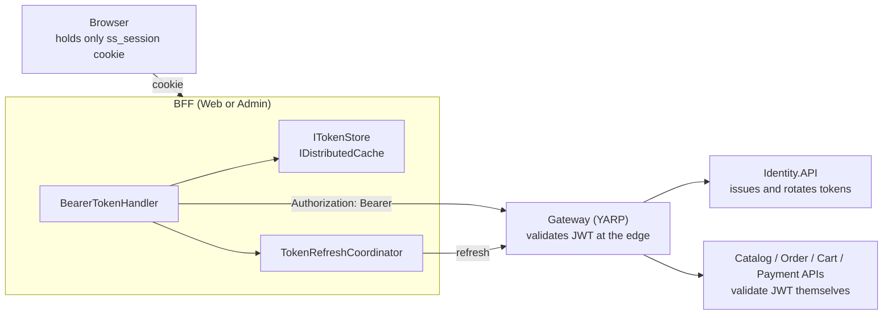
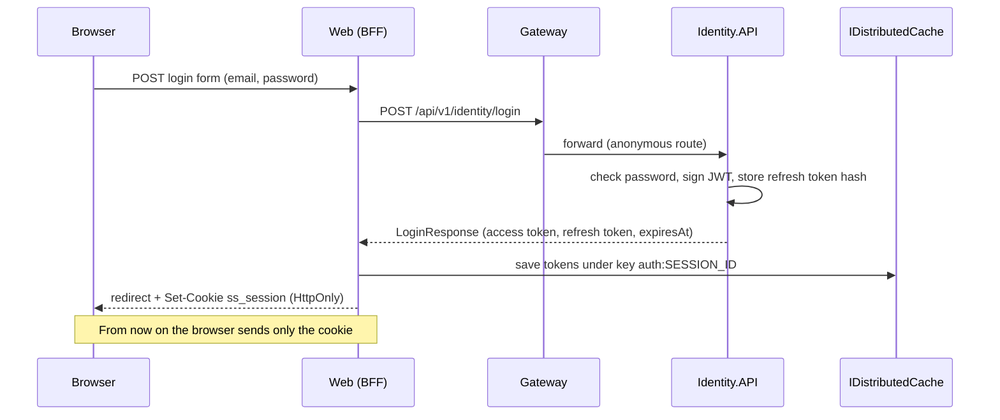
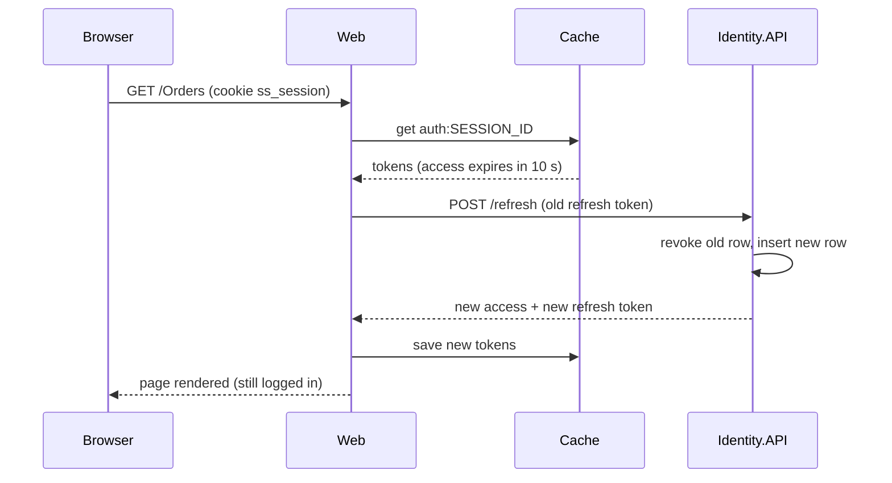
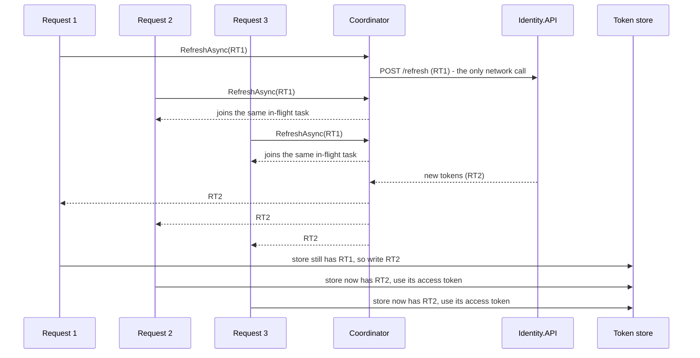

# Chương 3 - Xác thực (authentication) và mô hình BFF
> 🇻🇳 Bản tiếng Việt. English version: [03-authentication-and-bff.md](../03-authentication-and-bff.md)

Chương này giải thích cách một người dùng chứng minh "tôi là ai" trong SimpleStore, và cách bằng chứng đó đi an toàn giữa trình duyệt, hai ứng dụng web front end, một gateway và nhiều API. Bạn sẽ đi theo một lần đăng nhập từ trình duyệt đến tận database, rồi xem chuyện gì xảy ra một giờ sau đó khi access token hết hạn.

**Bạn sẽ học được**

- JWT access token chứa những gì và `Identity.API` ký token đó như thế nào.
- Refresh token được tạo ra, lưu (dưới dạng hash) và xoay vòng (rotate) ở mỗi lần dùng ra sao.
- Passkey (WebAuthn) nối vào cùng đoạn code phát token như thế nào.
- Mô hình BFF (Backend for Frontend) là gì và vì sao trình duyệt không bao giờ thấy JWT.
- `BearerTokenHandler` gắn token vào các lời gọi đi ra và làm mới (refresh) token ra sao.
- Vì sao `TokenRefreshCoordinator` tồn tại (single-flight) và vì sao Admin cần thêm `TokenRefreshClient`.

Các chương trước: [01 Architecture and Aspire](01-architecture-and-aspire.md), [02 Gateway and API versioning](02-gateway-and-api-versioning.md).

---

## Vấn đề cần giải quyết

Một cửa hàng web phải trả lời hai câu hỏi ở mỗi request: *ai đang gọi?* và *họ có được phép làm việc này không?* Với monolith, bạn chỉ cần giữ session trong bộ nhớ. Trong SimpleStore có nhiều service (Catalog, Order, Cart, Payment, ...) và không service nào nên phải gọi một "session service" trung tâm ở mỗi request. Chúng cũng không nên mỗi service tự có một bảng user riêng.

Câu trả lời thông dụng là **token**: một mẩu dữ liệu nhỏ, có chữ ký, nói rằng "đây là user X, có role Y, hợp lệ đến thời điểm T". Bất kỳ service nào biết khóa ký (signing key) đều có thể kiểm tra chữ ký ngay tại chỗ và tin vào nội dung.

> **Thuật ngữ mới: JWT (JSON Web Token).** Một chuỗi gồm ba phần base64url ngăn cách bằng dấu chấm: header (thuật toán), payload (các claim như user id và role) và chữ ký. Ai cũng có thể *đọc* payload; chỉ người có khóa mới *tạo được chữ ký hợp lệ*. Vì vậy đừng bao giờ đặt bí mật vào trong đó.

> **Thuật ngữ mới: Access token và refresh token.** Access token sống ngắn và được gửi ở mọi lời gọi API. Refresh token sống lâu, chỉ gửi cho Identity để đổi lấy access token mới. Access token ngắn hạn giúp giảm thiệt hại nếu bị lộ; refresh token giúp người dùng vẫn đăng nhập mà không phải gõ lại mật khẩu.

> **Thuật ngữ mới: BFF (Backend for Frontend).** Một ứng dụng web chạy phía server, nằm giữa trình duyệt và các API. Trình duyệt chỉ nói chuyện với BFF bằng một cookie bình thường; BFF giữ token thật và gọi API thay cho trình duyệt. Trong SimpleStore, `SimpleStore.Web` (storefront MVC) và `SimpleStore.Admin` (Blazor Server) là các BFF.

Có một vấn đề thứ hai ẩn sau vấn đề đầu. Refresh token ở đây được **xoay vòng sau mỗi lần dùng**: mỗi lần refresh thành công sẽ vô hiệu hóa refresh token cũ và trả về cái mới. Điều đó tốt cho bảo mật, nhưng nếu một trang gửi cùng lúc năm lời gọi API với access token đã hết hạn, cả năm lời gọi sẽ cùng dùng một refresh token cũ và bốn trong số đó sẽ thất bại. Mục "Single-flight refresh" sẽ giải quyết chuyện này.

---

## Bức tranh tổng thể



*Cách đọc: các mũi tên cho biết ai gọi ai. Trình duyệt chỉ nói chuyện với BFF bằng cookie. Mọi thứ bên phải BFF đều dùng JWT trong header `Authorization`.*

Cùng luồng đó cho một lần đăng nhập, từng bước một:



*Cách đọc: thời gian chảy từ trên xuống. Token dừng lại ở cache; chỉ một session id vô nghĩa (opaque) được trả về cho trình duyệt.*

---

## Đi qua mã nguồn

### 1. Ký access token

File: [JwtTokenService.cs](../../../src/SimpleStore.Identity.API/Services/JwtTokenService.cs)

Khóa được lấy từ cấu hình dưới dạng chuỗi base64, chuyển thành byte, rồi dùng với HMAC-SHA256 (HS256 - thuật toán *đối xứng*: cùng một khóa vừa để ký vừa để kiểm tra).

```csharp
var keyBytes = Convert.FromBase64String(_options.Key);
var signingKey = new SymmetricSecurityKey(keyBytes);
var credentials = new SigningCredentials(signingKey, SecurityAlgorithms.HmacSha256);

var now = DateTime.UtcNow;
var expiresAt = now.AddMinutes(_options.AccessTokenMinutes);
```

Tiếp theo là các claim (những thông tin nằm trong token):

```csharp
var claims = new List<Claim>
{
    new(JwtRegisteredClaimNames.Sub, user.Id),
    new(JwtRegisteredClaimNames.Email, user.Email ?? string.Empty),
    new(JwtRegisteredClaimNames.Name, user.FullName),
    new(JwtRegisteredClaimNames.Jti, Guid.NewGuid().ToString())
};
foreach (var role in roles)
{
    claims.Add(new Claim("role", role));
}
```

- `sub` là user id. Mọi service dùng nó để biết "đây là ai".
- `name` chứa họ tên đầy đủ của user (các giao diện hiển thị nó).
- `jti` là id duy nhất của token này.
- Mỗi role (`Admin`, `Customer`) được thêm thành một claim `role`. Các service kiểm tra chúng để phân quyền (authorization).

Token cũng có `iss`/`aud` (issuer và audience), `nbf` (not before = lúc này) và `exp` (hết hạn). Vậy thời hạn là bao lâu? [JwtOptions.cs](../../../src/SimpleStore.Identity.API/Services/JwtOptions.cs) đặt mặc định `AccessTokenMinutes` là **60**, và [appsettings.json](../../../src/SimpleStore.Identity.API/appsettings.json) cũng đặt là 60. Refresh token mặc định sống 30 ngày. (Một số ghi chú cũ trong `docs/` nói 15 phút; code ghi 60.)

Bản thân khóa không bao giờ nằm trong repository. AppHost truyền `Jwt__Key`, `Jwt__Issuer` và `Jwt__Audience` cho mọi service cần kiểm tra token (xem [Chương 1](01-architecture-and-aspire.md)).

### 2. Refresh token: ngẫu nhiên, được hash, được xoay vòng

File: [RefreshTokenService.cs](../../../src/SimpleStore.Identity.API/Services/RefreshTokenService.cs)

Refresh token không phải là JWT. Nó chỉ là 32 byte ngẫu nhiên, mã hóa dạng base64url. Chỉ có hash SHA-256 được lưu vào database, nên nếu bản dump database bị đánh cắp thì cũng không có token dùng được.

```csharp
private static string GenerateRaw()
{
    var bytes = RandomNumberGenerator.GetBytes(32);
    return Convert.ToBase64String(bytes).TrimEnd('=').Replace('+', '-').Replace('/', '_');
}

private static string Hash(string raw)
{
    var bytes = Encoding.UTF8.GetBytes(raw);
    return Convert.ToHexString(SHA256.HashData(bytes));
}
```

Entity ([RefreshToken.cs](../../../src/SimpleStore.Identity.API/Models/RefreshToken.cs)) tự biết khi nào nó còn dùng được:

```csharp
public bool IsActive => RevokedAt is null && DateTime.UtcNow < ExpiresAt;
```

`RotateAsync` là trái tim của thiết kế:

```csharp
var (newRaw, newExp) = (GenerateRaw(), DateTime.UtcNow.AddDays(_options.RefreshTokenDays));
var newHash = Hash(newRaw);

existing.RevokedAt = DateTime.UtcNow;
existing.ReplacedByTokenHash = newHash;

_db.RefreshTokens.Add(new RefreshToken
{
    UserId = existing.UserId,
    TokenHash = newHash,
    ExpiresAt = newExp
});
await _db.SaveChangesAsync(cancellationToken);
```

Việc thu hồi dòng cũ và chèn dòng mới diễn ra trong một lần `SaveChangesAsync` duy nhất; EF Core bọc nó trong một transaction database, nên bạn không bao giờ rơi vào tình huống có không token hợp lệ nào hoặc có hai token hợp lệ sau một lần xoay vòng.

> **Thuật toán: xoay vòng refresh token (refresh token rotation)**
>
> 1. Hash refresh token thô mà client gửi lên (SHA-256, dạng hex).
> 2. Tìm dòng có hash đó. Nếu không có, đã bị thu hồi, hoặc đã hết hạn: không trả về gì (endpoint trả 401).
> 3. Tạo một token ngẫu nhiên mới và hash nó.
> 4. Trên dòng cũ, đặt `RevokedAt = now` và `ReplacedByTokenHash = new hash`.
> 5. Chèn một dòng mới cho cùng user với hash mới và hạn dùng mới.
> 6. Lưu cả hai thay đổi cùng lúc và trả về token mới *dạng thô* (nó không bao giờ được lưu dưới dạng văn bản thuần).

`RevokeAsync` (dùng khi logout) có tính idempotent (gọi nhiều lần cho kết quả như một lần): nếu dòng không tồn tại hoặc đã bị thu hồi thì nó chỉ đơn giản return.

### 3. Login, register, refresh, logout

File: [IdentityService.cs](../../../src/SimpleStore.Identity.API/Services/IdentityService.cs)

Login dùng `SignInManager.CheckPasswordSignInAsync` của ASP.NET Core Identity, rồi gọi `IssueTokensAsync` để ký access token và tạo refresh token. Register tạo user, thêm role `Customer` và phát token theo cách tương tự.

Refresh gồm hai bước nhỏ:

```csharp
var existing = await _refresh.ValidateAsync(refreshToken, cancellationToken);
if (existing is null) return null;

var rotated = await _refresh.RotateAsync(refreshToken, cancellationToken);
if (rotated is null) return null;
```

Sau đó nó nạp lại user, đọc lại các role *hiện tại*, và ký access token mới. Nghĩa là thay đổi role có hiệu lực ở lần refresh kế tiếp. Các HTTP endpoint nằm trong [IdentityEndpoints.cs](../../../src/SimpleStore.Identity.API/Endpoints/IdentityEndpoints.cs): `/login`, `/register`, `/refresh` và `/logout` là anonymous (ẩn danh), vì người gọi chưa có access token hợp lệ (hoặc, với refresh, token vừa hết hạn).

### 4. Passkey

> **Thuật ngữ mới: Passkey (WebAuthn).** Cách đăng nhập không cần mật khẩu: trình duyệt yêu cầu thiết bị (vân tay, mã PIN, khóa bảo mật) ký một challenge từ server. Server chỉ lưu public key.

Passkey tái sử dụng phần hỗ trợ sẵn có của ASP.NET Core Identity (`IdentityPasskeyOptions`, schema version 3). Luồng gồm hai lượt đi-về để đăng nhập và hai lượt để đăng ký một passkey:

| Mục đích | Bước 1 (lấy options) | Bước 2 (gửi kết quả đã ký) |
|---|---|---|
| Đăng nhập (anonymous) | `POST /passkey/assertion-options` | `POST /passkey/assertion` |
| Đăng ký passkey (đã đăng nhập) | `POST /passkey/creation-options` | `POST /passkey/attestation` |

Điểm quan trọng là nơi đăng nhập bằng passkey kết thúc. Sau khi xác minh assertion, nó gọi *cùng* `IssueTokensAsync` như đăng nhập bằng mật khẩu:

```csharp
var assertion = await signInManager.PerformPasskeyAssertionAsync(request.CredentialJson);
if (!assertion.Succeeded || assertion.User is null)
    return Results.BadRequest(new { error = assertion.Failure?.Message ?? "Passkey assertion failed." });

var response = await service.IssueTokensAsync(assertion.User.Id, ct);
```

Vì vậy mọi thứ sau khi đăng nhập (JWT, refresh token, BFF session) đều giống hệt nhau, bất kể người dùng chứng minh danh tính bằng cách nào. Trình duyệt phải hoàn tất quy trình (ceremony) trong `AuthenticatorTimeout`, được đặt là 2 phút trong [Program.cs](../../../src/SimpleStore.Identity.API/Program.cs).

### 5. BFF lưu token, trình duyệt nhận cookie

Handler của trang đăng nhập Web ([Login.cshtml.cs](../../../src/SimpleStore.Web/Areas/Identity/Pages/Account/Login.cshtml.cs)) gọi Identity qua typed client và đưa kết quả cho `ITokenStore`:

```csharp
await _tokens.SetAsync(new TokenSet
{
    AccessToken = response.AccessToken,
    RefreshToken = response.RefreshToken,
    ExpiresAt = response.ExpiresAt
});

return LocalRedirect(returnUrl);
```

Store ([DistributedCacheTokenStore.cs](../../../src/SimpleStore.Web/Services/Auth/DistributedCacheTokenStore.cs)) là nơi ý tưởng BFF trở nên cụ thể. Nếu trình duyệt chưa có session cookie, nó tạo một id ngẫu nhiên và đặt cookie `HttpOnly`:

```csharp
if (!ctx.Request.Cookies.TryGetValue(SessionCookieName, out var sessionId) || string.IsNullOrEmpty(sessionId))
{
    sessionId = Guid.NewGuid().ToString("N");
    ctx.Response.Cookies.Append(SessionCookieName, sessionId, new CookieOptions
    {
        HttpOnly = true,
        Secure = true,
        SameSite = SameSiteMode.Lax,
        IsEssential = true,
        Path = "/"
    });
}
```

Sau đó nó serialize `TokenSet` thành JSON và ghi vào cache với key `"auth:" + sessionId` cùng sliding expiration (hạn trượt) 30 ngày:

```csharp
var json = JsonSerializer.Serialize(tokens);
await _cache.SetStringAsync(CacheKeyPrefix + sessionId, json, new DistributedCacheEntryOptions
{
    // Sliding expiration keeps the entry alive as long as the user is active.
    SlidingExpiration = TimeSpan.FromDays(30)
}, cancellationToken);
```

Mỗi cờ của cookie mang lại lợi ích gì:

- `HttpOnly`: JavaScript không đọc được cookie, nên một lỗi XSS không thể đánh cắp session id.
- `Secure`: chỉ được gửi qua HTTPS.
- `SameSite=Lax`: không được gửi trong các POST từ site khác, giúp làm giảm các cuộc tấn công CSRF.

Cả Web và Admin đều đăng ký `AddDistributedMemoryCache()`. Dù tên có chữ "distributed", bản cài đặt đó thực ra là **bộ nhớ của từng process**: session mất khi ứng dụng khởi động lại và không được chia sẻ giữa các replica. Với một dự án mẫu để học chạy một instance thì như vậy là ổn; xem [Chương 11](11-known-limitations.md).

### 6. Biến session trở lại thành JWT ở mỗi request

`SimpleStore.Web` và `SimpleStore.Admin` vẫn dùng middleware JWT bearer của ASP.NET Core để xác thực các request *đến* từ trình duyệt. Mẹo nằm ở event `OnMessageReceived`, chạy trước khi token được đọc từ header `Authorization`. Vì trình duyệt không gửi header đó, event này lấy token ra từ store ([Program.cs](../../../src/SimpleStore.Web/Program.cs)):

```csharp
var store = ctx.HttpContext.RequestServices.GetRequiredService<ITokenStore>();
var current = await store.GetAsync(ctx.HttpContext.RequestAborted);
if (current is null) return;

// Auto-refresh expired access tokens transparently for inbound auth.
if (current.ExpiresAt <= DateTime.UtcNow.AddSeconds(30) && !string.IsNullOrEmpty(current.RefreshToken))
```

Nếu access token còn không quá 30 giây là hết hạn (cùng giá trị với `ClockSkew`), nó refresh ngay tại đây:

```csharp
var rotated = await identity.RefreshAsync(new RefreshRequest { RefreshToken = current.RefreshToken }, ctx.HttpContext.RequestAborted);
if (rotated is not null)
{
    var next = new TokenSet
    {
        AccessToken = rotated.AccessToken,
        RefreshToken = rotated.RefreshToken,
        ExpiresAt = rotated.ExpiresAt
    };
    await store.SetAsync(next, ctx.HttpContext.RequestAborted);
    ctx.Token = next.AccessToken;
    return;
```

Lưu ý rằng đường đi inbound này gọi thẳng Identity; nó **không** đi qua coordinator được mô tả ở dưới.

> **Thuật toán: refresh token hết hạn trên một request đến**
>
> 1. Đọc cookie `ss_session`, rồi đọc `TokenSet` từ cache. Không có cookie hoặc không có entry: request vẫn là anonymous.
> 2. Nếu `ExpiresAt` còn cách hơn 30 giây, dùng nguyên access token.
> 3. Nếu không, gọi `POST /refresh` với refresh token đã lưu.
> 4. Nếu thành công, lưu các token đã xoay vòng vào cache và dùng access token mới.
> 5. Nếu thất bại, vẫn đưa token cũ ra; việc kiểm tra sẽ fail và request bị coi là chưa đăng nhập.



*Cách đọc: người dùng không thấy gì cả; việc refresh diễn ra bên trong một request tải trang.*

### 7. Các lời gọi đi ra: BearerTokenHandler

Khi một controller gọi `ICatalogApiClient`, `IOrderApiClient` v.v., một `DelegatingHandler` (middleware của HttpClient) sẽ gắn token vào. Xem [BearerTokenHandler.cs](../../../src/SimpleStore.Web/Services/Auth/BearerTokenHandler.cs). Các handler được gắn trong [Program.cs](../../../src/SimpleStore.Web/Program.cs) bằng `.AddHttpMessageHandler<BearerTokenHandler>()`.

> **Thuật toán: BearerTokenHandler.GetUsableAccessTokenAsync**
>
> 1. Đọc `TokenSet` từ `ITokenStore`. Không có: gửi request mà không kèm token.
> 2. Nếu `ExpiresAt > now + 30 s`: trả về access token.
> 3. Nếu không có refresh token: trả về access token như cũ.
> 4. Nếu không, nhờ `TokenRefreshCoordinator` refresh bằng refresh token hiện tại (single-flight, xem mục sau).
> 5. Đọc lại store. Nếu refresh token trong đó vẫn bằng cái ta bắt đầu, ghi các token đã xoay vòng vào đó; nếu nó đã đổi, nghĩa là có người khác đã lưu token mới rồi, nên dùng access token của store.
> 6. Nếu refresh thất bại (null hoặc exception), gửi request không xác thực và để API trả 401.

Bước 5 trong code:

```csharp
// Re-read the store: another concurrent caller may have already persisted the rotated
// tokens. If we see an unchanged refresh token, we are the one responsible for writing.
var latest = await _tokens.GetAsync(cancellationToken);
if (latest is null || string.Equals(latest.RefreshToken, current.RefreshToken, StringComparison.Ordinal))
{
    await _tokens.SetAsync(new TokenSet
    {
        AccessToken = rotated.AccessToken,
        RefreshToken = rotated.RefreshToken,
        ExpiresAt = rotated.ExpiresAt
    }, cancellationToken);
    return rotated.AccessToken;
}
return latest.AccessToken;
```

Hai caller có thể cùng thấy giá trị chưa đổi trước khi một trong hai kịp ghi; trong trường hợp đó cả hai ghi cùng các token đã xoay vòng, điều này vô hại.

`AddIdentityApiClient()` của Web **không** có `BearerTokenHandler`: login, register và refresh là các route anonymous nên không cần (và nếu có thì refresh sẽ tự gọi chính nó). Các lời gọi đến Catalog, Order, Payment và Cart đều có handler.

### 8. Single-flight refresh: TokenRefreshCoordinator

File: [TokenRefreshCoordinator.cs](../../../src/SimpleStore.Web/Services/Auth/TokenRefreshCoordinator.cs)

> **Thuật ngữ mới: Single-flight.** Nếu nhiều caller cùng lúc yêu cầu cùng một việc tốn kém, hãy làm việc đó một lần và đưa cùng một kết quả cho mọi người.

Coordinator giữ một dictionary từ *giá trị refresh token* sang một `Lazy<Task<LoginResponse?>>`. Caller đầu tiên cài đặt `Lazy`; các caller sau với cùng refresh token sẽ tìm thấy nó và await cùng một task.

```csharp
var created = false;
var lazy = _inFlight.GetOrAdd(refreshToken, _ =>
{
    created = true;
    return new Lazy<Task<LoginResponse?>>(refreshFn, LazyThreadSafetyMode.ExecutionAndPublication);
});
if (!created)
{
    Telemetry.TokenRefreshCoalesced.Add(1);
}
return AwaitAndCleanupAsync(refreshToken, lazy);
```

Khi có race (tranh chấp), `ConcurrentDictionary.GetOrAdd` có thể chạy factory của nó nhiều lần và bỏ các kết quả thừa. Đó là lý do giá trị là một `Lazy` với `ExecutionAndPublication`: dù có hai đối tượng `Lazy` được tạo ra, chỉ cái thắng được ô trong dictionary mới thật sự được *thực thi*, nên lời gọi mạng chỉ chạy một lần.

Việc dọn dẹp diễn ra trong khối `finally` để một lần refresh thất bại không để lại một entry "bị nhiễm độc":

```csharp
finally
{
    // Best-effort cleanup. Late callers that already grabbed this Lazy still receive its
    // cached result via lazy.Value; removing the dictionary entry only affects future callers
    // who would otherwise see a stale, already-completed task and reuse its (no-longer-valid)
    // refresh token.
    _inFlight.TryRemove(key, out _);
}
```

> **Thuật toán: gộp N lần refresh song song**
>
> 1. Mỗi caller gọi `RefreshAsync(refreshToken, refreshFn)`.
> 2. `GetOrAdd` trả về `Lazy` có sẵn nếu có, nếu không thì lưu một cái mới.
> 3. Caller đã tạo ra nó không tăng gì cả; mọi caller khác tăng bộ đếm `simplestore.identity.token_refresh.coalesced`.
> 4. Tất cả caller `await lazy.Value`; lần truy cập đầu tiên chạy `refreshFn` (một lời gọi HTTP đến Identity), những caller còn lại chờ cùng một task.
> 5. Khi task hoàn tất, mỗi caller xóa key (chỉ lần xóa đầu tiên có tác dụng).



*Cách đọc: ba caller cần refresh cùng lúc. Identity chỉ thấy một lời gọi, không phải ba, nên RT1 vốn chỉ dùng được một lần không bị tiêu tốn ba lần.*

Một chi tiết trong `BearerTokenHandler`: lời gọi refresh bên trong dùng `CancellationToken.None`. Nếu một caller đang chờ bị hủy (người dùng đóng tab), điều đó không được làm gián đoạn lần refresh chung mà những caller khác đang chờ.

### 9. Admin khác ở điểm nào

Admin ([Program.cs](../../../src/SimpleStore.Admin/Program.cs)) là một ứng dụng Blazor Server, nên nó khác ở ba điểm.

**a) `TokenRefreshClient` tránh phụ thuộc vòng.** Ở Web, `IIdentityApiClient` không có handler. Ở Admin thì có, vì các endpoint admin `/users` cần JWT. Nhưng `BearerTokenHandler` cần một client để gọi refresh, mà chuỗi handler của `IIdentityApiClient` lại chứa `BearerTokenHandler`: một vòng lặp phụ thuộc. Cách sửa là một client thứ hai rất nhỏ, không có handler nào ([TokenRefreshClient.cs](../../../src/SimpleStore.Admin/Services/Auth/TokenRefreshClient.cs)):

```csharp
public sealed class TokenRefreshClient(HttpClient http)
{
    private readonly IIdentityApiClient _identity = new IdentityApiClient(http);

    public Task<LoginResponse?> RefreshAsync(RefreshRequest request, CancellationToken cancellationToken = default)
        => _identity.RefreshAsync(request, cancellationToken);
}
```

Nó cũng đảm bảo rằng một lời gọi refresh không bao giờ có thể kích hoạt một lần refresh khác.

**b) `CircuitTokenStore` cache token trong suốt vòng đời của Blazor circuit.** `IHttpContextAccessor.HttpContext` chỉ đáng tin cậy trong request HTTP đầu tiên thiết lập kết nối SignalR; những lần bấm nút sau đó chạy mà không có request bình thường. Vì vậy [CircuitTokenStore.cs](../../../src/SimpleStore.Admin/Services/Auth/CircuitTokenStore.cs) nhớ `TokenSet` tốt gần nhất và dùng nó làm phương án dự phòng:

```csharp
catch
{
    // HttpContext may be unavailable in interactive Blazor — fall back to cached.
}

return _hasCached ? _cached : null;
```

**c) Admin từ chối người không phải admin ngay lúc đăng nhập và đưa trình duyệt về trang đăng nhập.** Từ [Login.cshtml.cs](../../../src/SimpleStore.Admin/Pages/Account/Login.cshtml.cs):

```csharp
if (!response.User.Roles.Contains("Admin"))
{
    ErrorMessage = "Account does not have admin access.";
    return Page();
}
```

và `OnChallenge` trong `Program.cs` chuyển hướng một HTML `GET` chưa xác thực đến `/Account/Login?returnUrl=...`, còn các request khác vẫn chỉ nhận 401 thông thường. `FallbackPolicy` của authorization được đặt là policy `Admin`, nên mọi trang đều chỉ dành cho admin trừ khi trang đó nói khác.

### 10. Logout

[Logout.cshtml.cs](../../../src/SimpleStore.Web/Areas/Identity/Pages/Account/Logout.cshtml.cs) thu hồi refresh token ở Identity (`LogoutAsync`) rồi xóa entry trong cache và cookie (`ClearAsync`). Bản thân access token không thể bị thu hồi; nó chỉ đơn giản hết hạn (tối đa 60 phút sau) và không ai còn giữ nó nữa, ngoại trừ entry cache vừa bị xóa.

### 11. Gateway cũng kiểm tra token

Mọi lưu lượng từ BFF đến API đều đi qua gateway, nơi *lại* kiểm tra JWT cho các route được bảo vệ (xem [Chương 2](02-gateway-and-api-versioning.md)). Các API phía sau kiểm tra lần thứ ba. Đây là chủ ý, gọi là defense in depth (phòng thủ nhiều lớp): mỗi lớp rất rẻ (một phép kiểm tra HMAC) và không lớp nào phải tin lớp trước nó.

---

## Điều gì có thể sai

- **Việc dùng lại refresh token không bị phát hiện.** Nếu một refresh token cũ được đưa ra lần nữa, `ValidateAsync` thấy nó đã bị thu hồi và trả về null, nên caller nhận 401. Chỉ vậy thôi. Mô hình có ghi `ReplacedByTokenHash` trên dòng cũ, nhưng không có gì đọc nó: không có cơ chế thu hồi cả "họ token" (token family) để đăng xuất tất cả mọi người nếu một token bị đánh cắp bị phát lại. Các hệ thống thực tế thường bổ sung phần này.
- **Rotation không có cơ chế bảo vệ đồng thời (concurrency guard).** `RotateAsync` tra cứu rồi lưu mà không có row version hay lock. Hai lần refresh thật sự đồng thời với cùng một token có thể cùng qua `ValidateAsync`. Trong SimpleStore, coordinator làm điều này khó xảy ra với các lời gọi đi ra từ một process, nhưng đó không phải là sự đảm bảo ở mức database.
- **Đường refresh inbound bỏ qua coordinator.** `OnMessageReceived` gọi trực tiếp `IIdentityApiClient.RefreshAsync` (Web) hoặc `TokenRefreshClient` (Admin). Nếu trình duyệt bắn nhiều request song song và tất cả đều thấy token đã hết hạn, mỗi request tự chạy một lần refresh riêng. Single-flight chỉ bảo vệ các lời gọi *đi ra* song song đi qua `BearerTokenHandler`. Đây cũng là lý do bộ đếm `coalesced` có thể vẫn bằng 0 khi duyệt web đơn giản.
- **Một caller đến muộn vẫn có thể thua trong cuộc đua.** Coordinator xóa entry của nó ngay khi refresh xong. Một caller đã đọc token cũ ngay trước khi store được cập nhật, nhưng đến coordinator sau khi entry bị xóa, sẽ bắt đầu một lần refresh thứ hai với token đã bị thu hồi, nhận 401 từ Identity, và gửi request mà không có token.
- **Session nằm trong bộ nhớ process.** `AddDistributedMemoryCache()` nghĩa là khởi động lại Web hoặc Admin sẽ đăng xuất mọi người, và hai replica sẽ không chia sẻ session. Chuyển sang Redis chỉ là đổi một dòng đăng ký, nhưng repo này không làm vậy.
- **Session cookie không có hạn rõ ràng.** `ss_session` được đặt mà không có `Expires`, nên trình duyệt thường bỏ nó khi đóng, trong khi entry trong cache vẫn sống cho đến hết cửa sổ trượt 30 ngày. Checkbox "Remember me" trên form đăng nhập của Web được bind vào `Input.RememberMe`, nhưng handler hiển thị ở trên không bao giờ đọc nó.
- **Login không đổi session id.** `SetAsync` dùng lại giá trị cookie `ss_session` có sẵn nếu trình duyệt đã có, nên cùng một id tiếp tục giữa trạng thái ẩn danh và đã đăng nhập.
- **Khóa ký được chia sẻ.** HS256 nghĩa là mọi service có thể *kiểm tra* token cũng có thể *làm giả* token. Điều đó chấp nhận được trong một ranh giới tin cậy (trust boundary); bước nâng cấp thường thấy là thuật toán bất đối xứng (RS256) với public key được công bố.
- **Access token không thể bị thu hồi sớm.** Khóa một user trong Admin không làm mất hiệu lực các access token đã phát; nó chỉ chặn các lần đăng nhập và refresh mới.

---

## Tự thực hành

Khởi động hệ thống bằng `dotnet run --project src/SimpleStore.AppHost` và mở Aspire dashboard. Các tài khoản seed cho môi trường dev là `admin@simplestore.local` / `Admin123!` (role Admin) và `demo@simplestore.local` / `Demo123!` (role Customer).

1. **Xem trình duyệt giữ gì.** Mở storefront, vào trang đăng nhập, đăng nhập bằng khách hàng demo. Trong dev tools của trình duyệt mở *Application > Cookies*. Bạn sẽ thấy `ss_session` có cờ `HttpOnly` và `Secure`, cùng một giá trị trông ngẫu nhiên. Kiểm tra *Local Storage* và *Session Storage*: không có token nào ở đó. Thử `document.cookie` trong console: `ss_session` không được liệt kê vì nó là HttpOnly.
2. **Đọc một JWT.** Gửi `POST /api/v1/identity/login` đến địa chỉ gateway hiện trong dashboard, với body JSON gồm `email` và `password`. Lấy phần giữa của `accessToken`, giải mã base64url ngay trên máy bạn (ví dụ dùng `base64 -d` sau khi sửa phần padding) và tìm `sub`, `email`, `name`, `role`, `exp`. Đừng dán token lên các website bên thứ ba. Đây là token dev, nhưng đó là một thói quen tốt.
3. **Xem một lần rotation.** Trong cùng response, ghi lại `refreshToken`. Gọi `POST /api/v1/identity/refresh` với nó: bạn nhận token mới. Gọi lại với refresh token *cũ*: bạn nhận 401. (Nếu bạn đang mở pgweb từ AppHost, hãy xem bảng `RefreshTokens` trong `identitydb`: dòng cũ có `RevokedAt` và `ReplacedByTokenHash` được điền, và không có token thô nào xuất hiện.)
4. **Ép một lần refresh tự động.** Tạm đặt `AccessTokenMinutes` thành `1` trong [appsettings.json](../../../src/SimpleStore.Identity.API/appsettings.json), khởi động lại, đăng nhập, chờ khoảng 40 giây, rồi tải lại một trang cần xác thực như *My orders*. Trong màn hình *Traces* của dashboard bạn sẽ thấy một request `refresh` đến Identity nằm trong request tải trang đó. Đặt giá trị về 60 sau khi xong.
5. **Xem bộ đếm coalescing.** Trong *Metrics* chọn resource Web hoặc Admin và tìm `simplestore.identity.token_refresh.coalesced`. Sau khi duyệt bình thường, nó rất có thể bằng 0 (xem "Điều gì có thể sai"). Nó tăng lên khi nhiều lời gọi API đi ra bắt đầu cùng một lúc với token đã hết hạn.
6. **Admin nghiêm ngặt hơn.** Thử đăng nhập vào ứng dụng Admin bằng tài khoản khách hàng demo và đọc thông báo. Sau đó đăng nhập bằng tài khoản admin.

---

## Những điều cần nhớ

- Access token là một JWT có chữ ký (HS256) với các claim `sub`, `email`, `name`, `jti` và `role`, mặc định hợp lệ 60 phút.
- Refresh token là ngẫu nhiên, chỉ được lưu dưới dạng hash SHA-256, và được xoay vòng ở mỗi lần dùng trong một transaction.
- Passkey và mật khẩu đều kết thúc ở `IssueTokensAsync`, nên mọi thứ phía sau đều giống hệt nhau.
- Với mô hình BFF, trình duyệt giữ một cookie `HttpOnly` vô nghĩa; token nằm phía server trong `IDistributedCache` dưới key `auth:` cộng với session id.
- `BearerTokenHandler` refresh ngay trước khi hết hạn; `TokenRefreshCoordinator` đảm bảo các caller song song dùng chung một lần refresh để rotate-on-use không gây lỗi.
- Admin cần `TokenRefreshClient` (để phá vòng phụ thuộc) và `CircuitTokenStore` (Blazor circuit không có `HttpContext` đáng tin cậy).
- Những thiếu sót đã biết (không phát hiện việc dùng lại token, session trong bộ nhớ, refresh inbound không được gộp) được liệt kê thẳng thắn trong [Chương 11](11-known-limitations.md).

## Chương tiếp theo

Bây giờ bạn đã biết một người gọi được nhận diện như thế nào, hãy tiếp tục với [Chương 4 - Catalog and Cart](04-catalog-and-cart.md), nơi giỏ hàng của khách vãng lai được gộp vào tài khoản của họ lúc đăng nhập.
