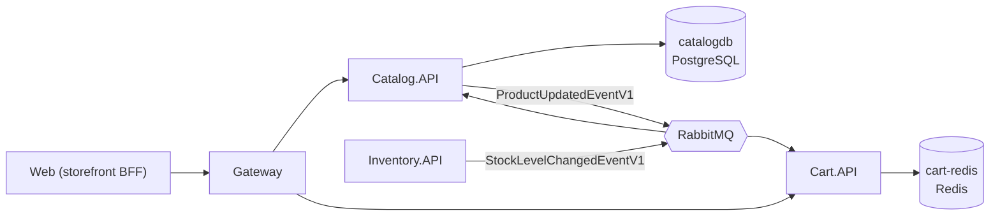
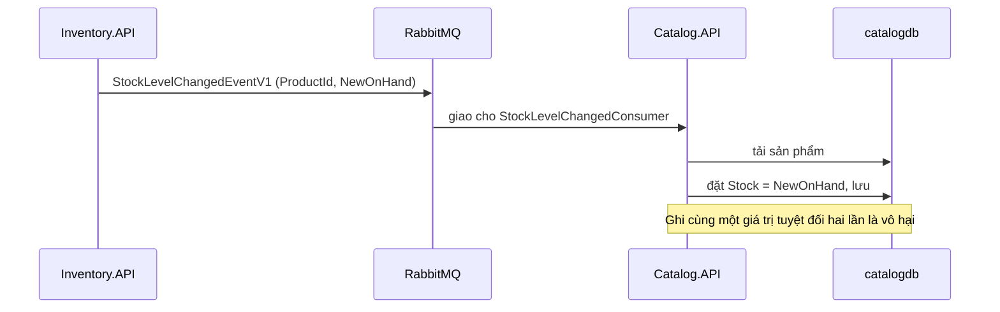
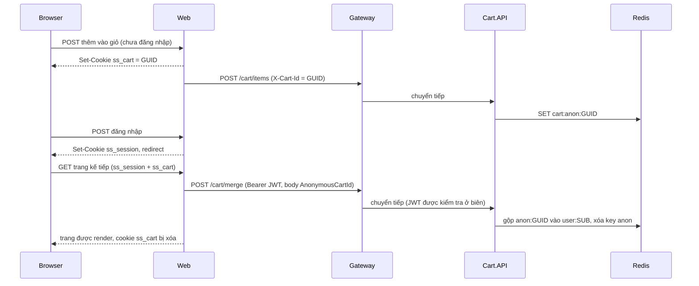
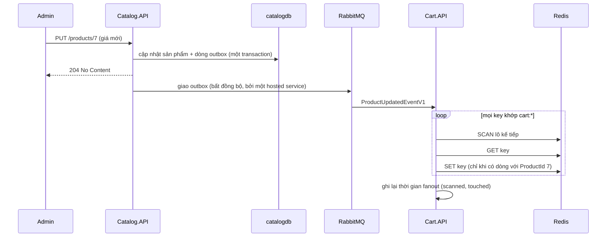

# Chương 4 - Catalog và Cart

> 🇻🇳 Bản tiếng Việt. English version: [04-catalog-and-cart.md](../04-catalog-and-cart.md)

Chương này nói về hai service mà người mua hàng chạm vào đầu tiên: **Catalog** (danh sách sản phẩm, lưu trong PostgreSQL) và **Cart** (giỏ hàng, lưu trong Redis). Bề ngoài cả hai đều nhỏ, nhưng chúng cho bạn thấy ba ý tưởng quan trọng của microservice: đọc và ghi dữ liệu mà service của bạn sở hữu, giữ một *bản sao* dữ liệu của service khác và đồng bộ nó bằng event, và xử lý những khách chưa đăng nhập.

**Bạn sẽ học được**

- Cách Catalog phân trang và tìm kiếm một cách an toàn.
- Vì sao `Product.Stock` trong Catalog là một cache chỉ đọc, và một event giữ cho nó luôn mới như thế nào.
- Cách một lần cập nhật sản phẩm được lưu *và* thông báo ra ngoài trong cùng một transaction của database (outbox).
- Cách key của Cart hoạt động trong Redis (`cart:user:<sub>` và `cart:anon:<guid>`) và cách `ResolveOwner` chọn một trong hai.
- Cách giỏ hàng ẩn danh được gộp vào giỏ hàng của người dùng khi họ đăng nhập, và vì sao việc gộp này nằm trong một middleware.
- Cách một thay đổi giá sản phẩm lan ra mọi giỏ hàng bằng Redis `SCAN`, và cái giá phải trả.
- Cách Cart xuống cấp một cách êm thấm khi Redis không khỏe.

Chương trước: [Chương 3 - Xác thực và mẫu BFF](03-authentication-and-bff.md). Liên quan: [Chương 1](01-architecture-and-aspire.md), [Chương 2](02-gateway-and-api-versioning.md).

---

## Vấn đề cần giải quyết

1. **Một cửa hàng phải liệt kê được hàng nghìn sản phẩm mà không gửi tất cả cùng lúc.** API phải phân trang, lọc theo danh mục và tìm theo văn bản, và một client bất cẩn không được phép đòi một triệu dòng.
2. **Tồn kho nằm ở nơi khác.** Từ khi service Inventory trở thành nguồn sự thật duy nhất về tồn kho (xem [Chương 7](07-inventory-event-sourcing-cqrs.md)), Catalog vẫn phải hiển thị "còn hàng: 12" trên trang sản phẩm. Gọi Inventory mỗi lần xem trang sẽ gắn chặt hai service với nhau.
3. **Một dòng trong giỏ hàng cần tên, giá và ảnh sản phẩm.** Cart.API có thể gọi Catalog mỗi lần hiển thị giỏ hàng, nhưng khi đó Cart sẽ hỏng mỗi khi Catalog ngừng chạy. Thay vào đó, mỗi dòng giỏ hàng mang theo một bản sao của các trường đó. Bản sao thì sẽ cũ đi, nên khi admin sửa một sản phẩm, mọi bản sao phải được làm mới.
4. **Người mua duyệt hàng trước khi đăng nhập.** Giỏ hàng của họ phải sống sót qua lúc đăng nhập, và không được mất nếu họ đã đăng nhập sẵn trên thiết bị khác.

> **Thuật ngữ mới: Denormalization (phi chuẩn hóa).** Lưu một bản sao dữ liệu từ nơi khác để bạn không phải tra cứu mỗi lần. Nó làm việc đọc nhanh và giúp các service độc lập, nhưng bạn phải giữ cho bản sao luôn cập nhật.

> **Thuật ngữ mới: Eventual consistency (nhất quán cuối cùng).** Các bản sao sẽ khớp nhau *sớm thôi*, không phải ngay lập tức. Giữa lúc admin lưu sản phẩm và lúc Cart làm mới, một giỏ hàng có thể hiển thị giá cũ trong chốc lát.

> **Thuật ngữ mới: Idempotent (lũy đẳng).** Một thao tác có cùng kết quả dù bạn chạy một lần hay nhiều lần. Message broker có thể giao cùng một message hai lần, nên consumer cần phải idempotent.

---

## Bức tranh tổng thể



*Cách đọc: mũi tên liền đi tới database là đọc và ghi; mũi tên đi qua RabbitMQ là event. Catalog publish các lần sửa sản phẩm (Cart lắng nghe); Inventory publish các thay đổi tồn kho (Catalog lắng nghe).*

Ai sở hữu cái gì:

| Dữ liệu | Chủ sở hữu | Bản sao |
|---|---|---|
| Tên, mô tả, giá, ảnh, danh mục | Catalog | Các dòng giỏ hàng (`ProductName`, `UnitPrice`, `ImageUrl`) |
| Tồn kho hiện có | Inventory | `Product.Stock` trong Catalog |
| Nội dung giỏ hàng | Cart (Redis) | không có |

---

## Đi qua mã nguồn

### Phần A - Catalog

#### 1. Phân trang và tìm kiếm

File: [CatalogService.cs](../../../src/SimpleStore.Catalog.API/Services/CatalogService.cs)

Mỗi lời gọi danh sách đầu tiên đi qua một đoạn bảo vệ nhỏ, giữ cho các giá trị phân trang hợp lý:

```csharp
private static (int page, int pageSize) ClampPaging(int page, int pageSize)
{
    if (page < 1) page = 1;
    if (pageSize < 1) pageSize = 1;
    if (pageSize > MaxPageSize) pageSize = MaxPageSize;
    return (page, pageSize);
}
```

`MaxPageSize` là 100, nên trang lớn nhất mà một caller nhận được là 100 sản phẩm. Sau đó `GetProductsAsync` xây dựng truy vấn từng bước:

```csharp
var query = _context.Products.Include(p => p.Category).AsNoTracking().AsQueryable();
if (categoryId.HasValue)
    query = query.Where(p => p.CategoryId == categoryId.Value);
if (!string.IsNullOrWhiteSpace(searchTerm))
    query = query.Where(p => p.Name.Contains(searchTerm) || p.Description.Contains(searchTerm));

var totalCount = await query.CountAsync(ct);
var items = await query
    .OrderBy(p => p.Id)
    .Skip((page - 1) * pageSize)
    .Take(pageSize)
    .Select(p => ToDto(p))
    .ToListAsync(ct);
```

Những điểm đáng chú ý:

- Không có gì chạm tới database cho đến `CountAsync` và `ToListAsync`. Các bộ lọc chỉ nối thêm vào truy vấn mà sau đó EF Core dịch thành một câu SQL duy nhất.
- `Contains` trở thành SQL `LIKE '%term%'`. Đơn giản, nhưng ký tự đại diện ở đầu không dùng được index thông thường, nên với bảng lớn bạn sẽ chuyển sang full-text search.
- `OrderBy(p => p.Id)` là bắt buộc để phân trang ổn định: nếu không có thứ tự xác định, trang 2 có thể lặp lại hoặc bỏ sót dòng.
- `AsNoTracking()` bảo EF Core đừng ghi nhớ các entity, rẻ hơn cho truy vấn chỉ đọc.
- Phần đếm và phần lấy trang là hai truy vấn riêng, nên khi có ghi đồng thời, tổng số có thể lệch đôi chút so với các item.

Các endpoint gọi đoạn này nằm trong [CatalogEndpoints.cs](../../../src/SimpleStore.Catalog.API/Endpoints/CatalogEndpoints.cs). Việc đọc không cần authorization; việc ghi dùng `.RequireAuthorization("Admin")`. Gateway lặp lại cách chia đó (`catalog-read` ẩn danh, `catalog-write` cho admin; xem [Chương 2](02-gateway-and-api-versioning.md)).

> **Thuật toán: truy vấn sản phẩm có phân trang**
>
> 1. Kẹp `page >= 1` và `1 <= pageSize <= 100`.
> 2. Bắt đầu từ `Products` join với `Category`, không tracking.
> 3. Nếu có `categoryId`, lọc theo nó.
> 4. Nếu `search` không rỗng, lọc những dòng có `Name` hoặc `Description` chứa nó.
> 5. Đếm số dòng sau khi lọc.
> 6. Sắp xếp theo `Id`, bỏ qua `(page-1) * pageSize` dòng, lấy `pageSize` dòng, map sang DTO.
> 7. Trả về các item cùng `Page`, `PageSize`, `TotalCount`.

#### 2. Tồn kho là cache, không phải trường để sửa

Khi admin tạo một sản phẩm, Catalog **không** nhận con số tồn kho. Nó ép về không:

```csharp
// Stock starts at 0 — Inventory.API is the source of truth. An admin establishes initial
// stock by issuing a receipt note in Inventory, which flows back here as a
// StockLevelChangedEventV1 and updates the cached Product.Stock.
var product = new Product
{
    Name = request.Name,
    Description = request.Description,
    Price = request.Price,
    Stock = 0,
```

`UpdateProductAsync` cũng không đụng tới `Stock`. Các DTO của request (`CreateProductRequest`, `UpdateProductRequest`) hoàn toàn không có trường `Stock`, nên client thậm chí không thể thử. (Seeder, [CatalogSeeder.cs](../../../src/SimpleStore.Catalog.API/CatalogSeeder.cs), tạo 4 danh mục và 10 sản phẩm kèm tồn kho ban đầu để bản demo có dữ liệu; seeder riêng của Inventory ghi các phiếu nhập kho tương ứng.)

#### 3. Lưu và thông báo một lần cập nhật: outbox

Một lần sửa sản phẩm có hai việc: đổi dòng dữ liệu, và báo cho Cart biết. Nếu bạn làm hai việc đó riêng rẽ, bạn có thể lưu dòng dữ liệu rồi sập trước khi gửi event, hoặc gửi event rồi lưu thất bại. Đó là **vấn đề dual-write (ghi kép)** (được giải thích đầy đủ trong [Chương 5](05-orders-and-outbox.md)).

> **Thuật ngữ mới: Transactional outbox (hộp thư đi theo transaction).** Thay vì gửi message trực tiếp, bạn ghi nó vào một bảng trong *cùng transaction database* với thay đổi dữ liệu của bạn. Một tiến trình nền sau đó đọc bảng và giao message. Hoặc cả dòng dữ liệu lẫn message đều được lưu, hoặc không có gì được lưu.

Catalog bật outbox trong [Program.cs](../../../src/SimpleStore.Catalog.API/Program.cs):

```csharp
x.AddEntityFrameworkOutbox<CatalogDbContext>(o =>
{
    o.UsePostgres();
    o.UseBusOutbox();
});
x.AddConsumer<StockLevelChangedConsumer>();
```

Sau đó `UpdateProductAsync` dùng nó. Đầu tiên, nó bọc công việc trong một execution strategy của EF Core để một lỗi database tạm thời có thể được retry (thử lại) cả khối (xem [Chương 9](09-resilience-and-observability.md)):

```csharp
var strategy = _context.Database.CreateExecutionStrategy();
await strategy.ExecuteAsync(async () =>
{
    await using var tx = await _context.Database.BeginTransactionAsync(ct);

    await _context.SaveChangesAsync(ct);

    await _context.Entry(product).Reference(p => p.Category).LoadAsync(ct);
```

Sau đó nó publish. Vì bus outbox đang bật, `Publish` không nói chuyện với RabbitMQ; nó xếp một dòng `OutboxMessage` vào change tracker của EF. Lần `SaveChanges` thứ hai ghi dòng đó, và `CommitAsync` làm cho việc cập nhật sản phẩm và dòng outbox cùng được lưu vĩnh viễn:

```csharp
await _publishEndpoint.Publish(new ProductUpdatedEventV1
{
    ProductId = product.Id,
    Name = product.Name,
    Description = product.Description,
    Price = product.Price,
    ImageUrl = product.ImageUrl,
    Stock = product.Stock,
    CategoryId = product.CategoryId,
    CategoryName = product.Category?.Name ?? string.Empty
}, ct);

await _context.SaveChangesAsync(ct);
await tx.CommitAsync(ct);
```

> **Thuật toán: cập nhật một sản phẩm và thông báo nó**
>
> 1. Tải sản phẩm; nếu không có, trả về not found.
> 2. Sao chép Name, Description, Price, ImageUrl, CategoryId từ request (không bao giờ sao chép Stock).
> 3. Mở một execution strategy (đơn vị retry) và bắt đầu một transaction.
> 4. `SaveChanges`: việc cập nhật sản phẩm được ghi bên trong transaction.
> 5. Tải tên danh mục để đưa vào event.
> 6. `Publish(ProductUpdatedEventV1)`: được lưu vào bảng outbox.
> 7. `SaveChanges` lần nữa: dòng outbox được ghi.
> 8. Commit. Một hosted service của MassTransit giao các dòng outbox tới RabbitMQ một cách bất đồng bộ và đánh dấu là đã giao.

Bản thân `ProductUpdatedEventV1` nằm trong [ProductUpdatedEvent.cs](../../../src/SimpleStore.Contracts/ProductUpdatedEvent.cs) và có một tên wire được ghim cố định; xem [Chương 10](10-contracts-and-versioning.md).

#### 4. Giữ cho cache tồn kho luôn mới

File: [StockLevelChangedConsumer.cs](../../../src/SimpleStore.Catalog.API/Consumers/StockLevelChangedConsumer.cs)

Inventory publish `StockLevelChangedEventV1` mỗi khi `stock_levels` của nó thay đổi (giữ hàng, nhập kho, xuất kho, hủy), kèm số lượng tồn tuyệt đối mới (`NewOnHand`). Consumer của Catalog ghi đè giá trị đã cache:

```csharp
var product = await _context.Products.FirstOrDefaultAsync(p => p.Id == msg.ProductId, ct);
if (product is null)
{
    _logger.LogWarning(
        "StockLevelChangedEventV1 for unknown ProductId={ProductId} — Catalog has no such product.",
        msg.ProductId);
    return;
}

var oldStock = product.Stock;
product.Stock = msg.NewOnHand;
await _context.SaveChangesAsync(ct);
```

Vì sao chạy hai lần vẫn an toàn: message nói "tồn kho bây giờ là N", chứ không phải "tồn kho thay đổi -2". Ghi "N" lần thứ hai không thay đổi gì. Nếu nó là một delta (độ chênh), một lần giao trùng sẽ bị đếm gấp đôi. Một sản phẩm không xác định được ghi log rồi bỏ qua thay vì báo lỗi (báo lỗi chỉ khiến broker retry một việc không bao giờ thành công). `DbContext` của Catalog cũng map bảng inbox của MassTransit (`AddInboxStateEntity` trong [CatalogDbContext.cs](../../../src/SimpleStore.Catalog.API/Data/CatalogDbContext.cs)), mà phần tích hợp EF Core outbox có thể dùng để loại trùng các lần giao theo message id; ghi chú của dự án mô tả đây là cách consume đúng một lần (exactly-once).



*Cách đọc: con số trong message là đáp án cuối cùng, không phải lượng thay đổi, và đó là điều làm cho consumer idempotent.*

---

### Phần B - Cart

#### 5. Giỏ hàng nằm ở đâu trong Redis

File: [RedisCartStore.cs](../../../src/SimpleStore.Cart.API/Services/RedisCartStore.cs)

Một giỏ hàng là một mảng JSON được lưu dưới một key Redis:

```csharp
private static readonly DistributedCacheEntryOptions EntryOptions = new()
{
    SlidingExpiration = TimeSpan.FromDays(30)
};

private const string KeyPrefix = "cart:";
```

Key đầy đủ là `cart:` cộng với một *owner key*, và owner key là `user:<sub>` (người dùng đã đăng nhập, trong đó `sub` là JWT subject từ [Chương 3](03-authentication-and-bff.md)) hoặc `anon:<guid>` (một trình duyệt ẩn danh). Giá trị là một danh sách JSON gồm các `CartItemDto` với `ProductId`, `ProductName`, `UnitPrice`, `ImageUrl`, `Quantity`. Hạn dùng "sliding" 30 ngày nghĩa là mỗi lần đọc hoặc ghi sẽ đẩy hạn chót ra xa; một giỏ hàng bị bỏ quên sẽ biến mất sau 30 ngày im lặng.

Mỗi thao tác thay đổi đều là "đọc danh sách, sửa nó, ghi lại" (`AddItemAsync`, `UpdateItemAsync`, `RemoveItemAsync`). Cách đó đơn giản, và nó không atomic (xem "Điều gì có thể sai").

#### 6. Ai đang gọi? ResolveOwner

File: [CartEndpoints.cs](../../../src/SimpleStore.Cart.API/Endpoints/CartEndpoints.cs)

```csharp
private static string? ResolveOwner(HttpContext ctx)
{
    var sub = ctx.User.FindFirst("sub")?.Value;
    if (!string.IsNullOrEmpty(sub)) return $"user:{sub}";

    var anon = ctx.Request.Headers[CartIdHeader].ToString();
    return string.IsNullOrEmpty(anon) ? null : $"anon:{anon}";
}
```

> **Thuật toán: xác định chủ sở hữu giỏ hàng**
>
> 1. Nếu request mang một JWT hợp lệ có claim `sub`, chủ sở hữu là `user:<sub>`. JWT luôn thắng.
> 2. Nếu không, nếu có header `X-Cart-Id`, chủ sở hữu là `anon:<giá trị đó>`.
> 3. Nếu không, không có chủ sở hữu: hầu hết endpoint trả `400`; `/count` và `/total` trả `0`.

Hầu hết endpoint kết thúc bằng `.AllowAnonymous()` vì người mua ẩn danh không có token. Cách này chạy được với JWT middleware: một request không có token đơn giản là chưa được xác thực, và `ctx.User` không có `sub`. Chỉ `/merge` được bảo vệ:

```csharp
group.MapPost("/merge", async (MergeCartRequest request, HttpContext ctx, ICartStore store, CancellationToken ct) =>
{
    var sub = ctx.User.FindFirst("sub")?.Value;
    if (string.IsNullOrEmpty(sub)) return Results.Unauthorized();
    if (string.IsNullOrEmpty(request.AnonymousCartId)) return Results.BadRequest("AnonymousCartId is required.");

    await store.MergeAsync($"anon:{request.AnonymousCartId}", $"user:{sub}", ct);
    return Results.NoContent();
}).RequireAuthorization();
```

Đích đến luôn lấy từ *token*, không bao giờ từ body của request, nên một caller không thể gộp giỏ hàng của người khác vào tài khoản của mình bằng cách nêu tên một người dùng khác. Gateway cũng đánh dấu route này là `AuthenticatedUser` (`cart-merge`, [appsettings.json](../../../src/SimpleStore.Gateway/appsettings.json)).

#### 7. Storefront nhận diện một trình duyệt ẩn danh như thế nào

Ba class nhỏ trong `SimpleStore.Web/Services/Cart/` phối hợp với nhau:

**`CartCookieManager`** ([CartCookieManager.cs](../../../src/SimpleStore.Web/Services/Cart/CartCookieManager.cs)) tạo cookie `ss_cart` lần đầu tiên một khách ẩn danh thêm thứ gì đó vào giỏ. `CartController.Add` chỉ gọi `EnsureCartId()` khi người dùng chưa được xác thực.

```csharp
var id = Guid.NewGuid().ToString("N");
ctx.Response.Cookies.Append(CookieName, id, new CookieOptions
{
    HttpOnly = true,
    Secure = true,
    SameSite = SameSiteMode.Lax,
    IsEssential = true,
    Path = "/",
    Expires = DateTimeOffset.UtcNow.AddDays(30)
});
ctx.Items[ItemsKey] = id;
return id;
```

Dòng cuối rất quan trọng. Một cookie bạn vừa append vào *response* thì không nhìn thấy được trong `Request.Cookies` của *chính request đó*. Vì vậy manager cũng lưu id vào `HttpContext.Items`, và mọi lần đọc đều kiểm tra `Items` trước. Không có điều này, lần "Thêm vào giỏ" đầu tiên của một khách mới sẽ đến Cart.API mà không có cart id.

**`CartIdHandler`** ([CartIdHandler.cs](../../../src/SimpleStore.Web/Services/Cart/CartIdHandler.cs)) là một `DelegatingHandler` đi ra ngoài (outgoing), đóng dấu header:

```csharp
var cartId = _cookies.TryGetCartId();
if (!string.IsNullOrEmpty(cartId) && !request.Headers.Contains(HeaderName))
{
    request.Headers.TryAddWithoutValidation(HeaderName, cartId);
}
return base.SendAsync(request, cancellationToken);
```

Nó chạy cho mọi lời gọi Cart, kể cả với người dùng đã đăng nhập; điều đó vô hại vì Cart.API ưu tiên JWT.

**`CartMergeMiddleware`** ([CartMergeMiddleware.cs](../../../src/SimpleStore.Web/Services/Cart/CartMergeMiddleware.cs)) gộp giỏ hàng ẩn danh vào giỏ hàng của người dùng. Nó được đăng ký ngay sau authentication và authorization trong [Program.cs](../../../src/SimpleStore.Web/Program.cs):

```csharp
app.UseAuthentication();
app.UseAuthorization();

// Runs after authentication so the merge sees the just-logged-in user.
app.UseMiddleware<CartMergeMiddleware>();
```

và làm như sau:

```csharp
var anonCartId = cookies.TryGetCartId();
if (!string.IsNullOrEmpty(anonCartId))
{
    try
    {
        await cart.MergeAsync(anonCartId, context.RequestAborted);
    }
    catch (Exception ex)
    {
        _logger.LogWarning(ex, "Anonymous cart merge failed; clearing cookie regardless.");
    }
    cookies.Clear();
}
```

(nằm bên trong một phép kiểm tra `if (context.User.Identity?.IsAuthenticated == true)`).

**Vì sao là middleware chứ không phải trong POST đăng nhập?** Handler đăng nhập lưu các token vào cache và đặt cookie `ss_session` trên *response* của nó. Trong chính POST đó, request chưa mang cookie `ss_session`, nên `DistributedCacheTokenStore.GetAsync` (đọc `Request.Cookies`) không tìm thấy gì, và một lời gọi đi ra sẽ được gửi mà không có JWT. Đến request kế tiếp, trình duyệt gửi cookie, xác thực thành công, và lời gọi merge mang theo token. Middleware chạy ở request đã xác thực đầu tiên mà vẫn còn cookie `ss_cart`, gộp một lần, rồi xóa cookie.



*Cách đọc: giỏ hàng được tạo dưới một key ẩn danh, và việc gộp xảy ra ở request đầu tiên sau lần redirect đăng nhập, khi JWT đã sẵn sàng.*

#### 8. Thuật toán gộp giỏ hàng

```csharp
var toItems = await LoadItemsAsync(toKey, ct);
foreach (var src in fromItems)
{
    var dst = toItems.FirstOrDefault(i => i.ProductId == src.ProductId);
    if (dst is null)
    {
        toItems.Add(src);
    }
    else
    {
        dst.Quantity += src.Quantity;
    }
}
```

tiếp theo là lưu giỏ hàng đích và xóa key nguồn:

```csharp
await SaveItemsAsync(toKey, toItems, ct);
await _cache.RemoveAsync(KeyFor(fromKey), ct);
```

> **Thuật toán: MergeAsync(from = anon, to = user)**
>
> 1. Nếu hai key bằng nhau: không làm gì.
> 2. Tải các item nguồn. Nếu rỗng: xóa key nguồn rồi dừng.
> 3. Tải các item đích.
> 4. Với mỗi dòng nguồn: nếu đích đã có `ProductId` đó, cộng dồn số lượng; nếu không thì thêm dòng vào cuối.
> 5. Lưu danh sách đích.
> 6. Xóa key nguồn.

Việc gộp *không* atomic: các bước 3 đến 6 là những lời gọi Redis riêng rẽ. Xem "Điều gì có thể sai".

#### 9. Làm mới các dòng giỏ hàng khi sản phẩm thay đổi

File: [ProductUpdatedConsumer.cs](../../../src/SimpleStore.Cart.API/Consumers/ProductUpdatedConsumer.cs)

Cart không có database nào ngoài Redis, và Redis không thể trả lời "những giỏ hàng nào chứa sản phẩm 7?" nếu không có index. SimpleStore không giữ index. Thay vào đó, consumer đi qua **mọi** key giỏ hàng:

```csharp
await foreach (var ownerKey in _store.EnumerateOwnerKeysAsync(ct))
{
    scanned++;
    var redisKey = "cart:" + ownerKey;
    var raw = await _cache.GetStringAsync(redisKey, ct);
    if (string.IsNullOrEmpty(raw)) continue;

    var items = JsonSerializer.Deserialize<List<CartItemDto>>(raw);
    if (items is null || items.Count == 0) continue;
```

> **Thuật ngữ mới: SCAN.** Một lệnh Redis duyệt không gian key theo từng lô nhỏ bằng một con trỏ (cursor). Khác với `KEYS *`, nó không chặn server trong lúc chạy. Chi phí vẫn tỉ lệ thuận với số lượng key.

`EnumerateOwnerKeysAsync` trong `RedisCartStore` dùng nó:

```csharp
foreach (var endpoint in _mux.GetEndPoints())
{
    var server = _mux.GetServer(endpoint);
    // KeysAsync uses SCAN under the hood — non-blocking on the Redis server.
    await foreach (var key in server.KeysAsync(pattern: KeyPrefix + "*").WithCancellation(ct))
    {
        var s = (string)key!;
        if (s.StartsWith(KeyPrefix, StringComparison.Ordinal))
            yield return s.Substring(KeyPrefix.Length);
    }
}
```

Đây là lý do Cart.API đăng ký cả `AddRedisDistributedCache` (cho `IDistributedCache`) lẫn `AddRedisClient` (cho `IConnectionMultiplexer` thô) trong [Program.cs](../../../src/SimpleStore.Cart.API/Program.cs).

Với mỗi giỏ hàng chứa sản phẩm đó, consumer ghi lại các trường đã denormalize và lưu:

```csharp
var dirty = false;
foreach (var item in items)
{
    if (item.ProductId != evt.ProductId) continue;
    item.ProductName = evt.Name;
    item.UnitPrice = evt.Price;
    item.ImageUrl = evt.ImageUrl;
    dirty = true;
}

if (dirty)
{
    await _cache.SetStringAsync(redisKey, JsonSerializer.Serialize(items), EntryOptions, ct);
    touched++;
}
```

Số lượng và các dòng khác được giữ nguyên. Consumer không có inbox, vì Cart không có `DbContext`. Nó cũng không cần: ghi đè các giá trị giống hệt nhau là idempotent, nên một lần giao trùng không thay đổi gì.

Nó cũng ghi lại việc quét mất bao lâu, kèm tag cho biết đã nhìn bao nhiêu key và đã đổi bao nhiêu:

```csharp
Telemetry.CartFanoutDuration.Record(
    sw.Elapsed.TotalMilliseconds,
    new KeyValuePair<string, object?>("scanned", scanned),
    new KeyValuePair<string, object?>("touched", touched));
```

Histogram này tên là `simplestore.cart.fanout.duration`. Nó là tín hiệu cảnh báo sớm: khi nó tăng lên, thiết kế "quét tất cả" đang trở nên đắt đỏ, và phương án thay thế được nhắc đến trong comment của mã nguồn, một reverse index được duy trì (một set cho mỗi sản phẩm liệt kê các giỏ hàng của nó), trở nên đáng để xây.



*Cách đọc: admin nhận phản hồi ngay sau khi database commit; việc làm mới giỏ hàng diễn ra sau đó, bất đồng bộ.*

> **Thuật toán: cart fan-out khi nhận ProductUpdatedEventV1**
>
> 1. Bật đồng hồ bấm giờ; `scanned = 0`, `touched = 0`.
> 2. SCAN Redis tìm các key khớp `cart:*`; với mỗi key, bỏ tiền tố để lấy owner key.
> 3. `GET` giá trị; bỏ qua những giá trị rỗng hoặc không parse được.
> 4. Với mọi dòng có `ProductId` bằng với của event, sao chép `Name`, `Price`, `ImageUrl`.
> 5. Nếu có dòng nào thay đổi, `SET` giỏ hàng trở lại với hạn sliding 30 ngày và `touched++`.
> 6. Ghi lại thời gian đã trôi qua với các tag `scanned` và `touched`; ghi log nếu `touched > 0`.

#### 10. Khi Redis không khỏe

Hai hành vi khác nhau, được chọn có chủ đích:

- **Việc đọc xuống cấp êm thấm.** `GetAsync` gọi `TryLoadItemsAsync`, hàm này bắt các lỗi kết nối và timeout của Redis và trả về một giỏ hàng rỗng:

```csharp
catch (RedisConnectionException ex)
{
    _log.LogWarning(ex,
        "Redis unreachable while loading cart {OwnerKey}; degrading to empty cart.", ownerKey);
    return new List<CartItemDto>();
}
```

Một sự cố ngắn sẽ hiển thị một giỏ hàng rỗng thay vì trang lỗi.

- **Việc ghi báo lỗi to và rõ.** `AddItemAsync` và các hàm tương tự dùng `LoadItemsAsync`, hàm không nuốt lỗi. Nếu chúng coi sự cố là "giỏ hàng rỗng", lần `SaveItemsAsync` kế tiếp sẽ ghi đè giỏ hàng thật bằng gần như không có gì. Thay vào đó exception đi tới [RedisExceptionMiddleware.cs](../../../src/SimpleStore.Cart.API/Middleware/RedisExceptionMiddleware.cs), nơi trả về một 503 gọn gàng cùng gợi ý thử lại:

```csharp
ctx.Response.Clear();
ctx.Response.StatusCode = StatusCodes.Status503ServiceUnavailable;
ctx.Response.Headers.RetryAfter = "5";
ctx.Response.ContentType = "application/problem+json";
```

---

## Điều gì có thể sai

- **Mất cập nhật trong giỏ hàng.** `AddItemAsync`, `UpdateItemAsync` và `MergeAsync` đọc cả danh sách, sửa nó trong bộ nhớ và ghi lại. Hai request cho cùng một giỏ hàng vào cùng một thời điểm (hai tab) có thể ghi đè lên nhau. Việc gộp thêm một khoảng hở nữa: consumer fan-out hoặc một tab khác có thể ghi vào giỏ hàng đích giữa lúc đọc và lúc ghi của việc gộp.
- **Việc gộp có thể làm rơi một giỏ hàng.** Middleware bắt mọi exception của việc gộp, ghi một cảnh báo và xóa cookie `ss_cart` "bất kể kết quả". Nếu lời gọi gộp thất bại (ví dụ một 503 từ Redis), giỏ hàng ẩn danh bị bỏ mồ côi trong Redis cho đến khi hạn sliding 30 ngày xóa nó, và người dùng không bao giờ thấy nó.
- **Chi phí fan-out tăng theo từng giỏ hàng.** Việc quét tỉ lệ tuyến tính với số key giỏ hàng, chạy ở mỗi lần sửa sản phẩm, và phát ra một lệnh `GET` cho mỗi key. Với bản demo thì ổn, còn với hàng triệu giỏ hàng thì là vấn đề thật. Không có reverse index.
- **Giá cũ trong giỏ hàng.** Các dòng giỏ hàng giữ một bản sao của giá. Cho đến khi event được xử lý (hoặc nếu nó bị mất), giỏ hàng hiển thị giá cũ. Ngoài ra, storefront gửi tên và giá khi thêm vào giỏ (`CartController.Add` điền chúng từ một lần tra cứu Catalog), và Cart.API tin vào những gì nó nhận được. Số tiền khách hàng thực sự bị tính được quyết định về sau, trong service Order (xem [Chương 5](05-orders-and-outbox.md)).
- **Event trùng lặp.** Cart không có inbox, nên một `ProductUpdatedEventV1` bị giao trùng sẽ chạy lại toàn bộ lần quét. Việc đó lãng phí nhưng đúng, vì các lần ghi là idempotent.
- **Event sai thứ tự.** Nếu hai lần sửa cùng một sản phẩm được giao sai thứ tự, các giá trị cũ hơn có thể ghi đè giá trị mới hơn. Event không mang version hay timestamp nào để consumer so sánh.
- **Độ trễ tồn kho.** `Product.Stock` hiển thị trên storefront có thể chậm hơn Inventory bởi độ trễ của projector và broker. Bảo vệ chống bán quá số lượng là việc của Inventory, không phải của Catalog.
- **Sản phẩm không xác định trong một stock event.** Được ghi thành cảnh báo rồi bỏ đi, nên một sản phẩm tồn tại trong Inventory nhưng không có trong Catalog sẽ bị lặng lẽ phớt lờ.
- **Tìm kiếm `LIKE '%term%'` không mở rộng được** cho các bảng lớn nếu không có thêm index.

---

## Tự thực hành

Chạy hệ thống: `dotnet run --project src/SimpleStore.AppHost`. Dùng Aspire dashboard để tìm các liên kết tới Web, Redis insight và RabbitMQ management.

1. **Giới hạn phân trang.** Gọi catalog qua gateway: `GET /api/v1/catalog/products?page=1&pageSize=3`, rồi `pageSize=1000`, rồi `page=0`. `pageSize` trong phản hồi bị kẹp về 100 và `page` về 1. Thêm `&search=watch` và `&categoryId=1` rồi so sánh `totalCount`.
2. **Giỏ hàng ẩn danh.** Trong một cửa sổ trình duyệt ẩn danh (private), mở storefront (đừng đăng nhập) và thêm một sản phẩm. Trong dev tools *Application > Cookies*, tìm `ss_cart` (một GUID 32 ký tự, `HttpOnly`, hết hạn sau khoảng 30 ngày). Mở **RedisInsight** (liên kết nằm ở resource `cart-redis` trong dashboard) và tìm key `cart:anon:<GUID đó>`; giá trị của nó là một mảng JSON.
3. **Gộp khi đăng nhập.** Vẫn trong cửa sổ đó, thêm sản phẩm thứ hai, rồi đăng nhập bằng `demo@simplestore.local` / `Demo123!`. Sau khi redirect, kiểm tra: cookie `ss_cart` đã biến mất; key `cart:anon:...` đã biến mất; một key `cart:user:<sub>` tồn tại và chứa cả hai sản phẩm. Nếu người dùng demo vốn đã có cùng sản phẩm đó trong giỏ, số lượng của nó là tổng của cả hai.
4. **Quyền sở hữu giỏ hàng.** Trong RedisInsight, xem TTL của một key giỏ hàng. Thêm một item khác và xem TTL nhảy lại về khoảng 30 ngày (hạn sliding).
5. **Fan-out.** Khi đã có một sản phẩm trong giỏ, đăng nhập vào Admin bằng `admin@simplestore.local` / `Admin123!`, mở *Products*, đổi giá của sản phẩm đó và lưu. Tải lại giỏ hàng trên storefront: dòng đó hiển thị giá mới mà không ai đụng tới giỏ hàng. Trong RabbitMQ management bạn có thể thấy luồng message; trong Aspire dashboard *Metrics*, xem `simplestore.cart.fanout.duration` (với các tag `scanned` và `touched`) cho resource Cart, và trong *Structured logs* tìm dòng "Refreshed N cart(s)".
6. **Cache tồn kho.** Admin UI không có trang inventory, nên hãy dùng API. Đăng nhập qua gateway bằng tài khoản admin (`POST /api/v1/identity/login`, xem [Chương 3](03-authentication-and-bff.md)) và gửi `POST /api/v1/inventory/receipt-notes` với access token của admin trong header Bearer và một body như `{"id": "<a new GUID>", "lines": [{"productId": 1, "quantity": 5}]}`. Một lúc sau tải lại trang sản phẩm trên storefront: tồn kho của sản phẩm 1 đã tăng thêm 5, do `StockLevelChangedEventV1` thúc đẩy chứ không phải do bất cứ việc gì Catalog tự làm. Hãy mở cả trình soạn sản phẩm trong Admin: không có trường tồn kho.
7. **Xuống cấp êm thấm.** Dừng container `cart-redis` (từ dashboard hoặc Docker). Tải lại storefront: giỏ hàng hiển thị rỗng. Bấm "Add to cart": lời gọi thất bại với một 503 và header `Retry-After` thay vì lặng lẽ làm mất giỏ hàng. Khởi động lại Redis và thử lại.

---

## Những điều cần nhớ

- Catalog kẹp phân trang (`pageSize` tối đa 100), sắp xếp theo `Id` và tìm kiếm bằng `LIKE`.
- `Product.Stock` là một cache chỉ được ghi bởi `StockLevelChangedConsumer`, consumer này ghi đè bằng một giá trị tuyệt đối, nên các lần giao trùng là vô hại.
- Việc sửa sản phẩm dùng transactional outbox: dòng dữ liệu và `ProductUpdatedEventV1` được commit cùng nhau, rồi được giao bất đồng bộ.
- Cart lưu một danh sách JSON cho mỗi chủ sở hữu dưới `cart:user:<sub>` hoặc `cart:anon:<guid>`, với hạn sliding 30 ngày; `sub` của JWT luôn thắng `X-Cart-Id`.
- Giỏ hàng ẩn danh được gộp bởi `CartMergeMiddleware` ở request đã xác thực đầu tiên, vì bản thân POST đăng nhập chưa có session cookie.
- Các dòng giỏ hàng là bản sao denormalize được làm mới bởi một consumer idempotent đi SCAN tất cả giỏ hàng; cách này đơn giản, tuyến tính theo số giỏ hàng, và được đo bằng `simplestore.cart.fanout.duration`.
- Việc đọc xuống cấp về giỏ hàng rỗng; việc ghi trả về 503 để giỏ hàng không bao giờ bị ghi đè bằng dữ liệu xấu.

## Chương tiếp theo

Tiếp tục với [Chương 5 - Đơn hàng và outbox](05-orders-and-outbox.md), nơi cùng ý tưởng outbox bảo vệ khoảnh khắc khách hàng bấm "đặt hàng".
