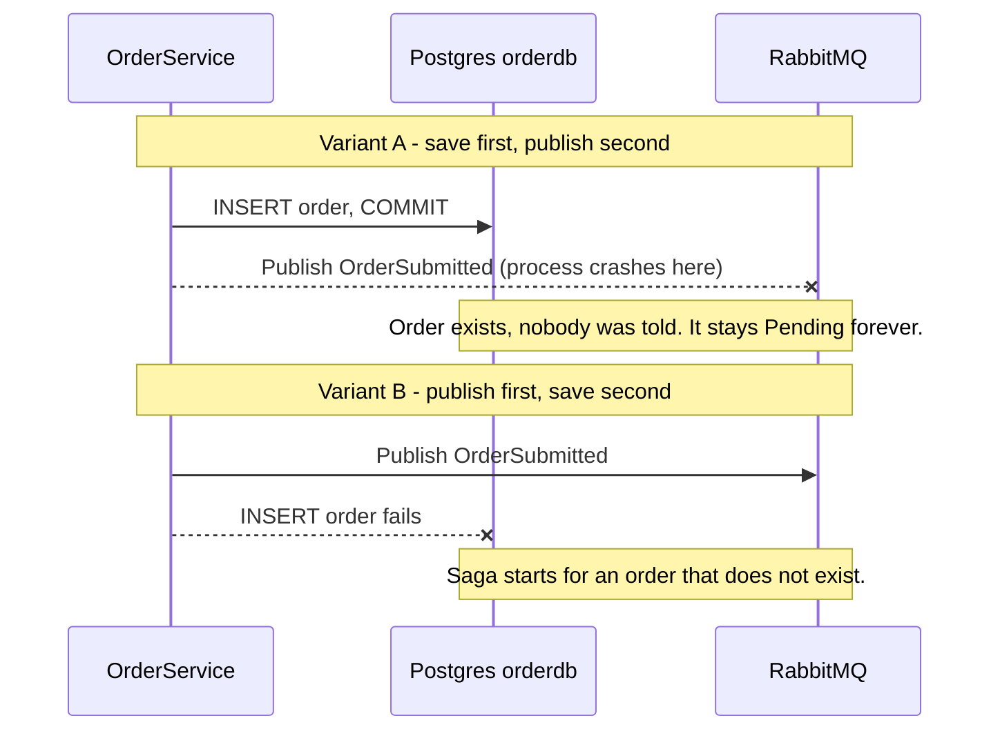
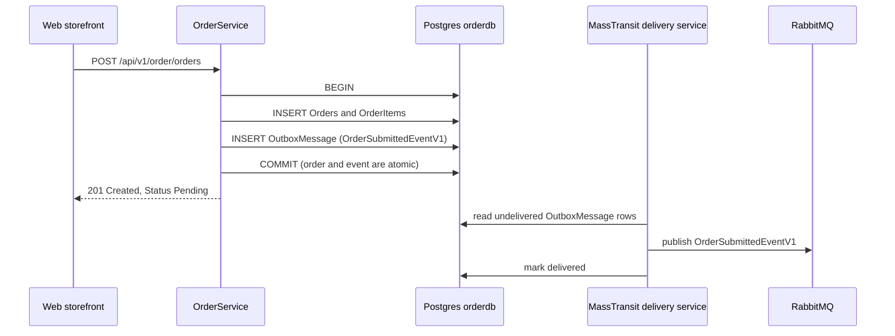
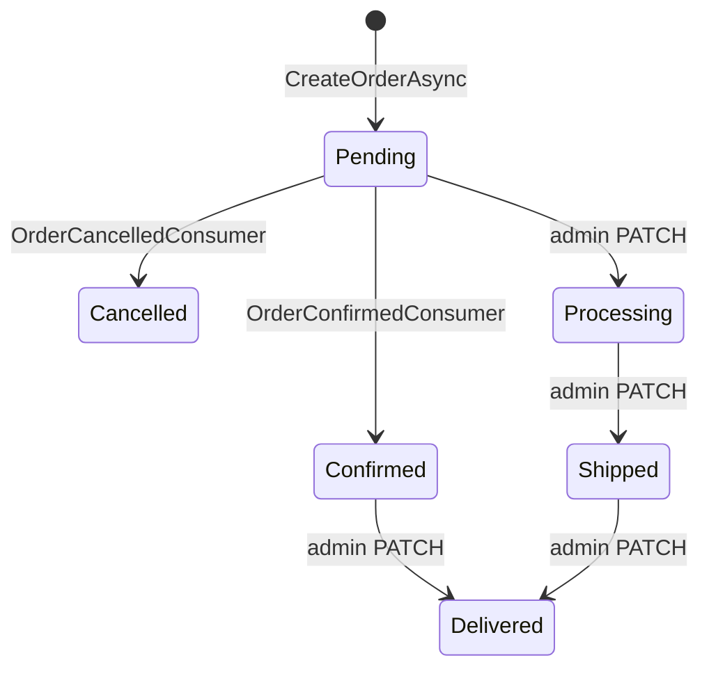

# Chương 5: Orders và Transactional Outbox
> 🇻🇳 Bản tiếng Việt. English version: [05-orders-and-outbox.md](../05-orders-and-outbox.md)

Đặt hàng là khoảnh khắc yêu cầu của một khách hàng SimpleStore biến thành một chuỗi công việc trải rộng trên bốn service. Chương này xem mắt xích đầu tiên của chuỗi đó: cách `Order.API` lưu một đơn hàng và thông báo cho phần còn lại của hệ thống mà không bao giờ làm mất thông báo. Mẹo này gọi là transactional outbox (hộp thư đi trong transaction), và nó là một trong những pattern hữu ích nhất trong các hệ thống hướng sự kiện (event-driven).

**Bạn sẽ học được**

- `OrderService.CreateOrderAsync` làm gì, từng bước một, và vì sao nó gọi `SaveChangesAsync` hai lần.
- "Dual-write problem" (vấn đề ghi kép) là gì và vì sao kiểu "lưu rồi mới publish" đơn thuần là không an toàn.
- Các bảng outbox và inbox giúp bạn có việc gửi thông điệp đáng tin cậy, "gần như chính xác một lần" (effectively exactly-once) như thế nào.
- Các giá trị `OrderStatus` có nghĩa gì và đoạn code nào được phép thay đổi chúng.
- Những phần nào của code đơn hàng là các đơn giản hóa có chủ ý để phục vụ việc học.

---

## Vấn đề cần giải quyết

Khi khách hàng bấm "Place order", hai việc phải xảy ra:

1. Đơn hàng phải được lưu vào `orderdb` (một database Postgres do `Order.API` sở hữu).
2. Phần còn lại của hệ thống phải được báo, bằng cách publish event `OrderSubmittedEventV1` lên RabbitMQ, để checkout saga ([Chương 6](06-checkout-saga.md)) có thể bắt đầu giữ hàng (reserve stock) và thu tiền.

Đây là hai hệ thống khác nhau (Postgres và RabbitMQ). Không có một transaction duy nhất nào bao trùm được cả hai. Nếu bạn làm lần lượt từng việc, một sự cố có thể rơi đúng vào giữa hai bước.

> **Thuật ngữ mới: dual write (ghi kép).** Ghi cùng một thay đổi logic vào hai hệ thống độc lập (ở đây là một database và một message broker) mà không có transaction chung. Nếu một lần ghi thành công còn lần kia thất bại, hai hệ thống sẽ mâu thuẫn nhau, và không có gì trong code của bạn nhận ra điều đó.



*Cách đọc: thời gian chảy từ trên xuống; mũi tên kết thúc bằng `x` là bước không bao giờ hoàn tất. Cả hai thứ tự đều khiến database và broker mâu thuẫn nhau.*

Bọc lệnh publish trong `try/catch` không sửa được điều này. Process có thể bị kill, mạng có thể đứt, hoặc broker có thể đang sập đúng vào khoảnh khắc giữa hai lần ghi.

## Bức tranh tổng thể

Cách sửa là biến event thành một phần của transaction database. Thay vì gửi thông điệp thẳng đến RabbitMQ, service ghi nó vào một bảng ("outbox") trong cùng database, trong cùng transaction với đơn hàng. Sau đó một thành phần chạy nền riêng đọc bảng này và chuyển các dòng đến RabbitMQ.

> **Thuật ngữ mới: transactional outbox (hộp thư đi trong transaction).** Một bảng lưu các thông điệp gửi đi ngay trong database của bạn. Vì dòng thông điệp được commit cùng với dữ liệu nghiệp vụ, nên hoặc cả hai cùng tồn tại hoặc cả hai cùng không. Sau đó một tiến trình chuyển tiếp (relay) sẽ giao các dòng này đến broker.



*Cách đọc: thời điểm duy nhất đơn hàng và event của nó được ghi là lệnh COMMIT duy nhất. Mọi thứ bên dưới response 201 xảy ra sau đó và có thể được thử lại.*

Vì việc giao được thử lại cho đến khi thành công, một thông điệp có thể được giao nhiều hơn một lần (ví dụ, relay publish xong rồi sập trước khi đánh dấu dòng là đã giao). Điều này gọi là at-least-once delivery (giao ít nhất một lần). Phía nhận xử lý các bản trùng bằng hình ảnh phản chiếu của outbox: inbox (hộp thư đến: bảng ghi nhớ thông điệp đã xử lý), được mô tả trong phần thuật toán bên dưới.

## Đi qua mã nguồn

### 1. Đơn hàng đến từ đâu

Storefront dựng request đặt hàng từ giỏ hàng của người mua trong [OrdersController.cs](../../../src/SimpleStore.Web/Controllers/OrdersController.cs), rồi gọi `Order.API` qua gateway. Kiểu request là [CreateOrderRequest.cs](../../../src/SimpleStore.Order.API.Client/CreateOrderRequest.cs): một địa chỉ giao hàng và một danh sách `OrderItemDto` (product id, tên, số lượng, đơn giá).

HTTP endpoint nằm trong [OrderEndpoints.cs](../../../src/SimpleStore.Order.API/Endpoints/OrderEndpoints.cs). Nó đọc user id từ claim `sub` của JWT (không bao giờ lấy từ body request) và gọi service:

```csharp
var userId = user.FindFirstValue("sub");
if (string.IsNullOrEmpty(userId)) return Results.Unauthorized();
var created = await service.CreateOrderAsync(userId, request, ct);
```

### 2. Dựng đơn hàng (không validate, có chủ ý)

[OrderService.cs](../../../src/SimpleStore.Order.API/Services/OrderService.cs) bắt đầu `CreateOrderAsync` bằng việc dựng entity:

```csharp
            Status = OrderStatus.Pending,
            TotalAmount = request.Items.Sum(i => i.UnitPrice * i.Quantity),
            Items = request.Items.Select(i => new OrderItem
            {
                ProductId = i.ProductId,
                ProductName = i.ProductName,
                Quantity = i.Quantity,
                UnitPrice = i.UnitPrice
            }).ToList()
```

Hãy để ý cái gì đang thiếu: `Order.API` không gọi Catalog, không kiểm tra sản phẩm có tồn tại không, và không kiểm tra giá. `ProductName` và `UnitPrice` lấy thẳng từ request. Storefront Web điền chúng từ giỏ hàng của người mua, nhưng một caller gọi thẳng API có thể gửi bất kỳ giá nào. Đây là một đơn giản hóa phục vụ việc học (nó giữ cho `Order.API` độc lập với `Catalog.API`); một hệ thống production sẽ tính lại giá của đơn hàng ở phía server. Xem [Chương 11](11-known-limitations.md).

Cũng chính phương thức này đặt `CorrelationId = Guid.NewGuid()` cho đơn hàng. Id này là khóa gắn kết mọi thông điệp về sau của đơn hàng này, ở mọi service.

### 3. Transaction

Phần lõi của phương thức:

```csharp
var strategy = _context.Database.CreateExecutionStrategy();
await strategy.ExecuteAsync(async () =>
{
    await using var tx = await _context.Database.BeginTransactionAsync(ct);

    _context.Orders.Add(order);
    await _context.SaveChangesAsync(ct);
```

- `CreateExecutionStrategy` / `ExecuteAsync` là lớp bọc retry của EF Core. Vì `Program.cs` bật `EnableRetryOnFailure`, EF Core từ chối một transaction viết tay trừ khi toàn bộ đơn vị công việc nằm bên trong strategy, để nó có thể chạy lại đơn vị đó khi gặp lỗi database tạm thời (transient). Xem [Chương 9](09-resilience-and-observability.md).
- `BeginTransactionAsync` mở transaction sẽ chứa cả đơn hàng lẫn dòng outbox.
- `SaveChangesAsync` đầu tiên chèn đơn hàng. Bước này cần thiết vì `Id` của đơn hàng do Postgres sinh ra khi insert, và event phải mang `OrderId` đó.

### 4. Publish, thực chất chỉ "đặt sẵn" một dòng

```csharp
            }, ct);

            await _context.SaveChangesAsync(ct);
            await tx.CommitAsync(ct);
        });
```

Ngay phía trên đoạn trích này, code gọi `_publishEndpoint.Publish(new OrderSubmittedEventV1 { CorrelationId = ..., OrderId = order.Id, UserId = ..., ... })`. Vì `Program.cs` đã bật bus outbox, lời gọi đó không nói chuyện với RabbitMQ. Nó chỉ trao thông điệp cho outbox trong bộ nhớ của MassTransit. `SaveChangesAsync` thứ hai mới là thứ đẩy nó vào bảng `OutboxMessage`. Sau đó `CommitAsync` làm cho đơn hàng, các item, và dòng outbox hiển thị cùng một lúc. Một comment trong file cũng giải thích cùng lập luận này.

### 5. Bật outbox lên

[Program.cs](../../../src/SimpleStore.Order.API/Program.cs) nối dây MassTransit:

```csharp
builder.Services.AddMassTransit(x =>
{
    x.AddEntityFrameworkOutbox<OrderDbContext>(o =>
    {
        o.UsePostgres();
        o.UseBusOutbox();
    });
    x.AddConsumer<OrderConfirmedConsumer>();
    x.AddConsumer<OrderCancelledConsumer>();
```

- `AddEntityFrameworkOutbox<OrderDbContext>` bảo MassTransit lưu dữ liệu outbox và inbox thông qua `OrderDbContext`.
- `UseBusOutbox()` thay việc publish trực tiếp bằng "ghi vào bảng outbox". Nó cũng khởi động một hosted background service để giao các dòng đến RabbitMQ.

Bản thân các bảng được khai báo trong [OrderDbContext.cs](../../../src/SimpleStore.Order.API/Data/OrderDbContext.cs):

```csharp
        builder.AddInboxStateEntity();
        builder.AddOutboxMessageEntity();
        builder.AddOutboxStateEntity();
```

Trong migration snapshot, chúng trở thành các bảng `InboxState`, `OutboxMessage`, và `OutboxState` (cạnh `Orders` và `OrderItems`).

Phần còn lại của khối `AddMassTransit` (heartbeat của Rabbit, `UseMessageRetry` kiểu exponential với 5 lần thử, `UseCircuitBreaker`) là cấu hình resilience dùng chung cho mọi service; nó được giải thích trong [Chương 9](09-resilience-and-observability.md).

### 6. Inbox: nhận phán quyết của saga

`Order.API` cũng lắng nghe hai event từ saga, `OrderConfirmedEventV1` và `OrderCancelledEventV1`. Xem [OrderConfirmedConsumer.cs](../../../src/SimpleStore.Order.API/Consumers/OrderConfirmedConsumer.cs):

```csharp
        var order = await _context.Orders.FirstOrDefaultAsync(
            o => o.CorrelationId == msg.CorrelationId, context.CancellationToken);

        if (order is null)
        {
            _log.LogWarning("OrderConfirmedEventV1 for unknown CorrelationId {CorrelationId}", msg.CorrelationId);
            return;
        }

        order.Status = OrderStatus.Confirmed;
        await _context.SaveChangesAsync(context.CancellationToken);
```

Consumer tìm đơn hàng theo `CorrelationId` (đó là lý do cột này có unique index, xem đoạn trích `OrderDbContext` bên dưới), đặt trạng thái, rồi lưu. [OrderCancelledConsumer.cs](../../../src/SimpleStore.Order.API/Consumers/OrderCancelledConsumer.cs) giống hệt ngoại trừ `OrderStatus.Cancelled` và một metric được gắn tag lý do hủy.

`ConfigureEndpoints(ctx)` tạo một queue cho mỗi consumer, và vì EF outbox đã được đăng ký, các consumer đó được bọc bằng inbox. Comment trong code của `OrderConfirmedConsumer` nói rõ điều này: "The MassTransit EF inbox makes the consume idempotent."

### 7. Trạng thái đơn hàng (Order status)

[OrderStatus.cs](../../../src/SimpleStore.Order.API/Models/OrderStatus.cs) định nghĩa `Pending, Confirmed, Processing, Shipped, Delivered, Cancelled`. `OrderDbContext` lưu enum dưới dạng text và ép `CorrelationId` phải duy nhất:

```csharp
            e.Property(o => o.Status).HasConversion<string>().HasMaxLength(16);
            // CorrelationId is the saga key — looked up on OrderConfirmedEventV1 / OrderCancelledEventV1.
            e.HasIndex(o => o.CorrelationId).IsUnique();
```

Lưu tên (ví dụ `Confirmed`) thay vì một con số nghĩa là bạn có thể đọc trực tiếp cột đó trong pgweb.

Ai ghi trạng thái? Đúng bốn đường code, và không đường nào kiểm tra giá trị hiện tại:

| Bên ghi | Đặt thành | Ở đâu |
|---|---|---|
| `CreateOrderAsync` | `Pending` | [OrderService.cs](../../../src/SimpleStore.Order.API/Services/OrderService.cs) |
| `OrderConfirmedConsumer` | `Confirmed` | kết quả của saga |
| `OrderCancelledConsumer` | `Cancelled` | kết quả của saga |
| `UpdateStatusAsync` (admin `PATCH /api/v1/order/admin/orders/{id}/status`) | bất kỳ giá trị nào parse được thành `OrderStatus` | thao tác của admin |



*Cách đọc: đây là luồng dự kiến, không phải luồng được ép buộc. Code không bao giờ từ chối một lần chuyển trạng thái; admin PATCH có thể nhảy từ trạng thái nào sang trạng thái nào cũng được, và một consumer ghi đè trạng thái vô điều kiện.*

### 8. Phần còn lại của HTTP surface

Các endpoint của user (cần JWT, chủ sở hữu là claim `sub`): `GET /api/v1/order/orders`, `GET /api/v1/order/orders/{id}`, `POST /api/v1/order/orders`. Các endpoint của admin (role `Admin`): `GET /api/v1/order/admin/orders`, `/count`, `/{id}`, `PATCH /{id}/status`, `/stats`, `/counts-by-user`. Tất cả nằm trong [OrderEndpoints.cs](../../../src/SimpleStore.Order.API/Endpoints/OrderEndpoints.cs). Cách các request đến được đây qua gateway được nói trong [Chương 2](02-gateway-and-api-versioning.md).

## Thuật toán

> **Thuật toán: tạo đơn hàng với outbox** (`OrderService.CreateOrderAsync`)
>
> 1. Dựng một `Order` với `Status = Pending`, một `CorrelationId` mới, và `TotalAmount = sum(UnitPrice * Quantity)` lấy từ request.
> 2. Mở một EF execution strategy; mọi thứ bên dưới là một đơn vị có thể retry.
> 3. `BEGIN` một transaction database.
> 4. `Orders.Add(order)` và `SaveChanges` để Postgres gán `order.Id` và các id của item.
> 5. `Publish(OrderSubmittedEventV1 { CorrelationId, OrderId, UserId, ... })`. Với bus outbox, bước này chỉ đặt sẵn thông điệp trong bộ nhớ.
> 6. `SaveChanges` lần nữa; thông điệp đã đặt sẵn trở thành một dòng trong `OutboxMessage`.
> 7. `COMMIT`. Đơn hàng, các item, và dòng outbox giờ đã bền vững cùng nhau.
> 8. Trả về DTO. (Metric và một dòng log đến sau commit.)

> **Thuật toán: giao outbox** (do hosted delivery service của MassTransit thực hiện, tóm tắt)
>
> 1. Poll outbox để tìm các dòng chưa được giao.
> 2. Publish từng thông điệp lên RabbitMQ.
> 3. Đánh dấu dòng là đã giao (và để MassTransit dọn các dòng cũ sau).
> 4. Nếu process chết ở bất kỳ điểm nào, lặp lại từ bước 1 sau khi khởi động lại. Một thông điệp có thể được publish nhiều hơn một lần; nó không bao giờ bị mất.

> **Thuật toán: khử trùng bằng inbox (inbox deduplication)** (do MassTransit thực hiện quanh mỗi consumer, tóm tắt)
>
> 1. Một thông điệp đến với một `MessageId`. Consumer có một `ConsumerId` ổn định.
> 2. Trong transaction database của chính consumer, tìm một dòng `InboxState` với cặp `(MessageId, ConsumerId)` đó.
> 3. Nếu nó tồn tại và đã được consume, bỏ bản trùng mà không gọi code của bạn.
> 4. Nếu không, chạy consumer của bạn, và ghi dòng inbox trong cùng transaction với các thay đổi của bạn.
> 5. Commit. Hiệu ứng của thông điệp và bản ghi "tôi đã xử lý nó" là nguyên tử (atomic).

Outbox cộng inbox cho ta xử lý "gần như chính xác một lần": việc giao là at-least-once, và các bản trùng bị lọc ở phía nhận. Lưu ý rằng đây là một phát biểu về thiết kế của MassTransit; code service trong repo này chỉ bật tính năng lên.

## Điều gì có thể sai

- **Sập trước `COMMIT`.** Không có gì được lưu, không có event nào tồn tại. Khách hàng thấy lỗi và thử lại. An toàn.
- **Sập sau `COMMIT`, trước khi giao.** Đơn hàng và dòng outbox đã tồn tại. Sau khi khởi động lại, delivery service gửi event đi. Đơn hàng chỉ nằm ở `Pending` lâu hơn một chút. Đây chính xác là trường hợp mà outbox được tạo ra để xử lý.
- **Giao trùng.** Inbox của consumer nhận sẽ lọc nó. Các consumer không có DbContext (như Cart.API) không có inbox và phải được viết sao cho idempotent; xem [Chương 4](04-catalog-and-cart.md).
- **RabbitMQ sập.** Vẫn đặt được đơn hàng, vì `CreateOrderAsync` chỉ nói chuyện với Postgres. Các event dồn lại trong `OutboxMessage` và được xả đi khi broker trở lại.
- **Consumer không tìm thấy đơn hàng.** Cả hai consumer ghi một warning và return, điều này được tính là consume thành công; thông điệp không được retry và việc đổi trạng thái bị bỏ qua một cách âm thầm.
- **Một consumer ném exception.** `UseMessageRetry` thử lại tối đa 5 lần với back-off tăng theo cấp số nhân, sau đó MassTransit chuyển thông điệp vào một queue `_error` để người vận hành xử lý.
- **Trạng thái không được bảo vệ.** Vì các lần chuyển trạng thái không được ép buộc, một `OrderCancelledEventV1` đến muộn sẽ ghi đè một đơn hàng `Delivered`, và admin có thể đặt bất kỳ trạng thái nào. Các hệ thống thực tế bảo vệ các lần chuyển (ví dụ "chỉ `Pending` mới được chuyển thành `Confirmed`").
- **Giá được tin cậy.** Như đã mô tả ở trên, một caller gọi thẳng API có thể tự chọn `UnitPrice`.
- **Màu badge trong storefront có thể gây hiểu nhầm.** Trong [Views/Orders/Index.cshtml](../../../src/SimpleStore.Web/Views/Orders/Index.cshtml) mọi trạng thái khác `Pending` đều nhận badge "success" màu xanh lá, nên một đơn hàng `Cancelled` cũng màu xanh, và trang chi tiết ([Details.cshtml](../../../src/SimpleStore.Web/Views/Orders/Details.cshtml)) luôn dùng badge màu vàng. Hãy đọc chữ, đừng nhìn màu.

## Tự thực hành

1. Khởi động mọi thứ: `dotnet run --project src/SimpleStore.AppHost`. Mở Aspire dashboard (URL được in ra trong console).
2. Trong storefront Web, đăng nhập bằng khách hàng demo đã seed (thông tin đăng nhập có trong README), thêm một sản phẩm vào giỏ, rồi thanh toán. Bạn sẽ đến trang xác nhận đơn hàng. Đơn hàng bắt đầu ở `Pending` và được saga cập nhật một lát sau.
3. Mở **pgweb** từ dashboard (resource `postgres`), chọn database `orderdb`, và chạy:
   - `SELECT "Id", "CorrelationId", "Status", "TotalAmount" FROM "Orders" ORDER BY "Id" DESC;`
   - `SELECT "SequenceNumber", "MessageType", "SentTime" FROM "OutboxMessage" ORDER BY "SequenceNumber" DESC;`
   - `SELECT "MessageId", "ConsumerId", "Received", "Consumed" FROM "InboxState" ORDER BY "Id" DESC;`

   Làm mới truy vấn đơn hàng sau vài giây: `Status` chuyển sang `Confirmed` hoặc `Cancelled` (cái nào phụ thuộc vào số dư ví, xem [Chương 8](08-payment-and-compensation.md)). MassTransit xóa các dòng outbox đã giao theo thời gian, nên bảng outbox có thể trông trống; các dòng `InboxState` (mỗi dòng ứng với một `OrderConfirmed`/`OrderCancelled` đã consume) là dấu vết nhìn thấy được của inbox đang làm việc.
4. Trong tab **Traces** của dashboard, tìm trace `POST /api/v1/order/orders` của `order`. Đi theo nó vào lần publish RabbitMQ và tiếp đến service `checkout`. Trường log scope `CorrelationId` (cùng giá trị với dòng trong `Orders`) cho phép bạn lọc log xuyên suốt các service.
5. Trong **RabbitMQ management** (resource `rabbitmq`), mở tab **Queues**. Bạn sẽ thấy một queue cho mỗi consumer, ví dụ cho `OrderConfirmedConsumer` và `OrderCancelledConsumer`.
6. Thí nghiệm: dừng resource `rabbitmq` từ dashboard, đặt thêm một đơn hàng, rồi khởi động lại nó. Kết quả mong đợi: đơn hàng được tạo bình thường và hiện `Pending`; dòng `OutboxMessage` đang chờ; khi broker trở lại, event được giao và saga tiếp tục chạy. (Dự đoán từ thiết kế; hãy tự kiểm chứng trên máy của bạn.)

## Những điều cần nhớ

- Bạn không thể ghi nguyên tử vào cả database lẫn broker. Outbox biến việc đó thành một transaction cục bộ cộng với một relay có thể retry.
- `CreateOrderAsync` cố ý lưu hai lần: lần đầu để lấy `OrderId` do database sinh ra, lần hai để đẩy event đã đặt sẵn vào `OutboxMessage`, tất cả trong một transaction.
- Outbox cho at-least-once delivery; inbox loại bỏ các bản trùng ở phía consumer.
- `CorrelationId` được `Order.API` tạo ra một lần và là khóa cho saga, log và các consumer.
- Các lần chuyển trạng thái đơn hàng và giá gửi đến không được validate trong dự án mẫu này. Đó là một đơn giản hóa cần nhớ, không phải một pattern để sao chép.

## Chương tiếp theo

Tiếp tục với [Chương 6: The checkout saga](06-checkout-saga.md), nơi `OrderSubmittedEventV1` được publish ở đây khởi động một workflow chạy dài xuyên qua Inventory và Payment.
