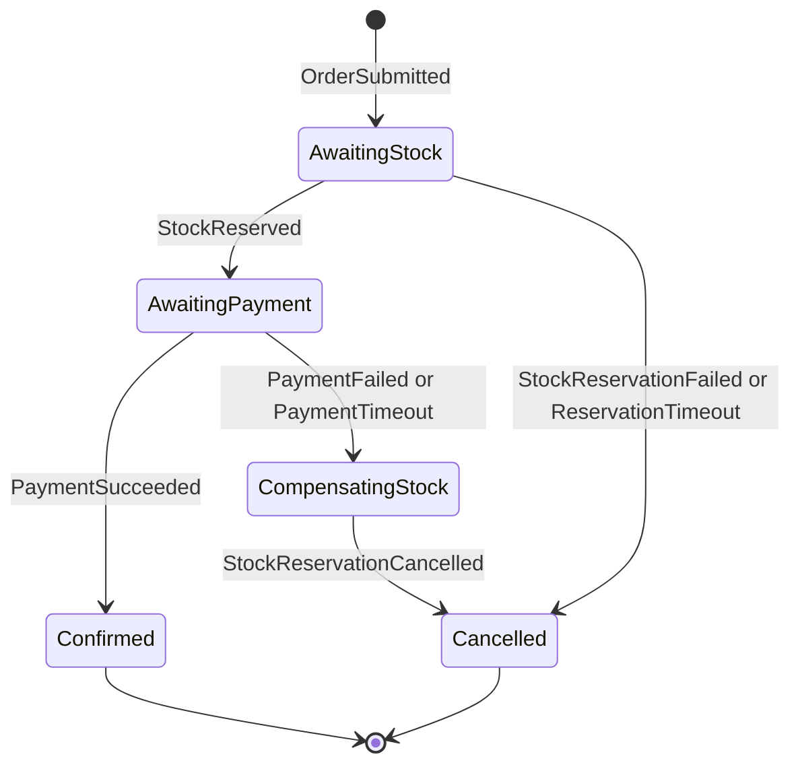
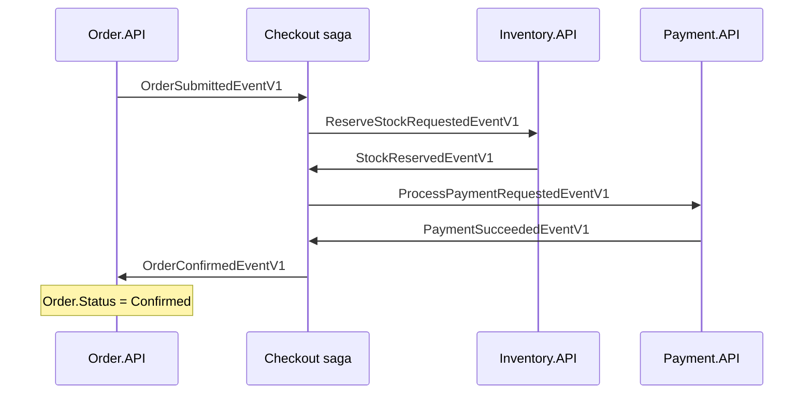
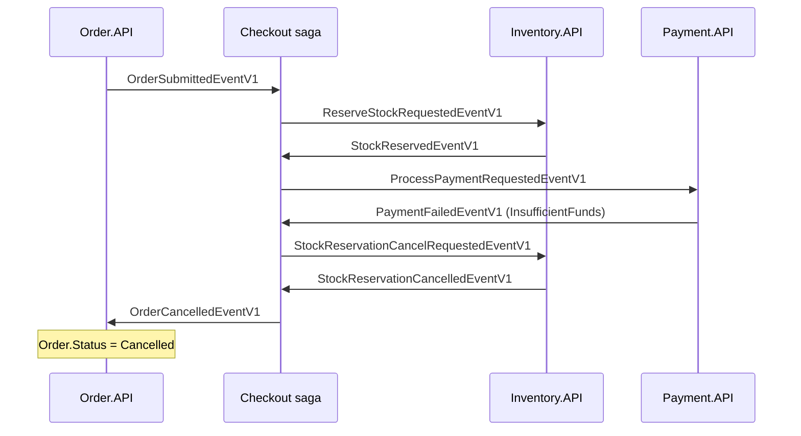

# Chương 6: Checkout Saga
> 🇻🇳 Bản tiếng Việt. English version: [06-checkout-saga.md](../06-checkout-saga.md)

Sau khi một đơn hàng được lưu, ba service nữa phải phối hợp với nhau trước khi đơn có thể được xác nhận: Inventory phải giữ hàng lại, Payment phải thu tiền, và Order phải được báo kết quả. Không có giao dịch database (transaction) đơn lẻ nào bao trùm được các service đó, nên SimpleStore dùng saga: một quy trình chạy dài, được điều khiển bởi một state machine (máy trạng thái) nhớ mỗi đơn đang ở đâu, và biết cách hoàn tác các bước trước đó khi một bước sau thất bại. Chương này đi qua `SimpleStore.Checkout.API`, service chứa state machine đó.

**Bạn sẽ học được**

- Saga là gì, và nó khác distributed transaction (two-phase commit) như thế nào.
- Orchestration (điều phối tập trung) so với choreography (các service tự phối hợp), và compensation (bù trừ) so với rollback (hoàn tác).
- Mọi trạng thái và mọi chuyển tiếp của `CheckoutSagaStateMachine`, đọc thẳng từ mã nguồn.
- Timeout được lên lịch, lưu bền vững và hủy như thế nào.
- Vì sao thất bại ở bước thanh toán cần compensation nhưng thất bại ở bước giữ hàng thì không.
- Những tình huống mà mã nguồn không xử lý tường minh (message đến muộn và message trùng lặp), và cần kiểm chứng điều gì.

---

## Vấn đề cần giải quyết

Checkout chạm tới nhiều service, mỗi service có database riêng:

| Bước | Service | Database |
|---|---|---|
| Lưu đơn hàng | Order.API | `orderdb` |
| Giữ hàng trong kho | Inventory.API | KurrentDB + `inventorydb` |
| Thu tiền khách hàng | Payment.API | `paymentdb` |
| Đặt trạng thái cuối cùng của đơn | Order.API | `orderdb` |

Bạn muốn ngữ nghĩa "tất cả hoặc không gì cả": hoặc hàng được giữ, tiền được thu, và đơn được xác nhận, hoặc không có gì xảy ra. Trong một database duy nhất bạn sẽ dùng một transaction. Qua nhiều service thì bạn không thể.

> **Thuật ngữ mới: distributed transaction (giao dịch phân tán, two-phase commit, 2PC).** Một giao thức trong đó một coordinator (bộ điều phối) yêu cầu mọi bên tham gia "chuẩn bị" (prepare), rồi bảo tất cả "commit" hoặc tất cả "hủy" (abort). Nó cho tính nguyên tử (atomicity) thật sự, nhưng các bên phải giữ lock trong lúc chờ, mọi bên đều phải hỗ trợ giao thức, và nếu coordinator bị sập thì mọi người có thể bị kẹt. Các microservice có database riêng và dùng message broker thường tránh nó.

> **Thuật ngữ mới: saga.** Một chuỗi các local transaction (giao dịch cục bộ), mỗi service một cái, được nối với nhau bằng các message. Nếu một bước thất bại, saga chạy các hành động bù trừ (compensating action) cho những bước đã thành công, thay vì rollback.

> **Thuật ngữ mới: compensation (bù trừ).** Một hành động mới làm hoàn tác về mặt ngữ nghĩa một hành động đã commit trước đó (ví dụ "nhả lượng hàng đã giữ"). Nó khác rollback: rollback làm cho thay đổi trước đó coi như chưa từng xảy ra, còn compensation là một thay đổi thứ hai, nhìn thấy được, triệt tiêu tác dụng của thay đổi đầu. Ở giữa hai thay đổi đó, các service khác có thể đã thấy trạng thái trung gian.

> **Thuật ngữ mới: orchestration so với choreography.** Trong choreography, mỗi service phản ứng với event từ các service khác và không ai nắm toàn cảnh. Trong orchestration, một thành phần (ở đây là saga) nắm toàn bộ quy trình và bảo các bên khác làm gì tiếp theo. SimpleStore dùng orchestration vì luồng xử lý dễ đọc trong một file.

## Bức tranh tổng thể

`Checkout.API` không có HTTP endpoint và không có JWT. Nó thuần túy là một RabbitMQ consumer sở hữu `checkoutdb`. Với mỗi đơn hàng, nó giữ một dòng trạng thái. Mỗi event đến sẽ chuyển dòng đó từ trạng thái này sang trạng thái kế tiếp và publish lệnh tiếp theo.



*Cách đọc: mỗi mũi tên là "event đến" và trạng thái mà nó dẫn tới. `Confirmed` và `Cancelled` là trạng thái cuối; dòng saga bị xóa khi tới đó. `CompensatingStock` chỉ tồn tại trên đường đi khi thanh toán thất bại.*

Đường đi thuận lợi (happy path), với các service là các cột:



*Cách đọc: mỗi mũi tên là một message đi qua RabbitMQ (không bao giờ là gọi trực tiếp). Saga là service duy nhất nói chuyện với tất cả mọi bên.*

Thanh toán thất bại kèm compensation:



*Cách đọc: hàng đã được giữ khi thanh toán thất bại, nên saga phải yêu cầu Inventory nhả hàng và chờ xác nhận trước khi báo cho Order rằng đơn đã bị hủy.*

Để xem tài liệu tham khảo chi tiết theo từng message, hãy đọc [docs/checkout-saga.md](../../checkout-saga.md), mục 15 ("v12 - payment step + stock-release compensation"). Các mục 2 đến 12 của tài liệu đó mô tả thiết kế v8 trước đó (khi bước thanh toán chưa tồn tại), nên hãy dùng mục 15 cho luồng hiện tại.

## Đi qua mã nguồn

### 1. Checkout.API được nối dây như một consumer thuần túy

[Program.cs](../../../src/SimpleStore.Checkout.API/Program.cs) đăng ký state machine và phần lưu trữ của nó:

```csharp
    x.AddSagaStateMachine<CheckoutSagaStateMachine, CheckoutSagaState>()
        .EntityFrameworkRepository(r =>
        {
            r.ConcurrencyMode = ConcurrencyMode.Pessimistic; // row-lock the saga instance per message
            r.ExistingDbContext<CheckoutDbContext>();
            r.UsePostgres();
        });
```

- `EntityFrameworkRepository` lưu mỗi saga instance thành một dòng thông qua `CheckoutDbContext`.
- `ConcurrencyMode.Pessimistic` nghĩa là trong lúc một message đang được xử lý cho một saga instance, MassTransit khóa dòng đó, nên hai message của cùng một đơn được xử lý lần lượt, cái này sau cái kia.
- Cùng file đó cũng bật EF Core bus outbox (`AddEntityFrameworkOutbox<CheckoutDbContext>` với `UseBusOutbox()`), cùng cơ chế như trong [Chương 5](05-orders-and-outbox.md). Các message mà saga publish được ghi vào outbox (hộp thư đi: bảng lưu các message chờ gửi) trong cùng một transaction với việc đổi trạng thái saga, nên "trạng thái đã chuyển" và "lệnh tiếp theo đã được gửi" không thể lệch nhau.
- Các cài đặt bus thông thường (heartbeat, `UseMessageRetry` với 5 lần thử theo cấp số nhân, `UseCircuitBreaker`) cũng nằm ở đây; xem [Chương 9](09-resilience-and-observability.md).

### 2. Cái gì được lưu: `checkout_saga_state`

[CheckoutSagaState.cs](../../../src/SimpleStore.Checkout.API/Sagas/CheckoutSagaState.cs) chứa dữ liệu, và [CheckoutDbContext.cs](../../../src/SimpleStore.Checkout.API/Data/CheckoutDbContext.cs) ánh xạ (map) nó:

```csharp
        builder.Entity<CheckoutSagaState>(e =>
        {
            e.ToTable("checkout_saga_state");
            e.HasKey(x => x.CorrelationId);
            e.Property(x => x.CorrelationId).ValueGeneratedNever();
            e.Property(x => x.CurrentState).HasMaxLength(64);
            e.Property(x => x.UserId).HasMaxLength(256);
            e.Property(x => x.FailureReason).HasMaxLength(128);
            e.HasIndex(x => x.OrderId);
        });
```

Bảng `checkout_saga_state` có các cột sau: `CorrelationId` (khóa chính, do Order.API cung cấp), `CurrentState`, `OrderId`, `UserId`, `Amount` (tổng tiền của đơn, sau đó được gửi cho Payment), `ReservationId` (một GUID mới do saga tạo cho Inventory), `TimeoutTokenId` và `PaymentTimeoutTokenId` (các handle dùng để hủy timeout đã lên lịch), `FailureReason`, `CreatedAt`, `UpdatedAt`. Không có cột row-version; tính đồng thời (concurrency) được xử lý bằng pessimistic lock đã mô tả ở trên.

> **Thuật ngữ mới: correlation id (mã tương quan).** Một định danh đi kèm trong mọi message về cùng một giao dịch nghiệp vụ. Saga dùng nó để tìm ra dòng "của mình". Mọi event đều mang nó, nên saga chỉ cần khớp `CorrelationId`.

### 3. Trạng thái, event và schedule

[CheckoutSagaStateMachine.cs](../../../src/SimpleStore.Checkout.API/Sagas/CheckoutSagaStateMachine.cs) khai báo chúng dưới dạng các property:

```csharp
    public State AwaitingStock { get; private set; } = null!;
    public State AwaitingPayment { get; private set; } = null!;
    public State CompensatingStock { get; private set; } = null!;
    public State Confirmed { get; private set; } = null!;
    public State Cancelled { get; private set; } = null!;

    public Event<OrderSubmittedEventV1> OrderSubmitted { get; private set; } = null!;
    public Event<StockReservedEventV1> StockReserved { get; private set; } = null!;
    public Event<StockReservationFailedEventV1> StockReservationFailed { get; private set; } = null!;
    public Event<PaymentSucceededEventV1> PaymentSucceeded { get; private set; } = null!;
    public Event<PaymentFailedEventV1> PaymentFailed { get; private set; } = null!;
    public Event<StockReservationCancelledEventV1> StockReservationCancelled { get; private set; } = null!;

    public Schedule<CheckoutSagaState, ReservationTimeoutExpired> ReservationTimeout { get; private set; } = null!;
    public Schedule<CheckoutSagaState, PaymentTimeoutExpired> PaymentTimeout { get; private set; } = null!;
```

MassTransit cũng cung cấp sẵn các trạng thái `Initial` và `Final`. Cộng với năm trạng thái ở trên, tổng cộng có bảy trạng thái.

Mọi event đều được tương quan (correlate) trên cùng một trường:

```csharp
        Event(() => OrderSubmitted, e => e.CorrelateById(ctx => ctx.Message.CorrelationId));
        Event(() => StockReserved, e => e.CorrelateById(ctx => ctx.Message.CorrelationId));
        Event(() => StockReservationFailed, e => e.CorrelateById(ctx => ctx.Message.CorrelationId));
        Event(() => PaymentSucceeded, e => e.CorrelateById(ctx => ctx.Message.CorrelationId));
        Event(() => PaymentFailed, e => e.CorrelateById(ctx => ctx.Message.CorrelationId));
        Event(() => StockReservationCancelled, e => e.CorrelateById(ctx => ctx.Message.CorrelationId));
```

Chỉ `OrderSubmitted` được xử lý trong `Initially(...)`, nên nó là event duy nhất có thể tạo ra một dòng saga mới.

### 4. Khởi động saga

```csharp
        Initially(
            When(OrderSubmitted)
                .Then(ctx =>
                {
                    ctx.Saga.OrderId = ctx.Message.OrderId;
                    ctx.Saga.UserId = ctx.Message.UserId;
                    ctx.Saga.Amount = ctx.Message.TotalAmount;
                    ctx.Saga.ReservationId = Guid.NewGuid();
                    ctx.Saga.CreatedAt = DateTime.UtcNow;
                    ctx.Saga.UpdatedAt = DateTime.UtcNow;
                    LogTransition(ctx.Saga, "Initial", "AwaitingStock", reason: null);
                })
                .Schedule(ReservationTimeout, ctx => new ReservationTimeoutExpired { CorrelationId = ctx.Saga.CorrelationId })
```

Sau đó mã publish `ReserveStockRequestedEventV1` (một `ReservationLineItem` cho mỗi sản phẩm được đặt) và gọi `.TransitionTo(AwaitingStock)`.

### 5. Hàng đã được giữ: chuyển sang thanh toán

```csharp
            When(StockReserved)
                .Unschedule(ReservationTimeout)
                .Then(ctx =>
                {
                    ctx.Saga.UpdatedAt = DateTime.UtcNow;
                    LogTransition(ctx.Saga, "AwaitingStock", "AwaitingPayment", reason: null);
                })
                .Schedule(PaymentTimeout, ctx => new PaymentTimeoutExpired { CorrelationId = ctx.Saga.CorrelationId })
```

Câu trả lời về hàng đã đến kịp lúc, nên timeout của bước giữ hàng bị hủy (`Unschedule`) và một timeout thanh toán được bắt đầu. Sau đó saga publish `ProcessPaymentRequestedEventV1` mang theo `OrderId`, `UserId` và `Amount` đã lưu, rồi chuyển sang `AwaitingPayment`. Hai nhánh thất bại của `AwaitingStock` (`StockReservationFailed` và timeout) đều publish `OrderCancelledEventV1` và đi thẳng tới `Cancelled`; không có gì cần hoàn tác vì Inventory chưa giữ gì cả.

### 6. Thanh toán thất bại: chạy compensation

```csharp
                .Publish(ctx => new StockReservationCancelRequestedEventV1
                {
                    CorrelationId = ctx.Saga.CorrelationId,
                    ReservationId = ctx.Saga.ReservationId,
                    OrderId = ctx.Saga.OrderId,
                    RequestedAt = DateTimeOffset.UtcNow
                })
                .TransitionTo(CompensatingStock),
```

Đây là phần đuôi của handler `When(PaymentFailed)` (handler `PaymentTimeout.Received` kết thúc theo cách tương tự). Trước đoạn này, handler lưu `FailureReason` từ message (hoặc `"PaymentTimeout"`). Saga chưa hủy đơn ngay. Trước tiên nó chờ trong `CompensatingStock`, vì hàng vẫn đang bị giữ. Về phía Inventory, [CancelReservationRequestedConsumer.cs](../../../src/SimpleStore.Inventory.API/Consumers/CancelReservationRequestedConsumer.cs) nhận yêu cầu và nhả reservation (lượng hàng đã giữ); [Chương 7](07-inventory-event-sourcing-cqrs.md) giải thích cách làm.

### 7. Compensation xong: hủy đơn và kết thúc

```csharp
                .Publish(ctx => new OrderCancelledEventV1
                {
                    CorrelationId = ctx.Saga.CorrelationId,
                    OrderId = ctx.Saga.OrderId,
                    Reason = ctx.Saga.FailureReason ?? "PaymentFailed",
                    CancelledAt = DateTimeOffset.UtcNow
                })
                .TransitionTo(Cancelled)
                .Finalize());
```

Đoạn này thuộc về `During(CompensatingStock, When(StockReservationCancelled) ...)`. Lý do báo cho Order.API là bất cứ thứ gì đã được lưu trước đó (`InsufficientFunds` hoặc `PaymentTimeout`).

`Finalize()` chuyển instance sang trạng thái `Final` có sẵn, và dòng cuối của constructor xóa nó khỏi database:

```csharp
        // Remove finalized saga instances from checkoutdb. Flip to keep them for audit.
        SetCompletedWhenFinalized();
```

Vì vậy `checkout_saga_state` chỉ chứa các đơn vẫn đang xử lý dở. Một đơn đã hoàn tất không để lại dòng nào (dấu vết kiểm toán nằm trong log và trace).

### 8. Hàm hỗ trợ quan sát (observability)

`LogTransition` ghi dòng log `Saga {CorrelationId} order {OrderId}: {FromState} -> {ToState}.` (kèm lý do nếu có) và đặt các tag như `saga.state.from` và `saga.state.to` lên activity của trace hiện tại. Nhờ vậy bạn có thể theo dõi một đơn hàng xuyên qua các service trong Aspire dashboard ([Chương 9](09-resilience-and-observability.md)).

### 9. Timeout

`Schedule(...)` định nghĩa một bộ đếm giờ gửi một message tới chính saga sau một khoảng trễ:

```csharp
        Schedule(() => ReservationTimeout, x => x.TimeoutTokenId, s =>
        {
            s.Delay = TimeSpan.FromSeconds(reservationTimeoutSeconds);
            s.Received = r => r.CorrelateById(ctx => ctx.Message.CorrelationId);
        });
```

`TimeoutTokenId` là cột nơi MassTransit lưu handle của message đã lên lịch, để `Unschedule` có thể hủy nó. Bộ đếm giờ thanh toán được khai báo tương tự với `PaymentTimeoutTokenId`. Các khoảng trễ đến từ cấu hình, `Checkout:ReservationTimeoutSeconds` và `Checkout:PaymentTimeoutSeconds`, mỗi cái mặc định 30 giây. Trong [appsettings.json](../../../src/SimpleStore.Checkout.API/appsettings.json) chỉ giá trị của reservation được đặt, nên timeout thanh toán dùng mặc định 30 giây.

Các bộ đếm giờ sống trong Quartz với một kho lưu trữ database bền vững (persistent), được thiết lập trong `Program.cs`:

```csharp
        s.UsePostgres(pg =>
        {
            pg.ConnectionString = checkoutDbConnectionString;
            pg.TablePrefix = "qrtz_";
        });
        s.UseSystemTextJsonSerializer();
```

Các bảng Quartz (`qrtz_job_details`, `qrtz_triggers` và các bảng khác) được tạo bởi migration `AddQuartzTables` trong `checkoutdb`. Vì các trigger đang chờ được lưu trong Postgres, việc khởi động lại Checkout.API không làm nó quên chúng; các comment trong mã nói rằng Quartz nạp lại chúng khi khởi động và kích hoạt những trigger đã đến hạn trong lúc tiến trình đang tắt. Thiết lập này dành cho một replica Checkout.API duy nhất; chạy nhiều replica sẽ cần Quartz clustering, thứ chưa được cấu hình.

### Bảng chuyển tiếp trạng thái

| # | Từ trạng thái | Trigger | Saga làm gì | Publish | Sang trạng thái |
|---|---|---|---|---|---|
| 1 | `Initial` | `OrderSubmitted` | Sao chép `OrderId`, `UserId`, `Amount`; tạo `ReservationId`; lên lịch `ReservationTimeout` | `ReserveStockRequestedEventV1` | `AwaitingStock` |
| 2 | `AwaitingStock` | `StockReserved` | Hủy lịch `ReservationTimeout`; lên lịch `PaymentTimeout` | `ProcessPaymentRequestedEventV1` | `AwaitingPayment` |
| 3 | `AwaitingStock` | `StockReservationFailed` | Hủy lịch `ReservationTimeout`; lưu `FailureReason` từ message | `OrderCancelledEventV1` | `Cancelled`, rồi finalize |
| 4 | `AwaitingStock` | `ReservationTimeout` kích hoạt | Lưu `FailureReason = "ReservationTimeout"` | `OrderCancelledEventV1` | `Cancelled`, rồi finalize |
| 5 | `AwaitingPayment` | `PaymentSucceeded` | Hủy lịch `PaymentTimeout` | `OrderConfirmedEventV1` | `Confirmed`, rồi finalize |
| 6 | `AwaitingPayment` | `PaymentFailed` | Hủy lịch `PaymentTimeout`; lưu `FailureReason` từ message | `StockReservationCancelRequestedEventV1` | `CompensatingStock` |
| 7 | `AwaitingPayment` | `PaymentTimeout` kích hoạt | Lưu `FailureReason = "PaymentTimeout"` | `StockReservationCancelRequestedEventV1` | `CompensatingStock` |
| 8 | `CompensatingStock` | `StockReservationCancelled` | Đọc `FailureReason` đã lưu | `OrderCancelledEventV1` (lý do là `FailureReason`, hoặc `"PaymentFailed"` nếu rỗng) | `Cancelled`, rồi finalize |

Các lý do hủy bạn sẽ thấy trong `OrderCancelledEventV1.Reason`, trong log, và trong tag `reason` của metric Order: `InsufficientStock` (từ Inventory), `ReservationTimeout`, `InsufficientFunds` (từ Payment), `PaymentTimeout`.

## Thuật toán

> **Thuật toán: saga xử lý một message như thế nào**
>
> 1. Một message đến trên queue mà MassTransit đã tạo cho saga.
> 2. Đọc `CorrelationId` của nó. Khóa dòng `checkout_saga_state` tương ứng (chế độ pessimistic). Nếu event là `OrderSubmitted` và chưa có dòng nào, một instance mới được tạo ở trạng thái `Initial`.
> 3. Tìm handler cho (trạng thái hiện tại, event). Nếu không có, xem "Điều gì có thể sai" bên dưới.
> 4. Chạy handler: cập nhật các trường, lên lịch hoặc hủy lịch các bộ đếm giờ, chuẩn bị (stage) các message cần publish.
> 5. Lưu `CurrentState` mới và ghi các message đã chuẩn bị vào outbox, trong một transaction database duy nhất.
> 6. Nếu instance đã được finalize, xóa dòng đó (`SetCompletedWhenFinalized`).
> 7. Dịch vụ giao outbox (outbox delivery service) gửi các message đã chuẩn bị tới RabbitMQ.

> **Thuật toán: vì sao thanh toán thất bại thì compensation còn giữ hàng thất bại thì không**
>
> 1. Đi qua các bước theo thứ tự: giữ hàng, rồi thu tiền, rồi xác nhận.
> 2. Một bước thất bại chưa thay đổi gì bền vững, nên không cần hoàn tác. Một bước đã thành công trước đó thì đã thay đổi một thứ gì đó, nên nó phải được hoàn tác nếu một bước sau thất bại.
> 3. Giữ hàng thất bại (`StockReservationFailed`): Inventory từ chối yêu cầu và không giữ gì. Không có bước nào trước đó thành công, nên hủy thẳng.
> 4. Thanh toán thất bại (`PaymentFailed`): `PaymentService` không ghi dòng sổ cái (ledger) nào và không đổi số dư khi bị từ chối, nên không có tiền nào để trả lại. Nhưng reservation hàng từ bước 1 vẫn đang được giữ, nên nó phải được nhả: đó chính là compensation, và saga chờ xác nhận của Inventory (`CompensatingStock`) trước khi hủy đơn.

## Điều gì có thể sai

- **Một bước không bao giờ trả lời.** Cả hai trạng thái chờ đều có bộ đếm giờ, nên saga không thể chờ mãi. Timeout giữ hàng thì hủy thẳng. Timeout thanh toán thì chạy compensation nhả hàng.
- **Checkout.API khởi động lại giữa chừng một saga.** Trạng thái nằm trong Postgres và các bộ đếm giờ nằm trong các bảng Quartz của cùng database đó, nên saga tiếp tục chạy. Các message đến trong lúc nó đang tắt sẽ chờ trong RabbitMQ.
- **Handler ném exception.** MassTransit thử lại tối đa 5 lần với back-off tăng theo cấp số nhân trước khi chuyển message sang error queue.
- **Event đến muộn, trùng lặp, hoặc sai thứ tự.** State machine chỉ định nghĩa handler cho các tổ hợp có trong bảng trên. Nó không có `Ignore(...)`, `DuringAny(...)` hay `OnUnhandledEvent(...)` tường minh nào, nên không có đoạn mã nào trong repository này nói cần làm gì với, ví dụ, một `StockReserved` thứ hai, một `PaymentSucceeded` đến khi đang ở `CompensatingStock`, hoặc bất kỳ event nào mà dòng saga của nó đã bị xóa. MassTransit mặc định làm gì với một event không có handler ở trạng thái hiện tại, hoặc không có instance khớp, là điều bạn nên kiểm chứng trong tài liệu MassTransit và bằng thí nghiệm. Tài liệu này không khẳng định điều đó.
- **Lỗ hổng thanh toán muộn (một hạn chế thiết kế để thảo luận).** Giả sử `PaymentTimeout` kích hoạt trước, nên saga bắt đầu compensation và đơn kết thúc ở `Cancelled`. Nếu `Payment.API` chỉ chậm chứ không chết, `DebitForOrderAsync` của nó vẫn có thể commit sau đó: số dư bị trừ và một dòng sổ cái `Payment` được ghi, rồi `PaymentSucceededEventV1` được publish tới một saga không còn chờ nó nữa. Khách hàng đã trả tiền cho một đơn đã bị hủy, và không có mã nào trong repository hoàn tiền. Điều tương tự có thể xảy ra nếu Payment.API đã bị dừng: message `ProcessPaymentRequestedEventV1` chờ trong queue của nó và được xử lý khi service quay lại (xem thí nghiệm bên dưới). Các hệ thống thực tế thêm đường hoàn tiền (refund) hoặc logic bỏ qua-và-đối soát (reconcile); xem [Chương 11](11-known-limitations.md).
- **Bộ đếm giờ kích hoạt sau khi đã hoàn tất?** Các bộ đếm giờ bị hủy bằng `Unschedule` trên các đường thành công. Mã không cho thấy chuyện gì xảy ra nếu một message timeout được gửi tới một saga đã chuyển sang trạng thái khác hoặc đã bị xóa; hãy coi đó là một trường hợp nữa của câu hỏi về event không được xử lý.
- **Một replica duy nhất.** Quartz trong cấu hình này, giống như projector của Inventory, giả định chỉ có một instance đang chạy.

## Tự thực hành

1. Chạy `dotnet run --project src/SimpleStore.AppHost` và mở Aspire dashboard.
2. Happy path. Trong ứng dụng Admin, mở **Payments** và nạp một số tiền lớn cho khách hàng demo (xem [Chương 8](08-payment-and-compensation.md)). Trong storefront, đặt một đơn hàng. Trong dashboard, mở **Structured logs**, chọn resource `checkout`, và tìm các dòng như `Saga ... order ...: Initial -> AwaitingStock.`, rồi `AwaitingStock -> AwaitingPayment.`, rồi `AwaitingPayment -> Confirmed.`. Lọc theo giá trị `CorrelationId` để thấy cả các dòng tương ứng trong `order`, `inventory` và `payment`.
3. Trace. Trong **Traces**, mở trace bắt đầu từ `POST /api/v1/order/orders`. Các span của saga mang các tag `saga.state.from` và `saga.state.to`.
4. RabbitMQ management (resource `rabbitmq`, tab **Queues**): bạn sẽ thấy các queue cho saga và cho consumer của mỗi service. Tốc độ message tăng lên thoáng chốc khi bạn đặt một đơn hàng.
5. pgweb, database `checkoutdb`: `SELECT * FROM checkout_saga_state;`. Thường nó rỗng, vì các saga đã xong bị xóa. Để bắt được một dòng đang xử lý dở, hãy làm thí nghiệm bên dưới.
6. **Cố ý làm hỏng, phần 1: không đủ tiền.** Hãy chắc chắn ví của khách hàng demo trống hoặc thấp hơn tổng tiền đơn (**Payments** trong Admin hiển thị số dư). Đặt một đơn cho một sản phẩm, và ghi lại tồn kho của nó trên storefront hoặc trong Admin trước khi đặt. Trong log của `checkout` bạn sẽ thấy `AwaitingStock -> AwaitingPayment`, rồi `AwaitingPayment -> CompensatingStock (InsufficientFunds)`, rồi `CompensatingStock -> Cancelled (InsufficientFunds)`. Trạng thái đơn trở thành `Cancelled`, và sau khi projector của Inventory và Catalog đã xử lý cập nhật, tồn kho của sản phẩm trở về giá trị ban đầu.
7. **Cố ý làm hỏng, phần 2: một payment service đã chết.** Dừng resource `payment` trong dashboard, đặt một đơn hàng, và nhanh chóng chạy `SELECT "CorrelationId", "CurrentState", "FailureReason" FROM checkout_saga_state;` trong pgweb. Bạn sẽ thấy `AwaitingPayment`. Sau khoảng 30 giây log hiển thị `AwaitingPayment -> CompensatingStock (PaymentTimeout)` và đơn kết thúc ở `Cancelled` với tồn kho được khôi phục. Bước tiếp theo tùy chọn: khởi động lại `payment` và quan sát log cũng như ví của nó. Dự đoán của chúng tôi từ thiết kế, mà bạn nên kiểm chứng, là yêu cầu nằm trong queue giờ được xử lý, nên một dòng sổ cái `Payment` có thể xuất hiện cho một đơn đã bị hủy. Đó là lỗ hổng thanh toán muộn đã mô tả ở trên.

## Những điều cần nhớ

- Saga thay một transaction lớn bằng nhiều transaction nhỏ cộng với các compensation. Compensation là các hành động mới, không phải rollback.
- `CheckoutSagaStateMachine` là một orchestrator: một file cho thấy toàn bộ luồng checkout, và dòng của nó trong `checkout_saga_state` ghi lại mỗi đơn đang ở đâu.
- Mọi thứ đều được định danh bằng `CorrelationId`; chỉ `OrderSubmitted` mới có thể tạo một saga instance.
- Timeout được lưu bền vững trong các bảng Quartz, nên chúng sống sót qua các lần khởi động lại, và bị hủy ngay khi câu trả lời đang chờ đến nơi.
- Việc đổi trạng thái cộng với các message được publish là nguyên tử nhờ outbox; khóa dòng giữ cho các message của một đơn được xử lý tuần tự.
- Mã không có xử lý tường minh cho các event đến muộn, trùng lặp hoặc sai thứ tự; biết MassTransit làm gì ở đó, và thêm các quy tắc hoàn tiền hoặc bỏ qua, là một phần của việc làm cho nó sẵn sàng cho production.

## Chương tiếp theo

Hãy tiếp tục với [Chương 7: Inventory, event sourcing và CQRS](07-inventory-event-sourcing-cqrs.md) để xem hàng được giữ và nhả như thế nào. Phần câu chuyện về phía Payment nằm trong [Chương 8](08-payment-and-compensation.md).
