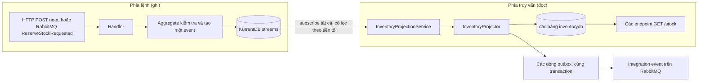
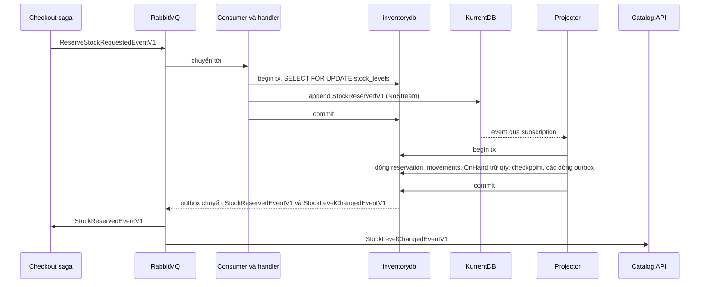
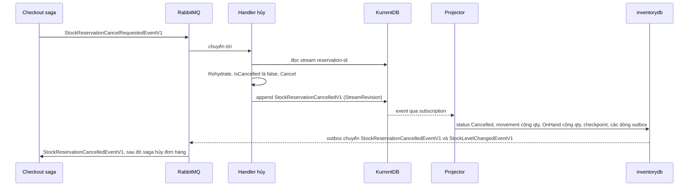

# Chương 7 - Inventory: Event Sourcing và CQRS

> 🇻🇳 Bản tiếng Việt. English version: [07-inventory-event-sourcing-cqrs.md](../07-inventory-event-sourcing-cqrs.md)

`SimpleStore.Inventory.API` là nguồn sự thật duy nhất về hàng tồn kho. Khác với mọi service khác trong repo này, nó không lưu "trạng thái hiện tại" trong một bảng rồi cập nhật bảng đó. Nó lưu một bản ghi (log) những việc đã xảy ra (một phiếu nhập kho được ghi nhận, hàng được giữ chỗ, một reservation được nhả ra) trong KurrentDB, và nó suy ra các con số tồn kho hiện tại từ log đó vào Postgres. Chương này giải thích thiết kế đó, cách checkout saga sử dụng nó, và những chỗ "sắc cạnh" dễ gây đau.

**Bạn sẽ học được**

- Event sourcing và CQRS là gì, qua các đoạn mã có thể xem trực tiếp.
- Một aggregate (`Reservation`) quyết định, ghi lại và phát lại (replay) event như thế nào.
- Vì sao event store nằm sau một interface (`IEventStore`) và optimistic concurrency làm cho việc retry trở nên an toàn ra sao.
- Cách projector chạy nền chuyển event thành các bảng read, lưu checkpoint tiến độ và publish integration event trong cùng một transaction.
- Một reservation và compensation của nó (việc nhả hàng) chạy từ đầu đến cuối ra sao.
- Cách dựng lại toàn bộ read model bằng cách xóa nó đi rồi khởi động lại.
- Vì sao bạn nên, và không nên, dùng mẫu thiết kế này trong một hệ thống thật.

Kiến thức nền: [chương 1](01-architecture-and-aspire.md) (bản đồ các service), [chương 5](05-orders-and-outbox.md) (ý tưởng về outbox) và [chương 6](06-checkout-saga.md) (saga gọi tới Inventory).

---

## Vấn đề cần giải quyết

Hàng tồn kho trông đơn giản: mỗi sản phẩm một con số. Trên thực tế bạn cần nhiều hơn con số đó.

- Có nhiều thứ làm thay đổi tồn kho: hàng về (phiếu nhập kho, receipt note), hàng đi (phiếu xuất kho, delivery note), và một lần checkout giữ hàng cho một đơn (reservation), có thể sau đó lại nhả ra.
- "Vì sao sản phẩm 7 đang có 12 đơn vị?" là câu hỏi mà một người vận hành sẽ hỏi. Một cột `OnHand` đơn lẻ không thể trả lời. Bạn sẽ cần một bảng audit thứ hai, và phải đồng bộ nó bằng tay.
- Các service khác phải phản ứng với thay đổi tồn kho (Catalog cache con số này, saga chờ kết quả của reservation). Nếu bạn cập nhật một bảng rồi mới publish một thông điệp, một lần sập giữa hai bước sẽ làm mất thông điệp (vấn đề ghi kép, dual-write, từ chương 5).

Event sourcing giải quyết hai vấn đề đầu bằng cách biến lịch sử thành dữ liệu chính. CQRS (được giải thích ngay sau đây) cho các truy vấn một bảng dễ đọc, rẻ. Projector, cùng với outbox, giải quyết vấn đề thứ ba.

> **Thuật ngữ mới: event sourcing.** Thay vì lưu trạng thái hiện tại của một thứ, bạn lưu mọi thay đổi của nó dưới dạng các event bất biến, theo thứ tự. Trạng thái hiện tại là những gì bạn nhận được khi phát lại các event đó từ đầu. Sao kê ngân hàng là phép so sánh đời thường: số dư được suy ra từ danh sách giao dịch, chứ không phải ngược lại.

> **Thuật ngữ mới: aggregate.** Một cụm nhỏ các đối tượng luôn được thay đổi như một khối và tự áp đặt các quy tắc của riêng nó. Ở đây, một `Reservation` cùng các dòng của nó là một aggregate. Mỗi instance aggregate sở hữu đúng một stream.

> **Thuật ngữ mới: stream.** Danh sách có thứ tự các event của một instance aggregate. Trong KurrentDB, một stream có một cái tên; ở đây nó là `reservation-{guid}`, `receiptNote-{guid}` hoặc `deliveryNote-{guid}`. Event đầu tiên trong một stream có revision 0, event kế tiếp có revision 1, và cứ thế tiếp tục.

> **Thuật ngữ mới: CQRS (Command Query Responsibility Segregation, tách biệt trách nhiệm giữa lệnh và truy vấn).** Dùng một mô hình để thay đổi dữ liệu (command) và một mô hình khác để đọc nó (query). Trong service này, mô hình ghi là các event stream và mô hình đọc là một tập các bảng Postgres.

> **Thuật ngữ mới: projection / read model.** Projection là đoạn mã lắng nghe các event và ghi chúng vào một dạng thuận tiện cho việc truy vấn. Kết quả là read model. Ở đây: các bảng `stock_levels`, `stock_movements`, `reservations` và các bảng khác trong `inventorydb`.

---

## Bức tranh tổng thể



*Cách đọc:* đi theo khối bên trái từ trên xuống dưới để thấy một command được quyết định và được ghi thành một event. Mũi tên đi ra từ KurrentDB là bất đồng bộ: một service chạy nền riêng đọc log và điền vào các bảng ở bên phải. Cách duy nhất để dữ liệu đi từ bên trái sang bên phải là qua các event.

Hai phía được cố ý tách rời nhau. Phía ghi không bao giờ đọc các bảng read để quyết định bất cứ điều gì, trừ một ngoại lệ quan trọng (phép kiểm tra tồn kho trong `CreateReservationHandler`, được nói tới bên dưới). Phía đọc không bao giờ ghi event.

| Mối quan tâm | Nằm ở đâu |
|---|---|
| Nguồn sự thật | Các stream KurrentDB `deliveryNote-{guid}`, `receiptNote-{guid}`, `reservation-{guid}` |
| Các bảng truy vấn | `inventorydb` (Postgres): `delivery_notes`, `receipt_notes`, `reservations` (mỗi bảng có thêm bảng `_lines`), `stock_levels`, `stock_movements`, `projection_checkpoints`, cộng với các bảng outbox/inbox của MassTransit |
| Lớp trừu tượng cho event store | [IEventStore.cs](../../../src/SimpleStore.Inventory.API/EventStore/IEventStore.cs) và adapter duy nhất, [KurrentEventStore.cs](../../../src/SimpleStore.Inventory.API/EventStore/KurrentEventStore.cs) |
| Projector | [InventoryProjectionService.cs](../../../src/SimpleStore.Inventory.API/Projections/InventoryProjectionService.cs) (vòng lặp) và [InventoryProjector.cs](../../../src/SimpleStore.Inventory.API/Projections/InventoryProjector.cs) (từ event sang SQL) |

Các domain event (`StockReservedV1`, `StockReservationCancelledV1`, ...) là nội bộ của bounded context này. Chúng không phải là các thông điệp mà service khác nhìn thấy. Các thông điệp mà service khác nhìn thấy là các integration event trong `SimpleStore.Contracts`; [chương 10](10-contracts-and-versioning.md) giải thích sự khác biệt đó.

---

## Đi qua mã nguồn

### 1. Aggregate quyết định và ghi lại

Mở [Reservation.cs](../../../src/SimpleStore.Inventory.API/Domain/Reservations/Reservation.cs). Cả ba aggregate (`DeliveryNote`, `ReceiptNote`, `Reservation`) có chung một hình dạng:

- Một constructor private, nên cách duy nhất để có một instance là qua một phương thức static.
- Một static factory (`DeliveryNote.Issue`, `ReceiptNote.Record`, `Reservation.Reserve`) kiểm tra đầu vào, tạo event, áp dụng event đó lên chính nó, và ghi nhớ nó trong một danh sách private `_uncommitted`.
- `Rehydrate(events)` dựng một instance bằng cách áp dụng lần lượt từng event đã lưu.
- Một phương thức private `Apply` dùng switch theo kiểu event và thay đổi trạng thái trong bộ nhớ.

Những dòng cuối của factory cho thấy mẫu này:

```csharp
        var reservation = new Reservation();
        reservation.Apply(evt);
        reservation._uncommitted.Add(evt);
        return reservation;
```

`Apply` là nơi duy nhất trạng thái thay đổi. Cùng một phương thức được dùng khi tạo mới (event mới) và khi nạp lại (event cũ), và đó là toàn bộ mẹo: trạng thái trong bộ nhớ không bao giờ có thể khác với những gì log ngụ ý.

```csharp
    private void Apply(IInventoryDomainEvent @event)
    {
        switch (@event)
        {
            case StockReservedV1 reserved:
                if (_reserved)
                    throw new DomainException("Reservation has already been reserved.");
                Id = reserved.NoteId;
                CorrelationId = reserved.CorrelationId;
                OrderId = reserved.OrderId;
                ReservedAt = reserved.ReservedAt;
                _lines.AddRange(reserved.Lines.Select(l => new InventoryLine(l.ProductId, l.Quantity)));
                _reserved = true;
                break;
```

Việc nạp chỉ là một vòng lặp gọi `Apply`:

```csharp
    public static Reservation Rehydrate(IEnumerable<IInventoryDomainEvent> events)
    {
        var reservation = new Reservation();
        foreach (var evt in events) reservation.Apply(evt);
        if (!reservation._reserved)
            throw new DomainException("Reservation stream did not contain a Reserved event.");
        return reservation;
    }
```

`Cancel` là một command trên một reservation đã tồn tại. Nó từ chối chạy hai lần, rồi phát ra `StockReservationCancelledV1` mang theo các dòng đã giữ để projector biết cần trả lại bao nhiêu hàng:

```csharp
    public void Cancel(DateTimeOffset now)
    {
        if (!_reserved)
            throw new DomainException("Cannot cancel a reservation that was never reserved.");
        if (_cancelled)
            throw new DomainException("Reservation has already been cancelled.");
```

Các dòng hàng là một value object, [InventoryLine.cs](../../../src/SimpleStore.Inventory.API/Domain/Shared/InventoryLine.cs): một record bất biến mà constructor của nó ném `DomainException` nếu số lượng không dương. Một dòng không hợp lệ không thể tồn tại, nên aggregate không bao giờ phải kiểm tra lại.

### 2. Event và tên của chúng trên đường truyền (wire name)

[StockReservedV1.cs](../../../src/SimpleStore.Inventory.API/Domain/Reservations/Events/StockReservedV1.cs) là một record đơn giản. Hãy chú ý `V1` trong tên kiểu và `NoteId` chính là id của reservation (cái tên này do interface `IInventoryDomainEvent` quy định, interface mà cả bốn domain event cùng dùng):

```csharp
public sealed record StockReservedV1 : IInventoryDomainEvent
{
    public Guid NoteId { get; init; }
    public Guid CorrelationId { get; init; }
    public int OrderId { get; init; }
    public DateTimeOffset ReservedAt { get; init; }
    public IReadOnlyList<LineData> Lines { get; init; } = [];

    public sealed record LineData
    {
        public int ProductId { get; init; }
        public int Quantity { get; init; }
    }
}
```

Trong KurrentDB, mỗi event được lưu dưới dạng một phần thân JSON cộng với một chuỗi kiểu (type string). [EventTypeRegistry.cs](../../../src/SimpleStore.Inventory.API/EventStore/EventTypeRegistry.cs) ánh xạ giữa kiểu C# và chuỗi đó, theo cả hai chiều:

```csharp
    public const string DeliveryNoteIssuedV1Type = "simplestore.inventory.delivery-note.issued.v1";
    public const string ReceiptNoteRecordedV1Type = "simplestore.inventory.receipt-note.recorded.v1";
    public const string StockReservedV1Type = "simplestore.inventory.reservation.reserved.v1";
    public const string StockReservationCancelledV1Type = "simplestore.inventory.reservation.cancelled.v1";
```

Chuỗi này, chứ không phải tên class C#, mới là thứ được lưu mãi mãi. Bạn có thể đổi tên class; bạn không bao giờ được đổi chuỗi của một event đã tồn tại trong một stream. Nếu registry không biết một chuỗi (`ClrTypeFor` trả về `null`), event vẫn được giao cho projector, chỉ là không có `DomainEvent` đã được giải mã; projector bỏ qua nó và đếm nó (xem bước 7).

### 3. Event store nằm sau một port

[IEventStore.cs](../../../src/SimpleStore.Inventory.API/EventStore/IEventStore.cs) có ba phương thức: `AppendAsync`, `SubscribeAllAsync`, `ReadStreamAsync`. Mọi thứ trong service đều phụ thuộc vào interface này. Chỉ có [KurrentEventStore.cs](../../../src/SimpleStore.Inventory.API/EventStore/KurrentEventStore.cs) import `KurrentDB.Client`, nên thay đổi database chỉ là việc của một file.

> **Thuật ngữ mới: optimistic concurrency (đồng thời lạc quan).** Thay vì khóa một stream trong lúc bạn làm việc, bạn ghi kèm một điều kiện: "append cái này, nhưng chỉ khi stream vẫn đang ở trạng thái tôi mong đợi". Nếu ai đó đã đến trước, thao tác ghi bị từ chối và bạn quyết định làm gì tiếp. Không có khóa nào được giữ giữa lúc bạn đọc và lúc bạn ghi.

`AppendAsync` nhận một [AppendCondition](../../../src/SimpleStore.Inventory.API/EventStore/AppendCondition.cs). Có hai loại:

- `NoStream`: "chỉ khi stream này chưa tồn tại". Dùng khi tạo một aggregate.
- `StreamRevision(n)`: "chỉ khi event cuối cùng trong stream có revision n". Dùng khi thêm vào một aggregate đã tồn tại.

Adapter dịch chúng sang `StreamState` của KurrentDB:

```csharp
                case AppendCondition.NoStreamCondition:
                    await _client.AppendToStreamAsync(
                        streamName,
                        StreamState.NoStream,
                        data,
                        cancellationToken: ct);
                    break;

                case AppendCondition.StreamRevision rev:
                    await _client.AppendToStreamAsync(
                        streamName,
                        StreamState.StreamRevision(rev.ExpectedRevision),
                        data,
                        cancellationToken: ct);
                    break;
```

Khi điều kiện không thỏa, SDK ném `WrongExpectedVersionException`, và adapter chuyển nó thành exception riêng của port để các nơi gọi không bao giờ thấy một kiểu của SDK:

```csharp
        catch (WrongExpectedVersionException ex)
        {
            throw new ConcurrencyConflictException(streamName, ex);
        }
```

Vì sao điều này quan trọng: id của note do bên gọi chọn (một `Guid` do client cung cấp với HTTP, `ReservationId` của saga với reservation). Gửi cùng một request hai lần nghĩa là lần append `NoStream` thứ hai sẽ thất bại. Vì vậy một lần retry không thể tạo ra bản trùng; nó biến thành một xung đột mà bên gọi nhận ra được (HTTP 409, hoặc "đã làm xong rồi" đối với saga).

### 4. Một command đơn giản: ghi nhận một phiếu nhập kho

[CreateReceiptNoteHandler.cs](../../../src/SimpleStore.Inventory.API/Application/ReceiptNotes/CreateReceiptNoteHandler.cs) là khuôn mẫu cho phía ghi: kiểm tra đầu vào, gọi aggregate, append, trả về một DTO.

```csharp
        var note = ReceiptNote.Record(
            noteId: cmd.NoteId,
            date: cmd.Date,
            reference: cmd.Reference,
            lines: domainLines,
            now: _clock.GetUtcNow());

        var stream = $"receiptNote-{note.Id}";
        await _eventStore.AppendAsync(stream, note.UncommittedEvents, AppendCondition.NoStream, ct);
        note.MarkEventsCommitted();
```

Có hai điều cần để ý. Thứ nhất, handler hoàn toàn không đụng tới Postgres. Thứ hai, DTO mà nó trả về được dựng từ aggregate trong bộ nhớ, không phải từ các bảng read. Projector chưa chạy, nên một lệnh `GET /receipt-notes/{id}` ngay sau đó có thể trả về 404 trong chốc lát. Đó là eventual consistency (tính nhất quán sau cùng), một trong những đánh đổi của CQRS.

[ReceiptNoteEndpoints.cs](../../../src/SimpleStore.Inventory.API/Endpoints/ReceiptNoteEndpoints.cs) ánh xạ `DomainException` thành 400 và `ConcurrencyConflictException` thành 409. Delivery note hoạt động tương tự. Không có HTTP endpoint nào cho reservation: chúng chỉ tồn tại trên message bus.

### 5. Command thú vị: giữ hàng (reserve stock)

Checkout saga publish `ReserveStockRequestedEventV1`. [ReserveStockRequestedConsumer.cs](../../../src/SimpleStore.Inventory.API/Consumers/ReserveStockRequestedConsumer.cs) chuyển nó thành một command và gọi [CreateReservationHandler.cs](../../../src/SimpleStore.Inventory.API/Application/Reservations/CreateReservationHandler.cs). Handler này có hai kết cục.

Đầu tiên nó mở một transaction và khóa các dòng tồn kho mà nó sắp đọc:

```csharp
            await using var tx = await _readDb.Database.BeginTransactionAsync(ct);

            var levels = await _readDb.StockLevels
                .FromSqlInterpolated($"SELECT * FROM stock_levels WHERE \"ProductId\" = ANY({ids}) FOR UPDATE")
                .ToDictionaryAsync(s => s.ProductId, ct);
```

`FOR UPDATE` khiến các reservation handler chạy đồng thời phải chờ nhau theo từng dòng sản phẩm. Sau đó nó kiểm tra từng dòng hàng. Một sản phẩm không có dòng nào được coi như có 0 trong kho:

```csharp
            var shortages = new List<ShortageLine>();
            foreach (var line in cmd.Lines)
            {
                var onHand = levels.TryGetValue(line.ProductId, out var lvl) ? lvl.OnHand : 0;
                if (onHand < line.Quantity)
                    shortages.Add(new ShortageLine
                    {
                        ProductId = line.ProductId,
                        Requested = line.Quantity,
                        Available = onHand
                    });
            }
```

**Kết cục A, không đủ hàng.** Một command bị từ chối không phải là một sự thật về thế giới, nên không có domain event nào được ghi vào KurrentDB. Thay vào đó, handler publish một integration event thẳng qua outbox của MassTransit, bên trong cùng transaction Postgres:

```csharp
                await _publishEndpoint.Publish(new StockReservationFailedEventV1
                {
                    CorrelationId = cmd.CorrelationId,
                    ReservationId = cmd.ReservationId,
                    OrderId = cmd.OrderId,
                    Reason = "InsufficientStock",
                    ShortageLines = shortages,
                    FailedAt = _clock.GetUtcNow()
                }, ct);
                await _readDb.SaveChangesAsync(ct); // flush the bus outbox in this transaction
                await tx.CommitAsync(ct);
```

**Kết cục B, đủ hàng.** Handler yêu cầu aggregate reserve và append với `NoStream`. Nếu stream đã tồn tại, đây là việc giao lại một request đã được xử lý rồi, và nó được coi là thành công:

```csharp
            var domainLines = cmd.Lines.Select(l => new InventoryLine(l.ProductId, l.Quantity)).ToList();
            var reservation = Reservation.Reserve(
                cmd.ReservationId, cmd.CorrelationId, cmd.OrderId, domainLines, _clock.GetUtcNow());

            try
            {
                await _eventStore.AppendAsync(
                    $"reservation-{reservation.Id}", reservation.UncommittedEvents, AppendCondition.NoStream, ct);
            }
            catch (ConcurrencyConflictException)
```

Hãy chú ý điều mà đường thành công **không** làm: nó không publish gì cả. Thông điệp thành công (`StockReservedEventV1`) được projector publish sau đó, khi event đã được ghi vào read model. Thứ tự đó có nghĩa là saga chỉ nghe tin "đã giữ hàng" sau khi `stock_levels` thực sự đã bị trừ.

Toàn bộ thân hàm được bọc trong `strategy.ExecuteAsync(...)` (execution strategy retry-on-failure của EF Core, được nói tới ở [chương 9](09-resilience-and-observability.md)), nên một lỗi Postgres tạm thời sẽ chạy lại đơn vị công việc. Điều này an toàn vì lần append `NoStream` gộp các lần lặp lại thành một.

### 6. Compensation: hủy một reservation

Khi thanh toán thất bại, saga publish `StockReservationCancelRequestedEventV1` và [CancelReservationRequestedConsumer.cs](../../../src/SimpleStore.Inventory.API/Consumers/CancelReservationRequestedConsumer.cs) gọi [CancelReservationHandler.cs](../../../src/SimpleStore.Inventory.API/Application/Reservations/CancelReservationHandler.cs). Đây là event sourcing đúng nghĩa: nạp stream, dựng lại aggregate, chạy một command, append event mới.

```csharp
        var reservation = Reservation.Rehydrate(events);
        if (reservation.IsCancelled)
        {
            _log.LogInformation(
                "Reservation {ReservationId} already released — treating redelivery as success.", cmd.ReservationId);
            return;
        }

        reservation.Cancel(_clock.GetUtcNow());
```

Lần append dùng `StreamRevision`, với revision của event cuối cùng mà chúng ta đã đọc (`events.Count - 1`, vì revision bắt đầu từ 0):

```csharp
            await _eventStore.AppendAsync(
                streamName,
                reservation.UncommittedEvents,
                new AppendCondition.StreamRevision((ulong)(events.Count - 1)),
                ct);
```

Nếu hai lần giao lệnh cancel chạy đua với nhau, chỉ một lần append thắng; lần còn lại nhận `ConcurrencyConflictException`, mà handler cũng coi là thành công. Một lần giao thứ ba đến sau đó bị chặn bởi phép kiểm tra `IsCancelled`. Một stream không tồn tại (reservation không biết) thì ghi một cảnh báo và trả về.

### 7. Projector: từ event sang bảng

[InventoryProjectionService.cs](../../../src/SimpleStore.Inventory.API/Projections/InventoryProjectionService.cs) là một `BackgroundService` của ASP.NET chạy suốt vòng đời của process.

> **Thuật ngữ mới: checkpoint.** Một dấu trang ghi rằng "tôi đã xử lý log tới vị trí này". Sau khi khởi động lại, projector tiếp tục từ dấu trang thay vì bắt đầu lại từ đầu. Nó được lưu trong bảng `projection_checkpoints`, do [CheckpointStore.cs](../../../src/SimpleStore.Inventory.API/Projections/Checkpoints/CheckpointStore.cs) ghi dưới dạng cặp vị trí `(commit, prepare)` của KurrentDB.

Bản thân subscription nằm trong adapter. Nó bắt đầu từ checkpoint (hoặc từ đầu khi chưa có) và lọc các stream theo ba tiền tố tên. Nó cũng cho projector biết event là lịch sử hay đang trực tiếp (live), dùng marker `CaughtUp` của KurrentDB:

```csharp
        // KurrentDB emits a CaughtUp marker once the subscription reaches the live tail. Before it,
        // we are replaying history (cold start) and stamp IsLive=false so the projector suppresses
        // integration-event publishing; after it, events are live and IsLive=true.
        var caughtUp = false;
        await foreach (var message in subscription.Messages.WithCancellation(ct))
        {
            switch (message)
            {
                case StreamMessage.Event evt:
                    yield return ToEnvelope(evt.ResolvedEvent, caughtUp);
                    break;
                case StreamMessage.CaughtUp:
                    caughtUp = true;
                    break;
            }
        }
```

Service bọc subscription trong một vòng lặp ngoài. Nếu KurrentDB ngắt kết nối hoặc một projection thất bại, nó chờ rồi kết nối lại, nạp lại checkpoint từ Postgres. Thời gian chờ bắt đầu ở 1 giây và nhân đôi tới tối đa 30 giây:

```csharp
            catch (Exception ex)
            {
                _log.LogError(ex,
                    "Inventory projector subscription dropped; reconnecting in {BackoffSeconds}s.",
                    backoff.TotalSeconds);
                try
                {
                    await Task.Delay(backoff, stoppingToken);
                }
                catch (OperationCanceledException)
                {
                    break;
                }
                backoff = TimeSpan.FromSeconds(Math.Min(MaxBackoff.TotalSeconds, backoff.TotalSeconds * 2));
            }
```

Với mỗi event, `ApplyOneAsync` mở một DI scope mới và một transaction database, áp dụng event, đẩy checkpoint lên, rồi commit. Các dòng read-model, dòng checkpoint và mọi dòng outbox (thông điệp gửi đi) đều nằm trong đúng một transaction đó:

```csharp
            if (envelope.Position is { } pos)
            {
                await checkpoints.UpsertAsync(ProjectionName, pos, _clock.GetUtcNow(), ct);
            }

            await db.SaveChangesAsync(ct);
            await tx.CommitAsync(ct);
```

Nếu process chết giữa chừng, không có gì được commit và event đơn giản là được nhận lại sau khi khởi động lại.

Một event mà registry không biết wire type thì không có `DomainEvent` đã giải mã. Projector ghi một cảnh báo, tăng bộ đếm `simplestore.inventory.projector.unknown_events`, đẩy checkpoint lên và đi tiếp. Điều này cho phép một replica cũ sống sót khi một replica mới hơn ghi một event `V2` trong tương lai (xem [chương 10](10-contracts-and-versioning.md)).

### 8. Mỗi kiểu event một phương thức

[InventoryProjector.cs](../../../src/SimpleStore.Inventory.API/Projections/InventoryProjector.cs) chứa một phương thức cho mỗi domain event. Đây là phần lõi của `ApplyReceiptNoteRecordedAsync`, thứ mà mọi phương thức làm thay đổi tồn kho đều lặp lại:

```csharp
        foreach (var line in evt.Lines)
        {
            // Positive delta = stock IN.
            _db.StockMovements.Add(new StockMovementRow
            {
                ProductId = line.ProductId,
                Delta = line.Quantity,
                MovementType = ReceiptNote,
                SourceNoteId = evt.NoteId,
                OccurredAt = evt.RecordedAt,
            });
            var newOnHand = await UpsertStockLevelAsync(line.ProductId, line.Quantity, evt.RecordedAt, ct);
            if (isLive)
                await PublishStockLevelChangedAsync(line.ProductId, newOnHand, evt.RecordedAt, ReceiptNote, ct);
        }
```

Mỗi phương thức thay đổi những gì:

| Domain event | Các dòng được ghi | Integration event được publish (chỉ khi `isLive`) |
|---|---|---|
| `DeliveryNoteIssuedV1` | `delivery_notes` + các dòng; mỗi dòng hàng một `stock_movements` (Delta `-qty`), `stock_levels.OnHand -= qty` | `StockLevelChangedEventV1` cho mỗi dòng hàng (cause `DeliveryNote`) |
| `ReceiptNoteRecordedV1` | `receipt_notes` + các dòng; mỗi dòng hàng một movement (Delta `+qty`), `OnHand += qty` | `StockLevelChangedEventV1` cho mỗi dòng hàng (cause `ReceiptNote`) |
| `StockReservedV1` | `reservations` (Status `"Active"`) + các dòng; movement `ReservationCreated` (`-qty`), `OnHand -= qty` | `StockLevelChangedEventV1` cho mỗi dòng hàng (`ReservationCreated`) và `StockReservedEventV1` |
| `StockReservationCancelledV1` | Status của reservation thành `"Cancelled"`; movement `ReservationCancelled` (`+qty`), `OnHand += qty` | `StockLevelChangedEventV1` cho mỗi dòng hàng (`ReservationCancelled`) và `StockReservationCancelledEventV1` |

Phương thức cancel cho thấy hai chốt chặn idempotency. Một dòng bị thiếu hoặc một dòng không còn là `Active` sẽ bị bỏ qua, nên việc phát lại và giao lại không bao giờ khôi phục hàng hai lần:

```csharp
        var reservation = await _db.Reservations.FirstOrDefaultAsync(r => r.Id == evt.NoteId, ct);
        if (reservation is null)
        {
            // Reserve not yet projected (shouldn't happen — cancel follows a successful reserve) or wiped.
            LogSkippedAlreadyProjected(_log, "StockReservationCancelledV1(no-row)", evt.NoteId);
            return;
        }
        if (reservation.Status != "Active")
        {
            LogSkippedAlreadyProjected(_log, "StockReservationCancelledV1", evt.NoteId);
            return;
        }
```

Ba phương thức còn lại dùng `AnyAsync` theo id của note để chặn: nếu dòng header đã tồn tại thì event đã được projection rồi.

Việc publish được kiểm soát bởi `isLive`. Trong lúc phát lại khi khởi động nguội (cold-start replay) nó là `false`, nên việc dựng lại read model không làm RabbitMQ bị ngập bởi toàn bộ lịch sử một lần nữa.

### 9. Đọc: SQL thuần, eventual consistency

[StockEndpoints.cs](../../../src/SimpleStore.Inventory.API/Endpoints/StockEndpoints.cs) đọc `stock_levels` và `stock_movements` bằng các truy vấn EF `AsNoTracking()`; không dính dáng tới event store. Một sản phẩm chưa từng có movement thì không có dòng nào, và endpoint nói rõ điều đó thay vì giả vờ rằng tồn kho bằng không:

```csharp
            var row = await db.StockLevels
                .AsNoTracking()
                .FirstOrDefaultAsync(s => s.ProductId == productId, ct);
            if (row is null)
                return Results.NotFound(new { productId, message = "No movements recorded for this product." });
```

Mọi endpoint của Inventory đều yêu cầu policy `Admin` ([InventoryEndpoints.cs](../../../src/SimpleStore.Inventory.API/Endpoints/InventoryEndpoints.cs)).

### 10. Việc seed dữ liệu cũng theo event sourcing

[InventorySeeder.cs](../../../src/SimpleStore.Inventory.API/InventorySeeder.cs) không insert vào `stock_levels`. Nó append một phiếu nhập kho cho mỗi sản phẩm, với một id tất định (deterministic) để các lần chạy lại va chạm vô hại trên `NoStream`:

```csharp
            var noteId = SeedNoteId(productId);
            var note = ReceiptNote.Record(
                noteId: noteId,
                date: clock.GetUtcNow().UtcDateTime.Date,
                reference: $"SEED-{productId:D3}",
                lines: [new InventoryLine(productId, quantity)],
                now: clock.GetUtcNow());
```

Seeder chạy trong `Program.cs` trước `app.Run()`, tức là trước khi projector khởi động. Sau đó projector phát lại các event seed đó với `IsLive = false`, nên không có `StockLevelChangedEventV1` nào được publish cho chúng. Seeder của Catalog dùng cùng các số lượng, và đó là cách hai service bắt đầu ở trạng thái nhất quán mà không cần một thông điệp nào.

---

## Một ví dụ event sourcing nhỏ: rehydrate một Reservation

Giả sử stream `reservation-R1` chứa hai event (revision 0 và 1):

| Revision | Wire type | Nội dung |
|---|---|---|
| 0 | `simplestore.inventory.reservation.reserved.v1` | `NoteId = R1`, `OrderId = 42`, các dòng: sản phẩm 1 x2, sản phẩm 3 x1 |
| 1 | `simplestore.inventory.reservation.cancelled.v1` | `NoteId = R1`, cùng các dòng, `CancelledAt = ...` |

`Reservation.Rehydrate` tạo một instance rỗng và áp dụng chúng theo thứ tự:

1. Bắt đầu: `_reserved = false`, `_cancelled = false`, không có dòng nào.
2. Áp dụng revision 0: đặt `Id`, `OrderId`, `ReservedAt`, thêm hai dòng, `_reserved = true`.
3. Áp dụng revision 1: các chốt chặn đều qua (`_reserved` là true, `_cancelled` là false), `_cancelled = true`. Bây giờ `IsCancelled` trả về `true`.

Nếu stream chỉ chứa revision 0, `IsCancelled` sẽ là `false`, `Cancel` sẽ append tại expected revision 0 (`events.Count - 1`), và phía đọc sau đó sẽ biến event mới đó thành "+2 cho sản phẩm 1, +1 cho sản phẩm 3".

Mức tồn kho của sản phẩm 1 hoàn toàn không được lưu trên aggregate. Nó là tổng của mọi delta movement trên mọi stream, do projector duy trì.

---

## Thuật toán

**Thuật toán 1: chu trình command của aggregate (dùng bởi mọi handler phía ghi)**

1. Dựng các value object (`InventoryLine`); đầu vào không hợp lệ ném `DomainException`.
2. Hoặc tạo một aggregate mới (`Reserve`, `Record`, `Issue`) hoặc nạp một aggregate có sẵn: đọc stream và `Rehydrate`.
3. Chạy phương thức command. Nó kiểm tra các bất biến (invariant), tạo một event, gọi `Apply`, và lưu event vào `UncommittedEvents`.
4. `AppendAsync(stream, UncommittedEvents, condition)`: `NoStream` cho aggregate mới, `StreamRevision(last)` cho aggregate đã có.
5. Khi gặp `ConcurrencyConflictException`, quyết định theo từng command: HTTP ánh xạ thành 409; các handler do saga điều khiển coi nó là "đã làm xong".

**Thuật toán 2: `CreateReservationHandler.HandleAsync`**

```text
validate: 1..100 lines, every quantity > 0
run inside the EF execution strategy:
    begin Postgres transaction
    levels = SELECT ... FROM stock_levels WHERE ProductId in (...) FOR UPDATE
    shortages = lines where (levels[product] or 0) < quantity
    if shortages not empty:
        publish StockReservationFailedEventV1 (Reason "InsufficientStock")  -> outbox row
        save, commit, count "failed", return          # no domain event
    reservation = Reservation.Reserve(...)
    try append to "reservation-{id}" with NoStream
    on conflict: commit, return                       # redelivery, nothing more to do
    save, commit, count "succeeded"                   # the projector publishes StockReservedEventV1 later
```

**Thuật toán 3: vòng lặp của projector**

```text
sleep 2 s (let KurrentDB come up)
backoff = 1 s
forever:
    try:
        checkpoint = load from projection_checkpoints   (none = full replay)
        subscribe to all streams with the 3 prefixes, from the checkpoint
        for each event:
            if no registered CLR type: warn, count unknown_events, move checkpoint, continue
            begin transaction
              apply event to read tables (idempotent), publish integration events if IsLive
              upsert checkpoint
              save, commit
        backoff = 1 s            # only reached if the subscription ends cleanly
    catch error:
        log, wait backoff, backoff = min(30 s, backoff * 2), loop again
```

**Thuật toán 4: phát lại khi khởi động nguội (cold-start replay)**

1. `projection_checkpoints` không có dòng nào, nên `LoadAsync` trả về `null` và subscription bắt đầu tại `FromAll.Start`.
2. Mọi event lịch sử đều đi qua cùng các phương thức `Apply*`, dựng các bảng từ con số không. `IsLive` là `false`, nên không có gì được publish.
3. KurrentDB gửi `CaughtUp`; từ lúc đó `IsLive` là `true` và các event mới publish integration event như bình thường.

---

## Từ đầu đến cuối: một reservation thành công



*Cách đọc:* thời gian chạy từ trên xuống. Khối đầu tiên (handler) ghi vào KurrentDB; khối thứ hai (projector) là một transaction riêng xảy ra ngay sau đó một lúc và là nơi tạo ra các thông điệp gửi đi. Transaction Postgres trong khối đầu tiên chỉ giữ khóa dòng; trên đường thành công không có gì được lưu trong nó.

## Từ đầu đến cuối: compensation



*Cách đọc:* cùng hình dạng với đường reserve, nhưng handler trước hết đọc lịch sử để dựng lại aggregate. Saga chờ thông điệp cuối cùng rồi mới bảo Order.API hủy (xem [chương 8](08-payment-and-compensation.md) để biết vì sao cần hủy).

---

## Vì sao dùng event sourcing ở đây, và vì sao không dùng ở mọi nơi

Vì sao nó phù hợp với Inventory:

- **Có audit trail miễn phí.** Tồn kho là một cuốn sổ cái. Mỗi thay đổi đều có một nguyên nhân, một thời điểm và một id chứng từ nguồn. `stock_movements` chính là một projection của đúng những thứ đó.
- **Một read model có thể dựng lại.** Các bảng Postgres là cache. Nếu bạn đổi hình dạng của chúng, bạn xóa chúng đi và phát lại (xem "Tự thực hành").
- **Phù hợp tự nhiên với nhắn tin bất đồng bộ.** Chính những event cập nhật các bảng cũng điều khiển các integration event mà các service khác phụ thuộc vào.
- **Idempotency rẻ.** Các lần append `NoStream` và expected-revision làm cho retry an toàn mà không cần thêm việc ghi sổ nào.

Vì sao bạn sẽ không dùng nó ở mọi nơi:

- **Hai mô hình, nhiều mã hơn.** Ngay cả service nhỏ này cũng cần aggregate, một registry, một port, một projector và các bảng read cho thứ mà một service CRUD làm trong một `DbContext`.
- **Eventual consistency.** Một lần đọc ngay sau khi ghi có thể đọc ra dữ liệu cũ, và mọi client đều phải chấp nhận điều đó.
- **Schema của event sống mãi.** Bạn không bao giờ có thể sửa lịch sử, chỉ có thể thêm các phiên bản event mới và vẫn phải xử lý các phiên bản cũ ([chương 10](10-contracts-and-versioning.md)).
- **Gánh nặng vận hành.** Thêm một database nữa để chạy, sao lưu và giám sát, cộng với một projector phải theo kịp.

Một quy tắc hợp lý: dùng nó ở nơi bản thân lịch sử có giá trị nghiệp vụ (sổ cái, tồn kho, đặt chỗ, thanh toán), và dùng các bảng thông thường cho dữ liệu chỉ bao giờ được xem ở trạng thái hiện tại (danh mục sản phẩm, hồ sơ người dùng).

---

## Điều gì có thể sai

- **Tình huống tranh chấp bán vượt mức (một đánh đổi đã được ghi lại).** Khóa `FOR UPDATE` bảo vệ việc *đọc* `stock_levels`, nhưng `OnHand` bị trừ sau đó bởi projector, không phải bởi handler. Hai reservation đến trước khi projector áp dụng cái đầu tiên có thể cùng thấy đủ hàng và cùng thành công. Ví dụ: `OnHand = 5`; reservation A muốn 5, qua kiểm tra, event của nó được append; trước khi projector chạy, reservation B muốn 5, đọc `OnHand = 5` (khóa của A đã được nhả), và cũng qua kiểm tra. Sau khi projection, `OnHand` là `-5`. `stock_levels.OnHand` được phép âm. Comment đầu handler và [docs/checkout-saga.md](../../checkout-saga.md) mục 10.2 mô tả khoảng hở này. Một thiết kế production sẽ kiểm tra dựa trên một giá trị được cập nhật trong cùng một bước nguyên tử, hoặc tuần tự hóa trên aggregate sở hữu tồn kho.
- **Các event tồn đọng không được publish sau khi khởi động lại.** `IsLive` chỉ trở thành `true` sau marker `CaughtUp`, bất kể vì sao subscription bắt đầu ở phía sau. Nếu service ngừng hoạt động trong lúc một reservation được append, event đó được phát lại với `IsLive = false` sau khi khởi động lại: các bảng được cập nhật, nhưng `StockReservedEventV1` không được publish. Khi đó saga sẽ phải dựa vào timeout reservation của nó (xem [chương 6](06-checkout-saga.md)). Điều này suy ra từ việc đọc `SubscribeAllAsync` và các phép kiểm tra `isLive`; nó không được bao phủ bởi một test nào.
- **Một event "bị đầu độc" làm projector đứng yên.** Nếu việc áp dụng một event ném exception mỗi lần, vòng lặp ngoài nạp lại cùng checkpoint và gặp lại nó mãi mãi, với 30 giây nghỉ giữa các lần. Vì vậy, các event sau đó không được áp dụng vào read model. Hãy theo dõi gauge `simplestore.inventory.projector.lag` và log lỗi.
- **Back-off không được đặt lại khi có tiến triển.** `backoff = MinBackoff` chỉ chạy khi subscription trả về bình thường. Một subscription chạy lâu đã xử lý nhiều event rồi mới bị ngắt vẫn chờ với độ trễ còn sót lại từ các lần lỗi trước đó.
- **Chỉ chạy đúng với một replica.** Không có lease trên checkpoint. Hai bản sao của service sẽ cùng subscribe và chạy đua trên cùng một dòng checkpoint và cùng các dòng read-model. Để scale out cần persistent subscription với một consumer group.
- **Append và commit Postgres nằm ở hai kho riêng biệt.** Nếu append vào KurrentDB thành công rồi commit Postgres thất bại, một lần retry gặp xung đột `NoStream` và được coi là thành công, điều đó là đúng. Chiều ngược lại (commit mà không append) không thể xảy ra vì không có gì khác được lưu trên đường thành công.
- **Đọc ngay sau khi ghi có thể trả 404.** `POST /receipt-notes` trả về note mới từ bộ nhớ, nhưng `GET /receipt-notes/{id}` đọc từ các bảng, nên nó có thể trả 404 trong vài mili giây.
- **Kiểu event không biết.** Một replica mới hơn ghi một event `V2` khiến một replica cũ hơn bỏ qua nó và tăng `simplestore.inventory.projector.unknown_events`. Bộ đếm này nên bằng 0 ở trạng thái ổn định.

Các metric được định nghĩa trong [Telemetry.cs](../../../src/SimpleStore.Inventory.API/Observability/Telemetry.cs): `simplestore.reservations.requested`, `.succeeded`, `.failed`, `.cancelled`, `simplestore.inventory.projector.unknown_events`, và gauge `simplestore.inventory.projector.lag` (chênh lệch vị trí commit-log tính bằng byte, không phải số lượng event).

---

## Tự thực hành

Khởi động mọi thứ bằng `dotnet run --project src/SimpleStore.AppHost`. Aspire dashboard liệt kê URL của mọi resource (gateway, pgweb, RabbitMQ management, KurrentDB). Port được gán động, nên hãy sao chép chúng từ dashboard.

1. **Lấy một admin token.** `POST {gateway}/api/v1/identity/login` với body `{"email": "admin@simplestore.local", "password": "Admin123!"}` (tài khoản admin phát triển đã được seed). Sao chép `accessToken` từ phản hồi và gửi nó dưới dạng `Authorization: Bearer <token>` ở các bước bên dưới.
2. **Xem tồn kho đã seed.** `GET {gateway}/api/v1/inventory/stock` liệt kê các sản phẩm từ 1 đến 10 với số lượng từ seeder. Trong pgweb, mở `inventorydb` và xem `stock_levels`, `stock_movements` và `projection_checkpoints`.
3. **Ghi nhận một phiếu nhập kho.** `POST {gateway}/api/v1/inventory/receipt-notes` với một GUID mới:
   ```json
   { "id": "<new-guid>", "reference": "DEMO-1", "lines": [ { "productId": 1, "quantity": 5 } ] }
   ```
   Bạn nhận được `201`. Gửi lại đúng body đó: bạn nhận được `409`, vì stream đã tồn tại (`NoStream`).
4. **Quan sát projection.** `GET .../stock/1` bây giờ cho thấy nhiều hơn trước 5 đơn vị. `GET .../stock/1/movements` có thêm một dòng `ReceiptNote` mới với `Delta = 5`. `projection_checkpoints` có một vị trí và `UpdatedAt` mới hơn.
5. **Xem event store.** Mở giao diện web của KurrentDB (dashboard cho biết endpoint của nó), vào trình duyệt stream và mở `receiptNote-<your guid>`. Bạn sẽ thấy một event có kiểu `simplestore.inventory.receipt-note.recorded.v1` cùng phần thân JSON của nó. Hãy mở thêm `receiptNote-00000000-0000-0000-0000-000000000001`, một stream đã được seed.
6. **Xem hiệu ứng ở phía hạ nguồn.** `GET {gateway}/api/v1/catalog/products/1`: trường `stock` thay đổi theo, vì Catalog đã consume `StockLevelChangedEventV1` (làm mới cache, xem [chương 4](04-catalog-and-cart.md)).
7. **Kích hoạt các reservation.** Đặt một đơn hàng trên storefront Web. Trong `stock_movements` bạn sẽ thấy một dòng `ReservationCreated` với delta âm và trong `reservations` một dòng có Status `Active`. Nếu ví của khách hàng quá ít tiền ([chương 8](08-payment-and-compensation.md)), thì sau đó bạn cũng sẽ thấy `ReservationCancelled` với delta dương và Status `Cancelled`.
8. **Phát lại khi khởi động nguội.** Dừng AppHost. Trong pgweb chạy (điều chỉnh tên nếu giao diện pgweb của bạn đặt dấu nháy khác đi):
   ```sql
   TRUNCATE delivery_notes, receipt_notes, reservations, stock_levels, stock_movements, projection_checkpoints CASCADE;
   ```
   Khởi động lại AppHost. Theo dõi log của Inventory: "Inventory projector starting at FromAll.Start (cold start / full replay)". Sau vài giây `stock_levels` được dựng lại, bao gồm cả note `DEMO-1` của bạn. Không có thông điệp nào được publish trong lúc phát lại vì `IsLive` là false, điều mà bạn có thể xác nhận trong giao diện quản lý RabbitMQ.

---

## Những điều cần nhớ

- Event sourcing lưu những gì đã xảy ra; trạng thái hiện tại được suy ra. Phương thức `Apply` của aggregate là nơi duy nhất trạng thái thay đổi, cho cả event mới lẫn event được phát lại.
- CQRS tách việc ghi (KurrentDB, qua handler và aggregate) khỏi việc đọc (các bảng Postgres, qua projector). Chúng chỉ được nối với nhau bằng event, nên read model có thể chậm hơn phía ghi một khoảng ngắn.
- Optimistic concurrency (`NoStream`, `StreamRevision`) cộng với các id do client cung cấp làm cho retry và việc giao lại trở nên vô hại.
- Projector commit lần ghi read-model, checkpoint và các thông điệp gửi đi trong một transaction, và dùng `IsLive` để một lần phát lại không bao giờ publish lại lịch sử.
- Các bảng read là những cache dùng một lần: xóa chúng và khởi động lại để dựng lại.
- Thiết kế này có những đánh đổi thật sự (khoảng hở bán vượt mức, projector đứng yên, chỉ một replica); [chương 11](11-known-limitations.md) liệt kê chúng bên cạnh các hạn chế khác trong codebase.

**Chương tiếp theo:** [Chương 8 - Payment và compensation](08-payment-and-compensation.md).
