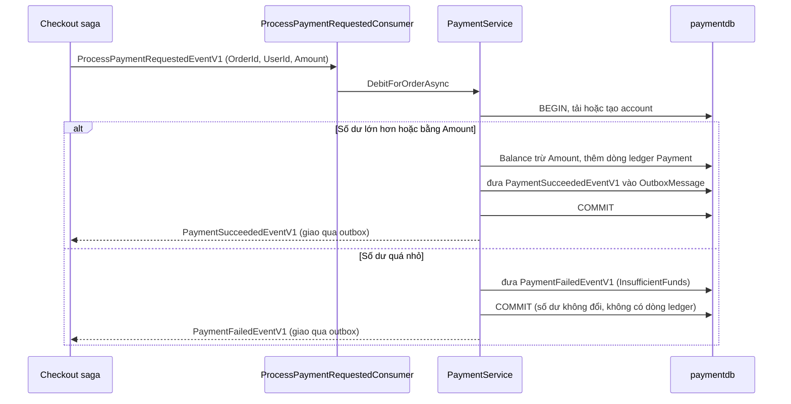
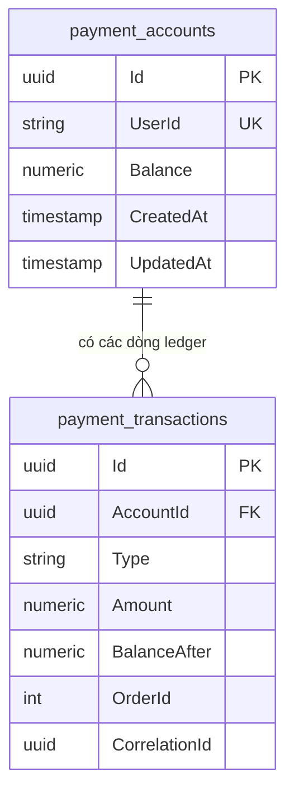

# Chương 8: Payment và Compensation

> 🇻🇳 Bản tiếng Việt. English version: [08-payment-and-compensation.md](../08-payment-and-compensation.md)

`SimpleStore.Payment.API` là service nhỏ nhất trong luồng checkout và cũng là service hữu ích nhất để thử nghiệm. Nó giữ một ví trả trước (một số dư) cho mỗi khách hàng và một sổ cái (ledger) ghi lại mọi lần nạp tiền và mọi lần trừ tiền. Khi saga checkout yêu cầu nó tính tiền một đơn hàng, nó kiểm tra số dư: đủ tiền nghĩa là thanh toán thành công, không đủ nghĩa là thất bại, và khi đó saga sẽ hoàn tác việc giữ hàng trong kho (compensation: hành động bù trừ để hoàn tác một bước đã làm). Vì bạn kiểm soát được số dư, bạn kiểm soát được việc một lần checkout kết thúc ở `Confirmed` hay `Cancelled`.

**Bạn sẽ học được**

- Mô hình dữ liệu: `payment_accounts` và sổ cái `payment_transactions`.
- Cách `DepositAsync` và `DebitForOrderAsync` hoạt động, từng dòng một.
- Cách outbox (hộp thư đi: bảng lưu thông điệp chờ gửi) và inbox (hộp thư đến: bảng ghi nhớ thông điệp đã xử lý) làm cho việc trừ tiền và message phản hồi của nó an toàn trước sự cố sập và việc giao lại.
- Cách ví trở thành cơ chế có thể chủ động điều chỉnh để demo checkout thành công hoặc thất bại, kèm theo kịch bản từng bước.
- Chỗ nào thiếu bảo vệ đồng thời (concurrency), và vì sao điều đó chấp nhận được ở đây nhưng không chấp nhận được trong production.

---

## Vấn đề cần giải quyết

Saga ([Chương 6](06-checkout-saga.md)) cần một bước thanh toán có thể thành công hoặc thất bại, để đường compensation (giải phóng lượng hàng đã giữ) có thể được trình diễn. Một bộ xử lý thẻ thật là công cụ sai cho một dự án học tập: bạn không thể bắt nó thất bại theo lệnh, và nó kéo theo secret cùng các phụ thuộc bên ngoài. Một ví trả trước thì đơn giản, chạy cục bộ, và hoàn toàn nằm trong tầm kiểm soát của bạn:

- "Tính tiền" nghĩa là trừ khỏi một số dư.
- "Thất bại" nghĩa là số dư quá nhỏ.
- "Lần sau cho thành công" nghĩa là nạp thêm tiền (từ trang Wallet của storefront, hoặc từ trang Admin Payments).

Service vẫn phải cư xử như một service thật ở những điểm quan trọng đối với messaging: nó phải tính tiền một lần dù message yêu cầu bị giao hai lần, và nó không bao giờ được ghi nhận một khoản trừ mà không báo cho saga biết.

## Bức tranh tổng thể



*Cách đọc: consumer chỉ là một lớp vỏ mỏng; `PaymentService` đưa ra quyết định. Ở cả hai nhánh, message phản hồi và thay đổi database được commit trong một transaction, và phản hồi được gửi đi sau đó bởi outbox relay.*

Mô hình dữ liệu:



*Cách đọc: mỗi người dùng có một account, mỗi account có nhiều dòng ledger. `Type` là chuỗi `Deposit` hoặc `Payment`. `OrderId` và `CorrelationId` chỉ được điền cho các dòng `Payment`.*

Để xem bản viết thiết kế gốc, xem [docs/payment-service.md](../../payment-service.md).

## Đi qua mã nguồn

### 1. Các entity

[PaymentAccount.cs](../../../src/SimpleStore.Payment.API/Models/PaymentAccount.cs) có `Id`, `UserId` (tối đa 450 ký tự), `Balance`, `CreatedAt`, `UpdatedAt`. `UserId` là một tham chiếu mềm (soft reference) tới id người dùng của Identity; không có foreign key xuyên database (xem [Chương 1](01-architecture-and-aspire.md)). Không có concurrency token.

[PaymentTransaction.cs](../../../src/SimpleStore.Payment.API/Models/PaymentTransaction.cs) là dòng ledger:

```csharp
    public Guid Id { get; set; }
    public Guid AccountId { get; set; }
    public PaymentAccount Account { get; set; } = null!;

    public PaymentTransactionType Type { get; set; }
    public decimal Amount { get; set; }
    public decimal BalanceAfter { get; set; }
```

Nó cũng có `OrderId`, `CorrelationId`, `Description` và `CreatedAt`. `BalanceAfter` lưu số dư lũy kế tại thời điểm của bút toán, nên một trang lịch sử không bao giờ cần tính lại gì. Enum kiểu trong [PaymentTransactionType.cs](../../../src/SimpleStore.Payment.API/Models/PaymentTransactionType.cs) có hai giá trị: `Deposit` và `Payment`.

### 2. Schema

[PaymentDbContext.cs](../../../src/SimpleStore.Payment.API/Data/PaymentDbContext.cs) map các bảng `payment_accounts` và `payment_transactions`, lưu số tiền dưới dạng `numeric(18,2)`, và lưu `Type` dưới dạng text. Hai dòng quan trọng nhất:

```csharp
            e.Property(a => a.Balance).HasPrecision(18, 2);
            // One account per user; the unique index is what makes "get or create" safe.
            e.HasIndex(a => a.UserId).IsUnique();
```

Ledger có các index thường, không unique, trên `AccountId` và `OrderId`. Không có ràng buộc unique nào trên `OrderId` hay `CorrelationId`, nên bản thân database sẽ không ngăn được hai dòng `Payment` cho cùng một đơn hàng. Biện pháp bảo vệ chống chuyện đó là inbox (bên dưới).

Context cũng đăng ký các bảng inbox và outbox của MassTransit (`InboxState`, `OutboxMessage`, `OutboxState`), cùng mẫu với `Order.API` ([Chương 5](05-orders-and-outbox.md)).

### 3. Nối consumer và outbox

[Program.cs](../../../src/SimpleStore.Payment.API/Program.cs):

```csharp
builder.Services.AddMassTransit(x =>
{
    x.AddEntityFrameworkOutbox<PaymentDbContext>(o =>
    {
        o.UsePostgres();
        o.UseBusOutbox();
    });
    x.AddConsumer<ProcessPaymentRequestedConsumer>();
```

Việc này làm hai nhiệm vụ. Outbox nghĩa là các lời gọi `Publish` bên trong `PaymentService` được ghi vào `OutboxMessage` trong cùng transaction với thay đổi số dư. Inbox (được áp vào consumer bởi `ConfigureEndpoints`) nghĩa là một `ProcessPaymentRequestedEventV1` bị giao hai lần sẽ chỉ được xử lý một lần. Các thiết lập retry, circuit breaker (cầu dao ngắt mạch) và heartbeat là những thiết lập chung được mô tả trong [Chương 9](09-resilience-and-observability.md).

### 4. Consumer chỉ là lớp vỏ mỏng

[ProcessPaymentRequestedConsumer.cs](../../../src/SimpleStore.Payment.API/Consumers/ProcessPaymentRequestedConsumer.cs) mở một log scope với `CorrelationId` và `OrderId`, rồi ủy quyền:

```csharp
        await _payments.DebitForOrderAsync(
            msg.UserId, msg.OrderId, msg.CorrelationId, msg.Amount, context.CancellationToken);
```

### 5. Nạp tiền

[PaymentService.cs](../../../src/SimpleStore.Payment.API/Services/PaymentService.cs) `DepositAsync` từ chối các số tiền không dương (`ArgumentOutOfRangeException`), rồi chạy bên trong một execution strategy và một transaction:

```csharp
            await using var tx = await _context.Database.BeginTransactionAsync(ct);
            var account = await GetOrAddTrackedAsync(userId, ct);

            var now = _clock.GetUtcNow().UtcDateTime;
            account.Balance += amount;
            account.UpdatedAt = now;
```

Sau đó nó thêm một dòng ledger `Deposit` (`Description = "Deposit"`, `BalanceAfter = account.Balance`), lưu, và commit. `GetOrAddTrackedAsync` là cách account được tạo theo yêu cầu:

```csharp
        var account = await _context.Accounts.FirstOrDefaultAsync(a => a.UserId == userId, ct);
        if (account is null)
        {
            account = NewAccount(userId);
            _context.Accounts.Add(account);
        }
        return account;
```

Một account mới tinh bắt đầu với số dư `0m`. Đây là lý do [PaymentSeeder.cs](../../../src/SimpleStore.Payment.API/PaymentSeeder.cs) chỉ chạy migration: các account được định danh bằng GUID người dùng của Identity, vốn không được biết tại thời điểm seed. Mọi khách hàng đều bắt đầu với một ví rỗng.

### 6. Trừ tiền: trái tim của service

`DebitForOrderAsync` bắt đầu giống như vậy (execution strategy, transaction, account được tải hoặc tạo) rồi rẽ nhánh:

```csharp
        var strategy = _context.Database.CreateExecutionStrategy();
        var succeeded = await strategy.ExecuteAsync(async () =>
        {
            await using var tx = await _context.Database.BeginTransactionAsync(ct);
            var account = await GetOrAddTrackedAsync(userId, ct);
            var now = _clock.GetUtcNow();

            if (account.Balance >= amount)
            {
```

Nhánh thành công: trừ tiền, ghi một dòng ledger `Payment` (với `OrderId`, `CorrelationId` và `Description = $"Payment for order #{orderId}"`), rồi publish và commit:

```csharp
                await _publishEndpoint.Publish(new PaymentSucceededEventV1
                {
                    CorrelationId = correlationId,
                    OrderId = orderId,
                    TransactionId = txn.Id,
                    Amount = amount,
                    PaidAt = now
                }, ct);
```

Sau đó code gọi `SaveChangesAsync` và `CommitAsync` rồi trả về `true`. `Publish` chỉ đưa message vào hàng chờ (staging); một lần `SaveChangesAsync` duy nhất ghi thay đổi số dư, dòng ledger và dòng outbox cùng nhau.

Nhánh thất bại: không đổi số dư và không có dòng ledger, chỉ có một message:

```csharp
            await _publishEndpoint.Publish(new PaymentFailedEventV1
            {
                CorrelationId = correlationId,
                OrderId = orderId,
                Reason = PaymentFailureReason.InsufficientFunds,
                Amount = amount,
                FailedAt = now
            }, ct);

            await _context.SaveChangesAsync(ct);
            await tx.CommitAsync(ct);
            return false;
```

`PaymentFailureReason.InsufficientFunds` là chuỗi `"InsufficientFunds"` từ [PaymentFailedEvent.cs](../../../src/SimpleStore.Contracts/PaymentFailedEvent.cs). Saga lưu nó vào `FailureReason` và về sau báo cáo nó như lý do hủy của đơn hàng. Sau transaction, một bộ đếm thành công hoặc thất bại và một dòng log được ghi lại.

Lưu ý một khác biệt nhỏ so với `OrderService`: `Order.API` lưu hai lần vì nó cần id đơn hàng được sinh ra trước. Ở đây các id là GUID được tạo trong code, nên một lần lưu là đủ.

### 7. Bề mặt HTTP

[PaymentEndpoints.cs](../../../src/SimpleStore.Payment.API/Endpoints/PaymentEndpoints.cs) map (tất cả nằm dưới `/api/v1/payment`):

| Đối tượng | Endpoint | Hành vi |
|---|---|---|
| Khách hàng (JWT, chủ sở hữu = claim `sub`) | `GET /account` | Trả về account của người gọi, tạo nó với số dư không nếu cần |
| Khách hàng | `POST /account/deposit` | Body `DepositRequest { Amount }`, số tiền phải dương |
| Khách hàng | `GET /account/transactions` | Ledger của người gọi, mới nhất trước |
| Admin (role `Admin`) | `GET /admin/accounts` (+ `/count`) | Danh sách account có phân trang, số dư cao nhất trước |
| Admin | `GET /admin/accounts/{userId}` | Một account, hoặc 404 |
| Admin | `POST /admin/accounts/{userId}/deposit` | Nạp tiền thay mặt một khách hàng |
| Admin | `GET /admin/accounts/{userId}/transactions` | Ledger của một khách hàng |

Một lần nạp tiền của người dùng trông như sau:

```csharp
        account.MapPost("/deposit", async (DepositRequest request, ClaimsPrincipal user, IPaymentService service, CancellationToken ct) =>
        {
            var userId = user.FindFirstValue("sub");
            if (string.IsNullOrEmpty(userId)) return Results.Unauthorized();
            if (request.Amount <= 0) return Results.BadRequest("Deposit amount must be positive.");
            return Results.Ok(await service.DepositAsync(userId, request.Amount, ct));
        });
```

Lưu ý rằng một khách hàng có thể nạp bất kỳ số tiền nào miễn phí: đây là một trình mô phỏng, không phải hệ thống tiền thật.

### 8. Hai giao diện người dùng

Ví của khách hàng: [WalletController.cs](../../../src/SimpleStore.Web/Controllers/WalletController.cs) hiển thị số dư và lịch sử, và gửi các lần nạp tiền qua `IPaymentApiClient`.

```csharp
        var account = await _payments.DepositAsync(amount);
        TempData["Success"] = $"Deposited ${amount:N2}. New balance: ${account.Balance:N2}.";
```

Trang cho người vận hành: [Payments.razor](../../../src/SimpleStore.Admin/Components/Pages/Payments.razor) ghép người dùng Identity với account Payment trong bộ nhớ (những account chưa tồn tại hiển thị là 0.00) và cung cấp nút nạp tiền trên từng dòng:

```csharp
        var account = await PaymentApi.DepositForUserAsync(row.Id, row.DepositAmount);
        row.Balance = account.Balance;
```

Trang chỉ tải 100 người dùng đầu tiên và 100 account đầu tiên, vậy là đủ cho một bản demo.

## Thuật toán

> **Thuật toán: `DebitForOrderAsync(userId, orderId, correlationId, amount)`**
>
> 1. Mở một logging scope với `CorrelationId` và `OrderId`.
> 2. Bên trong một EF execution strategy, `BEGIN` một transaction.
> 3. Tải account của `userId`; nếu nó chưa tồn tại, tạo một cái với số dư `0` (được tracking, chưa lưu).
> 4. Nếu `Balance >= amount`:
>    1. `Balance = Balance - amount`, cập nhật `UpdatedAt`.
>    2. Thêm một dòng ledger `Payment` với `BalanceAfter`, `OrderId`, `CorrelationId`.
>    3. Đưa `PaymentSucceededEventV1` vào hàng chờ (với id của dòng ledger làm `TransactionId`).
> 5. Nếu không, đưa `PaymentFailedEventV1` vào hàng chờ với `Reason = InsufficientFunds`. Không đổi gì khác.
> 6. `SaveChanges`, rồi `COMMIT`. Số dư, dòng ledger và dòng outbox (hoặc chỉ dòng outbox khi thất bại) được commit nguyên tử trong cùng transaction.
> 7. Outbox relay gửi phản hồi đã xếp hàng tới RabbitMQ, nơi saga nhận lấy nó.

> **Thuật toán: vì sao một request được giao lại không tính tiền hai lần** (câu chuyện về idempotency)
>
> 1. RabbitMQ có thể giao cùng một `ProcessPaymentRequestedEventV1` nhiều hơn một lần.
> 2. Inbox của MassTransit (bảng `InboxState` trong `paymentdb`) ghi lại mỗi cặp (message id, consumer id) trong transaction của consumer.
> 3. Một bản trùng với cùng message id được nhận ra và bị bỏ qua trước khi `DebitForOrderAsync` chạy.
> 4. Vì dòng inbox được commit cùng với khoản trừ tiền, một lần sập không thể tạo ra tình trạng "đã trừ tiền nhưng không được ghi nhận là đã consume" hay ngược lại.
>
> Lớp bảo vệ này theo từng message id. Bản thân service không có kiểm tra ở mức nghiệp vụ như "đơn hàng 42 đã được thanh toán chưa?": không có ràng buộc unique trên `OrderId` hay `CorrelationId`, và `DebitForOrderAsync` không truy vấn ledger trước.

## Điều gì có thể sai

- **Không đủ tiền.** Thất bại được mong đợi. Saga nhận `PaymentFailedEventV1`, giải phóng hàng và hủy đơn ([Chương 6](06-checkout-saga.md)).
- **Chưa có account.** Việc trừ tiền tạo một cái với số dư không, nên một khách hàng lần đầu chưa nạp tiền sẽ thất bại với `InsufficientFunds`.
- **Message trùng lặp.** Được xử lý bởi inbox, như mô tả ở trên.
- **Không có khóa mức dòng (row-level locking) hay concurrency token.** Hai lần trừ tiền (hoặc một lần nạp và một lần trừ) cho cùng một account chạy vào cùng một thời điểm, mỗi bên đọc số dư cũ và mỗi bên ghi lại một số dư đã tính. Một lần cập nhật có thể ghi đè lên lần kia (một "lost update", mất cập nhật), để lại một số dư sai. Bản thân execution strategy của EF Core và một transaction không ngăn được điều này. Cách sửa: một concurrency token trên `PaymentAccount` (với Postgres, là cột hệ thống `xmin`), hoặc `SELECT ... FOR UPDATE`, hoặc một câu `UPDATE ... SET Balance = Balance - @amount WHERE Balance >= @amount` atomic. Tài liệu thiết kế nêu rõ đây là điều cố ý bỏ qua.
- **Hai lần truy cập đầu tiên đồng thời.** Cả hai cùng cố insert một account; unique index trên `UserId` làm lần thứ hai thất bại, và retry policy của consumer thử lại.
- **Payment chậm hoặc ngừng chạy.** Timeout thanh toán của saga kích hoạt và chạy compensation, và khoản trừ tiền vẫn có thể xảy ra về sau, như mô tả trong [Chương 6](06-checkout-saga.md) (lỗ hổng thanh toán trễ). Trong code không có event hoàn tiền hay endpoint hoàn tiền.
- **Không có authorize/capture, không có đa tiền tệ, không có hoàn tiền.** Nó là một trình mô phỏng số dư trả trước, không phải một cổng thanh toán.

## Tự thực hành

Bạn cần AppHost đang chạy (`dotnet run --project src/SimpleStore.AppHost`), storefront đang mở, và ứng dụng Admin đang mở bằng người dùng admin có sẵn (thông tin đăng nhập nằm trong README). Dùng khách hàng demo có sẵn trong storefront.

**Kịch bản demo**

1. **(a) Đường thành công.**
   1. Trong Admin, mở **Payments**. Tìm khách hàng demo, nhập một số tiền lớn hơn hẳn giá của mọi sản phẩm (ví dụ 1000), và bấm **Deposit**. Dòng thông báo xác nhận số dư mới.
   2. Trong storefront, mở **Wallet** và xác nhận cùng số dư đó. Ghi nhớ tồn kho của một sản phẩm trên trang chi tiết của nó.
   3. Thêm sản phẩm đó vào giỏ hàng và checkout.
   4. Mở **My Orders**. Đơn hàng bắt đầu ở `Pending` và sẽ chuyển thành `Confirmed` sau một lát (tải lại trang). Mở lại **Wallet**: một dòng `Payment` "Payment for order #N" xuất hiện cùng số dư mới. Tồn kho của sản phẩm giảm đi đúng bằng số lượng đã đặt.
2. **(b) Đường thất bại kèm compensation.**
   1. Làm cho ví quá nhỏ. Không có tính năng rút tiền, nên hãy dùng một khách hàng có số dư thấp hơn tổng đơn hàng (đặt nhiều hơn hoặc chọn sản phẩm đắt hơn mức số dư chi trả được), hoặc đăng ký một khách hàng mới trong storefront (account mới bắt đầu từ không).
   2. Ghi nhớ tồn kho của sản phẩm, rồi checkout.
   3. Đơn hàng sẽ kết thúc ở `Cancelled`. Không có dòng `Payment` nào xuất hiện trong ledger. Trên trang chi tiết của sản phẩm, tồn kho có thể giảm trong chốc lát (việc giữ hàng) rồi trở về giá trị ban đầu (việc giải phóng); con số hiển thị là một cache mà Catalog làm mới từ các event của Inventory, nên hãy tải lại sau vài giây.
   4. Để hiểu vì sao, hãy theo dõi compensation qua Inventory trong [Chương 7](07-inventory-event-sourcing-cqrs.md): việc giữ hàng bị hủy và lượng hàng đã giữ được cộng ngược lại vào `stock_levels`.
3. **(c) Sửa và thử lại.** Nạp đủ tiền trong Admin **Payments** và đặt hàng lại; lần này nó kết thúc ở `Confirmed`.

**Nhìn vào bên trong**

- pgweb, database `paymentdb`:
  - `SELECT * FROM payment_accounts;`
  - `SELECT "Type", "Amount", "BalanceAfter", "OrderId", "Description", "CreatedAt" FROM payment_transactions ORDER BY "CreatedAt" DESC;`
  - `SELECT "MessageId", "ConsumerId", "Received", "Consumed" FROM "InboxState" ORDER BY "Id" DESC;` cho thấy một dòng cho mỗi yêu cầu thanh toán đã được xử lý.
- pgweb, database `checkoutdb`: `SELECT * FROM checkout_saga_state;` (thường rỗng; các saga đã hoàn tất bị xóa).
- Aspire dashboard, **Structured logs**, resource `payment`: các dòng `Payment requested for order N: amount.`, rồi hoặc `Payment of ... succeeded.` hoặc `... rejected - insufficient funds.` Lọc theo `CorrelationId` để nối với `checkout`, `order` và `inventory`.
- Aspire dashboard, **Metrics**: service Payment có các bộ đếm cho số lần nạp tiền và số lần thanh toán thành công và thất bại (bộ đếm thất bại có tag `reason`).
- RabbitMQ management, **Queues**: queue của `ProcessPaymentRequestedConsumer` là nơi các yêu cầu chờ nếu bạn dừng resource `payment`.

## Những điều cần nhớ

- Có thể chủ động điều chỉnh số dư ví để quyết định kết quả: số dư đủ dẫn đến `Confirmed`, còn số dư không đủ dẫn đến `Cancelled` và giải phóng hàng.
- `DebitForOrderAsync` giữ thay đổi số dư, dòng ledger và message phản hồi trong một transaction, bằng cách dùng outbox.
- Việc tính tiền đúng một lần (exactly-once) đến từ inbox (theo từng message id), không phải từ một ràng buộc database trên đơn hàng.
- Một khoản thanh toán thất bại không ghi dòng ledger nào và không di chuyển đồng tiền nào; compensation là về việc giải phóng hàng, không phải hoàn tiền.
- Việc thiếu kiểm soát đồng thời và thiếu đường hoàn tiền là những hạn chế đã biết để thảo luận, không phải các mẫu để sao chép.

## Chương tiếp theo

Tiếp tục với [Chương 9: Khả năng chịu lỗi và khả năng quan sát](09-resilience-and-observability.md) để xem bộ máy retry, circuit-breaker, health-check và tracing mà mọi service trong hướng dẫn này đều dựa vào.
