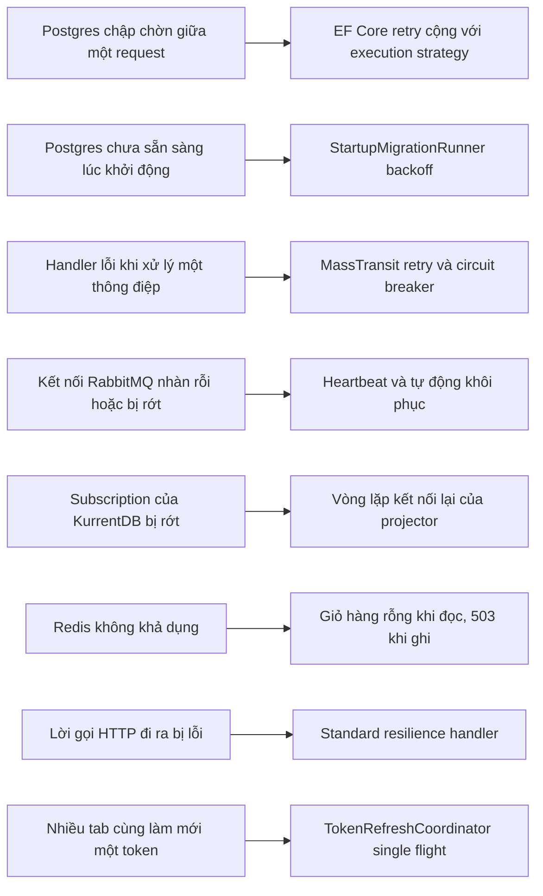
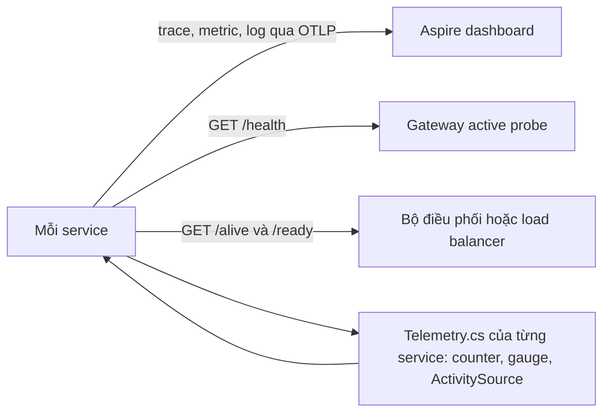

# Chương 9 - Khả năng chịu lỗi và khả năng quan sát

> 🇻🇳 Bản tiếng Việt. English version: [09-resilience-and-observability.md](../09-resilience-and-observability.md)

Trong một hệ thống gồm mười service và bốn kho dữ liệu, lúc nào cũng có thể xảy ra sự cố tạm thời: database khởi động lại, kết nối broker bị ngắt, container khởi động chậm. Chương này giới thiệu các lớp phòng vệ SimpleStore sử dụng để xử lý những sự cố ngắn hạn đó (retry, circuit breaker, giảm cấp có kiểm soát, health check) và các công cụ giúp quan sát hoạt động của hệ thống (trace, metric, log). Hai chủ đề này gắn liền với nhau: chỉ có thể tin vào cơ chế retry khi bạn biết nó đã được kích hoạt.

**Bạn sẽ học được**

- Cách EF Core retry (thử lại) các lỗi database tạm thời, và vì sao điều đó buộc transaction phải nằm trong một lớp bọc đặc biệt (`IExecutionStrategy`).
- Cách MassTransit retry việc xử lý thông điệp bị lỗi, và các thiết lập circuit breaker (cầu dao ngắt mạch) và heartbeat (nhịp tim) làm gì.
- Cách các service sống sót khi database chưa sẵn sàng lúc khởi động, và cách inventory projector kết nối lại.
- Cách giỏ hàng hoạt động ở chế độ suy giảm có kiểm soát khi đọc, nhưng trả lỗi rõ ràng khi ghi trong lúc Redis ngừng hoạt động.
- `/health`, `/alive` và `/ready` nghĩa là gì và thẻ `"ready"` hoạt động ra sao.
- Cách trace, metric và log của OpenTelemetry đến được Aspire dashboard, có những metric tự định nghĩa nào, và cách đọc một trace.

---

## Vấn đề cần giải quyết

Hầu hết lỗi trong một hệ thống phân tán là **tạm thời** (transient): chúng tự biến mất nếu bạn chờ một lát rồi thử lại. Ví dụ: Postgres đang khởi động lại, một kết nối TCP bị reset, RabbitMQ trả lời chậm. Có ba phản ứng tồi thường gặp:

1. **Sập.** Một câu truy vấn lỗi là ném exception, request trả về 500, hoặc cả tiến trình thoát.
2. **Retry mãi mãi, ngay lập tức.** Các lần retry dồn dập vào một service vốn đã đang chật vật.
3. **Lỗi trong im lặng.** Có chuyện không ổn và không ai biết là chuyện gì, ở đâu.

Chịu lỗi tốt nghĩa là: retry vài lần với khoảng chờ tăng dần, ngừng gọi thứ rõ ràng đang chết, và giảm cấp xuống một câu trả lời an toàn khi có thể. Quan sát tốt nghĩa là mỗi quyết định đó để lại một trace, một metric hoặc một dòng log mà bạn tìm được.

> **Thuật ngữ mới: transient failure (lỗi tạm thời).** Một lỗi được kỳ vọng sẽ tự biến mất trong vài giây, trái với một bug hay một mật khẩu sai, vốn sẽ lỗi mọi lần.

> **Thuật ngữ mới: exponential backoff (lùi theo cấp số nhân).** Chờ lâu hơn sau mỗi lần thử thất bại (ví dụ 1 giây, 2 giây, 4 giây, 8 giây). Cách này cho thứ đang hỏng thời gian hồi phục và tránh cảnh retry ồ ạt như bầy đàn.

> **Thuật ngữ mới: circuit breaker (cầu dao ngắt mạch).** Một lớp bảo vệ theo dõi tỷ lệ thất bại. Khi có quá nhiều lời gọi thất bại, nó "mở" và từ chối ngay các lời gọi tiếp theo trong một khoảng thời gian, rồi cho vài lời gọi đi qua để thử xem sự cố đã hết chưa. Giống như cầu dao điện, nó bảo vệ phần còn lại của hệ thống.

## Bức tranh tổng thể

Mỗi loại lỗi có một lớp phòng thủ riêng. Sơ đồ đầu tiên ánh xạ từng lỗi với cách phòng thủ.



*Cách đọc: các ô bên trái là những thứ đi sai, các ô bên phải là mã xử lý chúng. Mỗi mũi tên ứng với một mục trong phần "Đi qua mã nguồn".*

Sơ đồ thứ hai cho thấy các service báo cáo hoạt động của mình như thế nào.



*Cách đọc: mọi thứ một service phát ra đều đi đến dashboard (telemetry) hoặc đến thứ quyết định có gửi traffic cho nó hay không (các health endpoint).*

---

## Đi qua mã nguồn

### Phần A - Khả năng chịu lỗi

#### Bước 1 - EF Core retry các lỗi database tạm thời

Mọi service sở hữu một database Postgres đều đăng ký `DbContext` theo cùng một cách. Đây là Order.API trong [Program.cs](../../../src/SimpleStore.Order.API/Program.cs):

```csharp
builder.AddNpgsqlDbContext<OrderDbContext>("orderdb",
    configureSettings: settings =>
    {
        settings.DisableRetry = true;
        settings.CommandTimeout = 30;
    },
    configureDbContextOptions: opt =>
        opt.UseNpgsql(npgsql =>
            npgsql.EnableRetryOnFailure(
                maxRetryCount: 5,
                maxRetryDelay: TimeSpan.FromSeconds(10),
                errorCodesToAdd: null)));
```

- `EnableRetryOnFailure` bật **execution strategy** (chiến lược thực thi) có sẵn của EF Core: khi một câu lệnh lỗi với một lỗi mà Npgsql coi là tạm thời, EF chờ rồi thử lại, tối đa 5 lần, mỗi lần chờ không quá 10 giây.
- `settings.DisableRetry = true` tắt cơ chế retry mà component Aspire Postgres vốn sẽ tự thêm vào, nhờ vậy chỉ có đúng một chính sách retry và các con số của nó nhìn thấy ngay trong file này.
- `settings.CommandTimeout = 30` giới hạn một câu lệnh SQL tối đa 30 giây.

Cùng khối này (cùng các con số) xuất hiện ở Identity, Catalog, Inventory, Checkout và Payment. Cart.API không có Postgres nên không có DbContext.

#### Bước 2 - Vì sao transaction phải được bọc trong `CreateExecutionStrategy().ExecuteAsync`

Một lần retry phải lặp lại cả đơn vị công việc, không chỉ câu lệnh bị lỗi. Giả sử một transaction chạy `INSERT order`, `INSERT outbox row`, rồi kết nối rớt trước `COMMIT`. Database đã rollback mọi thứ, nên cách khôi phục đúng duy nhất là chạy lại tất cả từ đầu. EF không thể biết những câu lệnh nào của bạn thuộc về nhau trừ khi bạn nói cho nó biết.

Vì vậy EF Core **từ chối** chạy một transaction do bạn tự mở (`BeginTransactionAsync`) khi một strategy có retry đang bật. Nó ném `InvalidOperationException` với nội dung rằng transaction do người dùng khởi tạo không được hỗ trợ và bảo bạn dùng execution strategy. Cách sửa là đặt toàn bộ transaction vào bên trong một lambda mà strategy có thể chạy lại. Đây là phần đầu của `CreateOrderAsync` trong [OrderService.cs](../../../src/SimpleStore.Order.API/Services/OrderService.cs):

```csharp
        var strategy = _context.Database.CreateExecutionStrategy();
        await strategy.ExecuteAsync(async () =>
        {
            await using var tx = await _context.Database.BeginTransactionAsync(ct);

            _context.Orders.Add(order);
            await _context.SaveChangesAsync(ct);
```

và đây là phần cuối của cùng lambda đó:

```csharp
            await _context.SaveChangesAsync(ct);
            await tx.CommitAsync(ct);
        });
```

Ở giữa hai đoạn, mã publish `OrderSubmittedEventV1` vào outbox (hộp thư đi: bảng lưu thông điệp chờ gửi, chương 5). Cả lambda có thể chạy tới sáu lần (lần thử đầu cộng năm lần retry), nên nó phải an toàn khi lặp lại. Hai thói quen trong codebase này xuất phát từ đó:

- **Việc chỉ được xảy ra một lần thì đặt sau lambda.** Trong cùng phương thức, `Telemetry.OrdersSubmitted.Add(1, ...)` và dòng log "order submitted" nằm sau khi `ExecuteAsync` trả về, nhờ vậy một transaction bị retry vẫn chỉ được đếm một lần.
- **Các tác dụng phụ bên trong lambda phải idempotent.** Cùng mẫu này được dùng trong `PaymentService`, `CreateReservationHandler` và `InventoryProjectionService.ApplyOneAsync`, nơi các lớp kiểm tra "mình đã áp dụng cái này chưa?" làm cho lần chạy thứ hai vô hại.

> **Thuật ngữ mới: idempotent (lũy đẳng).** Làm hai lần cho kết quả giống như làm một lần. Các thao tác idempotent thì an toàn để retry.

#### Bước 3 - MassTransit retry, circuit breaker và heartbeat

Các message handler (bộ xử lý thông điệp) lỗi vì cùng những lý do tạm thời. Mỗi service dùng RabbitMQ cấu hình bus theo cùng một cách; Order.API, Checkout.API, Payment.API, Catalog.API, Cart.API và Inventory.API đều dùng các con số y hệt nhau. Identity không có bus. Trong Order.API:

```csharp
        cfg.Host(new Uri(builder.Configuration.GetConnectionString("rabbitmq")!), h =>
        {
            h.Heartbeat(TimeSpan.FromSeconds(30));
            h.RequestedConnectionTimeout(TimeSpan.FromSeconds(10));
        });
```

```csharp
        cfg.UseMessageRetry(r => r.Exponential(
            retryLimit: 5,
            minInterval: TimeSpan.FromSeconds(1),
            maxInterval: TimeSpan.FromSeconds(30),
            intervalDelta: TimeSpan.FromSeconds(2)));
```

```csharp
        cfg.UseCircuitBreaker(cb =>
        {
            cb.TrackingPeriod = TimeSpan.FromMinutes(1);
            cb.TripThreshold = 15;
            cb.ActiveThreshold = 10;
            cb.ResetInterval = TimeSpan.FromMinutes(5);
        });
```

Ý nghĩa của từng thiết lập:

| Thiết lập | Giá trị | Ý nghĩa |
|---|---|---|
| `Heartbeat` | 30 giây | Client và RabbitMQ trao đổi các frame giữ kết nối nhỏ, nhờ vậy một kết nối im lặng được phát hiện (và không bị thiết bị mạng cắt vì nhàn rỗi). |
| `RequestedConnectionTimeout` | 10 giây | Bỏ cuộc với một lần thử kết nối sau 10 giây. |
| `UseMessageRetry` / `Exponential` | 5 lần retry, khoảng chờ tăng từ khoảng 1 giây lên đến mức trần 30 giây | Nếu một consumer ném exception, MassTransit chạy lại handler ngay trong tiến trình. Khoảng cách chính xác do công thức của MassTransit quyết định. Sau lần retry thứ năm, thông điệp được chuyển sang queue `_error` để người vận hành kiểm tra. |
| `TrackingPeriod` | 1 phút | Cửa sổ thời gian dùng để đếm các lỗi. |
| `ActiveThreshold` | 10 | Breaker chỉ đánh giá endpoint khi đã xử lý ít nhất 10 thông điệp trong cửa sổ. |
| `TripThreshold` | 15 | Tỷ lệ thông điệp thất bại trong cửa sổ để kích hoạt breaker. |
| `ResetInterval` | 5 phút | Thời gian breaker giữ trạng thái mở trước khi cho một thông điệp thử đi qua. |

Lớp retry sửa các trục trặc ngắn; breaker xử lý sự cố kéo dài bằng cách tạm dừng việc tiêu thụ thay vì đốt hết số lần retry cho mọi thông điệp. Chương trình Checkout có một chú thích thêm đáng biết: các saga consumer tự động nhận chính sách retry, và saga repository dùng khóa dòng bi quan (pessimistic row lock) để các thông điệp đồng thời của cùng một saga chạy lần lượt từng cái một (chương 6).

Retry một handler chỉ có ý nghĩa nếu handler đó chạy hai lần vẫn an toàn. Đó là lý do Order, Catalog, Checkout và Payment dùng EF inbox (hộp thư đến: tiêu thụ đúng một lần) và Cart consumer được viết để idempotent mà không cần inbox (chương 4 và 5).

#### Bước 4 - Sống sót khi database chưa sẵn sàng lúc khởi động

Mọi service sở hữu một database đều chạy migration lúc khởi động. Nếu Postgres vẫn đang khởi động, lần thử đầu sẽ ném lỗi. [StartupMigrationRunner.cs](../../../src/SimpleStore.ServiceDefaults/StartupMigrationRunner.cs) bọc migration và seeding (nạp dữ liệu mẫu) trong một cơ chế retry có giới hạn. Order.API gọi nó như sau ở gần cuối `Program.cs`:

```csharp
await StartupMigrationRunner.RunAsync(app, async (sp, _) =>
{
    var context = sp.GetRequiredService<OrderDbContext>();
    await OrderSeeder.SeedAsync(context);
});
```

Và đây là phần cốt lõi của runner:

```csharp
            catch (Exception ex) when (attempt < maxAttempts && !cancellationToken.IsCancellationRequested)
            {
                log.LogWarning(ex,
                    "Startup migration attempt {Attempt}/{MaxAttempts} failed; retrying in {DelaySeconds}s.",
                    attempt, maxAttempts, delay.TotalSeconds);
                try
                {
                    await Task.Delay(delay, cancellationToken);
                }
                catch (OperationCanceledException)
                {
                    throw;
                }
                delay = TimeSpan.FromSeconds(Math.Min(MaxDelay.TotalSeconds, delay.TotalSeconds * 2));
            }
```

Bộ lọc `when (attempt < maxAttempts ...)` là mấu chốt: ở lần thất bại thứ năm, bộ lọc cho kết quả false, khối `catch` không chạy, và exception lan ra khỏi `RunAsync`, nên một connection string sai thật sự vẫn làm service sập nhanh thay vì retry mãi mãi. Sáu service có database (Identity, Catalog, Order, Inventory, Checkout, Payment) đều dùng runner này.

#### Bước 5 - Inventory projector kết nối lại

Inventory projector (chương 7) đọc event từ KurrentDB qua một subscription (đăng ký theo dõi) sống lâu. Nếu subscription đó đứt, một vòng lặp bên ngoài trong [InventoryProjectionService.cs](../../../src/SimpleStore.Inventory.API/Projections/InventoryProjectionService.cs) sẽ kết nối lại:

```csharp
            catch (OperationCanceledException) when (stoppingToken.IsCancellationRequested)
            {
                break;
            }
            catch (Exception ex)
            {
                _log.LogError(ex,
                    "Inventory projector subscription dropped; reconnecting in {BackoffSeconds}s.",
                    backoff.TotalSeconds);
                try
                {
                    await Task.Delay(backoff, stoppingToken);
                }
                catch (OperationCanceledException)
                {
                    break;
                }
                backoff = TimeSpan.FromSeconds(Math.Min(MaxBackoff.TotalSeconds, backoff.TotalSeconds * 2));
            }
```

Backoff bắt đầu từ 1 giây và nhân đôi cho đến 30 giây. Trước mỗi lần kết nối lại, vòng lặp nạp lại checkpoint (điểm đánh dấu tiến độ) từ Postgres, nên nó tiếp tục đúng chỗ đã dừng. Lưu ý một chi tiết: `backoff` chỉ được đặt lại về 1 giây khi `RunSubscriptionLoopAsync` trả về bình thường. Một subscription xử lý event hàng giờ rồi mới rớt sẽ không đặt lại giá trị này, nên lần kết nối lại tiếp theo dùng bất kỳ khoảng chờ nào mà các lần lỗi trước để lại. Như vậy là thận trọng chứ không sai, và chương 11 có liệt kê điều này.

#### Bước 6 - Giỏ hàng giảm cấp khi đọc và trả về 503 khi ghi

Khi không kết nối được Redis, Cart.API chọn cách xử lý khác nhau cho đọc và ghi. Trong [RedisCartStore.cs](../../../src/SimpleStore.Cart.API/Services/RedisCartStore.cs), việc đọc giỏ hàng nuốt các exception của Redis và trả lời bằng một giỏ hàng rỗng:

```csharp
    private async Task<List<CartItemDto>> TryLoadItemsAsync(string ownerKey, CancellationToken ct)
    {
        try
        {
            return await LoadItemsAsync(ownerKey, ct);
        }
        catch (RedisConnectionException ex)
        {
            _log.LogWarning(ex,
                "Redis unreachable while loading cart {OwnerKey}; degrading to empty cart.", ownerKey);
            return new List<CartItemDto>();
        }
```

`GetAsync` (được dùng bởi `GET /cart`, `/cart/count` và `/cart/total`) gọi phương thức này. Storefront hiển thị một giỏ hàng rỗng thay vì một trang lỗi.

Các thao tác ghi (thêm, cập nhật, xóa, merge) trước hết cần nạp giỏ hàng hiện tại, và chúng không được làm việc đó qua đường "dễ tính" kia. Nếu một lần đọc thất bại trông giống như một giỏ hàng rỗng, lần lưu tiếp theo sẽ ghi đè giỏ hàng thật bằng một giỏ gần như trống. Vì vậy các đường ghi dùng `LoadItemsAsync`, để exception thoát ra ngoài. [RedisExceptionMiddleware.cs](../../../src/SimpleStore.Cart.API/Middleware/RedisExceptionMiddleware.cs) bắt `RedisConnectionException` và `RedisTimeoutException` rồi biến chúng thành một câu trả lời gọn gàng:

```csharp
        ctx.Response.Clear();
        ctx.Response.StatusCode = StatusCodes.Status503ServiceUnavailable;
        ctx.Response.Headers.RetryAfter = "5";
        ctx.Response.ContentType = "application/problem+json";
```

`503 Service Unavailable` cộng với `Retry-After: 5` là tín hiệu chuẩn "hãy thử lại sau vài giây". (Một chú thích trong `RedisCartStore.GetAsync` nhắc đến một "ExceptionHandlingMiddleware"; lớp thực sự làm việc là `RedisExceptionMiddleware`, được đăng ký trong `Program.cs` của Cart.API.)

#### Bước 7 - Các lời gọi HTTP đi ra và việc làm mới token

Hai lớp bảo vệ nữa đã có sẵn từ các chương trước:

- `AddServiceDefaults()` gọi `http.AddStandardResilienceHandler()` cho mọi `HttpClient` trong mọi service (chương 1, bước 7). Đó là pipeline mặc định của Microsoft gồm giới hạn tốc độ, timeout, retry và circuit breaker cho HTTP gọi ra. Các giá trị mặc định của nó không được đặt trong repository này; hãy xem tài liệu của Microsoft để biết giá trị hiện hành, và lưu ý rằng việc retry các request không idempotent (chẳng hạn một POST tạo ra thứ gì đó) cần được cân nhắc kỹ.
- `TokenRefreshCoordinator` trong Web và Admin khiến các lần làm mới token đồng thời dùng chung một lời gọi mạng (một `Lazy<Task>` cho mỗi giá trị refresh token trong một `ConcurrentDictionary`). Nó tồn tại vì Identity xoay vòng refresh token ngay ở lần dùng đầu tiên, nên các lần làm mới song song sẽ chạy đua và tất cả trừ một cái sẽ thất bại. Chương 3 có thuật toán đầy đủ.

### Phần B - Health check

#### Bước 8 - Ba endpoint, một quy ước thẻ

Mọi service đều cung cấp ba health endpoint, được định nghĩa trong [Extensions.cs](../../../src/SimpleStore.ServiceDefaults/Extensions.cs). Đầu tiên, một check `self` đơn giản được gắn thẻ `live`:

```csharp
        builder.Services.AddHealthChecks()
            // Add a default liveness check to ensure app is responsive
            .AddCheck("self", () => HealthCheckResult.Healthy(), ["live"]);
```

Tiếp theo, các probe (đầu dò) kiểm tra phụ thuộc. Các component Aspire cho Postgres, Redis và MassTransit tự đăng ký health check riêng, nhưng chúng không mang thẻ `"ready"` của chúng ta. Một bước post-configuration thêm thẻ đó theo tên:

```csharp
        builder.Services.PostConfigure<HealthCheckServiceOptions>(o =>
        {
            foreach (var r in o.Registrations)
            {
                if (r.Tags.Contains("ready")) continue;
                if (AspireDependencyCheckPrefixes.Any(p =>
                        r.Name.StartsWith(p, StringComparison.OrdinalIgnoreCase)))
                {
                    r.Tags.Add("ready");
                }
            }
        });
```

Các tiền tố là `npgsql`, `postgres`, `redis`, `stackexchangeredis`, `rabbitmq` và `masstransit`. Cuối cùng `MapDefaultEndpoints()` công bố các endpoint, ở mọi môi trường (không chỉ Development):

```csharp
        app.MapHealthChecks(HealthEndpointPath);

        app.MapHealthChecks(AlivenessEndpointPath, new HealthCheckOptions
        {
            Predicate = r => r.Tags.Contains("live")
        });

        app.MapHealthChecks(ReadinessEndpointPath, new HealthCheckOptions
        {
            Predicate = r => r.Tags.Contains("ready")
        });
```

| Endpoint | Chạy những check nào | Trả lời câu hỏi | Thất bại khi |
|---|---|---|---|
| `/alive` | chỉ các check gắn thẻ `live` (chỉ có `self`) | Tiến trình còn phản hồi không? Có nên khởi động lại không? | tiến trình bị kẹt; không bao giờ vì một dependency bị chết |
| `/ready` | chỉ các check gắn thẻ `ready` (các probe dependency) | Instance này có làm được việc hữu ích không? Có nên nhận traffic không? | một dependency như Postgres hoặc RabbitMQ không kết nối được |
| `/health` | mọi check đã đăng ký | Trạng thái tổng thể; được dùng bởi active probe của gateway và Aspire dashboard | bất kỳ thứ gì không khỏe |

> **Thuật ngữ mới: liveness vs readiness (còn sống và sẵn sàng phục vụ).** Liveness hỏi "tiến trình còn sống không?" và cách chữa cho câu trả lời "không" là khởi động lại. Readiness hỏi "ngay lúc này nó có phục vụ được không?" và cách chữa cho câu trả lời "không" là ngừng gửi traffic cho nó rồi chờ. Nhầm lẫn hai khái niệm này gây ra những lần khởi động lại không cần thiết: khởi động lại một API sẽ không làm database của nó sống lại.

Service Inventory thêm một probe tự viết. [KurrentDbHealthCheck.cs](../../../src/SimpleStore.Inventory.API/Infrastructure/KurrentDbHealthCheck.cs) đọc một event duy nhất từ cuối event store với timeout 3 giây, và `Program.cs` đăng ký nó với thẻ đã gắn sẵn:

```csharp
builder.Services.AddHealthChecks()
    .AddCheck<KurrentDbHealthCheck>("kurrentdb", tags: ["ready"]);
```

Cuối cùng, bộ lọc trace của OpenTelemetry trong cùng file loại trừ ba đường dẫn này để các probe gọi liên tục mỗi vài giây không làm ngập danh sách trace:

```csharp
                    .AddAspNetCoreInstrumentation(tracing =>
                        // Exclude health check requests from tracing — they would otherwise dominate
                        // the trace stream with no signal.
                        tracing.Filter = context =>
                            !context.Request.Path.StartsWithSegments(HealthEndpointPath)
                            && !context.Request.Path.StartsWithSegments(AlivenessEndpointPath)
                            && !context.Request.Path.StartsWithSegments(ReadinessEndpointPath)
                    )
```

### Phần C - Khả năng quan sát

> **Thuật ngữ mới: observability (khả năng quan sát).** Khả năng hiểu một hệ thống đang hoạt động ra sao thông qua ba loại tín hiệu. **Log** là các event dạng văn bản. **Metric** là các con số theo thời gian (counter, gauge, histogram). **Trace** theo dõi một request đi qua nhiều service dưới dạng cây các bước có đo thời gian, gọi là **span**.

> **Thuật ngữ mới: OpenTelemetry (OTel).** Một chuẩn trung lập với nhà cung cấp cùng bộ thư viện để tạo ra ba loại tín hiệu đó. **OTLP** là giao thức dùng để chuyển chúng đến một collector (bộ thu thập); ở đây collector là Aspire dashboard.

#### Bước 9 - Những gì được đo đạc (instrument)

`ConfigureOpenTelemetry` trong [Extensions.cs](../../../src/SimpleStore.ServiceDefaults/Extensions.cs) thiết lập mọi thứ một lần cho mọi service:

- **Nguồn tracing:** tên của chính ứng dụng, `MassTransit`, và ký tự đại diện `SimpleStore.*`.
- **Meter cho metric:** `MassTransit` và ký tự đại diện `SimpleStore.*`, cộng với instrumentation của ASP.NET Core, `HttpClient` và runtime.
- **Instrumentation tự động:** ASP.NET Core, `HttpClient`, gRPC client (đây là cách các lời gọi KurrentDB hiện ra), và EF Core với `SetDbStatementForText = true`, nên mỗi span mang theo nội dung SQL thật. Redis được đo riêng trong `Program.cs` của Cart.API, vì nó cần `IConnectionMultiplexer` của service.
- **Log:** được xuất qua OpenTelemetry với `IncludeScopes = true`, nên các log scope như `CorrelationId` trở thành các trường có thể tìm kiếm.

Sampler (bộ lấy mẫu) quyết định giữ lại bao nhiêu trace:

```csharp
        var samplerArg = builder.Configuration.GetValue<double?>("OTEL_TRACES_SAMPLER_ARG") ?? 1.0;
```

và về sau `.SetSampler(new ParentBasedSampler(new TraceIdRatioBasedSampler(samplerArg)))`. Với giá trị mặc định `1.0`, mọi trace đều được giữ. Đặt `OTEL_TRACES_SAMPLER_ARG=0.1` sẽ giữ khoảng 10 phần trăm. `ParentBased` nghĩa là một service làm theo quyết định mà bên gọi đã đưa ra, nên một trace được giữ lại vẫn đầy đủ xuyên qua các service thay vì bị thủng lỗ chỗ.

Việc xuất (export) là tùy chọn:

```csharp
        var useOtlpExporter = !string.IsNullOrWhiteSpace(builder.Configuration["OTEL_EXPORTER_OTLP_ENDPOINT"]);

        if (useOtlpExporter)
        {
            builder.Services.AddOpenTelemetry().UseOtlpExporter();
        }
```

Aspire đặt `OTEL_EXPORTER_OTLP_ENDPOINT` cho mọi project nó khởi động, đó là lý do dashboard tự đầy lên mà không cần cấu hình thêm. Chạy một service riêng lẻ mà không có biến đó thì nó đơn giản là không xuất gì.

#### Bước 10 - Mỗi service một `Telemetry.cs`

Theo quy ước, mỗi service có một `Observability/Telemetry.cs` với một `ActivitySource` và một `Meter` tĩnh, cả hai đều được đặt tên `SimpleStore.<Service>`. Các ký tự đại diện ở trên tự động nhặt chúng lên, nên thêm một counter chỉ tốn một dòng trong file đó. Các source và meter tồn tại cho Order, Cart, Catalog, Checkout, Identity, Inventory, Payment, Web và Admin. Catalog, Checkout và Identity khai báo source và meter nhưng chưa định nghĩa counter nào. Chỉ Inventory thực sự bắt đầu các span tự định nghĩa (`InventoryProjector.Apply`, một span cho mỗi event được projection xử lý).

Đây là toàn bộ các metric tự định nghĩa, đọc từ mọi `Telemetry.cs`:

| Tên metric | Loại (đơn vị) | Phát ra bởi | Tag | Ý nghĩa |
|---|---|---|---|---|
| `simplestore.orders.submitted` | counter | Order.API, sau khi transaction tạo đơn hàng commit | `line_count` | Số đơn hàng đã tạo |
| `simplestore.orders.confirmed` | counter | Order.API `OrderConfirmedConsumer` | không có | Số đơn hàng được saga chuyển sang Confirmed |
| `simplestore.orders.cancelled` | counter | Order.API `OrderCancelledConsumer` | `reason` | Số đơn hàng được chuyển sang Cancelled, chia theo lý do |
| `simplestore.cart.fanout.duration` | histogram (ms) | Cart.API `ProductUpdatedConsumer` | `scanned`, `touched` | Thời gian Redis SCAN qua mọi giỏ hàng sau một lần cập nhật sản phẩm |
| `simplestore.reservations.requested` | counter | Inventory `ReserveStockRequestedConsumer` | `line_count` | Số yêu cầu giữ hàng đã nhận |
| `simplestore.reservations.succeeded` | counter | Inventory `CreateReservationHandler` | `line_count` | Số lần giữ hàng được chấp nhận (chỉ ở lần giao đầu tiên) |
| `simplestore.reservations.failed` | counter | Inventory `CreateReservationHandler` | `reason`, `shortage_lines` | Số lần giữ hàng bị từ chối vì không đủ tồn kho |
| `simplestore.reservations.cancelled` | counter | Inventory `CancelReservationHandler` | không có | Số lần giữ hàng được giải phóng như một bước bù trừ (compensation) |
| `simplestore.inventory.projector.unknown_events` | counter | Inventory projector | `event_type` | Các event mà projector không nhận ra; nên giữ ở mức 0 |
| `simplestore.inventory.projector.lag` | observable gauge (bytes) | Inventory projector | không có | Read model đang chậm hơn KurrentDB bao xa |
| `simplestore.payments.succeeded` | counter | Payment.API `DebitForOrderAsync` | không có | Số thanh toán đã trừ tiền |
| `simplestore.payments.failed` | counter | Payment.API `DebitForOrderAsync` | `reason` | Số thanh toán bị từ chối (ví dụ `InsufficientFunds`) |
| `simplestore.payments.deposits` | counter | Payment.API `DepositAsync` | không có | Số lần nạp tiền |
| `simplestore.identity.token_refresh.coalesced` | counter | Web và Admin `TokenRefreshCoordinator` | không có | Số lời gọi làm mới đã nhập vào một lần làm mới đang chạy |

Metric cuối cùng có chữ "identity" trong tên nhưng được phát ra bởi các meter của Web và Admin, không phải bởi Identity.API.

**Gauge độ trễ của projector** đáng để xem kỹ hơn vì nó không được tăng ở bất cứ đâu; nó được *quan sát*. Meter gọi một callback mỗi lần metric được thu thập:

```csharp
    public static readonly ObservableGauge<long> ProjectorLag = Meter.CreateObservableGauge(
        "simplestore.inventory.projector.lag",
        () => _projectorLagProvider(),
        unit: "bytes",
        description: "Commit-log position delta between KurrentDB's tail and the projector's last applied checkpoint. 0 = caught up.");
```

Projector service cung cấp callback đó trong constructor của nó:

```csharp
        Telemetry.SetProjectorLagProvider(() =>
        {
            var tail = Volatile.Read(ref _lastSeenTailCommit);
            var applied = Volatile.Read(ref _lastAppliedCommit);
            return tail > applied ? tail - applied : 0L;
        });
```

`_lastSeenTailCommit` được cập nhật khi một event đến từ subscription. `_lastAppliedCommit` được cập nhật sau khi transaction Postgres cho event đó commit. Độ chênh lệch được đo bằng byte của commit log trong KurrentDB, không phải bằng số event, nên hãy hiểu nó là "bằng không nghĩa là đã bắt kịp, càng lớn nghĩa là càng tụt xa".

#### Bước 11 - Các lần chuyển trạng thái của saga được gắn tag lên span đang hoạt động

Checkout saga không tự tạo span riêng. Thay vào đó `LogTransition` trong `CheckoutSagaStateMachine` ghi một dòng log và thêm các tag vào span mà MassTransit đã mở sẵn cho thông điệp đang được tiêu thụ:

```csharp
        var activity = Activity.Current;
        if (activity is not null)
        {
            activity.SetTag("saga.correlation_id", saga.CorrelationId);
            activity.SetTag("saga.order_id", saga.OrderId);
            activity.SetTag("saga.state.from", from);
            activity.SetTag("saga.state.to", to);
            if (reason is not null) activity.SetTag("saga.cancel_reason", reason);
        }
```

Trong dashboard, bạn có thể tìm các span theo một `saga.correlation_id` nhất định và thấy mọi lần chuyển trạng thái (ví dụ `AwaitingStock` sang `AwaitingPayment`) cùng lý do của nó. Order, Inventory, Payment và saga cũng mở một logging scope với `CorrelationId`, nên log từ các service khác nhau về cùng một đơn hàng có thể được nối lại bằng đúng một giá trị đó.

---

## Thuật toán

**Thuật toán 1 - EF execution strategy**

```text
attempt = 0
loop:
    try:
        run the lambda          # begin transaction, save, publish to outbox, commit
        return its result
    catch transient database error:
        attempt = attempt + 1
        if attempt > 5: throw
        wait (growing delay, never more than 10 s)
        # the transaction was rolled back, so run the lambda again from the top
    catch any other error:
        throw
```

**Thuật toán 2 - StartupMigrationRunner**

```text
delay = 1 s
for attempt = 1, 2, 3, 4, 5:
    try:
        migrate and seed
        return
    catch error when attempt < 5:
        log a warning
        wait delay
        delay = min(16 s, delay * 2)
    # on attempt 5 the filter is false, the error is thrown
```

Các khoảng chờ là 1, 2, 4 và 8 giây, tổng cộng khoảng 15 giây, trước khi service bỏ cuộc và thoát.

**Thuật toán 3 - Vòng lặp kết nối lại của projector**

```text
backoff = 1 s
while not stopping:
    try:
        load checkpoint from Postgres
        subscribe to KurrentDB from that position and apply events
        backoff = 1 s            # only reached when the subscription ends cleanly
    catch error:
        log it, wait backoff
        backoff = min(30 s, backoff * 2)
```

**Thuật toán 4 - Gán thẻ `"ready"`**

```text
for each registered health check r:
    if r has the tag "ready": skip
    if r.Name starts with npgsql, postgres, redis, stackexchangeredis, rabbitmq or masstransit (any case):
        add the tag "ready"
/ready runs only checks with the tag "ready"
```

**Thuật toán 5 - Circuit breaker, theo cấu hình hiện có**

```text
every message outcome is counted over a sliding 1 minute window
if at least 10 messages were processed in the window
   and 15 percent or more of them failed:
       open the breaker      # reject further messages for a while
after 5 minutes open:
       let a trial message through
       success: close the breaker    failure: open again
```

## Điều gì có thể sai

- **Retry nhân bội khối lượng công việc.** Một lambda gửi email, gọi API bên ngoài, hoặc tăng một counter bên trong `ExecuteAsync` sẽ làm điều đó lại ở mỗi lần retry. Hãy giữ các tác dụng phụ ở dạng idempotent hoặc chuyển chúng ra sau lambda.
- **Retry che giấu một sự cố thật.** Sáu lần thử với khoảng chờ lên đến 10 giây có thể cộng thêm nhiều giây vào một request vốn chắc chắn sẽ thất bại. Metric và trace là cách để bạn nhận ra điều đó.
- **Một thông điệp luôn lỗi.** Sau năm lần retry nó rơi vào queue `_error`. Không có gì tự động phát lại nó; phải có người vào xem giao diện quản lý RabbitMQ.
- **Breaker quá nhạy hoặc quá lì.** Breaker chỉ hành động sau 10 thông điệp trong một phút, nên một dòng nhỏ giọt các thông điệp lỗi sẽ không bao giờ làm nó ngắt, và một khi đã mở thì nó tạm dừng cả một endpoint trong năm phút.
- **Một lần đọc "êm" có thể gây hiểu lầm.** Giỏ hàng rỗng trong lúc Redis ngừng hoạt động là một câu trả lời hợp lệ cho giao diện, nhưng không phải trạng thái thật. Đừng xây một thao tác ghi dựa trên nó.
- **Thẻ `"ready"` dựa trên tên.** Nếu health check của một thư viện được đăng ký dưới một cái tên không bắt đầu bằng một trong các tiền tố đã liệt kê, `/ready` sẽ lặng lẽ bỏ qua nó. Tài liệu này không liệt kê các tên đã đăng ký. Hãy kiểm tra bằng cách dừng dependency và quan sát `/ready` (xem bên dưới).
- **Các health endpoint mở công khai.** Chúng được map ở mọi môi trường và chỉ trả về lên hoặc xuống, nhưng không được bảo vệ bằng xác thực.
- **Một migration thất bại năm lần sẽ giết service.** Đó là chủ ý, nhưng hãy xem log để tìm lỗi gốc thay vì thông báo của lần thử cuối.
- **Backoff của projector không được đặt lại sau một chặng chạy khỏe dài.** Một sự cố ngắn sau nhiều giờ ổn định có thể kết nối lại chậm hơn mức cần thiết.
- **Sampling (lấy mẫu).** Nếu bạn hạ `OTEL_TRACES_SAMPLER_ARG`, trace bạn cần có thể không tồn tại. Metric và log không bị lấy mẫu.
- **Instrumentation còn mỏng ngoài Inventory.** Chỉ projector bắt đầu các span tự định nghĩa; phần lớn số đo thời gian khác đến từ các span tự động của ASP.NET Core, EF Core và MassTransit.

## Tự thực hành

Khởi động hệ thống bằng `dotnet run --project src/SimpleStore.AppHost` và mở Aspire dashboard.

**1. Đọc một trace.**

1. Mở storefront (`web` trong dashboard), đăng nhập bằng một tài khoản khách hàng có sẵn (xem `IdentitySeeder.cs`), thêm một sản phẩm vào giỏ và thanh toán.
2. Trong dashboard, mở **Traces**. Lọc theo resource `web` hoặc `gateway` và mở trace của request tạo đơn hàng (một `POST` đến `/api/v1/order/orders`).
3. Mở rộng cây. Bạn sẽ thấy: span `web`, một span `gateway`, một span `order` cho lời gọi HTTP, rồi các span con cho các câu lệnh SQL. Bấm vào một span SQL và tìm nội dung câu lệnh (`db.statement`), có được là nhờ `SetDbStatementForText`.
4. Tìm các span MassTransit cho việc publish và cho các consumer trong `checkout`, `inventory` và `payment`. MassTransit truyền trace context trong header của thông điệp, nên bình thường chúng nối vào cùng một trace; nếu chúng hiện ra thành các trace riêng, hãy tìm chúng bằng cách tìm theo thuộc tính ở bên dưới.
5. Mở một span từ `checkout` và xem các thuộc tính của nó: `saga.correlation_id`, `saga.state.from`, `saga.state.to`, và với một lần hủy thì có `saga.cancel_reason`.
6. Với correlation id của đơn hàng bạn vừa tạo, mở pgweb trên `orderdb` và chạy `select "Id", "CorrelationId", "Status" from "Orders" order by "Id" desc limit 1;`. Sau đó trong **Structured logs**, lọc theo `CorrelationId` đó và xem các log của order, saga, inventory và payment xếp thẳng hàng với nhau.

**2. Metric.** Mở **Metrics**, chọn resource `order`, và tìm `simplestore.orders.submitted`. Chọn `payment` và xem `simplestore.payments.failed` (một khách hàng mới có số dư bằng không, nên lần thanh toán đầu tiên là cách hay để thấy nó tăng) và `simplestore.reservations.cancelled` dưới `inventory`, metric đếm các bước bù trừ.

**3. Độ trễ của projector.** Dưới `inventory`, vẽ biểu đồ `simplestore.inventory.projector.lag`. Nó nên nằm ở mức 0. Hãy tạo một phiếu nhập kho (receipt note) qua giao diện admin và xem nó có nhấp nhô không.

**4. Liveness và readiness.** Sao chép URL của `inventory` từ dashboard, rồi:

```pwsh
curl.exe -sk -o NUL -w "%{http_code}\n" "<inventory-url>/alive"
curl.exe -sk -o NUL -w "%{http_code}\n" "<inventory-url>/ready"
curl.exe -sk -o NUL -w "%{http_code}\n" "<inventory-url>/health"
```

Cả ba nên in ra 200. Bây giờ hãy dừng resource `kurrentdb` trong dashboard và lặp lại sau vài giây. `/ready` và `/health` nên trả về 503 (check `kurrentdb` tường minh được gắn thẻ `ready`), trong khi `/alive` vẫn là 200. Khởi động lại `kurrentdb` và xem `/ready` hồi phục. Sau đó thử dừng `rabbitmq` và xem `/ready` của những service nào thay đổi; thí nghiệm đó cho bạn biết việc gắn thẻ theo tên có bắt được check của MassTransit hay không.

**5. Giỏ hàng giảm cấp so với 503.** Lấy URL của `cart` từ dashboard và dừng `cart-redis`:

```pwsh
curl.exe -sk -i "<cart-url>/api/v1/cart" -H "X-Cart-Id: demo-cart"
curl.exe -sk -i -X POST "<cart-url>/api/v1/cart/items" -H "X-Cart-Id: demo-cart" -H "Content-Type: application/json" -d "{\"ProductId\":1,\"ProductName\":\"x\",\"UnitPrice\":1,\"Quantity\":1}"
```

Lệnh đầu (một lần đọc) nên trả về 200 với một giỏ hàng rỗng và một cảnh báo trong log của `cart`. Lệnh thứ hai (một lần ghi) nên trả về 503 với header `Retry-After: 5`. Khởi động lại Redis và lặp lại.

**6. Retry lúc khởi động.** Dừng resource `postgres`, rồi khởi động lại resource `order`. Xem log console của nó: bạn sẽ thấy "Startup migration attempt 1/5 failed; retrying in 1s", rồi 2s, 4s, 8s. Khởi động lại `postgres` trước lần thử thứ năm và log hiện "Startup migration succeeded on attempt N". Để nó tắt suốt cả lịch trình và service sẽ dừng.

**7. Retry rồi đến error queue.** Trong giao diện quản lý RabbitMQ, hãy xem các queue. Nếu có consumer nào từng dùng hết số lần retry, bạn sẽ thấy một queue có đuôi `_error` chứa các thông điệp.

## Những điều cần nhớ

- Retry các lỗi tạm thời vài lần với khoảng chờ tăng dần, rồi bỏ cuộc một cách ồn ào. EF Core (5 lần, trần 10 giây), MassTransit (5 lần, từ 1 giây đến 30 giây) và startup runner (5 lần thử, chờ 1 đến 8 giây) đều theo quy tắc đó.
- Vì một lần retry lặp lại cả một transaction, các transaction do người dùng mở phải nằm trong `CreateExecutionStrategy().ExecuteAsync(...)`, và những gì chạy bên trong phải an toàn khi lặp lại.
- Dùng circuit breaker, heartbeat và các vòng lặp kết nối lại cho các lỗi kéo dài hoặc âm thầm.
- Chọn cách giảm cấp theo từng thao tác: Cart đọc thì trả về giỏ hàng rỗng, Cart ghi thì trả về 503 kèm `Retry-After`.
- `/alive` dùng để quyết định khởi động lại, `/ready` dùng để quyết định về traffic, `/health` là cái nhìn tổng thể.
- Mọi service gửi trace, metric và log đến Aspire dashboard qua một thiết lập dùng chung; mỗi service tự thêm counter của mình trong `Telemetry.cs`.
- Liên kết các dữ liệu bằng `CorrelationId`: nó nằm trong các log scope và trong các tag span của saga.

## Chương tiếp theo

[Chương 10 - Contract và phiên bản hóa](10-contracts-and-versioning.md) liệt kê mọi event đi qua RabbitMQ và giải thích cách event có thể thay đổi mà không làm hỏng các service tiêu thụ chúng.
