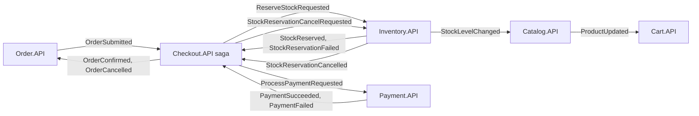
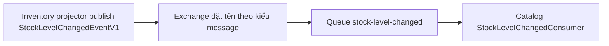
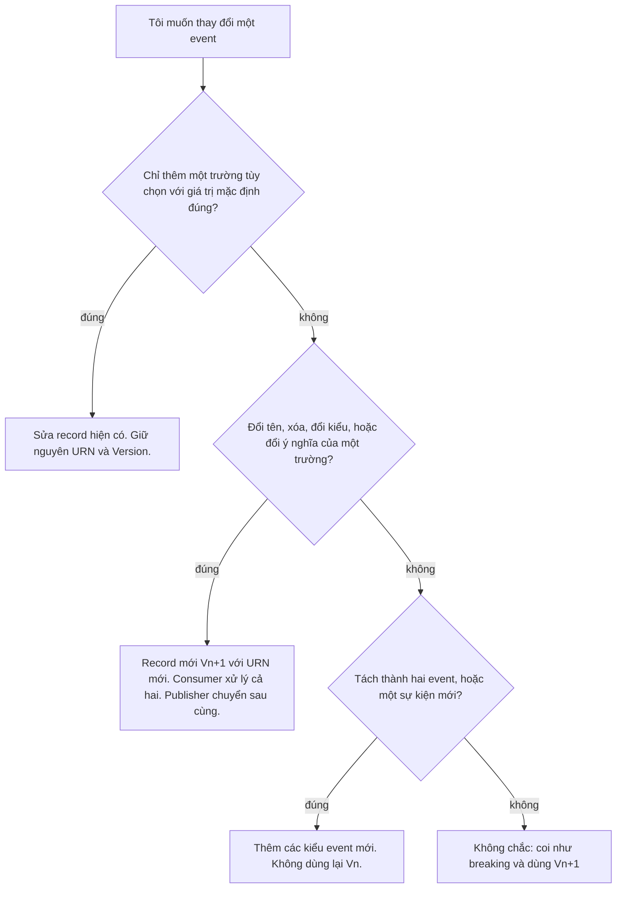

# Chương 10 - Contracts và Versioning
> 🇻🇳 Bản tiếng Việt. English version: [10-contracts-and-versioning.md](../10-contracts-and-versioning.md)

Các service trong SimpleStore nói chuyện với nhau bằng message, và hình dạng của các message đó là một contract (hợp đồng): publisher và mọi consumer phải thống nhất với nhau, nhưng chúng được deploy riêng rẽ và vào những thời điểm khác nhau. Chương này liệt kê mọi integration event trong `SimpleStore.Contracts`, giải thích cách MassTransit nhận diện và định tuyến chúng, và đưa ra một phương pháp lặp lại được để thay đổi một contract mà không làm hỏng các service phụ thuộc vào nó. Chương cũng nói về cách các HTTP API và các domain event nội bộ của Inventory được đánh phiên bản, vì chúng tuân theo các quy tắc khác nhau.

**Bạn sẽ học được**

- Sự khác nhau giữa integration event (giữa các service) và domain event (bên trong một service).
- Danh mục đầy đủ các event: các trường, ai publish, ai consume, và vì sao.
- Message URN là gì, và MassTransit dùng nó cùng với tên kiểu để dựng exchange và queue như thế nào (được đánh dấu "mặc định" ở chỗ đó là hành vi của MassTransit chứ không phải mã của repo).
- Những thay đổi nào là additive (cộng thêm, an toàn) và những thay đổi nào là breaking (phá vỡ), và cách phát hành một `V2`.
- Cách Inventory đánh phiên bản các event được lưu của nó, và điều đó liên hệ ra sao với versioning cho HTTP API trong [chương 2](02-gateway-and-api-versioning.md).

---

## Vấn đề cần giải quyết

Hãy tưởng tượng service Payment muốn thêm một trường tiền tệ (currency) bên cạnh `Amount` trong `PaymentSucceededEventV1`. Hiện giờ có năm service đang chạy, mỗi cái được build từ một commit khác nhau nếu bạn đang ở giữa lúc deploy. Các message đã nằm sẵn trong queue của RabbitMQ, hoặc trong một bảng outbox đang chờ được gửi, đã được viết bởi mã cũ. Ba câu hỏi nảy ra:

1. Consumer cũ có còn hiểu được một message do publisher mới tạo ra không?
2. Consumer mới có còn hiểu được một message do publisher cũ tạo ra không?
3. Làm sao một consumer biết nó nhận được hình dạng nào?

Không có quy tắc, câu trả lời là "tùy, và bạn sẽ biết trên production". Các quy tắc trong repo này khá nhỏ: mỗi event được đặt tên `...EventV1`, mang một số `Version`, có một định danh trên đường truyền (wire identity) được ghim cố định (message URN), chỉ được thay đổi theo cách additive, và nếu không thì sẽ có một kiểu mới với định danh mới đặt cạnh kiểu cũ.

> **Thuật ngữ mới: integration event (event tích hợp).** Một message mà một service publish để các service khác có thể phản ứng. Nó vượt qua ranh giới tiến trình, nên hình dạng của nó là một contract công khai. Tất cả chúng nằm trong `src/SimpleStore.Contracts`.

> **Thuật ngữ mới: domain event (event miền).** Một bản ghi về điều gì đó đã xảy ra bên trong một bounded context (ngữ cảnh có biên giới), dùng cho việc lưu trữ riêng của context đó (event sourcing). `StockReservedV1` của Inventory là một ví dụ. Domain event không bao giờ rời khỏi service của nó và không nằm trong `SimpleStore.Contracts`. Xem [chương 7](07-inventory-event-sourcing-cqrs.md).

> **Thuật ngữ mới: message URN.** Một chuỗi như `urn:message:SimpleStore.Contracts:StockReservedEvent` nhận diện một kiểu message trên đường truyền. MassTransit ghi nó vào envelope (phong bì) của message, và consumer dùng nó để quyết định một message có phải là loại mình xử lý hay không.

> **Thuật ngữ mới: upcasting.** Chuyển một event cũ đã lưu thành hình dạng mới nhất tại thời điểm đọc (`V1` vào, `V2` ra) để chỉ cần tồn tại handler cho bản mới nhất. Inventory có một bộ khung (scaffold) cho việc này; nó được giải thích ở phần cuối.

---

## Bức tranh tổng thể



*Cách đọc:* mỗi hộp là một service, mỗi mũi tên là một hoặc nhiều event đi qua RabbitMQ từ publisher (đuôi mũi tên) tới consumer (đầu mũi tên). Mọi tên thật đều mang hậu tố `V1`, được lược bỏ ở đây để nhãn ngắn gọn. Saga ở giữa là trung tâm (hub) của luồng checkout; Catalog và Cart nằm ở bên cạnh như những thành phần chỉ làm nhiệm vụ làm mới cache.

---

## Danh mục các event

Mỗi event bên dưới là một `sealed record` trong `src/SimpleStore.Contracts`, được đặt tên `<Name>EventV1`, với `public int Version { get; init; } = 1;` là thành viên đầu tiên. "Wire name" (tên trên đường truyền) là phần đuôi của URN đã được ghim: URN đầy đủ là `urn:message:SimpleStore.Contracts:<wire name>` và wire name là tên kiểu bỏ đi `V1`.

| Event (file) | Các trường (ngoài `Version`) | Publisher -> consumers | Mục đích |
|---|---|---|---|
| `OrderSubmittedEventV1` ([OrderSubmittedEvent.cs](../../../src/SimpleStore.Contracts/OrderSubmittedEvent.cs)) | `CorrelationId`, `OrderId`, `UserId`, `OrderDate`, `TotalAmount`, `ShippingAddress`, `Items` (danh sách `OrderSubmittedLineItem`: `ProductId`, `ProductName`, `Quantity`, `UnitPrice`) | Order.API -> Checkout saga | Khởi động checkout saga. Mang `CorrelationId` dùng làm khóa của saga. |
| `ReserveStockRequestedEventV1` ([ReserveStockRequestedEvent.cs](../../../src/SimpleStore.Contracts/ReserveStockRequestedEvent.cs)) | `CorrelationId`, `ReservationId`, `OrderId`, `RequestedAt`, `Lines` (danh sách `ReservationLineItem`: `ProductId`, `Quantity`) | Checkout saga -> Inventory.API | Yêu cầu Inventory giữ hàng. `ReservationId` đồng thời là khóa idempotency (chống xử lý trùng). |
| `StockReservedEventV1` ([StockReservedEvent.cs](../../../src/SimpleStore.Contracts/StockReservedEvent.cs)) | `CorrelationId`, `ReservationId`, `OrderId`, `ReservedAt`, `Lines` | Inventory.API (projector) -> Checkout saga | Việc giữ hàng thành công; saga có thể yêu cầu thanh toán. |
| `StockReservationFailedEventV1` ([StockReservationFailedEvent.cs](../../../src/SimpleStore.Contracts/StockReservationFailedEvent.cs)) | `CorrelationId`, `ReservationId`, `OrderId`, `Reason`, `ShortageLines` (danh sách `ShortageLine`: `ProductId`, `Requested`, `Available`), `FailedAt` | Inventory.API (`CreateReservationHandler`) -> Checkout saga | Việc giữ hàng bị từ chối; saga hủy đơn. |
| `ProcessPaymentRequestedEventV1` ([ProcessPaymentRequestedEvent.cs](../../../src/SimpleStore.Contracts/ProcessPaymentRequestedEvent.cs)) | `CorrelationId`, `OrderId`, `UserId`, `Amount`, `RequestedAt` | Checkout saga -> Payment.API | Yêu cầu Payment trừ tiền tài khoản của khách hàng. |
| `PaymentSucceededEventV1` ([PaymentSucceededEvent.cs](../../../src/SimpleStore.Contracts/PaymentSucceededEvent.cs)) | `CorrelationId`, `OrderId`, `TransactionId`, `Amount`, `PaidAt` | Payment.API -> Checkout saga | Tài khoản đã bị trừ tiền; saga xác nhận đơn. |
| `PaymentFailedEventV1` ([PaymentFailedEvent.cs](../../../src/SimpleStore.Contracts/PaymentFailedEvent.cs)) | `CorrelationId`, `OrderId`, `Reason`, `Amount`, `FailedAt`. `Reason` là một trong các hằng số `PaymentFailureReason` (hiện chỉ có `InsufficientFunds`). | Payment.API -> Checkout saga | Thanh toán bị từ chối; saga bắt đầu compensation. |
| `StockReservationCancelRequestedEventV1` ([StockReservationCancelRequestedEvent.cs](../../../src/SimpleStore.Contracts/StockReservationCancelRequestedEvent.cs)) | `CorrelationId`, `ReservationId`, `OrderId`, `RequestedAt` | Checkout saga -> Inventory.API | Compensation: nhả lượng hàng đang giữ. |
| `StockReservationCancelledEventV1` ([StockReservationCancelledEvent.cs](../../../src/SimpleStore.Contracts/StockReservationCancelledEvent.cs)) | `CorrelationId`, `ReservationId`, `OrderId`, `CancelledAt`, `Lines` | Inventory.API (projector) -> Checkout saga | Hàng đã quay lại tồn kho; saga giờ có thể hủy đơn. |
| `OrderConfirmedEventV1` ([OrderConfirmedEvent.cs](../../../src/SimpleStore.Contracts/OrderConfirmedEvent.cs)) | `CorrelationId`, `OrderId`, `ReservationId`, `ConfirmedAt` | Checkout saga -> Order.API | Đặt `Order.Status` thành `Confirmed`. |
| `OrderCancelledEventV1` ([OrderCancelledEvent.cs](../../../src/SimpleStore.Contracts/OrderCancelledEvent.cs)) | `CorrelationId`, `OrderId`, `Reason`, `CancelledAt` | Checkout saga -> Order.API | Đặt `Order.Status` thành `Cancelled`. |
| `ProductUpdatedEventV1` ([ProductUpdatedEvent.cs](../../../src/SimpleStore.Contracts/ProductUpdatedEvent.cs)) | `ProductId`, `Name`, `Description`, `Price`, `ImageUrl`, `Stock`, `CategoryId`, `CategoryName` | Catalog.API -> Cart.API | Cho phép các giỏ hàng làm mới bản sao phi chuẩn hóa (denormalized) của sản phẩm. |
| `StockLevelChangedEventV1` ([StockLevelChangedEvent.cs](../../../src/SimpleStore.Contracts/StockLevelChangedEvent.cs)) | `ProductId`, `NewOnHand`, `ChangedAt`, `Cause`. `Cause` là một trong các hằng số `StockChangeCause`: `DeliveryNote`, `ReceiptNote`, `ReservationCreated`, `ReservationCancelled`. | Inventory.API (projector) -> Catalog.API | Phát (broadcast) việc làm mới cache cho `Product.Stock`. Không gắn với quy trình nào. |

Những điều cần để ý trong bảng:

- Hầu hết các event mang `CorrelationId`, một Guid do Order.API tạo ra, nối mọi message của một lần checkout lại với nhau ([chương 6](06-checkout-saga.md)). Hai event phát rộng (`ProductUpdated`, `StockLevelChanged`) không có, vì chúng không thuộc quy trình nào.
- Các record lồng nhau (`OrderSubmittedLineItem`, `ReservationLineItem`, `ShortageLine`) không có `Version` và không có URN. Chúng đổi phiên bản cùng với event cha. `StockReservationCancelledEventV1` dùng lại `ReservationLineItem` từ `ReserveStockRequestedEvent.cs`.
- `Reason` trên `PaymentFailedEventV1` và `Cause` trên `StockLevelChangedEventV1` là các chuỗi (string) có hằng số đi kèm, không phải enum. Một chuỗi có thể có thêm giá trị mới mà không cần đổi kiểu, nhưng hãy xem "Điều gì có thể sai" để biết vì sao điều đó không hoàn toàn miễn phí.
- Không có gì trong mã đọc property `Version`. Nó là tài liệu và là một điểm móc cho một consumer tương lai muốn rẽ nhánh theo nó; việc định tuyến được làm bằng URN.

---

## Đi qua mã nguồn

### 1. Một file contract

[PaymentSucceededEvent.cs](../../../src/SimpleStore.Contracts/PaymentSucceededEvent.cs) cho thấy mọi quy ước chỉ trong vài dòng: URN được ghim, tên kiểu có `V1`, giá trị mặc định của `Version`, các property `init` bất biến (immutable).

```csharp
[MessageUrn("urn:message:SimpleStore.Contracts:PaymentSucceededEvent")]
public sealed record PaymentSucceededEventV1
{
    public int Version { get; init; } = 1;
    public Guid CorrelationId { get; init; }
    public int OrderId { get; init; }
    public Guid TransactionId { get; init; }
    public decimal Amount { get; init; }
    public DateTimeOffset PaidAt { get; init; }
}
```

Attribute ghim wire name về tên gốc, không có hậu tố. Phần `V1` trong tên C# dành cho lập trình viên; URN dành cho bus. [OrderSubmittedEvent.cs](../../../src/SimpleStore.Contracts/OrderSubmittedEvent.cs) giải thích ý định trong comment của nó: một `OrderSubmittedEventV2` trong tương lai khai báo một URN khác để các consumer có thể định tuyến theo đó.

> **Hãy kiểm tra trước khi dựa vào việc ghim.** Attribute `MessageUrn` trong gói MassTransit mà repo này tham chiếu (`MassTransit.Abstractions` 9.2.1, xem [SimpleStore.Contracts.csproj](../../../src/SimpleStore.Contracts/SimpleStore.Contracts.csproj)) tự thêm tiền tố `urn:message:` và ném exception nếu giá trị đã bắt đầu bằng nó. Trong lúc viết tài liệu này, vấn đề đã được tái hiện hai lần (độc lập): một dự án console thử nghiệm tham chiếu `SimpleStore.Contracts` và gọi `MessageUrn.ForType(typeof(OrderSubmittedEventV1))` đã thất bại với `Value should not contain the default prefix 'urn:message:'`. Viết `[MessageUrn("SimpleStore.Contracts:OrderSubmittedEvent")]` cho ra cùng URN cuối cùng trong cùng thí nghiệm. Nếu bạn thấy lỗi này khi chạy hệ thống, đó là nguyên nhân. Nó được liệt kê trong [chương 11](11-known-limitations.md).

Dự án contracts chỉ tham chiếu gói chứa attribute, không phải toàn bộ MassTransit, nên nó vẫn là một dependency nhẹ cho mọi service:

```xml
    <PackageReference Include="MassTransit.Abstractions" Version="9.2.1" />
```

### 2. Publish và consume

Order.API publish bằng cách gọi `Publish` với một record mới bên trong database transaction của nó (mẫu outbox từ [chương 5](05-orders-and-outbox.md)). [OrderService.cs](../../../src/SimpleStore.Order.API/Services/OrderService.cs):

```csharp
            await _publishEndpoint.Publish(new OrderSubmittedEventV1
            {
                CorrelationId = order.CorrelationId,
                OrderId = order.Id,
                UserId = order.UserId,
                OrderDate = order.OrderDate,
                TotalAmount = order.TotalAmount,
                ShippingAddress = order.ShippingAddress,
```

Một consumer khai báo nó xử lý contract nào bằng một interface generic. [OrderConfirmedConsumer.cs](../../../src/SimpleStore.Order.API/Consumers/OrderConfirmedConsumer.cs):

```csharp
public sealed class OrderConfirmedConsumer : IConsumer<OrderConfirmedEventV1>
```

Mỗi service đăng ký các consumer của mình (`x.AddConsumer<...>()`) và gọi `cfg.ConfigureEndpoints(ctx)` trong `Program.cs`. Lời gọi duy nhất đó là toàn bộ cấu hình định tuyến hiện có.

### 3. MassTransit định tuyến như thế nào (mặc định)

Phần sau đây là hành vi mặc định của MassTransit, không phải mã của repo. Các quy ước đã được kiểm tra với phiên bản MassTransit mà repo này dùng; hãy coi giao diện quản lý RabbitMQ là nguồn có thẩm quyền cuối cùng.



*Cách đọc:* một publisher không bao giờ gửi tới một queue. Nó gửi tới một exchange (bộ phân phối) đặt tên theo kiểu message, và mỗi service consumer có queue riêng gắn (bind) vào exchange đó.

- **Publishing** đi tới một exchange được suy ra từ namespace CLR và tên kiểu của message, ví dụ `SimpleStore.Contracts:StockLevelChangedEventV1`. Trong một bài thử nghiệm, một kiểu có attribute ghim vẫn có exchange đặt theo tên CLR của nó, không phải theo URN, nên việc ghim không kiểm soát tên exchange.
- **Consuming**: `ConfigureEndpoints` tạo một queue cho mỗi class consumer, với tên dạng kebab-case và bỏ hậu tố `Consumer` (`ReserveStockRequestedConsumer` thành `reserve-stock-requested`; `OrderConfirmedConsumer` thành `order-confirmed`), và gắn nó vào exchange của kiểu message mà consumer xử lý. Nếu hai service cùng consume một event, mỗi service có queue riêng và mỗi service nhận bản sao của riêng mình. Saga cũng có queue riêng; hãy đọc tên của nó trong giao diện quản lý.
- **Envelope**: mỗi message đi dưới dạng một envelope JSON. Ngoài phần thân (body), nó liệt kê (các) URN của message trong một trường `messageType`. Một consumer cho `IConsumer<T>` chấp nhận một envelope có `messageType` chứa URN của `T`, rồi deserialize phần thân thành `T`. Đó là lý do URN, chứ không phải tên class C#, mới là "contract": publisher và consumer không cần dùng chung tên kiểu CLR chính xác, chỉ cần chung URN và một phần thân tương thích.

Việc ghim mang lại gì: URN trong envelope không đổi khi các kiểu được đổi tên thành `...V1` ở v11, nên một phần thân message được viết trước khi đổi tên vẫn khớp với một consumer sau khi đổi. Nó không mang lại gì: tên exchange đi theo kiểu CLR, nên việc đổi tên đã chuyển việc publish sang các exchange có tên khác. Vì mọi service được build lại cùng lúc nên điều này vô hại, nhưng các message còn nằm trong một exchange cũ sẽ không đi theo. Hãy coi "việc đổi tên vô hình trên bus" là đúng chỉ với URN.

### 4. Domain event dùng một cơ chế khác

Các event được lưu của Inventory được nhận diện bằng một chuỗi thuần trong KurrentDB, được đăng ký trong [EventTypeRegistry.cs](../../../src/SimpleStore.Inventory.API/EventStore/EventTypeRegistry.cs):

```csharp
    public const string StockReservedV1Type = "simplestore.inventory.reservation.reserved.v1";
    public const string StockReservationCancelledV1Type = "simplestore.inventory.reservation.cancelled.v1";
```

Hai cơ chế trông giống nhau nhưng có vòng đời khác nhau:

| | Integration event | Domain event của Inventory |
|---|---|---|
| Nằm ở đâu | `SimpleStore.Contracts` | `Inventory.API/Domain/**/Events/` |
| Định danh | `[MessageUrn]` | Wire string trong `EventTypeRegistry` (`simplestore.<context>.<aggregate>.<verb>.v1`) |
| Vòng đời | Vài giây đến vài ngày (cho tới khi được consume) | Mãi mãi (log là nguồn sự thật) |
| Ai phải hiểu nó | Mọi service consumer | Chỉ projector và các handler của Inventory |

Hàng cuối cùng đó giải thích vì sao việc đánh phiên bản domain event nghiêm ngặt hơn: một message đã được consume là biến mất; một event đã lưu vẫn phải đọc được sau mười năm.

---

## Additive so với breaking

Trong cùng một `Vn`, thêm một trường tùy chọn là an toàn. Lý do nằm ở cách System.Text.Json (bộ serializer mà MassTransit dùng mặc định) đọc phần thân: một property thiếu trong JSON giữ nguyên giá trị khởi tạo mặc định trong C# của nó, và một property có trong JSON mà kiểu không có sẽ bị bỏ qua. [docs/versioning.md](../../versioning.md) mục 2 nêu chính sách; bảng này là cùng quy tắc kèm lý do.

| Thay đổi | An toàn trong cùng `Vn`? | Điều gì xảy ra ở phía bên kia |
|---|---|---|
| Thêm một trường tùy chọn với giá trị mặc định hợp lý | Có | Consumer cũ bỏ qua nó. Consumer mới đọc một message cũ sẽ thấy giá trị mặc định. |
| Đổi tên một trường | Không | Consumer cũ đọc giá trị mặc định cho trường đã đổi tên, một cách âm thầm. |
| Xóa một trường | Không | Consumer cũ đọc giá trị mặc định, một cách âm thầm. |
| Đổi kiểu của một trường | Không | Việc deserialize có thể ném exception, hoặc giá trị bị đọc sai. |
| Giữ tên, đổi ý nghĩa (ví dụ `Amount` từ net sang gross) | Không | Không có gì thất bại; các con số chỉ đơn giản là sai. Đây là trường hợp tệ nhất. |
| Tách một event thành hai | Không: thêm các kiểu event mới, để nguyên `Vn` | Event cũ giữ nguyên ý nghĩa của nó cho các consumer cũ. |

Từ "âm thầm" chính là vấn đề. Một trường bị xóa hoặc đổi tên không gây ra lỗi nào, vì property bị thiếu quay về giá trị mặc định của nó (0, chuỗi rỗng, `Guid.Empty`) và consumer cứ tiếp tục với dữ liệu sai. Đó là lý do quy tắc là phải nghiêm ngặt về việc cái gì được tính là additive.

---

## Các thuật toán

**Thuật toán 1: một consumer quyết định nó có thể xử lý một message như thế nào (mặc định, đã đơn giản hóa)**

1. Message đến queue của consumer với một envelope liệt kê một hoặc nhiều URN trong `messageType`.
2. MassTransit tìm một kiểu message có URN nằm trong danh sách đó và endpoint có consumer cho nó.
3. Nếu tìm thấy, nó deserialize phần thân thành kiểu CLR đó. Các property JSON bị thiếu giữ giá trị mặc định; các property JSON thừa bị bỏ.
4. Phương thức `Consume` của consumer chạy.
5. Nếu không URN nào khớp, message không được consumer này xử lý (mặc định MassTransit chuyển nó vào một queue `_skipped` thay vì làm nó thất bại).

**Thuật toán 2: phát hành một thay đổi breaking dưới dạng `V2` (từ [docs/versioning.md](../../versioning.md) mục 2)**

1. Thêm `FooEventV2` như một record mới trong `SimpleStore.Contracts`. Không đụng vào hay xóa `FooEventV1`.
2. Cho nó URN riêng. Không bao giờ dùng lại một URN cho một hình dạng khác.
3. Đặt `public int Version { get; init; } = 2;`.
4. Cập nhật mọi consumer để cài đặt `IConsumer<FooEventV2>` bên cạnh `IConsumer<FooEventV1>`. Deploy các consumer trước.
5. Cập nhật publisher để publish `FooEventV2`.
6. Giữ consumer `V1` cho tới khi không còn publisher nào gửi `V1` và queue `V1` đã rỗng. Sau đó mới xóa nó.

Hãy deploy consumer trước publisher, để không bao giờ có một message `V2` đang trên đường đi mà không ai đọc. Các message đã nằm trong queue dưới dạng `V1` trước khi chuyển vẫn được giao dưới dạng `V1`, đó là lý do consumer `V1` ở lại cho tới khi queue được xả hết.

**Thuật toán 3: một kiểm tra tương thích nhanh trước khi bạn merge một thay đổi contract**

1. Lấy một phần thân JSON do mã cũ tạo ra. Kiểu mới có đọc được nó và cho ra giá trị đúng (không chỉ là không có lỗi) không?
2. Lấy một phần thân JSON do mã mới tạo ra. Kiểu cũ có đọc được nó và cho ra giá trị đúng không?
3. Nếu cả hai câu trả lời đều có, thay đổi là additive. Nếu một trong hai là không, nó là breaking: dùng Thuật toán 2.

---

## Các ví dụ thực hành

Hai ví dụ này là minh họa, không phải mã tồn tại trong repo.

### Ví dụ A: thêm một trường (additive)

Mục tiêu: `OrderSubmittedEventV1` cũng nên mang số tiền giảm giá đã áp dụng.

```csharp
public decimal DiscountAmount { get; init; }
```

1. Thêm property với giá trị mặc định (`0`). Không có kiểu mới, không có URN mới, `Version` vẫn là `1`.
2. Chạy kiểm tra tương thích. Phần thân cũ vào kiểu mới: trường bị thiếu, nên `DiscountAmount` là `0`, điều này đúng vì các đơn cũ không có giảm giá. Phần thân mới vào kiểu cũ: trường bị bỏ qua. Cả hai đều đạt.
3. Deploy theo thứ tự bất kỳ. Consumer quan tâm (giả sử là saga) bắt đầu dùng `DiscountAmount`.

Một trường hợp trông như additive nhưng không phải: một property `Currency` mới có mặc định là chuỗi rỗng. Các message cũ sẽ mang một currency rỗng, và một consumer coi rỗng là "không rõ" có thể từ chối các khoản thanh toán. Giá trị mặc định phải là một phát biểu đúng về mọi message cũ.

### Ví dụ B: đổi hình dạng của một trường (breaking)

Mục tiêu: thay `PaymentSucceededEventV1.Amount` (một `decimal`) bằng một cặp gồm số tiền và tiền tệ.

1. Thêm `PaymentSucceededEventV2` với URN riêng và `Version = 2`:
   ```csharp
   [MessageUrn("SimpleStore.Contracts:PaymentSucceededEventV2")]
   public sealed record PaymentSucceededEventV2 { /* new shape */ }
   ```
   (Chuỗi URN ở đây theo hình dạng hoạt động được với attribute trong 9.2.1, xem phần callout ở trên.)
2. Trong checkout saga, thêm `Event<PaymentSucceededEventV2>` bên cạnh event `V1` và xử lý nó ở cùng trạng thái.
3. Deploy saga. Giờ nó chấp nhận cả hai phiên bản.
4. Đổi Payment.API để publish `V2`.
5. Khi queue `V1` rỗng và không tiến trình nào publish `V1`, hãy xóa phần xử lý `V1`, rồi (tùy chọn) xóa luôn record `V1`.

### Ví dụ C: tách một event

Nếu `OrderSubmittedEventV1` phải được tách thành "đơn đã được đặt" và "đã ghi nhận chi tiết thanh toán", quy tắc là thêm hai kiểu event mới và để nguyên `OrderSubmittedEventV1` cho tới khi các consumer của nó được chuyển đổi xong. Dùng lại `OrderSubmittedEventV1` với một ý nghĩa khác sẽ là một thay đổi breaking âm thầm.

### Chọn đúng loại thay đổi



*Cách đọc:* bắt đầu từ trên cùng và trả lời từng câu hỏi. Chỉ nhánh đầu tiên cho phép bạn sửa một record hiện có; mọi đường khác đều thêm một kiểu mới.

---

## Đánh phiên bản cho hai loại contract còn lại

HTTP API, integration event và domain event của Inventory mỗi loại có định danh riêng và quy tắc riêng. Chính sách nằm trong [docs/versioning.md](../../versioning.md).

| | HTTP API | Integration event | Domain event của Inventory |
|---|---|---|---|
| Định danh | Đoạn URL `/api/v{N}/<service>/...` | `[MessageUrn]` | Wire string trong `EventTypeRegistry` |
| Thư viện | `Asp.Versioning.Http` | `MassTransit.Abstractions` | Registry tự viết tay |
| Phiên bản hoặc kiểu không rõ | 404 | Các JSON property không rõ bị bỏ; không có URN khớp nghĩa là không có handler | Projector bỏ qua event và đếm nó |
| `V2` chạy song song với `V1` | Cùng một backend phục vụ cả hai | Record và URN riêng | Cả hai kiểu ở lại trong registry mãi mãi |

Việc đánh phiên bản HTTP được đề cập trong [chương 2](02-gateway-and-api-versioning.md): gateway chuyển tiếp `/api/v1/...` nguyên vẹn, và mỗi backend khai báo các phiên bản của mình một cách tự nhiên (native).

Các domain event của Inventory thêm ba thứ lên trên, tất cả từ v11:

1. **Hậu tố wire-string `.v1`** là điểm neo. Các thay đổi additive giữ `.v1`; một thay đổi breaking đưa vào `.v2` và cả hai chuỗi đều ở lại trong registry.
2. **Một bộ khung upcaster**, [IEventUpcaster.cs](../../../src/SimpleStore.Inventory.API/EventStore/IEventUpcaster.cs). Nó là một interface một phương thức, và chưa được nối vào đâu cả vì chưa có event `V2` nào tồn tại:
   ```csharp
   public interface IEventUpcaster<TOld, TNew>
       where TOld : IInventoryDomainEvent
       where TNew : IInventoryDomainEvent
   {
       TNew Upcast(TOld old);
   }
   ```
   Ý định: khi `StockReservedV2` xuất hiện trong tương lai, một upcaster biến các event `V1` lịch sử thành `V2` trong lúc replay, để chỉ cần mã projection cho `V2`. Nó được kỳ vọng là một phép biến đổi thuần túy; nếu việc chuyển đổi cần dữ liệu bên ngoài, một projection di chuyển dữ liệu chạy một lần (one-time migration projection) là công cụ tốt hơn.
3. **Một chế độ thất bại ồn ào cho các lần rollout hỏng.** Một replica cũ gặp một wire string `V2` sẽ không tìm thấy mục nào trong registry của nó, ghi log "Projector skipped unknown event type...", đưa checkpoint của nó vượt qua event đó, và tăng `simplestore.inventory.projector.unknown_events` ([InventoryProjectionService.cs](../../../src/SimpleStore.Inventory.API/Projections/InventoryProjectionService.cs)). Ở trạng thái ổn định, bộ đếm đó phải giữ ở mức không; một tốc độ khác không nghĩa là một `V2` đã được ghi trước khi mọi replica đọc được nó.

Hai cách để đưa một read model về trạng thái cập nhật sau khi một domain event thay đổi: **upcast** (rẻ, trong cùng tiến trình, cho các thay đổi hình dạng không mất mát) hoặc **full replay** (xóa các bảng đọc và khởi động lại để projector dựng lại từ đầu, như đã thực hành trong [chương 7](07-inventory-event-sourcing-cqrs.md)).

---

## Điều gì có thể sai

- **Dùng lại hoặc sửa một URN đã ghim.** Nếu một URN bị đổi, hoặc bị dùng lại cho một hình dạng mới, các message cũ hoặc không khớp consumer nào hoặc bị parse thành hình dạng sai. Không bao giờ đổi một URN đã được publish.
- **Xóa `V1` quá sớm.** Các message được tạo trước lúc chuyển vẫn có thể nằm trong một queue hoặc trong một bảng outbox. Chỉ ngừng dùng một consumer `V1` sau khi queue đã được xả hết.
- **Giá trị mặc định âm thầm.** Xóa hoặc đổi tên một trường không bao giờ ném exception; consumer chỉ thấy giá trị mặc định. Hãy ưu tiên thêm một trường mới và chuyển các consumer sang trước khi xóa trường cũ trong một `V2`.
- **Từ vựng chuỗi mở.** `PaymentFailureReason` và `StockChangeCause` là các chuỗi. Thêm một hằng số (như v12 đã làm với `ReservationCancelled`) giữ cho kiểu vẫn tương thích, nhưng một consumer có `switch` giả định chỉ có các giá trị cũ có thể xử lý sai nó. Hãy coi một hằng số mới là một thay đổi cần review consumer.
- **Cho rằng trường `Version` định tuyến được thứ gì đó.** Nó không; không có gì đọc nó. Việc định tuyến dùng URN. Dùng nó để rẽ nhánh bên trong consumer là có thể nhưng phải tự viết.
- **Đổi tên và tên exchange.** Như đã mô tả ở trên, đổi tên kiểu CLR làm đổi tên exchange mặc định. Việc ghim URN bảo vệ định danh của phần thân, không phải exchange.
- **Vấn đề tiền tố của attribute.** Xem callout trong phần đi qua mã nguồn: với phiên bản gói đã ghim, các chuỗi URN trong repo này có thể bị từ chối lúc runtime.
- **Các record lồng nhau không có phiên bản.** Một thay đổi với `ReservationLineItem` là một thay đổi với mọi event chứa nó (`ReserveStockRequested`, `StockReserved`, `StockReservationCancelled`). Hãy chạy kiểm tra tương thích cho tất cả chúng.
- **Domain event bị trôi (drift).** Không bao giờ sửa wire string của một event đã lưu hoặc xóa một record `V1` cũ trong Inventory; các event lịch sử phải luôn đọc được.

---

## Tự thực hành

1. **Đọc trên đường truyền.** Khởi động AppHost, mở giao diện quản lý RabbitMQ từ Aspire dashboard, và xem các tab Exchanges và Queues. Tìm các exchange có tên `SimpleStore.Contracts:...` và các queue như `reserve-stock-requested`, `order-confirmed`, `stock-level-changed`. So sánh với bảng ở trên.
2. **Xem một envelope.** Trong tab Queues, mở một queue, dùng "Get messages" với "Nack message requeue true" để không mất gì, và đọc trường `messageType` của một message. (Một queue thường được xả hết ngay lập tức; tạm thời dừng service consume sẽ giúp các message ở lại đủ lâu để xem.)
3. **Chạy thử một thay đổi additive.** Trên một nhánh nháp, thêm `public decimal DiscountAmount { get; init; }` vào `OrderSubmittedEventV1`, build, và đặt một đơn hàng. Không cần đổi gì khác. Hoàn tác sau đó.
4. **Chạy thử một thay đổi dual-consumer.** Trong đầu bạn hoặc trên một nhánh nháp, phác thảo `PaymentFailedEventV2` và `Event<PaymentFailedEventV2>` tương ứng trong `CheckoutSagaStateMachine`. Những service nào phải được deploy trước?
5. **Xem đường đi của event không rõ.** Bộ đếm `simplestore.inventory.projector.unknown_events` và thông điệp log "Projector skipped unknown event type" được định nghĩa trong projector; chúng chỉ kích hoạt nếu registry thiếu một kiểu đang có trong stream. Hãy đọc đường đi trong mã ở [InventoryProjectionService.cs](../../../src/SimpleStore.Inventory.API/Projections/InventoryProjectionService.cs) (`ApplyOneAsync`) và mô tả một lần deploy với một replica cũ và một event mới sẽ trông như thế nào.

---

## Những điều cần nhớ

- Integration event là các contract công khai dùng chung bởi các service được deploy độc lập; domain event là riêng tư với một service và nằm trong event store của nó.
- Mỗi contract ở đây có một tên CLR hậu tố `Vn`, một trường `Version`, và một URN được ghim. URN là định danh trên đường truyền; tên C# dành cho lập trình viên.
- Chỉ một trường tùy chọn mới với giá trị mặc định đúng mới là additive. Mọi thứ khác đều cần một record mới, một URN mới, dual consumer, và một bước ngừng dùng bản cũ.
- Deploy consumer trước, publisher sau, và xóa phiên bản cũ khi queue của nó rỗng.
- Các event được lưu của Inventory thêm các wire string `.vN`, một bộ khung upcaster, và một bộ đếm `unknown_events`, vì lịch sử đã lưu không bao giờ hết hạn.
- Hãy kiểm chứng, đừng giả định, rằng các URN được ghim được phiên bản MassTransit đang dùng chấp nhận (xem callout trong phần đi qua mã nguồn).

**Chương tiếp theo:** [Chương 11 - Những hạn chế đã biết](11-known-limitations.md).
