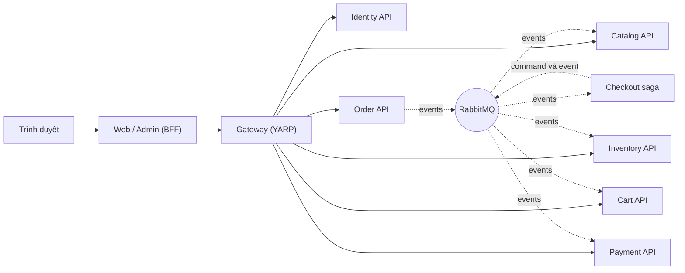

# Hướng dẫn học SimpleStore

> 🇻🇳 Bản tiếng Việt. Xem [hướng dẫn tiếng Anh](../README.md).

Hướng dẫn này đưa bạn đi qua SimpleStore từng bước, từ kiến trúc đến mã nguồn, dành cho những ai **mới làm quen với microservices**. [README](../../../README.md) ở thư mục gốc cho biết hệ thống *gồm những gì*; hướng dẫn này giải thích *hệ thống hoạt động ra sao và vì sao được thiết kế như vậy*, với mã nguồn, sơ đồ và các thuật toán minh họa.

Các chương đều có cùng bố cục, nên bạn luôn biết cần tìm nội dung gì và ở đâu:

1. **Vấn đề cần giải quyết** — vì sao thành phần này tồn tại.
2. **Bức tranh tổng thể** — một sơ đồ Mermaid.
3. **Đi qua mã nguồn** — file thật, đoạn mã thật, các bước được đánh số.
4. **Thuật toán** — phần logic được diễn giải thành các bước đơn giản.
5. **Điều gì có thể sai** — các kiểu lỗi có thể xảy ra.
6. **Tự thực hành** — các bước thực hành trên ứng dụng đang chạy.
7. **Những điều cần nhớ.**

> Sơ đồ được viết bằng [Mermaid](https://mermaid.js.org/). GitHub và VS Code (có cài extension Mermaid) có thể hiển thị trực tiếp.

---

## Thứ tự đọc gợi ý

Nếu chỉ có **một giờ**, hãy đọc [Chương 1](01-architecture-and-aspire.md), [Chương 5](05-orders-and-outbox.md) và [Chương 6](06-checkout-saga.md). Ba chương này trình bày những ý tưởng cốt lõi của dự án: *mỗi service sở hữu dữ liệu riêng, các service giao tiếp với nhau qua event, và saga giúp duy trì tính nhất quán cho quy trình trải dài qua nhiều service.*

Nếu bạn có **một cuối tuần**, hãy đọc lần lượt theo thứ tự:

| # | Chương | Bạn sẽ hiểu... |
|---|---|---|
| 1 | [Kiến trúc và Aspire](01-architecture-and-aspire.md) | các service là gì, service nào sở hữu database nào, Aspire kết nối chúng với nhau ra sao |
| 2 | [Gateway và versioning cho API](02-gateway-and-api-versioning.md) | một cổng vào duy nhất định tuyến request và bảo vệ 6 backend như thế nào, URL được đánh phiên bản ra sao |
| 3 | [Xác thực và mẫu BFF](03-authentication-and-bff.md) | JWT, cách xoay vòng refresh token, passkey, và lý do trình duyệt không bao giờ trực tiếp nhận token |
| 4 | [Catalog và Cart](04-catalog-and-cart.md) | một service CRUD truyền thống, giỏ hàng ẩn danh trên Redis, cách gộp giỏ hàng và làm mới cache qua event |
| 5 | [Orders và transactional outbox](05-orders-and-outbox.md) | vì sao không thể chỉ "lưu rồi mới publish", và outbox/inbox giải quyết vấn đề đó ra sao |
| 6 | [Checkout saga](06-checkout-saga.md) | một quy trình được điều phối qua nhiều service, có timeout và compensation (hành động bù trừ) |
| 7 | [Inventory: event sourcing và CQRS](07-inventory-event-sourcing-cqrs.md) | event chỉ được ghi thêm, aggregate, projection và read model có thể dựng lại |
| 8 | [Payment và compensation](08-payment-and-compensation.md) | ví trả trước cho phép chủ động quyết định checkout thành công hay thất bại |
| 9 | [Khả năng chịu lỗi và khả năng quan sát](09-resilience-and-observability.md) | retry, circuit breaker, health check, trace và metric |
| 10 | [Contract và versioning](10-contracts-and-versioning.md) | các integration event và cách thay đổi event mà không làm hỏng consumer |
| 11 | [Các hạn chế đã biết](11-known-limitations.md) | dự án học tập này đơn giản hóa những gì, và hệ thống production cần bổ sung gì |

---

## Hệ thống trong một bức hình



*Mũi tên liền biểu thị lời gọi HTTP đồng bộ; mũi tên đứt nét biểu thị thông điệp bất đồng bộ. Checkout không có giao diện HTTP mà chỉ xử lý các thông điệp.*

---

## Bảng thuật ngữ

| Thuật ngữ | Ý nghĩa đơn giản | Chương |
|---|---|---|
| **Aspire** | Công cụ .NET khởi động các service và database trên máy local, đồng thời cấu hình sẵn địa chỉ và secret cho chúng | [1](01-architecture-and-aspire.md) |
| **Service discovery** (khám phá service) | Gọi `https+http://gateway` thay vì dùng host và port cố định; Aspire sẽ phân giải địa chỉ thực | [1](01-architecture-and-aspire.md) |
| **API gateway** (cổng API) | Cổng vào duy nhất, định tuyến request đến đúng service và kiểm tra token | [2](02-gateway-and-api-versioning.md) |
| **JWT** | Token có chữ ký, cho biết người dùng là ai và họ có những role nào | [3](03-authentication-and-bff.md) |
| **Refresh token rotation** (xoay vòng refresh token) | Mỗi lần sử dụng refresh token, hệ thống thay nó bằng một token mới | [3](03-authentication-and-bff.md) |
| **BFF (Backend for Frontend)** | Ứng dụng phía server giữ token thay cho trình duyệt, để trình duyệt chỉ cần một cookie opaque (không tiết lộ thông tin bên trong) | [3](03-authentication-and-bff.md) |
| **Dual write problem** (vấn đề ghi kép) | Chỉ cập nhật database rồi publish thông điệp không đủ để bảo đảm hai thao tác đó là nguyên tử | [5](05-orders-and-outbox.md) |
| **Transactional outbox** | Ghi thông điệp trong cùng transaction với dữ liệu; worker chạy nền sẽ publish thông điệp sau đó | [5](05-orders-and-outbox.md) |
| **Inbox** | Bảng lưu ID các thông điệp đã xử lý, giúp bỏ qua thông điệp được gửi lại | [5](05-orders-and-outbox.md) |
| **Saga** | Quy trình kéo dài qua nhiều transaction cục bộ, dùng hành động bù trừ thay cho rollback toàn cục | [6](06-checkout-saga.md) |
| **Orchestration** (điều phối) | Một thành phần (saga) chỉ dẫn các thành phần khác cần làm gì tiếp theo | [6](06-checkout-saga.md) |
| **Compensation** (bù trừ) | Hành động đảo ngược tác động của một bước trước đó (ở đây là giải phóng lượng hàng đã giữ) | [6](06-checkout-saga.md), [8](08-payment-and-compensation.md) |
| **Event sourcing** | Lưu *lịch sử event* thay vì trạng thái hiện tại; trạng thái được tính từ các event đó | [7](07-inventory-event-sourcing-cqrs.md) |
| **Aggregate** | Nhóm nhỏ các đối tượng bảo đảm một quy tắc nghiệp vụ và được lưu, tải như một đơn vị | [7](07-inventory-event-sourcing-cqrs.md) |
| **CQRS** | Dùng một mô hình để thay đổi dữ liệu (command) và một mô hình khác để đọc dữ liệu (query) | [7](07-inventory-event-sourcing-cqrs.md) |
| **Projection** | Tiến trình chạy nền chuyển event thành các bảng được tối ưu cho việc đọc | [7](07-inventory-event-sourcing-cqrs.md) |
| **Eventual consistency** (tính nhất quán sau cùng) | Các phần của hệ thống đạt trạng thái nhất quán với nhau *sau một khoảng trễ ngắn*, chứ không phải ngay lập tức | [7](07-inventory-event-sourcing-cqrs.md) |
| **Idempotent** (có tính lũy đẳng) | Thực hiện hai lần cho kết quả tương đương với thực hiện một lần | [4](04-catalog-and-cart.md), [5](05-orders-and-outbox.md) |
| **Circuit breaker** (cầu dao) | Tạm ngừng gọi một dependency đang lỗi để dependency đó có thời gian hồi phục | [9](09-resilience-and-observability.md) |
| **Distributed trace** (trace phân tán) | Một dòng thời gian duy nhất theo dõi request xuyên suốt các service | [9](09-resilience-and-observability.md) |
| **Message URN** | Tên định danh cố định của event trên đường truyền, không phụ thuộc vào tên kiểu C# | [10](10-contracts-and-versioning.md) |

---

## Các chương liên quan thế nào tới lịch sử phiên bản

Dự án được phát triển qua nhiều giai đoạn (từ v0 đến v12). Các chương được sắp xếp theo *khái niệm* thay vì phiên bản; bảng dưới đây cho biết nội dung của từng phiên bản hiện được trình bày ở đâu:

| Phiên bản | Chủ đề | Đọc |
|---|---|---|
| v1–v4 | Database riêng cho từng service, tách Catalog, Identity, Order, Cart | [1](01-architecture-and-aspire.md), [3](03-authentication-and-bff.md), [4](04-catalog-and-cart.md) |
| v5 | API gateway | [2](02-gateway-and-api-versioning.md) |
| v6 | RabbitMQ, MassTransit, outbox/inbox | [5](05-orders-and-outbox.md) |
| v7 | Event sourcing và CQRS (Inventory) | [7](07-inventory-event-sourcing-cqrs.md) |
| v8, v8a, v8b | Checkout saga, củng cố, timeout bền vững | [6](06-checkout-saga.md) |
| v9 | Khả năng chịu lỗi (resilience) | [9](09-resilience-and-observability.md) |
| v10 | Observability (khả năng quan sát) | [9](09-resilience-and-observability.md) |
| v11 | Versioning cho API và event | [2](02-gateway-and-api-versioning.md), [10](10-contracts-and-versioning.md) |
| v12 | Payment và compensation | [8](08-payment-and-compensation.md), [6](06-checkout-saga.md) |

Các ghi chú thay đổi theo từng phiên bản vẫn nằm trong [`docs/`](../../) (`v1-changes.md` … `v12-changes.md`) nếu bạn muốn xem chi tiết lịch sử. Riêng saga, [`checkout-saga.md`](../../checkout-saga.md) là tài liệu thiết kế đầy đủ; mục 15 mô tả luồng hiện tại của v12.

---

## Trước khi bắt đầu: chạy hệ thống

Bạn có thể đọc hướng dẫn mà không cần chạy ứng dụng, nhưng phần *Tự thực hành* trong mỗi chương giả định ứng dụng đang hoạt động.

1. Cài .NET 10 SDK, công cụ Aspire và Docker Desktop (xem phần [điều kiện tiên quyết](../../../README.md#prerequisites) trong README ở thư mục gốc).
2. Đặt ba secret cho AppHost (`jwt-key` phải là chuỗi base64 đại diện cho ít nhất 32 byte ngẫu nhiên — hãy tự tạo và không commit secret này):

   ```pwsh
   dotnet user-secrets set Parameters:jwt-key       "<base64 of 32 random bytes>" --project src/SimpleStore.AppHost
   dotnet user-secrets set Parameters:jwt-issuer    "simple-store"                --project src/SimpleStore.AppHost
   dotnet user-secrets set Parameters:jwt-audience  "simple-store"                --project src/SimpleStore.AppHost
   ```

3. Khởi động mọi thứ:

   ```pwsh
   dotnet run --project src/SimpleStore.AppHost
   ```

4. Mở **Aspire dashboard** có địa chỉ được in trong console. Từ đó, bạn có thể mở cửa hàng (`web`), trang quản trị (`admin`), pgweb (trình duyệt Postgres), RedisInsight, giao diện quản lý RabbitMQ, cũng như xem trace, log và metric của mọi service.

Có hai tài khoản demo được seed, chỉ dành cho môi trường phát triển: `admin@simplestore.local` (Admin) và `demo@simplestore.local` (Customer). Mật khẩu của chúng nằm trong Identity seeder ([IdentitySeeder.cs](../../../src/SimpleStore.Identity.API/IdentitySeeder.cs)).

---

## Quy ước dùng trong hướng dẫn

- Liên kết tới file được ghi theo đường dẫn tương đối từ repository, ví dụ [AppHost.cs](../../../src/SimpleStore.AppHost/AppHost.cs).
- Các đoạn mã được trích từ repository và lược bớt bằng `// ...` khi cần. Nếu mã nguồn và hướng dẫn có điểm không khớp, **hãy lấy mã nguồn làm chuẩn** — vui lòng mở issue hoặc cập nhật hướng dẫn.
- Những phát biểu về mặc định của thư viện bên thứ ba mà không thấy được trong repository này được đánh dấu *"by default"* (mặc định) hoặc *"to verify"* (cần kiểm chứng).
