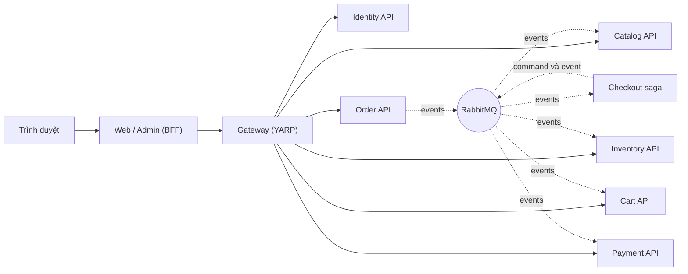

# Hướng dẫn học SimpleStore

> 🇻🇳 Bản tiếng Việt. English version: [README.md](../README.md)

Bản tiếng Anh: [English guide](../README.md)

Đây là một chuyến tham quan SimpleStore từng bước, đi sâu tới mức mã nguồn, dành cho những bạn **mới làm quen với microservices**. [README](../../../README.md) ở thư mục gốc cho bạn biết hệ thống *gồm những gì*; hướng dẫn này giải thích *nó hoạt động ra sao và vì sao lại thiết kế như vậy*, bằng mã nguồn thật, sơ đồ và các thuật toán nhỏ.

Mỗi chương đều có cùng một cấu trúc, nên bạn luôn biết cần tìm gì ở đâu:

1. **Vấn đề cần giải quyết** — vì sao thành phần này tồn tại.
2. **Bức tranh tổng thể** — một sơ đồ Mermaid.
3. **Đi qua mã nguồn** — file thật, đoạn mã thật, các bước được đánh số.
4. **Thuật toán** — phần logic được diễn giải thành các bước đơn giản.
5. **Điều gì có thể sai** — các kiểu lỗi có thể xảy ra.
6. **Tự thực hành** — các bước thực hành trên ứng dụng đang chạy.
7. **Những điều cần nhớ.**

> Các sơ đồ dùng [Mermaid](https://mermaid.js.org/). GitHub và VS Code (cài thêm extension Mermaid) hiển thị chúng trực tiếp.

---

## Thứ tự đọc gợi ý

Nếu bạn chỉ có **một giờ**, hãy đọc [Chương 1](01-architecture-and-aspire.md), [Chương 5](05-orders-and-outbox.md) và [Chương 6](06-checkout-saga.md). Ba chương này chứa ý tưởng cốt lõi của cả dự án: *mỗi service sở hữu dữ liệu của riêng nó, các service nói chuyện với nhau qua event, và một saga giữ cho quy trình nhiều service luôn nhất quán.*

Nếu bạn có **một cuối tuần**, hãy đọc lần lượt theo thứ tự:

| # | Chương | Bạn sẽ hiểu... |
|---|---|---|
| 1 | [Kiến trúc và Aspire](01-architecture-and-aspire.md) | các service là gì, service nào sở hữu database nào, Aspire kết nối mọi thứ lại với nhau ra sao |
| 2 | [Gateway và versioning cho API](02-gateway-and-api-versioning.md) | một điểm vào duy nhất định tuyến và bảo vệ 6 backend như thế nào, và URL được đánh phiên bản ra sao |
| 3 | [Xác thực và mẫu BFF](03-authentication-and-bff.md) | JWT, xoay vòng refresh token, passkey, và vì sao trình duyệt không bao giờ nhìn thấy token |
| 4 | [Catalog và Cart](04-catalog-and-cart.md) | một service CRUD cổ điển, giỏ hàng ẩn danh chạy trên Redis, gộp giỏ hàng và làm mới cache theo event |
| 5 | [Orders và transactional outbox](05-orders-and-outbox.md) | vì sao bạn không thể "lưu rồi mới publish", và outbox/inbox giải quyết việc đó như thế nào |
| 6 | [Checkout saga](06-checkout-saga.md) | một quy trình nhiều service được điều phối, có timeout và compensation (hành động bù trừ) |
| 7 | [Inventory: event sourcing và CQRS](07-inventory-event-sourcing-cqrs.md) | event chỉ-ghi-thêm, aggregate, projection và read model có thể dựng lại |
| 8 | [Payment và compensation](08-payment-and-compensation.md) | ví trả trước giúp bạn cho checkout thành công hoặc thất bại theo ý muốn |
| 9 | [Khả năng chịu lỗi và observability](09-resilience-and-observability.md) | retry, circuit breaker, health check, trace và metric |
| 10 | [Contract và versioning](10-contracts-and-versioning.md) | mọi integration event, và cách thay đổi một event mà không làm hỏng các consumer |
| 11 | [Các hạn chế đã biết](11-known-limitations.md) | những gì dự án học tập này đơn giản hóa, và những gì production cần có |

---

## Hệ thống trong một bức hình



*Mũi tên liền là các lời gọi HTTP đồng bộ; mũi tên đứt nét là các thông điệp bất đồng bộ. Checkout hoàn toàn không có giao diện HTTP: nó chỉ phản ứng với các thông điệp.*

---

## Bảng thuật ngữ

| Thuật ngữ | Ý nghĩa đơn giản | Chương |
|---|---|---|
| **Aspire** | Một công cụ .NET khởi động mọi service và database ở máy local, đồng thời nối sẵn địa chỉ và secret cho chúng | [1](01-architecture-and-aspire.md) |
| **Service discovery** (khám phá service) | Gọi `https+http://gateway` thay vì một host và port cố định; Aspire sẽ tìm ra địa chỉ thật | [1](01-architecture-and-aspire.md) |
| **API gateway** (cổng API) | Một cửa chính duy nhất, định tuyến request tới đúng service và kiểm tra token | [2](02-gateway-and-api-versioning.md) |
| **JWT** | Một token có chữ ký, cho biết người dùng là ai và có những role nào | [3](03-authentication-and-bff.md) |
| **Refresh token rotation** (xoay vòng refresh token) | Mỗi lần một refresh token được dùng, nó được thay bằng một token mới | [3](03-authentication-and-bff.md) |
| **BFF (Backend for Frontend)** | Một ứng dụng phía server giữ token thay cho trình duyệt, nên trình duyệt chỉ có một cookie "mờ" (opaque) | [3](03-authentication-and-bff.md) |
| **Dual write problem** (vấn đề ghi kép) | Cập nhật database *và* publish một thông điệp không thể trở thành một thao tác nguyên tử chỉ bằng cách làm cả hai việc | [5](05-orders-and-outbox.md) |
| **Transactional outbox** | Ghi thông điệp vào cùng transaction database với dữ liệu; một worker chạy nền sẽ publish nó sau | [5](05-orders-and-outbox.md) |
| **Inbox** | Một bảng chứa id của các thông điệp đã xử lý, để thông điệp bị gửi lại sẽ bị bỏ qua | [5](05-orders-and-outbox.md) |
| **Saga** | Một quy trình chạy dài gồm nhiều transaction cục bộ, dùng các hành động bù trừ thay cho rollback toàn cục | [6](06-checkout-saga.md) |
| **Orchestration** (điều phối) | Một thành phần (saga) bảo các thành phần khác làm gì tiếp theo | [6](06-checkout-saga.md) |
| **Compensation** (bù trừ) | Một hành động hoàn tác tác dụng của bước trước đó (ở đây: nhả lại lượng hàng đã giữ) | [6](06-checkout-saga.md), [8](08-payment-and-compensation.md) |
| **Event sourcing** | Lưu *lịch sử các event* thay vì trạng thái hiện tại; trạng thái được tính ra từ các event | [7](07-inventory-event-sourcing-cqrs.md) |
| **Aggregate** | Một cụm nhỏ các đối tượng bảo vệ một quy tắc nghiệp vụ và được lưu/tải như một khối | [7](07-inventory-event-sourcing-cqrs.md) |
| **CQRS** | Dùng một mô hình để thay đổi dữ liệu (command) và một mô hình khác để đọc (query) | [7](07-inventory-event-sourcing-cqrs.md) |
| **Projection** | Một tiến trình chạy nền biến event thành các bảng tối ưu cho việc đọc | [7](07-inventory-event-sourcing-cqrs.md) |
| **Eventual consistency** (nhất quán cuối cùng) | Các phần khác nhau của hệ thống đồng nhất với nhau *sau một khoảng trễ ngắn*, không phải ngay lập tức | [7](07-inventory-event-sourcing-cqrs.md) |
| **Idempotent** (bất biến khi lặp) | Làm hai lần cho kết quả giống như làm một lần | [4](04-catalog-and-cart.md), [5](05-orders-and-outbox.md) |
| **Circuit breaker** (cầu dao) | Tạm ngừng gọi một dependency đang lỗi để nó có thời gian hồi phục | [9](09-resilience-and-observability.md) |
| **Distributed trace** (vết phân tán) | Một dòng thời gian duy nhất đi theo một request xuyên qua các service | [9](09-resilience-and-observability.md) |
| **Message URN** | Tên cố định của một event trên đường truyền; không phụ thuộc vào tên kiểu C# | [10](10-contracts-and-versioning.md) |

---

## Các chương liên quan thế nào tới lịch sử phiên bản

Dự án được xây dựng dần dần (từ v0 đến v12). Các chương được tổ chức theo *khái niệm*, không theo phiên bản, nhưng bảng này cho bạn biết mỗi phiên bản hiện nằm ở đâu:

| Phiên bản | Chủ đề | Đọc |
|---|---|---|
| v1–v4 | Database riêng cho từng service, tách Catalog, Identity, Order, Cart | [1](01-architecture-and-aspire.md), [3](03-authentication-and-bff.md), [4](04-catalog-and-cart.md) |
| v5 | API gateway | [2](02-gateway-and-api-versioning.md) |
| v6 | RabbitMQ, MassTransit, outbox/inbox | [5](05-orders-and-outbox.md) |
| v7 | Event sourcing và CQRS (Inventory) | [7](07-inventory-event-sourcing-cqrs.md) |
| v8, v8a, v8b | Checkout saga, củng cố, timeout bền vững | [6](06-checkout-saga.md) |
| v9 | Khả năng chịu lỗi (resilience) | [9](09-resilience-and-observability.md) |
| v10 | Observability (khả năng quan sát) | [9](09-resilience-and-observability.md) |
| v11 | Versioning cho API và event | [2](02-gateway-and-api-versioning.md), [10](10-contracts-and-versioning.md) |
| v12 | Payment và compensation | [8](08-payment-and-compensation.md), [6](06-checkout-saga.md) |

Các ghi chú thay đổi gốc theo từng phiên bản vẫn nằm trong [`docs/`](../../) (`v1-changes.md` … `v12-changes.md`) nếu bạn muốn xem chi tiết lịch sử. Với saga, [`checkout-saga.md`](../../checkout-saga.md) là bản đặc tả thiết kế dài (mục 15 của nó là luồng v12 hiện tại).

---

## Trước khi bắt đầu: chạy hệ thống

Bạn có thể đọc hướng dẫn mà không cần chạy gì, nhưng phần *Tự thực hành* của mỗi chương giả định rằng ứng dụng đang chạy.

1. Cài .NET 10 SDK, bộ công cụ Aspire và Docker Desktop (xem [README](../../../README.md#prerequisites) ở thư mục gốc).
2. Đặt ba secret của AppHost (`jwt-key` phải là base64 của 32 byte ngẫu nhiên trở lên — hãy tự tạo; không bao giờ commit nó):

   ```pwsh
   dotnet user-secrets set Parameters:jwt-key       "<base64 of 32 random bytes>" --project src/SimpleStore.AppHost
   dotnet user-secrets set Parameters:jwt-issuer    "simple-store"                --project src/SimpleStore.AppHost
   dotnet user-secrets set Parameters:jwt-audience  "simple-store"                --project src/SimpleStore.AppHost
   ```

3. Khởi động mọi thứ:

   ```pwsh
   dotnet run --project src/SimpleStore.AppHost
   ```

4. Mở **Aspire dashboard** được in ra trong console. Từ đó bạn có thể mở storefront (`web`), trang quản trị (`admin`), pgweb (trình duyệt Postgres), RedisInsight, giao diện quản lý RabbitMQ và các trace/log/metric của mọi service.

Có hai tài khoản demo được seed, chỉ dành cho môi trường phát triển: `admin@simplestore.local` (Admin) và `demo@simplestore.local` (Customer). Mật khẩu của chúng nằm trong Identity seeder ([IdentitySeeder.cs](../../../src/SimpleStore.Identity.API/IdentitySeeder.cs)).

---

## Quy ước dùng trong hướng dẫn

- Liên kết tới file được tính tương đối so với repository, ví dụ [AppHost.cs](../../../src/SimpleStore.AppHost/AppHost.cs).
- Các đoạn mã được sao chép từ repository và rút gọn bằng `// ...` khi cần. Nếu mã và hướng dẫn mâu thuẫn nhau, **mã nguồn là bên đúng** — hãy mở một issue hoặc sửa lại hướng dẫn.
- Những phát biểu về mặc định của thư viện bên thứ ba mà không thấy được trong repository này được đánh dấu *"by default"* (mặc định) hoặc *"to verify"* (cần kiểm chứng).
